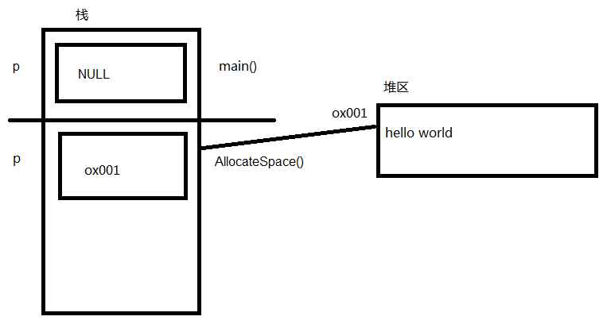
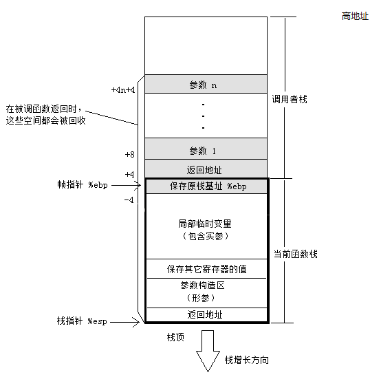
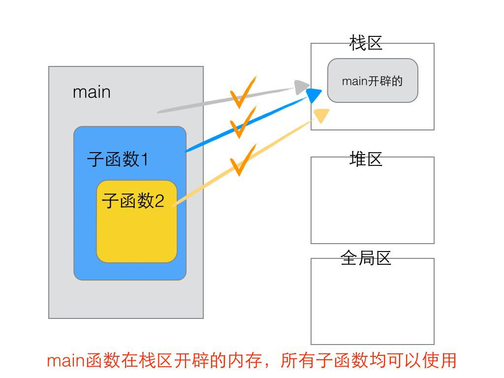
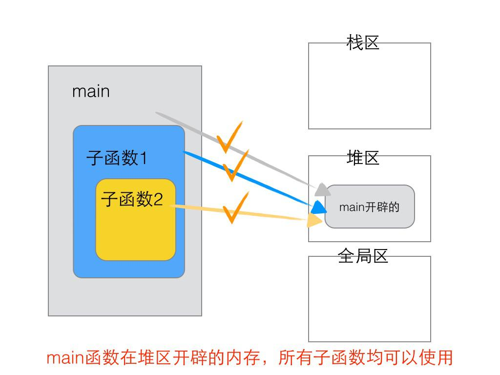
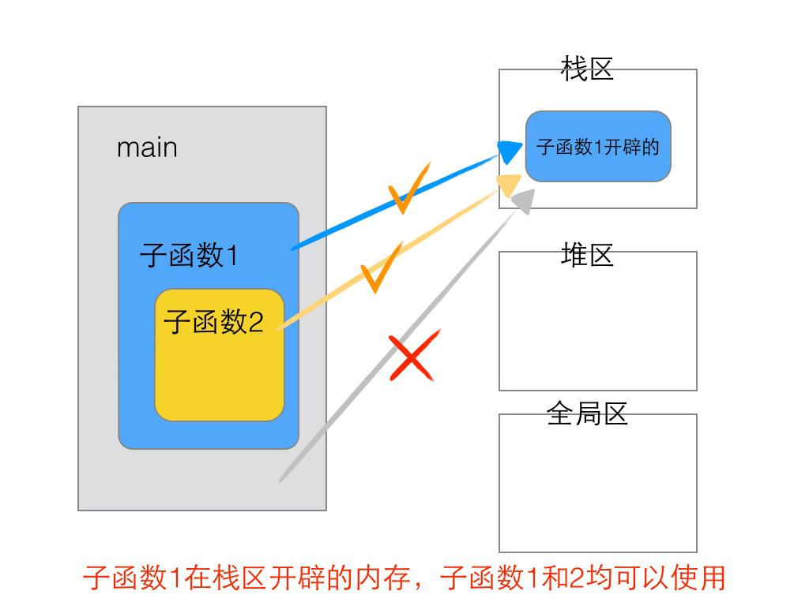
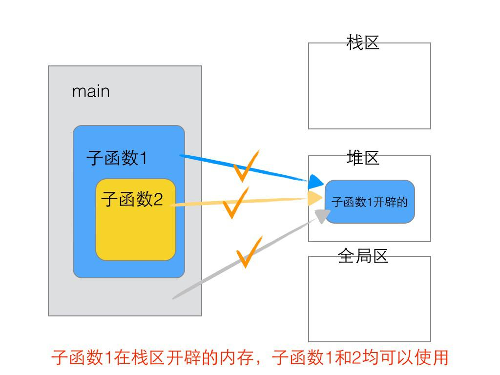
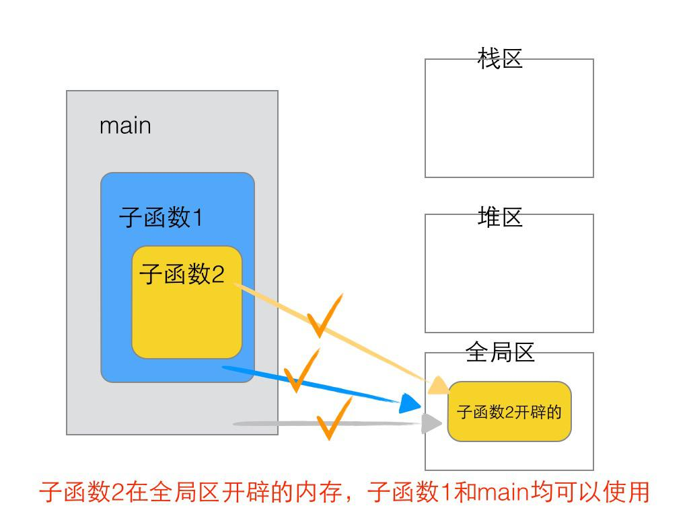
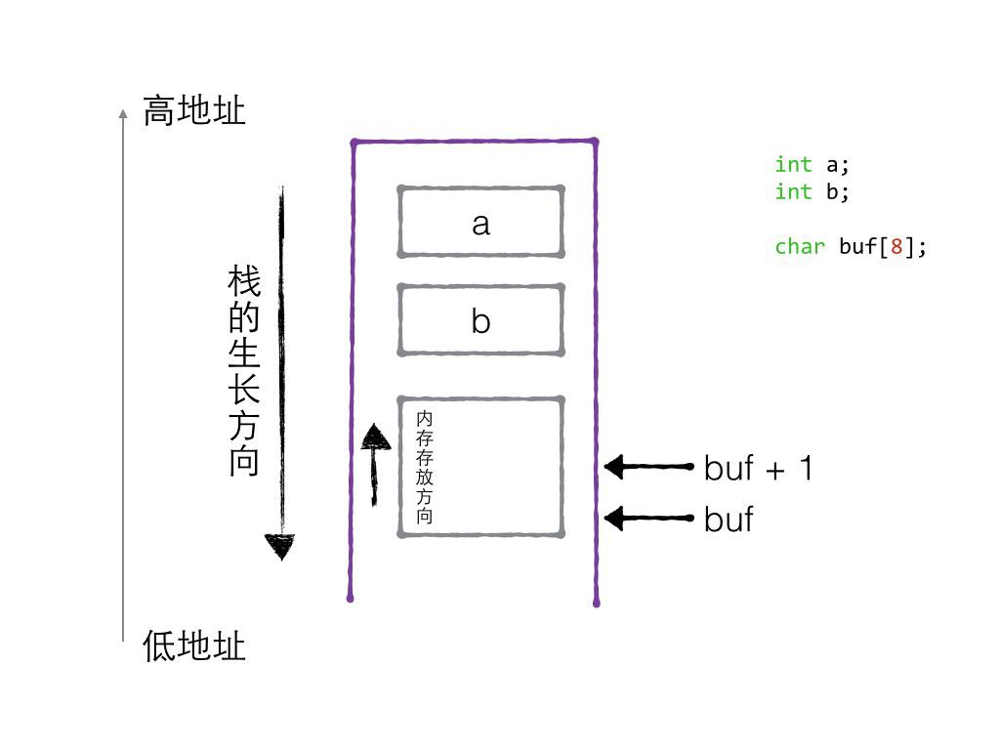

# 内存分区

---

## 数据类型

### 数据类型概念

数据类型是为了更好进行内存的管理，让编译器能确定分配多少内存

数据类型基本概念：

* 类型是对数据的抽象
* 类型相同的数据具有相同的表示形式、存储格式以及相关操作
* 程序中所有的数据都必定属于某种数据类型
* 数据类型可以理解为创建变量的模具: 固定大小内存的别名


### 数据类型别名

```c
#include <stdio.h>

typedef unsigned int u32;
typedef struct PERSON
{
    char name[64];
    int age;
} Person;

void test()
{
    u32 val;       // 相当于 unsigned int val
    Person person; // 相当于 struct PERSON person
}

int main()
{
    test();

    /*
     */

    return 0;
}
```

### void 数据类型

`void` 字面意思是”无类型”，`void*` 无类型指针，无类型指针可以指向任何类型的数据

`void` 定义变量是没有任何意义的，当定义 `void a`，编译器会报错

`void` 真正用在以下两个方面：

* 对函数返回的限定
* 对函数参数的限定

```c
#include <stdio.h>

// void 修饰函数参数和函数返回
void test1(void)
{
    printf("hello world\n");
}

// 不能定义 void 类型变量
void test2()
{
    // void val; // 不允许使用不完整的类型
}

// void* 可以指向任何类型的数据，被称为万能指针
void test3()
{
    int a = 10;
    void *p = NULL;
    p = &a;
    printf("a:%d\n", *(int *)p);

    char c = 'a';
    p = (void *)&c;
    printf("c:%c\n", *(char *)p);
}

// void* 常用于数据类型的封装
void test4()
{
    void *memcpy(void *_Dst, const void *_Src, size_t _Size);
}

int main()
{
    test1();
    test2();
    test3();
    test4();

    /*
        hello world
        a:10
        c:a
    */

    return 0;
}
```

直接输出 `*p` 是不行的，因为 `p` 是 `void *` 类型，一个变量的类型在其定义之初就是确定的，之后可以使用类型转换使其表现出其他类型，但本质类型是不变的

### sizeof 操作符

`sizeof` 是 C 语言中的一个操作符，类似于 `++、--` 等等。`sizeof` 能够告诉我们编译器为某一特定数据或者某一个类型的数据在内存中分配空间时分配的大小，大小以字节为单位

基本语法：

* `sizeof(变量);`
* `sizeof 变量;`
* `sizeof(类型);`

`sizeof` 注意点：

* `sizeof` 返回的占用空间大小是为这个变量开辟的大小，而不只是它用到的空间。所以对结构体用的时候，大多情况下就得考虑字节对齐的问题
* `sizeof` 返回的数据结果类型是 `long unsigned int`
* 要注意数组名和指针变量的区别。通常情况下数组名和指针变量差不多，但是在用 `sizeof` 的时候差别很大，对数组名用 `sizeof` 返回的是整个数组的大小，而对指针变量进行操作的时候返回的则是指针变量本身所占得空间，在 64 位下是 8。而且当数组名作为函数参数时，在函数内部，形参也就是个指针，所以不再返回数组的大小

```c
#include <stdio.h>

// sizeof 基本用法
void test1()
{
    int a = 10;
    printf("len: %lu\n", sizeof(a));
    printf("len: %lu\n", sizeof(int));
    printf("len: %lu\n", sizeof a);
}

// sizeof 结果类型
void test2()
{
    unsigned int a = 10;
    if (a - 11 < 0)
    {
        printf("结果小于 0\n");
    }
    else
    {
        printf("结果大于 0\n");
    }
    int b = 5;
    if (sizeof(b) - 10 < 0)
    {
        printf("结果小于 0\n");
    }
    else
    {
        printf("结果大于 0\n");
    }
}

// sizeof 碰到数组
void TestArray(int arr[])
{
    printf("TestArray arr size: %lu\n", sizeof(arr));
}
void test3()
{
    int arr[] = {10, 20, 30, 40, 50};
    printf("array size: %lu\n", sizeof(arr));
    printf("array length: %lu\n", sizeof(arr) / sizeof(arr[0]));

    // 数组名在某些情况下等价于指针
    int *pArr = arr;
    printf("arr[2] value: %d\n", pArr[2]);
    printf("array size: %lu\n", sizeof(pArr));

    // 数组做函数函数参数，将退化为指针，在函数内部不再返回数组大小
    TestArray(arr);
}

int main()
{
    test1();
    test2();
    test3();

    /*
        main.c: In function ‘TestArray’:
        main.c:38:47: warning: ‘sizeof’ on array function parameter ‘arr’ will return size of ‘int *’ [-Wsizeof-array-argument]
        38 |     printf("TestArray arr size: %lu\n", sizeof(arr));
            |                                               ^
        main.c:36:20: note: declared here
        36 | void TestArray(int arr[])
            |                ~~~~^~~~~
        len: 4
        len: 4
        len: 4
        结果大于 0
        结果大于 0
        array size: 20
        array length: 5
        arr[2] value: 30
        array size: 8
        TestArray arr size: 8
    */

    return 0;
}
```

### 数据类型总结

* 数据类型本质是固定内存大小的别名，是个模具，C 语言规定：通过数据类型定义变量
* 数据类型大小计算(`sizeof`)
* 可以给已存在的数据类型起别名 `typedef`
* 数据类型的封装(`void` 万能类型)

---

## 变量

### 变量的概念

既能读又能写的内存对象，称为变量；若一旦初始化后不能修改的对象则称为常量

变量定义形式： 

```c
类型 标识符, 标识符, ..., 标识符
```

### 变量名的本质

* 变量名的本质：一段连续内存空间的别名
* 程序通过变量来申请和命名内存空间 `int a = 0;`
* 通过变量名访问内存空间
* 不是向变量名读写数据，而是向变量所代表的内存空间中读写数据

修改变量的两种方式：

```c
#include <stdio.h>

void test()
{
    int a = 10;
    const int b = 100;
    printf("未修改前 a:%d\n", a);
    printf("未修改前 b:%d\n", b);

    // 直接修改
    a = 20;
    // b = 200; // 表达式必须是可修改的左值

    printf("直接修改 a:%d\n", a);

    // 间接修改
    int *pa = &a;
    *pa = 30;
    // 可以修改但有警告
    int *pb = &b;
    *pb = 300;

    printf("间接修改 a:%d\n", a);
    printf("间接修改 b:%d\n", b);
}

int main()
{
    test();

    /*
        main.c: In function ‘test’:
        main.c:20:15: warning: initialization discards ‘const’ qualifier from pointer target type [-Wdiscarded-qualifiers]
        20 |     int *pb = &b;
            |               ^
        未修改前 a:10
        未修改前 b:100
        直接修改 a:20
        间接修改 a:30
        间接修改 b:300
    */

    return 0;
}
```

## 程序的内存分区模型

### 内存分区

#### 运行之前

C 程序的编译流程:

* 预处理：宏定义展开、头文件展开、条件编译，这里并不会检查语法
* 编译：检查语法，将预处理后文件编译生成汇编文件
* 汇编：将汇编文件生成目标文件(二进制文件)
* 链接：将目标文件链接为可执行程序

编译完成生成可执行文件后，在 linux 下 `size` 命令可以查看一个可执行二进制文件基本情况：

```sh
# ls -l main
-rwxr-xr-x 1 root root 16776 Aug  5 19:10 main
# file main
main: ELF 64-bit LSB shared object, x86-64, version 1 (SYSV), dynamically linked, interpreter /lib64/ld-linux-x86-64.so.2, BuildID[sha1]=908300b67580d4e7fdbfc7c038fc7373c009bd58, for GNU/Linux 3.2.0, not stripped
# size main
   text    data     bss     dec     hex filename
   2023     608       8    2639     a4f main
# 
```

在没有运行程序前，也就是说程序没有加载到内存前，可执行程序内部已经分好 3 段信息，分别为代码区(`text`)、数据区(`data`)和未初始化数据区(`bss`) 3 个部分(也有把 `data` 和 `bss` 合起来叫做静态区或全局区)

* 代码区(`text`)存放 CPU 执行的机器指令。通常代码区是可共享的(即另外的执行程序可以调用它)，使其可共享的目的是对于频繁被执行的程序，只需要在内存中有一份代码即可。代码区通常是只读的，使其只读的原因是防止程序意外地修改了它的指令。另外，代码区还规划了局部变量的相关信息
* 全局初始化数据区/静态数据区(`data` 段)包含了在程序中明确被初始化的全局变量、已经初始化的静态变量(包括全局静态变量和局部静态变量)和常量数据(如字符串常量)
* 未初始化数据区(`bss` 区)存入的是全局未初始化变量和未初始化静态变量。未初始化数据区的数据在程序开始执行之前被内核初始化为 0 或者空(`NULL`)

总体来讲说，程序源代码被编译之后主要分成两种段：程序指令(代码区)和程序数据(数据区)。代码段属于程序指令，而数据域段和 `.bss` 段属于程序数据

那为什么把程序的指令和程序数据分开呢？

* 程序被 load 到内存中之后，可以将数据和代码分别映射到两个内存区域。由于数据区域对进程来说是可读可写的，而指令区域对程序来讲说是只读的，所以分区之后呢，可以将程序指令区域和数据区域分别设置成可读可写或只读。这样可以防止程序的指令有意或者无意被修改
* 当系统中运行着多个同样的程序的时候，这些程序执行的指令都是一样的，所以只需要内存中保存一份程序的指令就可以了，只是每一个程序运行中数据不一样而已，这样可以节省大量的内存。比如说之前的 Windows Internet Explorer 7.0 运行起来之后，它需要占用 112 844KB 的内存，它的私有部分数据有大概 15 944KB，也就是说有 96 900KB 空间是共享的，如果程序中运行了几百个这样的进程，共享的方法可以节省大量的内存

#### 运行之后

程序在加载到内存前，代码区和全局区(`data` 和 `bss`)的大小就是固定的，程序运行期间不能改变。然后，运行可执行程序，操作系统把物理硬盘程序 load(加载)到内存，除了根据可执行程序的信息分出代码区(`text`)、数据区(`data`)和未初始化数据区(`bss`)之外，还额外增加了栈区、堆区

* 代码区(`text segment`)加载的是可执行文件代码段，所有的可执行代码都加载到代码区，这块内存是不可以在运行期间修改的
* 未初始化数据区(`BSS`)加载的是可执行文件 `BSS` 段，位置可以分开亦可以紧靠数据段，存储于数据段的数据(全局未初始化，静态未初始化数据)的生存周期为整个程序运行过程
* 全局初始化数据区/静态数据区(`data segment`)加载的是可执行文件数据段，存储于数据段(全局初始化，静态初始化数据，文字常量(只读))的数据的生存周期为整个程序运行过程
* 栈区(`stack`)。栈是一种先进后出的内存结构，由编译器自动分配释放，存放函数的参数值、返回值、局部变量等。在程序运行过程中实时加载和释放，因此，局部变量的生存周期为申请到释放该段栈空间
* 堆区(`heap`)。堆是一个大容器，它的容量要远远大于栈，但没有栈那样先进后出的顺序。用于动态内存分配。堆在内存中位于 `BSS` 区和栈区之间。一般由程序员分配和释放，若程序员不释放，程序结束时由操作系统回收

| 类型 | 作用域 | 生命周期 | 存储位置 |
|:----:|:----:|:----:|:----:|
| `auto` 变量 | 一对 `{}` 内 | 当前函数 | 栈区 |
| `static` 局部变量 | 一对 `{}` 内 | 整个程序运行期 | 初始化在 `data` 段，未初始化在 `BSS` 段 |
| `extern` 变量 | 整个程序 | 整个程序运行期 | 初始化在 `data` 段，未初始化在 `BSS` 段 |
| `static` 全局变量 | 当前文件 | 整个程序运行期 | 初始化在 `data` 段，未初始化在 `BSS` 段 |
| `extern` 函数 | 整个程序 | 整个程序运行期 | 代码区 |
| `static` 函数 | 当前文件 | 整个程序运行期 | 代码区 |
| `register` 变量 | 一对 `{}` 内 | 当前函数 | 运行时存储在 CPU 寄存器 |
| 字符串常量 | 当前文件 | 整个程序运行期 | `data` 段 |

建立正确程序运行内存布局图是学好 C 的关键

### 分区模型

#### 栈区

由系统进行内存的管理。主要存放函数的参数以及局部变量。在函数完成执行，系统自行释放栈区内存，不需要用户管理

```c
#include <stdio.h>

char *func()
{
    char p[] = "hello world!"; // 在栈区存储 乱码
    printf("%s\n", p);
    return p;
}

void test()
{
    char *p = NULL;
    p = func();
    printf("%s\n", p);
}

int main()
{
    // test();

    /*
        main.c: In function ‘func’:
        main.c:7:12: warning: function returns address of local variable [-Wreturn-local-addr]
            7 |     return p;
            |            ^
        hello world!
        Segmentation fault
    */

    return 0;
}
```

#### 堆区

由编程人员手动申请，手动释放，若不手动释放，程序结束后由系统回收，生命周期是整个程序运行期间。使用 `malloc` 或者 `new` 进行堆的申请

```c
#include <stdio.h>
#include <stdlib.h>
#include <string.h>

char *func()
{
    char *str = malloc(100);
    strcpy(str, "hello world!");
    printf("%s\n", str);
    return str;
}

void test1()
{
    char *p = NULL;
    p = func();
    printf("%s\n", p);
}

void allocateSpace(char *p)
{
    p = malloc(100);
    // p 变量存储的地址发生改变
    strcpy(p, "hello world!");
    printf("%s\n", p);
}

void test2()
{
    char buf[] = "char";
    char *p = buf;

    // char *p = NULL; // Segmentation fault
    allocateSpace(p);

    printf("%s\n", p);
}

void fun(int *a)
{
    printf("%p\n", a);
    printf("%d\n", *a);

    a = (int *)malloc(sizeof(int));
    *a = 1;

    printf("%p\n", a);
    printf("%d\n", *a);
}

void test3()
{
    int *a;
    int tp = 10;
    a = &tp;

    printf("%p\n", a);
    printf("%d\n", *a);

    fun(a);

    printf("%p\n", a);
    printf("%d\n", *a);

    /*
        0x7ffc7919143c
        10
        0x7ffc7919143c
        10
        0x7ffc7919143c
        1
        0x7ffc7919143c
        1
    */

    // 取消 test3 中的注释

    /*
         0x7ffd1577a93c
         10
         0x7ffd1577a93c
         10
         0x55a01fff26b0
         1
         0x7ffd1577a93c
         10
    */
}

int main()
{
    test1();

    /*
        hello world!
        hello world!
    */

    test2();

    // test3();

    /*
        hello world!
        char
    */

    return 0;
}
```



堆分配内存 API：

```c
#include <stdlib.h>
void *calloc(size_t nmemb, size_t size);
```

* 功能：
    * 在内存动态存储区中分配 `nmemb` 块长度为 `size` 字节的连续区域。`calloc` 自动将分配的内存置 0
* 参数：
    * `nmemb`：所需内存单元数量
    * `size`：每个内存单元的大小(单位：字节)
* 返回值：
    * 成功：分配空间的起始地址
    * 失败：`NULL`

```c
#include <stdlib.h>
void *realloc(void *ptr, size_t size);
```

* 功能：
    * 重新分配用 `malloc` 或者 `calloc` 函数在堆中分配内存空间的大小
    * `realloc` 不会自动清理增加的内存，需要手动清理，如果指定的地址后面有连续的空间，那么就会在已有地址基础上增加内存，如果指定的地址后面没有空间，那么 `realloc` 会重新分配新的连续内存，把旧内存的值拷贝到新内存，同时释放旧内存
* 参数：
    * `ptr`：为之前用 `malloc` 或者 `calloc` 分配的内存地址，如果此参数等于 `NULL`，那么和 `realloc` 与 `malloc` 功能一致
    * `size`：为重新分配内存的大小，单位：字节
* 返回值：
    * 成功：新分配的堆内存地址
    * 失败：`NULL`

```c
#include <stdio.h>
#include <stdlib.h>
#include <string.h>

void test1()
{
    int *p1 = calloc(10, sizeof(int));

    if (p1 == NULL)
    {
        return;
    }
    for (int i = 0; i < 10; i++)
    {
        p1[i] = i + 1;
    }
    for (int i = 0; i < 10; i++)
    {
        printf("%d ", p1[i]);
    }
    printf("\n");
    free(p1);
}

void test2()
{
    int *p1 = calloc(10, sizeof(int));

    if (p1 == NULL)
    {
        return;
    }
    for (int i = 0; i < 10; i++)
    {
        p1[i] = i + 1;
    }

    int *p2 = realloc(p1, 15 * sizeof(int));
    if (p2 == NULL)
    {
        return;
    }

    printf("%p\n", p1);
    printf("%p\n", p2);

    // 打印
    for (int i = 0; i < 15; i++)
    {
        printf("%d ", p2[i]);
    }
    printf("\n");

    // 重新赋值
    for (int i = 0; i < 15; i++)
    {
        p2[i] = i + 1;
    }

    // 再次打印
    for (int i = 0; i < 15; i++)
    {
        printf("%d ", p2[i]);
    }
    printf("\n");

    free(p2);
}

int main()
{
    test1();
    printf("---------\n");
    test2();

    /*
        1 2 3 4 5 6 7 8 9 10
        ---------
        0x5602ea6886e0
        0x5602ea6886e0
        1 2 3 4 5 6 7 8 9 10 133377 0 0 0 0
        1 2 3 4 5 6 7 8 9 10 11 12 13 14 15
    */

    return 0;
}
```

#### 全局/静态区

全局静态区内的变量在编译阶段已经分配好内存空间并初始化。这块内存在程序运行期间一直存在,它主要存储全局变量、静态变量和常量

注意：

* 这里不区分初始化和未初始化的数据区，是因为静态存储区内的变量若不显示初始化，则编译器会自动以默认的方式进行初始化，即静态存储区内不存在未初始化的变量
* 全局静态存储区内的常量分为常变量和字符串常量，一经初始化，不可修改。静态存储内的常变量是全局变量，与局部常变量不同，区别在于局部常变量存放于栈，实际可间接通过指针或者引用进行修改，而全局常变量存放于静态常量区则不可以间接修改
* 字符串常量存储在全局/静态存储区的常量区

```c
#include <stdio.h>
#include <stdlib.h>
#include <string.h>

int v1 = 10;        // 全局/静态区
const int v2 = 20;  // 常量，一旦初始化，不可修改
static int v3 = 20; // 全局/静态区
char *p1;           // 全局/静态区，编译器默认初始化为 NULL

void test()
{
    static int v4 = 20; // 全局/静态区
}

int main()
{
    test();

    /*
     */

    return 0;
}
```

那么全局 `static int` 和全局 `int` 变量有什么区别

这两者的区别在于非静态全局变量的作用域是整个源程序，当一个源程序由多个源文件组成时，非静态的全局变量在各个源文件中都是有效的。而静态全局变量则限制了其作用域，即只在定义该变量的源文件内有效，在同一源程序的其它源文件中不能使用它，这是因为 static全局变量只初使化一次，防止在其他文件单元中被引用;

加深理解：

```c
#include <stdio.h>
#include <stdlib.h>
#include <string.h>

char *func()
{
    static char arr[] = "hello world!"; // 在静态区存储是可读可写
    arr[2] = 'c';
    char *p = "hello world!"; // 全局/静态区-字符串常量区
    // p[2] = 'c'; // 只读，不可修改
    printf("%p\n", arr);
    printf("%p\n", p);
    printf("%s\n", arr);
    return arr;
}

void test()
{
    char *p = func();
    printf("%s\n", p);
}

int main()
{
    test();

    /*
        0x55d671ec6010
        0x55d671ec4004
        heclo world!
        heclo world!
    */

    return 0;
}
```

字符串常量是否可修改？字符串常量优化：

* ANSIC 中规定：修改字符串常量，结果是未定义的
* ANSIC 并没有规定编译器的实现者对字符串的处理，例如：
    * 有些编译器可修改字符串常量，有些编译器则不可修改字符串常量
    * 有些编译器把多个相同的字符串常量看成一个(这种优化可能出现在字符串常量中，节省空间)，有些则不进行此优化。如果进行优化，则可能导致修改一个字符串常量导致另外的字符串常量也发生变化，结果不可知

所以尽量不要去修改字符串常量

C99 标准：

```c
char *p = "abc"; 
defines p with type ‘‘pointer to char’’ and initializes it to point to an object with type ‘‘array of char’’ with length 4 whose elements are initialized with a character string literal. If an attempt is made to use p to modify the contents of the array, the behavior is undefined.
```

字符串常量地址是否相同:

* tc2.0 同文件字符串常量地址不同
* Vs2013 字符串常量地址同文件和不同文件都相同
* Dev c++、QT 同文件相同，不同文件不同

#### 总结

在理解 C/C++ 内存分区时，常会碰到如下术语：数据区，堆，栈，静态区，常量区，全局区，字符串常量区，文字常量区，代码区等等，初学者被搞得云里雾里。在这里，尝试捋清楚以上分区的关系

* 数据区包括：堆，栈，全局/静态存储区
* 全局/静态存储区包括：常量区，全局区、静态区
* 常量区包括：字符串常量区、常变量区
* 代码区：存放程序编译后的二进制代码，不可寻址区

可以说，C/C++ 内存分区其实只有两个，即代码区和数据区

### 函数调用模型

#### 函数调用流程

栈(`stack`)是现代计算机程序里最为重要的概念之一，几乎每一个程序都使用了栈，没有栈就没有函数，没有局部变量，也就没有我们如今能见到的所有计算机的语言。在解释为什么栈如此重要之前，我们先了解一下传统的栈的定义：

在经典的计算机科学中，栈被定义为一个特殊的容器，用户可以将数据压入栈中(入栈，`push`)，也可以将压入栈中的数据弹出(出栈，`pop`)，但是栈容器必须遵循一条规则：先入栈的数据最后出栈(First In Last Out,FILO)

在经典的操作系统中，栈总是向下增长的。压栈的操作使得栈顶的地址减小，弹出操作使得栈顶地址增大

栈在程序运行中具有极其重要的地位。最重要的，栈保存一个函数调用所需要维护的信息，这通常被称为堆栈帧(Stack Frame)或者活动记录(Activate Record)

一个函数调用过程所需要的信息一般包括以下几个方面：

* 函数的返回地址
* 函数的参数
* 临时变量
* 保存的上下文：包括在函数调用前后需要保持不变的寄存器

从下面代码分析以下函数的调用过程：

```c
#include <stdio.h>

int func(int a, int b)
{
    int t_a = a;
    int t_b = b;
    return t_a + t_b;
}

int main()
{
    int ret = 0;
    ret = func(10, 20);
    printf("%d\n", ret);

    // 30

    return 0;
}
```



#### 调用惯例

现在大致了解了函数调用的过程，这期间有一个现象，那就是函数的调用者和被调用者对函数调用有着一致的理解，例如，它们双方都一致的认为函数的参数是按照某个固定的方式压入栈中。如果不这样的话，函数将无法正确运行

如果函数调用方在传递参数的时候先压入 `a` 参数，再压入 `b` 参数，而被调用函数则认为先压入的是 `b`，后压入的是 `a`，那么被调用函数在使用 `a`，`b` 值时候，就会颠倒

因此函数的调用方和被调用方对于函数是如何调用的必须有一个明确的约定，只有双方都遵循同样的约定，函数才能够被正确的调用，这样的约定被称为调用惯例(Calling Convention)

一个调用惯例一般包含以下几个方面：

* 函数参数的传递顺序和方式

函数的传递有很多种方式，最常见的是通过栈传递。函数的调用方将参数压入栈中，函数自己再从栈中将参数取出。对于有多个参数的函数，调用惯例要规定函数调用方将参数压栈的顺序：从左向右，还是从右向左。有些调用惯例还允许使用寄存器传递参数，以提高性能

* 栈的维护方式

在函数将参数压入栈中之后，函数体会被调用，此后需要将被压入栈中的参数全部弹出，以使得栈在函数调用前后保持一致。这个弹出的工作可以由函数的调用方来完成，也可以由函数本身来完成

为了在链接的时候对调用惯例进行区分，调用惯例要对函数本身的名字进行修饰。不同的调用惯例有不同的名字修饰策略

事实上，在 C 语言里，存在着多个调用惯例，而默认的是 `cdecl`。任何一个没有显示指定调用惯例的函数都是默认是 `cdecl` 惯例。比如上面对于 `func` 函数的声明，它的完整写法应该是：

```c
int _cdecl func(int a,int b);
```

注意: `_cdecl` 不是标准的关键字，在不同的编译器里可能有不同的写法，例如 `gcc` 里就不存在 `_cdecl` 这样的关键字，而是使用 `__attribute__((cdecl))`

| 调用惯例 | 出栈方 | 参数传递 | 名字修饰 |
|:----:|:----:|:----:|:----:|
| `cdecl` | 函数调用方 | 从右至左参数入栈 | 下划线+函数名 |
| `stdcall` | 函数本身 | 从右至左参数入栈 | 下划线+函数名+@+参数字节数 |
| `fastcall` | 函数本身 | 前两个参数由寄存器传递，其余参数通过堆栈传递 | @+函数名+@+参数的字节数 |
| `pascal` | 函数本身 | 从左至右参数入栈 | 较为复杂，参见相关文档 |

#### 函数变量传递分析











### 栈的生长方向和内存存放方向



```c
#include <stdio.h>

// 栈的生长方向
void test1()
{
    int a = 10;
    int b = 20;
    int c = 30;
    int d = 40;

    printf("a = %p\n", &a);
    printf("b = %p\n", &b);
    printf("c = %p\n", &c);
    printf("d = %p\n", &d);

    // a 的地址大于 b 的地址，故而生长方向向下
}

// 内存生长方向(小端模式)
void test2()
{

    // 高位字节 -> 地位字节
    int num = 0xaabbccdd;
    unsigned char *p = &num;

    // 从首地址开始的第一个字节
    printf("%x\n", *p);
    printf("%x\n", *(p + 1));
    printf("%x\n", *(p + 2));
    printf("%x\n", *(p + 3));
}

int main()
{
    test1();
    test2();

    /*
        main.c: In function ‘test2’:
        main.c:25:24: warning: initialization of ‘unsigned char *’ from incompatible pointer type ‘int *’ [-Wincompatible-pointer-types]
        25 |     unsigned char *p = &num;
            |                        ^
        a = 0x7ffc8479b1b8
        b = 0x7ffc8479b1bc
        c = 0x7ffc8479b1c0
        d = 0x7ffc8479b1c4
        dd
        cc
        bb
        aa
    */

    return 0;
}
```

---
