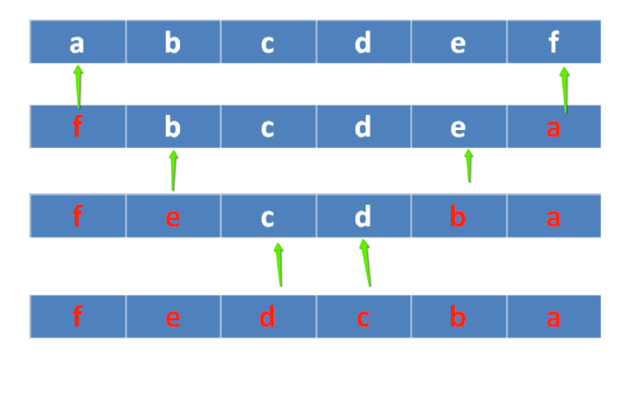
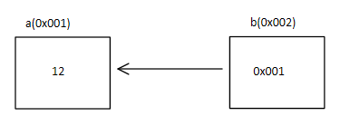
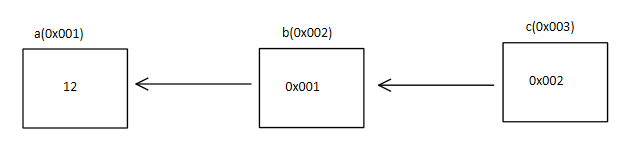

# 指针强化

---

## 指针是一种数据类型

### 指针变量

指针是一种数据类型，占用内存空间，用来保存内存地址

```c
#include <stdio.h>
#include <stdlib.h>
#include <string.h>

void test1()
{
    int val = 12;
    int *p1 = &val;
    int **p2 = &p1;
    int ***p3 = &p2;

    printf("p1 size: %lu\n", sizeof(p1));
    printf("p2 size: %lu\n", sizeof(p2));
    printf("p3 size: %lu\n", sizeof(p3));

    // 指针是变量，指针本身也占内存空间，指针也可以被赋值
    int a = 10;
    p1 = &a;

    printf("a address: %p\n", &a);
    printf("a value: %d\n", a);
    printf("p1 address: %p\n", &p1);
    printf("p1 value :%p\n", p1);
    printf("p2 address: %p\n", &p2);
    printf("p2 value :%p\n", p2);
    printf("p3 address: %p\n", &p3);
    printf("p3 value :%p\n", p3);
}

int main()
{
    test1();

    /*
        p1 size: 8
        p2 size: 8
        p3 size: 8
        a address: 0x7fff7e6cb1dc
        a value: 10
        p1 address: 0x7fff7e6cb1e0
        p1 value :0x7fff7e6cb1dc
        p2 address: 0x7fff7e6cb1e8
        p2 value :0x7fff7e6cb1e0
        p3 address: 0x7fff7e6cb1f0
        p3 value :0x7fff7e6cb1e8
    */

    return 0;
}
```

### 野指针和空指针

#### 空指针

C 标准定义了 `NULL` 指针，它作为一个特殊的指针变量，表示不指向任何东西。要使一个指针为 `NULL`，可以给它赋值一个零值。为了测试一个指针是否为 `NULL`，可以将它与零值进行比较

对指针解引用操作可以获得它所指向的值。但从定义上看，`NULL` 指针并未指向任何东西，因为对一个 `NULL` 指针因引用是一个非法的操作，在解引用之前，必须确保它不是一个 `NULL` 指针

如果对一个 `NULL` 指针间接访问会发生什么呢？结果因编译器而异

不允许向 `NULL` 和非法地址拷贝内存：

```c
#include <stdio.h>
#include <stdlib.h>
#include <string.h>

void test()
{
    char *p = NULL;
    //给 p 指向的内存区域拷贝内容
    strcpy(p, "1111"); // err

    char *q = 0x1122;
    //给 q 指向的内存区域拷贝内容
    strcpy(q, "2222"); // err
}

int main()
{
    test();

    /*
        main.c: In function ‘test’:
        main.c:11:15: warning: initialization of ‘char *’ from ‘int’ makes pointer from integer without a cast [-Wint-conversion]
        11 |     char *q = 0x1122;
            |               ^~~~~~
        Segmentation fault
    */

    return 0;
}
```

#### 野指针

在使用指针时，要避免野指针的出现：

野指针是指向一个已删除的对象或未申请访问受限内存区域的指针。与空指针不同，野指针无法通过简单地判断是否为 `NULL` 来避免，而只能通过养成良好的编程习惯来尽力减少。对野指针进行操作很容易造成程序错误

什么情况下回导致野指针呢

* 指针变量未初始化
    * 任何指针变量刚被创建时不会自动成为 `NULL` 指针，它的缺省值是随机的。所以，指针变量在创建的同时应当被初始化，要么将指针设置为 `NULL`，要么让它指向合法的内存
* 指针释放后未置空
    * 有时指针在 `free` 或 `delete` 后未赋值 `NULL`，便会使人以为是合法的。`free` 和 `delete`(尤其是 `delete`)只是把指针所指的内存给释放掉，但并没有把指针本身干掉。此时指针指向的就是“垃圾”内存。释放后的指针应立即将指针置为 `NULL`，防止产生“野指针”
* 指针操作超越变量作用域
    * 不要返回指向栈内存的指针或引用，因为栈内存在函数结束时会被释放

```c
#include <stdio.h>
#include <stdlib.h>
#include <string.h>

void test()
{
    int *p = 0x001; // 未初始化
    printf("%p\n", p);
    *p = 100;
}

int main()
{
    test();

    /*
        main.c: In function ‘test’:
        main.c:7:14: warning: initialization of ‘int *’ from ‘int’ makes pointer from integer without a cast [-Wint-conversion]
            7 |     int *p = 0x001; // 未初始化
            |              ^~~~~
        0x1
        Segmentation fault
    */

    return 0;
}
```

操作野指针是非常危险的操作，应该规避野指针的出现：

* 初始化时置 `NULL`
    * 指针变量一定要初始化为 `NULL`，因为任何指针变量刚被创建时不会自动成为 `NULL` 指针，它的缺省值是随机的
* 释放时置 `NULL`
    * 当指针 `p` 指向的内存空间释放时，没有设置指针 `p` 的值为 `NULL`。`delete` 和 `free` 只是把内存空间释放了，但是并没有将指针 `p` 的值赋为 `NULL`。通常判断一个指针是否合法，都是使用 `if` 语句测试该指针是否为 `NULL`

### 间接访问操作符

通过一个指针访问它所指向的地址的过程叫做间接访问，或者叫解引用指针，这个用于执行间接访问的操作符是 `*`

注意：对一个 `int*` 类型指针解引用会产生一个整型值，类似地，对一个 `float*` 指针解引用会产生了一个 `float` 类型的值

```c
int arr[5];
int *p = *(&arr);
```

* 在指针声明时，`*` 表示所声明的变量为指针
* 在指针使用时，`*` 表示操作指针所指向的内存空间
    * 相当通过地址(指针变量的值)找到指针指向的内存，再操作内存
    * 放在等号的左边赋值(给内存赋值，写内存)
    * 放在等号的右边取值(从内存中取值，读内存)

```c
#include <stdio.h>
#include <stdlib.h>
#include <string.h>

// 解引用
void test()
{
    // 定义指针
    int *p = NULL;
    // 指针指向谁，就把谁的地址赋给指针
    int a = 10;
    p = &a;
    *p = 20; // * 在左边当左值，必须确保内存可写
    // * 放右面，从内存中读值
    int b = *p;
    // 必须确保内存可写
    char *str = "hello world!";
    // *str = 'm';

    printf("a: %d\n", a);
    printf("*p: %d\n", *p);
    printf("b: %d\n", b);
    printf("str: %s\n", str);
}

int main()
{
    test();

    /*
        a: 20
        *p: 20
        b: 20
        str: hello world!
    */

    return 0;
}
```

### 指针的步长

指针是一种数据类型，是指它指向的内存空间的数据类型。指针所指向的内存空间决定了指针的步长。指针的步长指的是，当指针 +1 时候，移动多少字节单位

思考如下问题：

```c
#include <stdio.h>
#include <stdlib.h>
#include <string.h>

void test()
{
    int a = 0xaabbccdd;
    int *p1 = &a;
    char *p2 = &a;

    // *p1 打印出来正确结果
    printf("%x\n", *p1);
    // *p2 没有打印出来正确结果
    printf("%x\n", *p2);

    // p1 指针 +1 加了 4 字节
    printf("p1 = %p\n", p1);
    printf("p1 + 1 = %p\n", p1 + 1);
    // p2 指针 +1 加了 1 字节
    printf("p2 = %p\n", p2);
    printf("p2 + 1 = %p\n", p2 + 1);
}

int main()
{
    test();

    /*
        main.c: In function ‘test’:
        main.c:9:16: warning: initialization of ‘char *’ from incompatible pointer type ‘int *’ [-Wincompatible-pointer-types]
            9 |     char *p2 = &a;
            |                ^
        aabbccdd
        ffffffdd
        p1 = 0x7ffcdacd23b4
        p1 + 1 = 0x7ffcdacd23b8
        p2 = 0x7ffcdacd23b4
        p2 + 1 = 0x7ffcdacd23b5
    */

    return 0;
}
```

---

## 指针的意义_间接赋值

### 间接赋值的三大条件

通过指针间接赋值成立的三大条件：

* 2 个变量(一个普通变量一个指针变量、或者一个实参一个形参)
* 建立关系
* 通过 `*` 操作指针指向的内存

```c
// 两个变量
int a = 100;
int *p = NULL;
// 建立关系
// 指针指向谁，就把谁的地址赋值给指针
p = &a;
// 通过 * 操作内存
*p = 22;
```

### 如何定义合适的指针变量

多级指针

```c
int b;
int *q = &b;
int **t = &q;
int ***m = &t;
```

### 间接赋值

从 0 级指针到 1 级指针

```c
#include <stdio.h>
#include <stdlib.h>
#include <string.h>

int func1()
{
    return 10;
}

void func2(int a)
{
    a = 100;
}

// 指针的意义_间接赋值
void test1()
{
    int a = 0;
    a = func1();
    printf("a = %d\n", a);

    // 为什么没有修改
    func2(a);
    printf("a = %d\n", a);
}

// 指针的间接赋值
void func3(int *a)
{
    *a = 100;
}

void test2()
{
    int a = 0;
    a = func1();
    printf("a = %d\n", a);

    // 修改
    func3(&a);
    printf("a = %d\n", a);
}

int main()
{
    test1();
    test2();

    /*
        a = 10
        a = 10
        a = 10
        a = 100
    */

    return 0;
}
```

### 间接赋值

从 1 级指针到 2 级指针

```c
#include <stdio.h>
#include <stdlib.h>
#include <string.h>

void AllocateSpace(char **p)
{
    *p = (char *)malloc(100);
    strcpy(*p, "hello world!");
}

void FreeSpace(char **p)
{
    if (p == NULL)
    {
        return;
    }
    if (*p != NULL)
    {
        free(*p);
        *p = NULL;
    }
}

void test()
{
    char *p = NULL;

    AllocateSpace(&p);
    printf("%s\n", p);
    FreeSpace(&p);

    if (p == NULL)
    {
        printf("p 内存释放!\n");
    }
}

int main()
{
    test();

    /*
        hello world!
        p 内存释放!
    */

    return 0;
}
```

### 间接赋值的推论

* 用 1 级指针形参，去间接修改了 0 级指针(实参)的值
* 用 2 级指针形参，去间接修改了 1 级指针(实参)的值
* 用 3 级指针形参，去间接修改了 2 级指针(实参)的值
* 用 `n` 级指针形参，去间接修改了 `n-1` 级指针(实参)的值

---

## 指针做函数参数

指针做函数参数，具备输入和输出特性：

* 输入：主调函数分配内存
* 输出：被调用函数分配内存

### 输入特性

```c
#include <stdio.h>
#include <stdlib.h>
#include <string.h>

void fun(char *p /* in */)
{
    // 给 p 指向的内存区域拷贝内容
    strcpy(p, "abcddsgsd");
}

void test(void)
{
    // 输入，主调函数分配内存
    char buf[100] = {0};
    fun(buf);
    printf("buf  = %s\n", buf);
}

int main()
{
    test();

    /*
        buf  = abcddsgsd
    */

    return 0;
}
```

### 输出特性

```c
#include <stdio.h>
#include <stdlib.h>
#include <string.h>

void fun(char **p /* out */, int *len)
{
    char *tmp = (char *)malloc(100);
    if (tmp == NULL)
    {
        return;
    }
    strcpy(tmp, "adlsgjldsk");

    // 间接赋值
    *p = tmp;
    *len = strlen(tmp);
}

void test(void)
{
    // 输出，被调用函数分配内存，地址传递
    char *p = NULL;
    int len = 0;
    fun(&p, &len);
    if (p != NULL)
    {
        printf("p = %s, len = %d\n", p, len);
    }
}

int main()
{
    test();

    /*
        p = adlsgjldsk, len = 10
    */

    return 0;
}
```

## 字符串指针强化

### 字符串指针做函数参数

#### 字符串基本操作

```c
#include <stdio.h>
#include <stdlib.h>
#include <string.h>

// 字符串基本操作
// 字符串是以 0 或者 \0 结尾的字符数组(数字 0 和字符 \0 等价)
void test()
{

    // 字符数组只能初始化 5 个字符，当输出的时候，从开始位置直到找到 0 结束
    char str1[] = {'h', 'e', 'l', 'l', 'o'};
    printf("%s\n", str1);

    // 字符数组部分初始化，剩余填 0
    char str2[100] = {'h', 'e', 'l', 'l', 'o'};
    printf("%s\n", str2);

    // 如果以字符串初始化，那么编译器默认会在字符串尾部添加 \0
    char str3[] = "hello";
    printf("%s\n", str3);
    printf("sizeof str3: %lu\n", sizeof(str3));
    printf("strlen str3: %lu\n", strlen(str3));

    // sizeof 计算数组大小，数组包含 \0 字符
    // strlen 计算字符串的长度，到 \0 结束

    // 那么如果这么写，结果是多少呢
    char str4[100] = "hello";
    printf("sizeof str4: %lu\n", sizeof(str4));
    printf("strlen str4: %lu\n", strlen(str4));

    // 请问下面输入结果是多少？sizeof 结果是多少？strlen 结果是多少
    char str5[] = "hello\0world";
    printf("%s\n", str5);
    printf("sizeof str5: %lu\n", sizeof(str5));
    printf("strlen str5: %lu\n", strlen(str5));

    // 再请问下面输入结果是多少？sizeof 结果是多少？strlen 结果是多少
    char str6[] = "hello\012world";
    printf("%s\n", str6);
    printf("sizeof str6: %lu\n", sizeof(str6));
    printf("strlen str6: %lu\n", strlen(str6));
}

int main()
{
    test();

    /*
        hello
        hello
        hello
        sizeof str3: 6
        strlen str3: 5
        sizeof str4: 100
        strlen str4: 5
        hello
        sizeof str5: 12
        strlen str5: 5
        hello
        world
        sizeof str6: 12
        strlen str6: 11
    */

    return 0;
}
```
     
在 C 中有两种特殊的字符，八进制转义字符和十六进制转义字符，八进制字符的一般形式是 `\ddd`，`d` 是 0-7 的数字。十六进制字符的一般形式是 `\xhh`，`h` 是 0-9 或 `A-F` 内的一个。八进制字符和十六进制字符表示的是字符的 ASCII 码对应的数值

* `\063` 表示的是字符 `'3'`，因为 `'3'` 的 ASCII 码是 30(十六进制)，48(十进制)，63(八进制)
* `\x41` 表示的是字符 `'A'`，因为 `'A'` 的 ASCII 码是 41(十六进制)，65(十进制)，101(八进制)

#### 字符串拷贝功能实现

```c
#include <stdio.h>
#include <stdlib.h>
#include <string.h>

// 拷贝方法1
void copy_string1(char *dest, char *source)
{
    for (int i = 0; source[i] != '\0'; i++)
    {
        dest[i] = source[i];
    }
}

// 拷贝方法2
void copy_string2(char *dest, char *source)
{
    while (*source != '\0' /* *source != 0 */)
    {
        *dest = *source;
        source++;
        dest++;
    }
}

// 拷贝方法3
void copy_string3(char *dest, char *source)
{
    // 判断 *dest 是否为 0，0 则退出循环
    while (*dest++ = *source++)
    {
    }
}

int main()
{
    char *source = "copy_string";
    char dest1[20] = {0};
    char dest2[20] = {0};
    char dest3[20] = {0};

    copy_string1(dest1, source);
    copy_string1(dest2, source);
    copy_string1(dest3, source);

    printf("dest1: %s\n", dest1);
    printf("dest2: %s\n", dest2);
    printf("dest3: %s\n", dest3);

    /*
        dest1: copy_string
        dest2: copy_string
        dest3: copy_string
    */

    return 0;
}
```

#### 字符串反转模型



```c
#include <stdio.h>
#include <stdlib.h>
#include <string.h>

void reverse_string(char *str)
{
    if (str == NULL)
    {
        return;
    }

    int begin = 0;
    int end = strlen(str) - 1;

    while (begin < end)
    {
        // 交换两个字符元素
        char temp = str[begin];
        str[begin] = str[end];
        str[end] = temp;

        begin++;
        end--;
    }
}

void test()
{
    char str[] = "abcdefghijklmn";
    printf("str: %s\n", str);
    reverse_string(str);
    printf("str: %s\n", str);
}

int main()
{
    test();

    /*
        str: abcdefghijklmn
        str: nmlkjihgfedcba
    */

    return 0;
}
```

### 字符串的格式化

#### sprintf

```c
#include <stdio.h>
int sprintf(char *str, const char *format, ...);
```

* 功能：
    * 根据参数 `format` 字符串来转换并格式化数据，然后将结果输出到 `str` 指定的空间中，直到出现字符串结束符 `\0` 为止
* 参数： 
    * `str`：字符串首地址
    * `format`：字符串格式，用法和 `printf()` 一样
* 返回值：
    * 成功：实际格式化的字符个数
    * 失败：-1

```c
#include <stdio.h>
#include <stdlib.h>
#include <string.h>

void test()
{
    // 1. 格式化字符串
    char buf[1024] = {0};
    sprintf(buf, "你好，%s，欢迎加入我们!", "John");
    printf("buf: %s\n", buf);

    memset(buf, 0, 1024);
    sprintf(buf, "我今年 %d 岁了!", 20);
    printf("buf: %s\n", buf);

    // 2. 拼接字符串
    memset(buf, 0, 1024);
    char str1[] = "hello";
    char str2[] = "world";
    int len = sprintf(buf, "%s %s", str1, str2);
    printf("buf: %s len: %d\n", buf, len);

    int num = 100;

    // 3. 数字转字符串
    memset(buf, 0, 1024);
    sprintf(buf, "%d", num);
    printf("buf: %s\n", buf);

    // 设置宽度，右对齐
    memset(buf, 0, 1024);
    sprintf(buf, "%8d", num);
    printf("buf: %s\n", buf);

    // 设置宽度，左对齐
    memset(buf, 0, 1024);
    sprintf(buf, "%-8d", num);
    printf("buf: %s\n", buf);

    // 转成 16 进制字符串，小写
    memset(buf, 0, 1024);
    sprintf(buf, "0x%x", num);
    printf("buf: %s\n", buf);

    // 转成 8 进制字符串
    memset(buf, 0, 1024);
    sprintf(buf, "0%o", num);
    printf("buf: %s\n", buf);
}

int main()
{
    test();

    /*
        buf: 你好，John，欢迎加入我们!
        buf: 我今年 20 岁了!
        buf: hello world len: 11
        buf: 100
        buf:      100
        buf: 100
        buf: 0x64
        buf: 0144
    */

    return 0;
}
```

#### sscanf

```c
#include <stdio.h>
int sscanf(const char *str, const char *format, ...);
```

* 功能：
    * 从 `str` 指定的字符串读取数据，并根据参数 `format` 字符串来转换并格式化数据
* 参数：
    * `str`：指定的字符串首地址
	* `format`：字符串格式，用法和 `scanf()` 一样
* 返回值：
    * 成功：成功则返回参数数目，失败则返回 -1
	* 失败：-1

| 格式 | 作用 |
|:----:|:----:|
| `%*s` 或 `%*d` | 跳过数据 |
| `%[width]s` | 读指定宽度的数据 |
| `%[a-z]` | 匹配 `a` 到 `z` 中任意字符(尽可能多的匹配) |
| `%[aBc]` | 匹配 `a、B、c` 中一员，贪婪性 |
| `%[^a]` | 匹配非 `a` 的任意字符，贪婪性 |
| `%[^a-z]` | 表示读取除 `a-z` 以外的所有字符 |

```c
#include <stdio.h>
#include <stdlib.h>
#include <string.h>

// 1. 跳过数据
void test1()
{
    char buf[1024] = {0};
    // 跳过前面的数字
    // 匹配第一个字符是否是数字，如果是，则跳过
    // 如果不是则停止匹配
    sscanf("123456aaaa", "%*d%s", buf);
    printf("buf: %s\n", buf);
}

// 2. 读取指定宽度数据
void test2()
{
    char buf[1024] = {0};
    // 跳过前面的数字
    sscanf("123456aaaa", "%7s", buf);
    printf("buf: %s\n", buf);
}

// 3. 匹配 a-z 中任意字符
void test3()
{
    char buf[1024] = {0};
    // 跳过前面的数字
    // 先匹配第一个字符，判断字符是否是 a-z 中的字符，如果是匹配
    // 如果不是停止匹配
    sscanf("abcdefg123456", "%[a-z]", buf);
    printf("buf: %s\n", buf);
}

// 4. 匹配 aBc 中的任何一个
void test4()
{
    char buf[1024] = {0};
    // 跳过前面的数字
    // 先匹配第一个字符是否是 aBc 中的一个，如果是，则匹配，如果不是则停止匹配
    sscanf("abcdefg123456", "%[aBc]", buf);
    printf("buf: %s\n", buf);
}

// 5. 匹配非 a 的任意字符
void test5()
{
    char buf[1024] = {0};
    // 跳过前面的数字
    // 先匹配第一个字符是否是 aBc 中的一个，如果是，则匹配，如果不是则停止匹配
    sscanf("bcdefag123456", "%[^a]", buf);
    printf("buf: %s\n", buf);
}

// 6. 匹配非 a-z 中的任意字符
void test6()
{
    char buf[1024] = {0};
    // 跳过前面的数字
    // 先匹配第一个字符是否是 aBc 中的一个，如果是，则匹配，如果不是则停止匹配
    sscanf("123456ABCDbcdefag", "%[^a-z]", buf);
    printf("buf: %s\n", buf);
}

int main()
{
    test1();
    test2();
    test3();
    test4();
    test5();
    test6();

    /*
        buf: aaaa
        buf: 123456a
        buf: abcdefg
        buf: a
        buf: bcdef
        buf: 123456ABCD
    */

    return 0;
}
```

课堂小练习：

* 已给定字符串为：`helloworld@itcast.cn`，请编码实现 `helloworld` 输出和 `itcast.cn` 输出
* 已给定字符串为：`123abcd$myname@000qwe`，请编码实现匹配出 `myname` 字符串，并输出

```c
#include <stdio.h>
#include <stdlib.h>
#include <string.h>

void test1()
{
    char *ip = "127.0.0.1";
    int num1 = 0;
    int num2 = 0;
    int num3 = 0;
    int num4 = 0;

    sscanf(ip, "%d.%d.%d.%d", &num1, &num2, &num3, &num4);
    printf("%d %d %d %d\n", num1, num2, num3, num4);
}

void test2()
{
    char *str = "abcdef#zhangtao@123456";
    char buf[1024] = {0};

    sscanf(str, "%*[^#]#%[^@]", buf);
    printf("%s\n", buf);
}

void test3()
{
    char *str1 = "helloworld@itcast.cn";
    char *str2 = "123abcd$myname@000qwe";
    char buf1[1024] = {0};
    char buf2[1024] = {0};
    char buf3[1024] = {0};
    sscanf(str1, "%[a-z]%*[@]%s", buf1, buf2);
    sscanf(str2, "%*[^$]$%[^@]", buf3);

    printf("%s\n", buf1);
    printf("%s\n", buf2);
    printf("%s\n", buf3);
}

int main()
{
    test1();
    test2();
    test3();

    /*
        127 0 0 1
        zhangtao
        helloworld
        itcast.cn
        myname
    */

    return 0;
}
```

---

## 一级指针易错点

### 越界

```c
#include <stdio.h>
#include <stdlib.h>
#include <string.h>

void test()
{
    char buf[3] = "abc";
    printf("buf: %s\n", buf);
}

int main()
{
    test();

    /*
        buf: abc
    */

    return 0;
}
```

最好留一个位置给 `\0`

### 指针叠加会不断改变指针指向

```c
#include <stdio.h>
#include <stdlib.h>
#include <string.h>

void test()
{
    char *p = (char *)malloc(50);
    char buf[] = "abcdef";
    int n = strlen(buf);
    int i = 0;

    for (i = 0; i < n; i++)
    {
        *p = buf[i];
        p++; // 修改原指针指向
    }

    // 重新移动回来，可以正常释放
    // for (i = 0; i < n; i++)
    // {
    //     p--;
    // }

    free(p);
}

int main()
{
    test();

    /*
        free(): invalid pointer
        Aborted
    */

    return 0;
}
```

### 返回局部变量地址

```c
#include <stdio.h>
#include <stdlib.h>
#include <string.h>

char *get_str()
{
    char str[] = "abcdedsgads"; // 栈区，
    printf("[get_str]str = %s\n", str);
    return str;
}

void test()
{
    char *p = get_str();
    printf("%s\n", p);
}

int main()
{
    test();

    /*
        main.c: In function ‘get_str’:
        main.c:9:12: warning: function returns address of local variable [-Wreturn-local-addr]
            9 |     return str;
            |            ^~~
        [get_str]str = abcdedsgads
        Segmentation fault
    */

    return 0;
}
```

### 同一块内存释放多次(不可以释放野指针)

```c
#include <stdio.h>
#include <stdlib.h>
#include <string.h>

void test()
{
    char *p = NULL;
    p = (char *)malloc(50);
    strcpy(p, "abcdef");

    if (p != NULL)
    {
        // free() 函数的功能只是告诉系统 p 指向的内存可以回收了
        // 就是说，p 指向的内存使用权交还给系统
        // 但是，p 的值还是原来的值(野指针)，p 还是指向原来的内存
        free(p);
    }

    if (p != NULL)
    {
        free(p);
    }
}

int main()
{
    test();

    /*
        free(): double free detected in tcache 2
        Aborted
    */

    return 0;
}
```

---

## const 使用

```c
#include <stdio.h>
#include <stdlib.h>
#include <string.h>

// const 修饰变量
void test1()
{
    // 1. const基本概念
    const int i = 0;
    // i = 100; // 错误，只读变量初始化之后不能修改

    // 2. 定义 const 变量最好初始化
    const int j;
    // j = 100; //错误，不能再次赋值

    // 3. c 语言的 const 是一个只读变量，并不是一个常量，可通过指针间接修改
    const int k = 10;
    // k = 100; //错误，不可直接修改，我们可通过指针间接修改
    printf("k: %d\n", k);
    int *p = &k;
    *p = 100;
    printf("k: %d\n", k);
}

// const 修饰指针
void test2()
{
    int a = 10;
    int b = 20;
    // const 放在 * 号左侧 修饰 p_a 指针指向的内存空间不能修改，但可修改指针的指向
    const int *p_a = &a;
    // *p_a = 100; // 不可修改指针指向的内存空间
    p_a = &b; // 可修改指针的指向

    // const 放在 * 号的右侧， 修饰指针的指向不能修改，但是可修改指针指向的内存空间
    int *const p_b = &a;
    // p_b = &b; // 不可修改指针的指向
    *p_b = 100; // 可修改指针指向的内存空间

    // 指针的指向和指针指向的内存空间都不能修改
    const int *const p_c = &a;
}

// const 指针用法
struct Person
{
    char name[64];
    int id;
    int age;
    int score;
};

// 每次都对对象进行拷贝，效率低，应该用指针
void printPersonByValue(struct Person person)
{
    printf("Person.name: %s\n", person.name);
    printf("Person.id: %d\n", person.id);
    printf("Person.age: %d\n", person.age);
    printf("Person.score: %d\n", person.score);
}

// 但是用指针会有副作用，可能会不小心修改原数据
void printPersonByPointer(const struct Person *person)
{
    printf("Person->name: %s\n", person->name);
    printf("Person->id: %d\n", person->id);
    printf("Person->age: %d\n", person->age);
    printf("Person->score: %d\n", person->score);
}

void test3()
{
    struct Person p = {"Obama", 1101, 23, 87};
    printPersonByValue(p);
    printPersonByPointer(&p);
}

int main()
{
    test1();
    test2();
    test3();

    /*
        main.c: In function ‘test1’:
        main.c:20:14: warning: initialization discards ‘const’ qualifier from pointer target type [-Wdiscarded-qualifiers]
        20 |     int *p = &k;
            |              ^
        k: 10
        k: 100
        Person.name: Obama
        Person.id: 1101
        Person.age: 23
        Person.score: 87
        Person->name: Obama
        Person->id: 1101
        Person->age: 23
        Person->score: 87
    */

    return 0;
}
```

---

## 指针的指针(二级指针)

### 二级指针基本概念

考虑下面这些声明：

```c
int a = 12;
int *b = &a;
```

它们如下图进行内存分配：



假定又有了第 3 个变量，名叫 `c`，并用下面这条语句对它进行初始化：

```c
c = &b;
```

它在内存中大致如下：



问题是：`c` 的类型是什么？显然它是一个指针，但它所指向的是什么？变量 `b` 是一个“指向整型的指针”，所以任何指向 `b` 的类型必须是指向“指向整型的指针”的指针，更通俗地说，是一个指针的指针

指针变量和其他变量一样，占据内存中某个特定的位置，所以可以用 `&` 操作符取得它的地址

那么这个变量的声明是怎样的声明的呢

```c
int **c = &b;
```

那么这个 `**c` 如何理解呢

`*` 操作符具有从右向左的结合性，所以这个表达式相当于 ·*(*c)

`*c` 访问 `c` 所指向的位置，这是变量 `b`；第二个间接访问操作符访问这个位置 `b` 所指向的地址，也就是变量 `a`

指针的指针并不难懂，只需要留心所有的箭头，如果表达式中出现了间接访问操作符，就要随箭头访问它所指向的位置

### 二级指针做形参输出特性

二级指针做参数的输出特性是指由被调函数分配内存

```c
#include <stdio.h>
#include <stdlib.h>
#include <string.h>

// 被调函数，由参数 n 确定分配多少个元素内存
void allocate_space(int **arr, int n)
{
    // 堆上分配 n 个 int 类型元素内存
    int *temp = (int *)malloc(sizeof(int) * n);
    if (NULL == temp)
    {
        return;
    }
    // 给内存初始化值
    int *pTemp = temp;
    for (int i = 0; i < n; i++)
    {
        // temp[i] = i + 100;
        *pTemp = i + 100;
        pTemp++;
    }
    // 指针间接赋值
    *arr = temp;
}

// 打印数组
void print_array(int *arr, int n)
{
    for (int i = 0; i < n; i++)
    {
        printf("%d ", arr[i]);
    }
    printf("\n");
}

// 二级指针输出特性(由被调函数分配内存)
void test()
{
    int *arr = NULL;
    int n = 10;
    // 给 arr 指针间接赋值
    allocate_space(&arr, n);
    // 输出 arr 指向数组的内存
    print_array(arr, n);
    // 释放 arr 所指向内存空间的值
    if (arr != NULL)
    {
        free(arr);
        arr = NULL;
    }
}

int main()
{
    test();

    /*
        100 101 102 103 104 105 106 107 108 109
    */

    return 0;
}
```

### 二级指针做形参输入特性

二级指针做形参输入特性是指由主调函数分配内存

```c
#include <stdio.h>
#include <stdlib.h>
#include <string.h>

// 打印数组
void print_array(int **arr, int r, int l)
{
    for (int i = 0; i < r; i++)
    {
        for (int j = 0; j < l; j++)
        {
            printf("%d ", *(*(arr + i) + j));
        }
        printf("\n");
    }
}

// 二级指针输入特性(由主调函数分配内存)
void test()
{
    int a[5] = {0};
    int n = 5;

    int **arr = (int **)malloc(sizeof(int *) * n);
    arr[0] = a;
    arr[1] = a;
    arr[2] = a;
    arr[3] = a;
    arr[4] = a;

    print_array(arr, n, sizeof(a) / sizeof(a[0]));

    free(arr);
    arr = NULL;
}

int main()
{
    test();

    /*
        0 0 0 0 0
        0 0 0 0 0
        0 0 0 0 0
        0 0 0 0 0
        0 0 0 0 0
    */

    return 0;
}
```

### 强化训练

```c
#include <stdio.h>
#include <stdlib.h>
#include <string.h>

int main()
{
    // 栈区指针数组
    char *p1[] = {"aaaaa", "bbbbb", "ccccc"};

    // 堆区指针数组
    char **p3 = (char **)malloc(3 * sizeof(char *)); // char *array[3];

    int i = 0;
    for (i = 0; i < 3; i++)
    {
        p3[i] = (char *)malloc(10 * sizeof(char)); // char buf[10]
        sprintf(p3[i], "%d%d%d", i, i, i);
        printf("%s\n", p3[i]);
    }

    /*
        000
        111
        222
    */

    return 0;
}
```

### 多级指针

将堆区数组指针案例改为三级指针案例：

```c
#include <stdio.h>
#include <stdlib.h>
#include <string.h>

// 分配内存
void allocate_memory(char ***p, int n)
{
    if (n < 0)
    {
        return;
    }

    char **temp = (char **)malloc(sizeof(char *) * n);
    if (temp == NULL)
    {
        return;
    }

    // 分别给每一个指针 malloc 分配内存
    for (int i = 0; i < n; i++)
    {
        temp[i] = malloc(sizeof(char) * 30);
        sprintf(temp[i], "%2d_hello world!", i + 1);
    }

    *p = temp;
}

// 打印数组
void array_print(char **arr, int len)
{
    for (int i = 0; i < len; i++)
    {
        printf("%s\n", arr[i]);
    }
}

// 释放内存
void free_memory(char ***buf, int len)
{
    if (buf == NULL)
    {
        return;
    }

    char **temp = *buf;

    for (int i = 0; i < len; i++)
    {
        free(temp[i]);
        temp[i] = NULL;
    }

    free(temp);
}

void test()
{
    int n = 10;
    char **p = NULL;
    allocate_memory(&p, n);
    // 打印数组
    array_print(p, n);
    // 释放内存
    free_memory(&p, n);
}

int main()
{
    test();

    /*
         1_hello world!
         2_hello world!
         3_hello world!
         4_hello world!
         5_hello world!
         6_hello world!
         7_hello world!
         8_hello world!
         9_hello world!
        10_hello world!
    */

    return 0;
}
```

---
