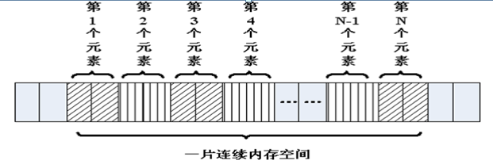

# 多维数组

---

## 一维数组

* 元素类型角度：数组是相同类型的变量的有序集合
* 内存角度：连续的一大片内存空间



### 数组名

数组名的值是一个指针常量，也就是数组第一个元素的地址。它的类型取决于数组元素的类型：如果是 `int` 类型，那么数组名的类型就是“指向 `int` 的常量指针”；如果它们是其他类型，那么数组名的类型也就是“指向其他类型的常量指针”

指针和数组是等价的吗？

答案是否定的。数组名在表达式中使用的时候，编译器才会产生一个指针常量。那么数组在什么情况下不能作为指针常量呢？在以下两种场景下：

* 当数组名作为 `sizeof` 操作符的操作数的时候，此时 `sizeof` 返回的是整个数组的长度，而不是指针数组指针的长度
* 当数组名作为 `&` 操作符的操作数时，此时返回的是一个指向数组的指针，而不是指向某个数组元素的指针常量

```c
#include <stdio.h>
#include <stdlib.h>
#include <string.h>

int main()
{
    int arr[10];
    // arr = NULL; // arr 作为指针常量，不可修改
    int *p = arr;                              // 此时 arr 作为指针常量来使用
    printf("sizeof(arr): %lu\n", sizeof(arr)); // 此时 sizeof 结果为整个数组的长度
    // printf("&arr type is %s\n", typeid(&arr).name()); // int(*)[10] 而不是 int*，表达式必须具有结构或联合类型，但它具有类型 "int"

    /*
        sizeof(arr): 40
    */

    return 0;
}
```

### 下标引用

```c
int arr[] = {1, 2, 3, 4, 5, 6};
```

`*(arr + 3)` 这个表达式是什么意思呢

首先，数组在表达式中是一个指向整型的指针，所以此表达式表示 `arr` 指针向后移动了 3 个元素的长度。然后通过间接访问操作符从这个新地址开始获取这个位置的值。这个和下标的引用的执行过程完全相同。所以如下表达式是等同的：

```c
*(arr + 3);
arr[3];
```

* 数组下标可否为负值呢

```c
#include <stdio.h>
#include <stdlib.h>
#include <string.h>

int main()
{
    int arr[] = {5, 3, 6, 8, 2, 9};
    int *p = arr + 2;
    printf("*p = %d\n", *p);
    printf("*p = %d\n", p[-1]);

    /*
        *p = 6
        *p = 3
    */

    return 0;
}
```

### 数组和指针

指针和数组并不是相等的

```c
int a[10];
int *b;
```

声明一个数组时，编译器根据声明所指定的元素数量为数组分配内存空间，然后再创建数组名，指向这段空间的起始位置。声明一个指针变量的时候，编译器只为指针本身分配内存空间，并不为任何整型值分配内存空间，指针并未初始化指向任何现有的内存空间

因此，表达式 `*a` 是完全合法的，但是表达式 `*b` 却是非法的。`*b` 将访问内存中一个不确定的位置，将会导致程序终止。另一方面 `b++` 可以通过编译，`a++` 却不行，因为 `a` 是一个常量值

### 作为函数参数的数组名

当一个数组名作为一个参数传递给一个函数的时候发生什么情况呢

数组名其实就是一个指向数组第 1 个元素的指针，所以很明白此时传递给函数的是一份指针的拷贝。所以函数的形参实际上是一个指针。但是为了使程序员新手容易上手一些，编译器也接受数组形式的函数形参。因此下面两种函数原型是相等的：

```c
int print_array(int *arr);
int print_array(int arr[]);
```

我们可以使用任何一种声明，但哪一个更准确一些呢？答案是指针。因为实参实际上是个指针，而不是数组。同样 `sizeof(arr)` 值是指针的长度，而不是数组的长度
	
一维数组中无须写明它的元素数目了，因为形参只是一个指针，并不需要为数组参数分配内存。另一方面，这种方式使得函数无法知道数组的长度。如果函数需要知道数组的长度，它必须显式传递一个长度参数给函数

---

## 多维数组

如果某个数组的维数不止 1 个，它就被称为多维数组。接下来的案例讲解以二维数组举例

```c
#include <stdio.h>
#include <stdlib.h>
#include <string.h>

void test()
{
    // 二维数组初始化
    int arr1[3][3] = {
        {1, 2, 3},
        {4, 5, 6},
        {7, 8, 9}};
    int arr2[3][3] = {1, 2, 3, 4, 5, 6, 7, 8, 9};
    int arr3[][3] = {1, 2, 3, 4, 5, 6, 7, 8, 9};

    // 打印二维数组
    for (int i = 0; i < 3; i++)
    {
        for (int j = 0; j < 3; j++)
        {
            printf("%d ", arr1[i][j]);
        }
        printf("\n");
    }
}

int main()
{
    test();

    /*
        1 2 3
        4 5 6
        7 8 9
    */

    return 0;
}
```

### 数组名

一维数组名的值是一个指针常量，它的类型是“指向元素类型的指针”，它指向数组的第 1 个元素。多维数组也是同理，多维数组的数组名也是指向第一个元素，只不过第一个元素是一个数组。例如：

```c
int arr[3][10];
```

可以理解为这是一个一维数组，包含了 3 个元素，只是每个元素恰好是包含了 10 个元素的数组。`arr` 就表示指向它的第 1 个元素的指针，所以 `arr` 是一个指向了包含了 10 个整型元素的数组的指针

### 指向数组的指针(数组指针)

数组指针，它是指针，指向数组的指针

数组的类型由元素类型和数组大小共同决定：`int array[5]` 的类型为 `int[5]`；C 语言可通过 `typedef` 定义一个数组类型

定义数组指针有一下三种方式：

```c
#include <stdio.h>
#include <stdlib.h>
#include <string.h>

// 方式一
void test1()
{
    // 先定义数组类型，再用数组类型定义数组指针
    int arr[10] = {1, 2, 3, 4, 5, 6, 7, 8, 9, 10};
    // 有 typedef 是定义类型，没有则是定义变量，下面代码定义了一个数组类型 ArrayType
    typedef int(ArrayType)[10];
    // int ArrayType[10]; // 定义一个数组，数组名为 ArrayType

    ArrayType myarr;        // 等价于 int myarr[10];
    ArrayType *pArr = &arr; // 定义了一个数组指针 pArr，并且指针指向数组 arr
    for (int i = 0; i < 10; i++)
    {
        printf("%d ", (*pArr)[i]);
    }
    printf("\n");
}

// 方式二
void test2()
{
    int arr[10];
    // 定义数组指针类型
    typedef int(*ArrayType)[10];
    ArrayType pArr = &arr; // 定义了一个数组指针 pArr，并且指针指向数组 arr
    for (int i = 0; i < 10; i++)
    {
        (*pArr)[i] = i + 1;
    }
    for (int i = 0; i < 10; i++)
    {
        printf("%d ", (*pArr)[i]);
    }
    printf("\n");
}

// 方式三
void test3()
{
    int arr[10];
    int(*pArr)[10] = &arr;

    for (int i = 0; i < 10; i++)
    {
        (*pArr)[i] = i + 1;
    }
    for (int i = 0; i < 10; i++)
    {
        printf("%d ", (*pArr)[i]);
    }
    printf("\n");
}

int main()
{
    test1();
    test2();
    test3();

    /*
        1 2 3 4 5 6 7 8 9 10
        1 2 3 4 5 6 7 8 9 10
        1 2 3 4 5 6 7 8 9 10
    */

    return 0;
}
```

### 指针数组(元素为指针)

* 栈区指针数组

```c
#include <stdio.h>
#include <stdlib.h>
#include <string.h>

// 数组做函数函数，退化为指针
void array_sort(char **arr, int len)
{
    for (int i = 0; i < len; i++)
    {
        for (int j = len - 1; j > i; j--)
        {
            // 比较两个字符串
            if (strcmp(arr[j - 1], arr[j]) > 0)
            {
                char *temp = arr[j - 1];
                arr[j - 1] = arr[j];
                arr[j] = temp;
            }
        }
    }
}

// 打印数组
void array_print(char **arr, int len)
{
    for (int i = 0; i < len; i++)
    {
        printf("%s\n", arr[i]);
    }
}

void test()
{
    // 主调函数分配内存
    // 指针数组
    char *p[] = {"bbb", "aaa", "ccc", "eee", "ddd"};
    // char** p = {"aaa", "bbb", "ccc", "ddd", "eee"}; // 错误
    int len = sizeof(p) / sizeof(char *);
    // 打印数组
    array_print(p, len);
    // 对字符串进行排序
    array_sort(p, len);
    printf("----------------\n");
    // 打印数组
    array_print(p, len);
}

int main()
{
    test();

    /*
        bbb
        aaa
        ccc
        eee
        ddd
        ----------------
        aaa
        bbb
        ccc
        ddd
        eee
    */

    return 0;
}
```

* 堆区指针数组

```c
#include <stdio.h>
#include <stdlib.h>
#include <string.h>

// 分配内存
char **allocate_memory(int n)
{
    if (n < 0)
    {
        return NULL;
    }

    char **temp = (char **)malloc(sizeof(char *) * n);
    if (temp == NULL)
    {
        return NULL;
    }

    // 分别给每一个指针 malloc 分配内存
    for (int i = 0; i < n; i++)
    {
        temp[i] = malloc(sizeof(char) * 30);
        sprintf(temp[i], "%2d_hello world!", i + 1);
    }

    return temp;
}

// 打印数组
void array_print(char **arr, int len)
{
    for (int i = 0; i < len; i++)
    {
        printf("%s\n", arr[i]);
    }
}

// 释放内存
void free_memory(char **buf, int len)
{
    if (buf == NULL)
    {
        return;
    }
    for (int i = 0; i < len; i++)
    {
        free(buf[i]);
        buf[i] = NULL;
    }
    free(buf);
}

void test()
{
    int n = 10;
    char **p = allocate_memory(n);
    // 打印数组
    array_print(p, n);
    // 释放内存
    free_memory(p, n);
}

int main()
{
    test();

    /*
         1_hello world!
         2_hello world!
         3_hello world!
         4_hello world!
         5_hello world!
         6_hello world!
         7_hello world!
         8_hello world!
         9_hello world!
        10_hello world!
    */

    return 0;
}
```

### 二维数组三种参数形式

* 二维数组的线性存储特性

```c
#include <stdio.h>
#include <stdlib.h>
#include <string.h>

void PrintArray(int *arr, int len)
{
    for (int i = 0; i < len; i++)
    {
        printf("%d ", arr[i]);
    }
    printf("\n");
}

// 二维数组的线性存储
void test()
{
    int arr[][3] = {
        {1, 2, 3},
        {4, 5, 6},
        {7, 8, 9}};

    int arr2[][3] = {1, 2, 3, 4, 5, 6, 7, 8, 9};
    int len = sizeof(arr2) / sizeof(int);

    // 如何证明二维数组是线性的
    // 通过将数组首地址指针转成 int* 类型，那么步长就变成了 8，就可以遍历整个数组
    int *p = (int *)arr;
    for (int i = 0; i < len; i++)
    {
        printf("%d ", p[i]);
    }
    printf("\n");

    PrintArray((int *)arr, len);
    PrintArray((int *)arr2, len);
}

int main()
{
    test();

    /*
        1 2 3 4 5 6 7 8 9
        1 2 3 4 5 6 7 8 9
        1 2 3 4 5 6 7 8 9
    */

    return 0;
}
```

* 二维数组的 3 种形式参数

```c
#include <stdio.h>
#include <stdlib.h>
#include <string.h>

// 二维数组的第一种形式
void PrintArray1(int arr[3][3])
{
    for (int i = 0; i < 3; i++)
    {
        for (int j = 0; j < 3; j++)
        {
            printf("arr[%d][%d]: %d\t", i, j, arr[i][j]);
        }
        printf("\n");
    }
}

// 二维数组的第二种形式
void PrintArray2(int arr[][3])
{
    for (int i = 0; i < 3; i++)
    {
        for (int j = 0; j < 3; j++)
        {
            printf("arr[%d][%d]: %d\t", i, j, arr[i][j]);
        }
        printf("\n");
    }
}

// 二维数组的第三种形式
void PrintArray3(int (*arr)[3])
{
    for (int i = 0; i < 3; i++)
    {
        for (int j = 0; j < 3; j++)
        {
            printf("arr[%d][%d]: %d\t", i, j, arr[i][j]);
        }
        printf("\n");
    }
}

void test()
{
    int arr[][3] = {
        {1, 2, 3},
        {4, 5, 6},
        {7, 8, 9}};

    PrintArray1(arr);
    PrintArray2(arr);
    PrintArray3(arr);
}

int main()
{
    test();

    /*
        arr[0][0]: 1    arr[0][1]: 2    arr[0][2]: 3
        arr[1][0]: 4    arr[1][1]: 5    arr[1][2]: 6
        arr[2][0]: 7    arr[2][1]: 8    arr[2][2]: 9
        arr[0][0]: 1    arr[0][1]: 2    arr[0][2]: 3
        arr[1][0]: 4    arr[1][1]: 5    arr[1][2]: 6
        arr[2][0]: 7    arr[2][1]: 8    arr[2][2]: 9
        arr[0][0]: 1    arr[0][1]: 2    arr[0][2]: 3
        arr[1][0]: 4    arr[1][1]: 5    arr[1][2]: 6
        arr[2][0]: 7    arr[2][1]: 8    arr[2][2]: 9
    */

    return 0;
}
```

---

## 总结

### 编程提示

* 源代码的可读性几乎总是比程序的运行时效率更为重要
* 只要有可能，函数的指针形参都应该声明为 `const`
* 在多维数组的初始值列表中使用完整的多层花括号提高可读性

### 内容总结

在绝大多数表达式中，数组名的值是指向数组第 1 个元素的指针。这个规则只有两个例外，`sizeof` 和对数组名 `&`

指针和数组并不相等。当声明一个数组的时候，同时也分配了内存。但是声明指针的时候，只分配容纳指针本身的空间

当数组名作为函数参数时，实际传递给函数的是一个指向数组第 1 个元素的指针

我们可以创建指向普通变量的指针，也可创建指向数组的指针

---
