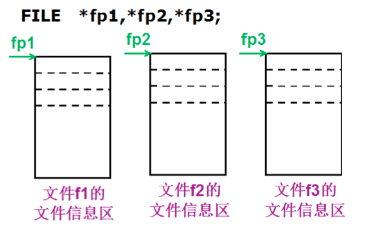
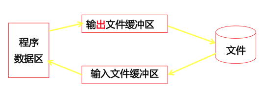

# 文件操作

---

## 文件相关概念

### 文件的概念

文件通常就是磁盘上一段命名的存储区。但是对于操作系统来说，文件就会更复杂一些。例如，一个大文件可以存储在一些分散的区段中，或者还会包含一些操作系统可以确定其文件类型的附加数据，但是这些是操作系统，而不是程序员所要关心的事情。我们应该考虑如何在 C 程序中处理文件

### 流的概念

流是一个动态的概念，可以将一个字节形象地比喻成一滴水，字节在设备、文件和程序之间的传输就是流，类似于水在管道中的传输，可以看出，流是对输入输出源的一种抽象，也是对传输信息的一种抽象

C 语言中，I/O 操作可以简单地看作是从程序移进或移出字节，这种搬运的过程便称为流(`stream`)。程序只需要关心是否正确地输出了字节数据，以及是否正确地输入了要读取字节数据，特定 I/O 设备的细节对程序员是隐藏的

#### 文本流

文本流，也就是常说的以文本模式读取文件。文本流的有些特性在不同的系统中可能不同。其中之一就是文本行的最大长度，标准规定至少允许 254 个字符。另一个可能不同的特性是文本行的结束方式。例如在 Windows 系统中，文本文件约定以一个回车符和一个换行符结尾。但是在 Linux 下只使用一个换行符结尾

标准 C 把文本定义为零个或者多个字符，后面跟一个表示结束的换行符 `\n`，对于那些文本行的外在表现形式与这个定义不同的系统上，库函数负责外部形式和内部形式之间的翻译。例如，在 Windows 系统中，在输出时，文本的换行符被写成一对回车/换行符。在输入时，文本中的回车符被丢弃。这种不必考虑文本的外部形势而操纵文本的能力简化了可移植程序的创建

#### 二进制流

二进制流中的字节将完全根据程序编写它们的形式写入到文件中，而且完全根据它们从文件或设备读取的形式读入到程序中。它们并未做任何改变。这种类型的流适用于非文本数据，但是如果你不希望 I/O 函数修改文本文件的行末字符，也可以把它们用于文本文件

C 语言在处理这两种文件的时候并不区分，都看成是字符流，按字节进行处理

程序中经常看到的文本方式打开文件和二进制方式打开文件仅仅体现在换行符的处理上

比如说，在 widows 下，文件的换行符是 `\r\n`，而在 Linux 下换行符则是 `\n`

当对文件使用文本方式打开的时候，读写的 windows 文件中的换行符 `\r\n` 会被替换成 `\n` 读到内存中，当在 windows 下写入文件的时候，`\n` 被替换成 `\r\n` 再写入文件。如果使用二进制方式打开文件，则不进行 `\r\n` 和 `\n` 之间的转换。 那么由于 Linux下的换行符就是 `\n`，所以文本文件方式和二进制方式无区别

---

## 文件的操作

### 文件流总览

标准库函数在 C 程序中执行与文件相关的 I/O 任务非常方便的系统函数。下面是关于文件 I/O 的一般概况

* 程序为同时处于活动状态的每个文件声明一个指针变量，其类型为 `FILE*`。这个指针指向这个 `FILE` 结构，当它处于活动状态时由流使用
* 流通过 `fopen` 函数打开。为了打开一个流，必须指定需要访问的文件或设备以及他们的访问方式(读、写、或者读写)。`Fopen` 和操作系统验证文件或者设备是否存在并初始化 `FILE`
* 根据需要对文件进行读写操作
* 最后调用 `fclose` 函数关闭流。关闭一个流可以防止与它相关的文件被再次访问，保证任何存储于缓冲区中的数据被正确写入到文件中，并且释放 `FILE` 结构

标准 I/O 更为简单，因为它们并不需要打开或者关闭

I/O 函数以三种基本的形式处理数据：单个字符、文本行和二进制数据，对于每种形式都有一组特定的函数对它们进行处理

| 函数名 | 目的 | 可用于所有流 | 只用于 `stdin` 和 `stdout` |
|:----:|:----:|:----:|:----:|
| `getchar` | 字符输入 | `fgetc、getc` | `getchar` |
| `putchar` | 字符输出 | `fputc、putc` | `putchar` |
| `gets` | 文本行输入 | `fgets` | `gets` |
| `puts` | 文本行输出 | `fputs` | `puts` |
| `scanf` | 格式化输入 | `fscanf` | `scanf` |
| `printf` | 格式化输出 | `fprintf` | `printf` |

### 文件指针

文件是由操作系统管理的单元。当操作一个文件的时候，操作系统帮我们打开文件，把我们指定要打开文件的信息保存起来，并且返回一个指针指向文件的信息。文件指针也可以理解为代指打开的文件。这个指针的类型为 `FILE` 类型。该类型定义在 `stdio.h` 头文件中。通过文件指针，我们就可以对文件进行各种操作

对于每一个 ANSI C 程序，运行时系统必须提供至少三个流-标准输入(`stdin`)、标准输出(`stdout`)、标准错误(`stderr`)，它们都是一个指向 `FILE` 结构的指针。标准输入是缺省情况下的输入来源，标准输出时缺省情况下的输出设置。具体缺省值因编译器而异，通常标准输入为键盘设备、标准输出为终端或者屏幕



ANSI C 并未规定 `FILE` 的成员，不同编译器可能有不同的定义。linux `gcc` 的 `FILE` 信息如下：

`FILE.h`

```c
typedef struct _IO_FILE FILE;
```

`struct_FILE.h`

```c
struct _IO_FILE
{
  int _flags;		/* High-order word is _IO_MAGIC; rest is flags. */

  /* The following pointers correspond to the C++ streambuf protocol. */
  char *_IO_read_ptr;	/* Current read pointer */
  char *_IO_read_end;	/* End of get area. */
  char *_IO_read_base;	/* Start of putback+get area. */
  char *_IO_write_base;	/* Start of put area. */
  char *_IO_write_ptr;	/* Current put pointer. */
  char *_IO_write_end;	/* End of put area. */
  char *_IO_buf_base;	/* Start of reserve area. */
  char *_IO_buf_end;	/* End of reserve area. */

  /* The following fields are used to support backing up and undo. */
  char *_IO_save_base; /* Pointer to start of non-current get area. */
  char *_IO_backup_base;  /* Pointer to first valid character of backup area */
  char *_IO_save_end; /* Pointer to end of non-current get area. */

  struct _IO_marker *_markers;

  struct _IO_FILE *_chain;

  int _fileno;
  int _flags2;
  __off_t _old_offset; /* This used to be _offset but it's too small.  */

  /* 1+column number of pbase(); 0 is unknown. */
  unsigned short _cur_column;
  signed char _vtable_offset;
  char _shortbuf[1];

  _IO_lock_t *_lock;
#ifdef _IO_USE_OLD_IO_FILE
};
```

### 文件缓冲区

ANSI C 标准采用“缓冲文件系统”处理数据文件。所谓缓冲文件系统是指系统自动地在内存区为程序中每一个正在使用的文件开辟一个文件缓冲区从内存向磁盘输出数据必须先送到内存中的缓冲区，装满缓冲区后才一起送到磁盘去。如果从磁盘向计算机读入数据，则一次从磁盘文件将一批数据输入到内存缓冲区(充满缓冲区)，然后再从缓冲区逐个地将数据送到程序数据区(给程序变量)

那么文件缓冲区有什么作用呢？

如从磁盘里取信息，先把读出的数据放在缓冲区，计算机再直接从缓冲区中取数据，等缓冲区的数据取完后再去磁盘中读取，这样就可以减少磁盘的读写次数，再加上计算机对缓冲区的操作大大快于对磁盘的操作，故应用缓冲区可大大提高计算机的运行速度



### 文件打开关闭

#### 文件打开(fopen)

文件的打开操作表示将给用户指定的文件在内存分配一个 `FILE` 结构区，并将该结构的指针返回给用户程序，以后用户程序就可用此 `FILE` 指针来实现对指定文件的存取操作了。当使用打开函数时，必须给出文件名、文件操作方式(读、写或读写)

```c
FILE * fopen(const char* filename, const char* mode);
```

* 功能：打开文件
* 参数：
    * `filename`：需要打开的文件名，根据需要加上路径
    * `mode`：打开文件的权限设置
* 返回值：
    * 成功：文件指针
    * 失败：`NULL`

| 方式 | 含义 |
|:----:|:----:|
| `r` | 打开，只读，文件必须已经存在 |
| `w` | 只写，如果文件不存在则创建，如果文件已存在则把文件长度截断(Truncate)为 0 字节。再重新写，也就是替换掉原来的文件内容文件指针指到头 |
| `a` | 只能在文件末尾追加数据，如果文件不存在则创建 |
| `rb` | 打开一个二进制文件，只读 |
| `wb` | 打开一个二进制文件，只写 |
| `ab` | 打开一个二进制文件，追加 |
| `r+` | 允许读和写，文件必须已存在 |
| `w+` | 允许读和写，如果文件不存在则创建，如果文件已存在则把文件长度截断为 0 字节再重新写 |
| `a+` | 允许读和追加数据，如果文件不存在则创建 |
| `rb+` | 以读/写方式打开一个二进制文件 |
| `wb+` | 以读/写方式建立一个新的二进制文件 |
| `ab+` | 以读/写方式打开一个二进制文件进行追加 |

```c
#include <stdio.h>
#include <stdlib.h>
#include <string.h>

void test()
{
    FILE *fp = NULL;

    // \\ 这样的路径形式，只能在 windows 使用
    // / 这样的路径形式，windows 和 linux 平台下都可用，建议使用这种
    // 路径可以是相对路径，也可是绝对路径
    fp = fopen("./test", "w");
    // fp = fopen("..\\test", "w");

    if (fp == NULL) // 返回空，说明打开失败
    {
        // perror() 是标准出错打印函数，能打印调用库函数出错原因
        perror("open");
        return;
    }
    else
    {
        printf("successful!\n");
    }
}

int main()
{
    test();

    /*
        successful!
    */

    return 0;
}
```

应该检查 `fopen` 返回值，为何函数失败，它会返回一个 `NULL` 值。如果程序不检查错误，这个 `NULL` 指针就会传给后续的 I/O 函数。它们将对这个指针执行间接访问，并将失败

#### 文件关闭(fclose)

文件操作完成后，如果程序没有结束，必须要用 `fclose()` 函数进行关闭，这是因为对打开的文件进行写入时，若文件缓冲区的空间未被写入的内容填满，这些内容不会写到打开的文件中。只有对打开的文件进行关闭操作时，停留在文件缓冲区的内容才能写到该文件中去，从而使文件完整。再者一旦关闭了文件，该文件对应的 `FILE` 结构将被释放，从而使关闭的文件得到保护，因为这时对该文件的存取操作将不会进行。文件的关闭也意味着释放了该文件的缓冲区

```c
int fclose(FILE* stream);
```

* 功能：关闭先前 `fopen()` 打开的文件。此动作让缓冲区的数据写入文件中，并释放系统所提供的文件资源
* 参数：
    * `stream`：文件指针
* 返回值：
    * 成功：0
    * 失败：-1

它表示该函数将关闭 `FILE` 指针对应的文件，并返回一个整数值。若成功地关闭了文件，则返回一个 0 值，否则返回一个非 0 值

### 文件读写函数回顾

* 按照字符读写文件：`fgetc(), fputc()`
* 按照行读写文件：`fputs(), fgets()`
* 按照块读写文件：`fread(), fwirte()`
* 按照格式化读写文件：`fprintf(), fscanf()`
* 按照随机位置读写文件：`fseek(), ftell(), rewind()`	

#### 字符读写函数回顾

```c
int fputc(int ch, FILE* stream);
```

* 功能：将 `ch` 转换为 `unsigned char` 后写入 `stream` 指定的文件中
* 参数：
    * `ch`：需要写入文件的字符
    * `stream`：文件指针
* 返回值：
    * 成功：成功写入文件的字符
    * 失败：返回 -1

```c
int fgetc(FILE *stream);
```

* 功能：从 `stream` 指定的文件中读取一个字符
* 参数：
    * `stream`：文件指针
* 返回值：
    * 成功：返回读取到的字符
    * 失败：-1

```c
int feof(FILE *stream);
```

* 功能：检测是否读取到了文件结尾
* 参数：
    * `stream`：文件指针
* 返回值：
    * 非 0 值：已经到文件结尾
	* 0：没有到文件结尾

```c
#include <stdio.h>
#include <stdlib.h>
#include <string.h>

void test()
{
    // 写文件
    FILE *fp_write = NULL;
    // 写方式打开文件
    fp_write = fopen("./mydata.txt", "w+");
    if (fp_write == NULL)
    {
        return;
    }

    char buf[] = "this is a test for pfutc!";
    for (int i = 0; i < strlen(buf); i++)
    {
        fputc(buf[i], fp_write);
    }

    fclose(fp_write);

    // 读文件
    FILE *fp_read = NULL;
    fp_read = fopen("./mydata.txt", "r");
    if (fp_read == NULL)
    {
        return;
    }

#if 0
	// 判断文件结尾 注意：多输出一个空格
	while (!feof(fp_read)){
		printf("%c",fgetc(fp_read));
	}
#else
    char ch;
    while ((ch = fgetc(fp_read)) != EOF)
    {
        printf("%c", ch);
    }
#endif
    printf("\n");
}

int main()
{
    test();

    /*
        this is a test for pfutc!
    */

    return 0;
}
```

将把流指针 `fp` 指向的文件中的一个字符读出，并赋给 `ch`，当执行 `fgetc()` 函数时，若当时文件指针指到文件尾，即遇到文件结束标志 `EOF`(其对应值为 -1)，该函数返回一个 -1 给 `ch`，在程序中常用检查该函数返回值是否为 -1 来判断是否已读到文件尾，从而决定是否继续

#### 行读写函数回顾

```c
int fputs(const char* str, FILE* stream);
```

* 功能：将 `str` 所指定的字符串写入到 `stream` 指定的文件中，字符串结束符 `\0` 不写入文件
* 参数：
    * `str`：字符串
	* `stream`：文件指针
* 返回值：
    * 成功：0
    * 失败：-1

```c
char* fgets(char *str, int size, FILE *stream);
```

* 功能：从 `stream` 指定的文件内读入字符，保存到 `str` 所指定的内存空间，直到出现换行字符、读到文件结尾或是已读了 `size - 1` 个字符为止，最后会自动加上字符 `\0` 作为字符串结束
* 参数：
    * `str`：字符串
    * `size`：指定最大读取字符串的长度 `size - 1`
    * `stream`：文件指针
* 返回值：
    * 成功：成功读取的字符串
    * 读到文件尾或出错：`NULL`

```c
#include <stdio.h>
#include <stdlib.h>
#include <string.h>

void test()
{
    // 写文件
    FILE *fp_write = NULL;
    // 写方式打开文件
    fp_write = fopen("./mydata.txt", "w+");
    if (fp_write == NULL)
    {
        perror("fopen:");
        return;
    }

    char *buf[] = {
        "01 this is a test for pfutc!\n",
        "02 this is a test for pfutc!\n",
        "03 this is a test for pfutc!\n",
        "04 this is a test for pfutc!\n",
    };
    for (int i = 0; i < sizeof(buf) / sizeof(char *); i++)
    {
        fputs(buf[i], fp_write);
    }

    fclose(fp_write);

    // 读文件
    FILE *fp_read = NULL;
    fp_read = fopen("./mydata.txt", "r");
    if (fp_read == NULL)
    {
        perror("fopen:");
        return;
    }

    // 判断文件结尾
    while (!feof(fp_read))
    {
        char temp[1024] = {0};
        fgets(temp, 1024, fp_read);
        printf("%s", temp);
    }

    fclose(fp_read);
}

int main()
{
    test();

    /*
        01 this is a test for pfutc!
        02 this is a test for pfutc!
        03 this is a test for pfutc!
        04 this is a test for pfutc!
    */

    return 0;
}
```

#### 块读写函数回顾

```c
size_t fwrite(const void *ptr, size_t size, size_t nmemb, FILE *stream);
```

* 功能：以数据块的方式给文件写入内容
* 参数：
    * `ptr`：准备写入文件数据的地址
	* `size`：`size_t` 为 `unsigned int` 类型，此参数指定写入文件内容的块数据大小
	* `nmemb`：写入文件的块数，写入文件数据总大小为 `size * nmemb`
	* `stream`：已经打开的文件指针
* 返回值：
    * 成功：实际成功写入文件数据的块数，此值和 `nmemb` 相等
    * 失败：0

```c
size_t fread(void *ptr, size_t size, size_t nmemb, FILE *stream);
```

* 功能：以数据块的方式从文件中读取内容
* 参数：
    * `ptr`：存放读取出来数据的内存空间
	* `size`：`size_t` 为 `unsigned int` 类型，此参数指定读取文件内容的块数据大小
	* `nmemb`：读取文件的块数，读取文件数据总大小为：`size * nmemb`
	* `stream`：已经打开的文件指针
* 返回值：
    * 成功：实际成功读取到内容的块数，如果此值比 `nmemb` 小，但大于 0，说明读到文件的结尾
    * 失败：0

```c
#include <stdio.h>
#include <stdlib.h>
#include <string.h>

typedef struct Teacher
{
    char name[32];
    int age;
} Teacher;

void test()
{
    FILE *fpWrite = NULL;
    fpWrite = fopen("./mydata.txt", "wb");
    if (fpWrite == NULL)
    {
        return;
    }

    Teacher teachers[] = {
        {"Aaa", 23},
        {"Bbb", 26},
        {"Ccc", 21},
        {"Ddd", 27},
        {"Eee", 28},
        {"Fff", 22},
    };
    int len = sizeof(teachers) / sizeof(Teacher);

    for (int i = 0; i < len; i++)
    {
        fwrite(&teachers[i], sizeof(teachers[i]), 1, fpWrite);
    }

    fclose(fpWrite);
    fpWrite = NULL;

    FILE *fpRead = NULL;
    fpRead = fopen("./mydata.txt", "rb");
    if (fpRead == NULL)
    {
        return;
    }

    Teacher save[len];
    fread(&save, sizeof(Teacher), len, fpRead);
    for (int i = 0; i < len; i++)
    {
        printf("Name: %s\tAge: %d\n", save[i].name, save[i].age);
    }

    fclose(fpRead);
    fpRead = NULL;
}

int main()
{
    test();

    /*
        Name: Aaa       Age: 23
        Name: Bbb       Age: 26
        Name: Ccc       Age: 21
        Name: Ddd       Age: 27
        Name: Eee       Age: 28
        Name: Fff       Age: 22
    */

    return 0;
}
```

#### 格式化读写函数回顾

```c
int fprintf(FILE* stream, const char* format, ...);
```

* 功能：根据参数 `format` 字符串来转换并格式化数据，然后将结果输出到 `stream` 指定的文件中，指定出现字符串结束符 `\0` 为止
* 参数：
    * `stream`：已经打开的文件
	* `format`：字符串格式，用法和 `printf()` 一样
* 返回值：
    * 成功：实际写入文件的字符个数
	* 失败：-1

```c
int fscanf(FILE* stream, const char* format, ...);
```

* 功能：从 `stream` 指定的文件读取字符串，并根据参数 `format` 字符串来转换并格式化数据
* 参数：
    * `stream`：已经打开的文件
	* `format`：字符串格式，用法和 `scanf()` 一样
* 返回值：
	* 成功：实际从文件中读取的字符个数
	* 失败：-1

```c
#include <stdio.h>
#include <stdlib.h>
#include <string.h>

void test()
{
    // 写文件
    FILE *fp_write = NULL;
    // 写方式打开文件
    fp_write = fopen("./mydata.txt", "w");
    if (fp_write == NULL)
    {
        perror("fopen:");
        return;
    }

    fprintf(fp_write, "hello world:%d!", 10);

    // 关闭文件
    fclose(fp_write);
    fp_write = NULL;

    // 读文件
    FILE *fp_read = NULL;
    fp_read = fopen("./mydata.txt", "rb");
    if (fp_read == NULL)
    {
        perror("fopen:");
        return;
    }

    char temps[1024] = {0};
    while (!feof(fp_read))
    {
        fscanf(fp_read, "%s", temps);
        printf("%s", temps);
    }
    printf("\n");

    fclose(fp_read);
    fp_read = NULL;
}

int main()
{
    test();

    /*
        helloworld:10!
    */

    return 0;
}
```

#### 随机读写函数回顾

```c
int fseek(FILE *stream, long offset, int whence);
```

* 功能：移动文件流(文件光标)的读写位置
* 参数：
    * `stream`：已经打开的文件指针
	* `offset`：根据 `whence` 来移动的位移数(偏移量)，可以是正数，也可以负数。如果正数，则相对于 `whence` 往右移动，如果是负数，则相对于 `whence` 往左移动。如果向前移动的字节数超过了文件开头则出错返回，如果向后移动的字节数超过了文件末尾，再次写入时将增大文件尺寸
	* `whence`：其取值如下：
        * `SEEK_SET`：从文件开头移动 `offset` 个字节
		* `SEEK_CUR`：从当前位置移动 `offset` 个字节
		* `SEEK_END`：从文件末尾移动 `offset` 个字节
* 返回值：
	* 成功：0
	* 失败：-1

```c
long ftell(FILE *stream);
```

* 功能：获取文件流(文件光标)的读写位置
* 参数：
	* `stream`：已经打开的文件指针
* 返回值：
	* 成功：当前文件流(文件光标)的读写位置
	* 失败：-1

```c
void rewind(FILE *stream);
```

* 功能：把文件流(文件光标)的读写位置移动到文件开头
* 参数：
	* `stream`：已经打开的文件指针
* 返回值：
	* 无返回值

```c
#include <stdio.h>
#include <stdlib.h>
#include <string.h>

typedef struct Teacher
{
    char name[32];
    int age;
} Teacher;

void test()
{
    FILE *fpWrite = NULL;
    fpWrite = fopen("./mydata.txt", "wb");
    if (fpWrite == NULL)
    {
        return;
    }

    Teacher teachers[] = {
        {"Obama", 33},
        {"John", 28},
        {"Edward", 45},
        {"Smith", 35}};

    int len = sizeof(teachers) / sizeof(teachers[0]);

    for (int i = 0; i < len; i++)
    {
        fwrite(&teachers[i], sizeof(teachers[i]), 1, fpWrite);
    }

    fclose(fpWrite);
    fpWrite = NULL;

    FILE *fpRead = NULL;
    fpRead = fopen("./mydata.txt", "rb");
    if (fpRead == NULL)
    {
        return;
    }

    Teacher save;
    long idx = ftell(fpRead);
    printf("File poninter: %ld\n", idx);

    // 读取第三个数组
    fseek(fpRead, sizeof(Teacher) * 2, SEEK_SET);
    idx = ftell(fpRead);
    fread(&save, sizeof(Teacher), 1, fpRead);
    printf("File poninter: %ld\n", idx);
    printf("Name: %s\tAge: %d\n", save.name, save.age);

    // 读取第二个数组
    fseek(fpRead, -sizeof(Teacher) * 2, SEEK_CUR);
    idx = ftell(fpRead);
    fread(&save, sizeof(Teacher), 1, fpRead);
    printf("File poninter: %ld\n", idx);
    printf("Name: %s\tAge: %d\n", save.name, save.age);

    // 读取第四个数组
    fseek(fpRead, -sizeof(Teacher), SEEK_END);
    idx = ftell(fpRead);
    fread(&save, sizeof(Teacher), 1, fpRead);
    printf("File poninter: %ld\n", idx);
    printf("Name: %s\tAge: %d\n", save.name, save.age);

    // 读取第一个数组
    rewind(fpRead);
    idx = ftell(fpRead);
    fread(&save, sizeof(Teacher), 1, fpRead);
    printf("File poninter: %ld\n", idx);
    printf("Name: %s\tAge: %d\n", save.name, save.age);

    fclose(fpRead);
    fpRead = NULL;
}

int main()
{
    test();

    /*
        File poninter: 0
        File poninter: 72
        Name: Edward    Age: 45
        File poninter: 36
        Name: John      Age: 28
        File poninter: 108
        Name: Smith     Age: 35
        File poninter: 0
        Name: Obama     Age: 33
    */

    return 0;
}
```

---

## 文件读写案例

文件格式如下：

正式的数据以 `:` 冒号进行分割，冒号前为 `key` 起到索引作用，冒号后为 `value` 是实值。`#` 开头的为注释，而不是正式数据

```txt
#英雄的Id
heroId:1
#英雄的姓名
heroName:德玛西亚
#英雄的攻击力
heroAtk:1000
#英雄的防御力
heroDef:500
#英雄的简介
heroInfo:前排坦克
```

```c
#include <stdio.h>
#include <stdlib.h>
#include <string.h>

typedef struct ConfigInfo
{
    char key[64];
    char value[64];
} ConfigInfo;

// 当前行是否为有效行
int isValidLine(char *buf)
{
    // 行没有结束符号 0 或者 \0，或者没有 :，则不是有效行
    if (buf[0] == '0' || buf[0] == '\0' || strchr(buf, ':') == NULL)
    {
        return 0;
    }
    return 1;
}

// 获取文件有效行数
int getFileLine(const char *filePath)
{
    FILE *file = fopen(filePath, "r");
    int num = 0;
    char buf[130] = {0};

    while (fgets(buf, 130, file) != NULL)
    {
        if (isValidLine(buf))
        {
            num++;
        }
        memset(buf, 0, 130);
    }
    fclose(file);
    file = NULL;

    return num;
}

void parseFile(const char *filePath, int lines, ConfigInfo **config)
{
    ConfigInfo *pConfig = (ConfigInfo *)malloc(sizeof(ConfigInfo) * lines);
    if (pConfig == NULL)
    {
        return;
    }

    FILE *file = fopen(filePath, "r");
    char buf[130] = {0};

    int idx = 0;
    while (fgets(buf, 130, file) != NULL)
    {
        if (isValidLine(buf))
        {
            // 有效行进行数据解析
            memset(pConfig[idx].key, 0, 64);
            memset(pConfig[idx].value, 0, 64);

            // 以 : 进行分割
            char *pos = strchr(buf, ':');
            // buf 开始，长度是 pos - buf
            strncpy(pConfig[idx].key, buf, pos - buf);
            // pos + 1 开始，长度是 pos + 1 字符串长度 - 1，1 是换行符
            strncpy(pConfig[idx].value, pos + 1, strlen(pos + 1) - 1);
            idx++;
        }
        memset(buf, 0, 130);
    }

    *config = pConfig;
}

// 获取指定信息配置
char *getInfoByKey(char *key, ConfigInfo *configInfo, int lines)
{
    for (int i = 0; i < lines; i++)
    {
        if (strcmp(key, configInfo[i].key) == 0)
        {
            return configInfo[i].value;
        }
    }
    return NULL;
}

// 释放内存
void freeConfigInfo(ConfigInfo *configInfo)
{
    free(configInfo);
    configInfo = NULL;
}

void test()
{
    char *filePath = "./config.txt";
    int lines = getFileLine(filePath);
    printf("文件的有效行数是：%d\n", lines);

    ConfigInfo *config = NULL;
    parseFile(filePath, lines, &config);

    printf("heroId = %s\n", getInfoByKey("heroId", config, lines));
    printf("heroName: = %s\n", getInfoByKey("heroName", config, lines));
    printf("heroAtk = %s\n", getInfoByKey("heroAtk", config, lines));
    printf("heroDef: = %s\n", getInfoByKey("heroDef", config, lines));
    printf("heroInfo: = %s\n", getInfoByKey("heroInfo", config, lines));

    freeConfigInfo(config);
    config = NULL;
}

int main()
{
    test();

    /*
        文件的有效行数是：5
        heroId = 1
        heroName: = 德玛西亚
        heroAtk = 1000
        heroDef: = 500
        heroInfo: = 前排坦克
     */

    return 0;
}
```

---
