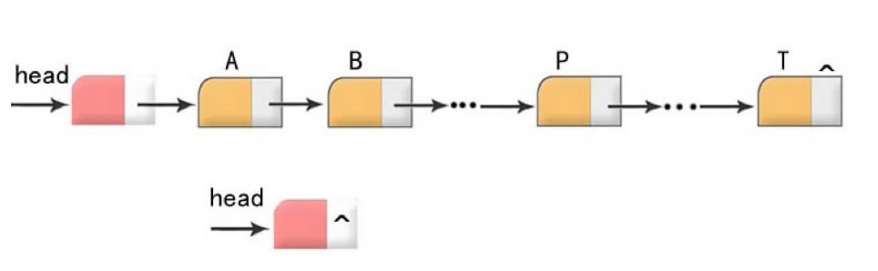
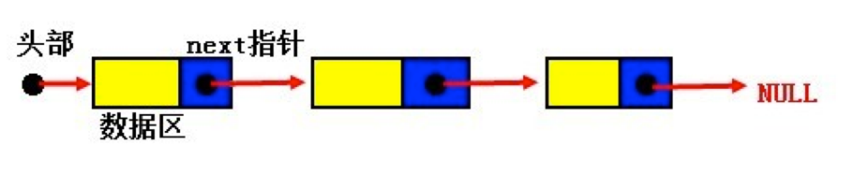
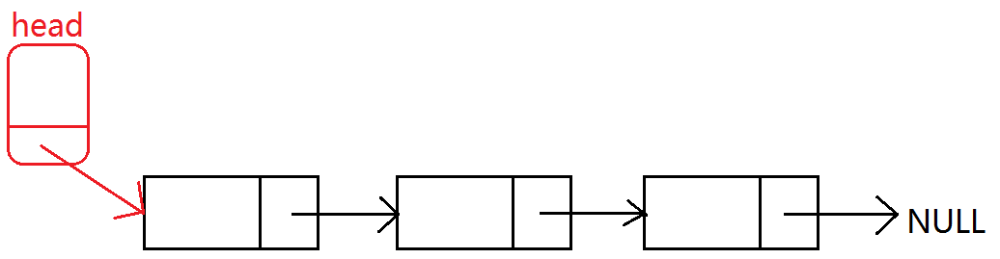
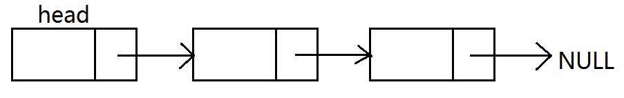
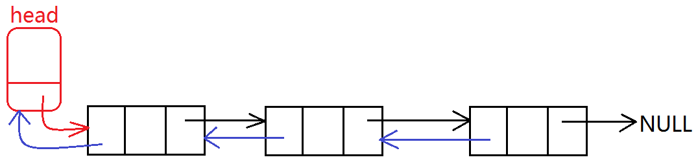
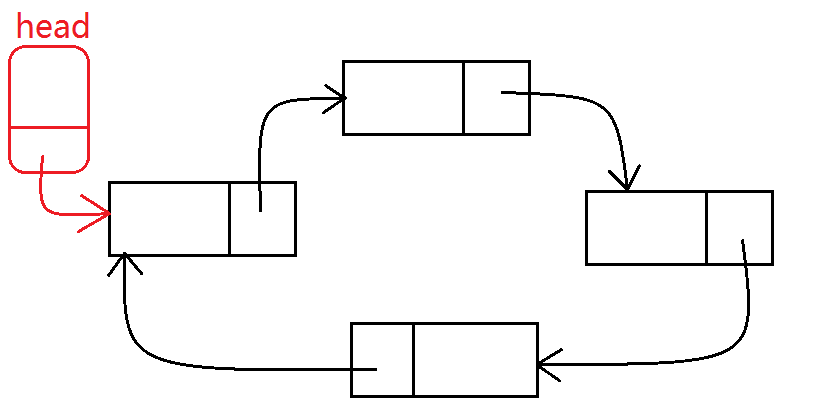

# 链表

---

## 链表基本概念

### 什么是链表



* 链表是一种常用的数据结构，它通过指针将一些列数据结点，连接成一个数据链。相对于数组，链表具有更好的动态性(非顺序存储)
* 数据域用来存储数据，指针域用于建立与下一个结点的联系
* 建立链表时无需预先知道数据总量的，可以随机的分配空间，可以高效的在链表中的任意位置实时插入或删除数据
* 链表的开销，主要是访问顺序性和组织链的空间损失

数组和链表的区别：

* 数组：一次性分配一块连续的存储区域
    * 优点：随机访问元素效率高
    * 缺点：
        * 要分配一块连续的存储区域(很大区域，有可能分配失败)
        * 删除和插入某个元素效率低
* 链表：无需一次性分配一块连续的存储区域，只需分配 `n` 块节点存储区域，通过指针建立关系
    * 优点：
        * 不需要一块连续的存储区域
	    * 删除和插入某个元素效率高
* 缺点：随机访问元素效率低

### 有关结构体的自身引用

* 问题1：结构体可以嵌套本类型的结构体变量吗
* 问题2：结构体可以嵌套本类型的结构体指针变量吗

```c
typedef struct _STUDENT
{
    char name[64];
    int age;
} Student;

typedef struct _TEACHER
{
    char name[64];
    Student stu; // 结构体可以嵌套其他类型的结构体
    // Teacher stu;
    // struct _TEACHER teacher; // 此时 Teacher 类型的成员还没有确定，编译器无法分配内存
    struct _TEACHER *teacher; // 不论什么类型的指针，都只占 8 个字节，编译器可确定内存分配
} Teacher;
```

注意，得用 `struct _TEACHER *teacher;` 而不能用 `Teacher *teacher;`，因为编译器此时并不知道 `Teacher` 是什么类型

* 结构体可以嵌套另外一个结构体的任何类型变量
* 结构体嵌套本结构体普通变量(不可以)。本结构体的类型大小无法确定，类型本质：固定大小内存块别名
* 结构体嵌套本结构体指针变量(可以)，指针变量的空间能确定，32 位，4 字节；64 位，8 字节

### 链表节点

链表是由一系列的节点组成，那么如何表示一个包含了数据域和指针域的节点呢

链表的节点类型实际上是结构体变量，此结构体包含数据域和指针域：

* 数据域用来存储数据
* 指针域用于建立与下一个结点的联系，当此节点为尾节点时，指针域的值为 `NULL`

```c
typedef struct Node
{
    //数据域
    int id;
    char name[50];
    //指针域
    struct Node *next;
} Node;
```



### 链表的分类

链表分为：静态链表和动态链表

静态链表和动态链表是线性表链式存储结构的两种不同的表示方式：

* 所有结点都是在程序中定义的，不是临时开辟的，也不能用完后释放，这种链表称为静态链表
* 所谓动态链表，是指在程序执行过程中从无到有地建立起一个链表，即一个一个地开辟结点和输入各结点数据，并建立起前后相链的关系

#### 静态链表

```c
#include <stdio.h>
#include <stdlib.h>
#include <string.h>

typedef struct Stu
{
    // 数据域
    int id;
    char name[100];

    // 指针域
    struct Stu *next;
} Stu;

void test()
{
    Stu s1 = {1, "Anna", NULL};
    Stu s2 = {2, "Bob", NULL};
    Stu s3 = {3, "Cord", NULL};

    s1.next = &s2;
    s2.next = &s3;
    s3.next = NULL;

    Stu *p = &s1;
    while (p != NULL)
    {
        printf("id = %d\tname = %s\n", p->id, p->name);
        p = p->next;
    }
}

int main()
{
    test();

    /*
        id = 1  name = Anna
        id = 2  name = Bob
        id = 3  name = Cord
    */

    return 0;
}
```

#### 动态链表

```c
#include <stdio.h>
#include <stdlib.h>
#include <string.h>

typedef struct Stu
{
    // 数据域
    int id;
    char name[100];

    // 指针域
    struct Stu *next;
} Stu;

void test()
{
    Stu *s1 = (Stu *)malloc(sizeof(Stu));
    s1->id = 1;
    strcpy(s1->name, "Anna");

    Stu *s2 = (Stu *)malloc(sizeof(Stu));
    s2->id = 2;
    strcpy(s2->name, "Bob");

    Stu *s3 = (Stu *)malloc(sizeof(Stu));
    s3->id = 3;
    strcpy(s3->name, "Cord");

    s1->next = s2;
    s2->next = s3;
    s3->next = NULL;

    Stu *p = s1;
    while (p != NULL)
    {
        printf("id = %d\tname = %s\n", p->id, p->name);
        p = p->next;
    }

    p = s1;
    Stu *tmp = NULL;
    while (p != NULL)
    {
        tmp = p;
        p = p->next;

        free(tmp);
        tmp = NULL;
    }
}

int main()
{
    test();
    char name[100];

    /*
        id = 1  name = Anna
        id = 2  name = Bob
        id = 3  name = Cord
    */

    return 0;
}
```

#### 带头和不带头链表

* 带头链表：固定一个节点作为头结点(数据域不保存有效数据)，起一个标志位的作用，以后不管链表节点如果改变，此头结点固定不变



* 不带头链表：头结点不固定，根据实际需要变换头结点(如在原来头结点前插入新节点，然后，新节点重新作为链表的头结点)



#### 单向链表、双向链表、循环链表

单向链表:


双向链表:



循环链表:



---

## 链表基本操作

### 创建链表

使用结构体定义节点类型：

```c
typedef struct LinkNode
{
    // 数据域
    int id;
    // 指针域
    struct LinkNode *next;
} LinkNode;
```

编写函数：`LinkNode *initLinkList()`

建立带有头结点的单向链表，循环创建结点，结点数据域中的数值从键盘输入，以 -1 作为输入结束标志，链表的头结点地址由函数值返回

```c
#include <stdio.h>
#include <stdlib.h>
#include <string.h>

typedef struct LinkNode
{
    // 数据域
    int id;
    // 指针域
    struct LinkNode *next;
} LinkNode;

LinkNode *initLinkList()
{
    // 创建头结点指针并分配内存
    LinkNode *head = (LinkNode *)malloc(sizeof(LinkNode));
    if (head == NULL)
    {
        return NULL;
    }

    head->id = -1;
    head->next = NULL;

    LinkNode *current = head;
    int data = -1;
    while (1)
    {
        printf("input data:\n");
        scanf("%d", &data);

        // 输入 -1 退出循环
        if (data == -1)
        {
            break;
        }

        // 新节点分配内存
        LinkNode *node = (LinkNode *)malloc(sizeof(LinkNode));
        if (node == NULL)
        {
            break;
        }

        node->id = data;
        node->next = NULL;

        current->next = node;
        current = node;
    }
    return head;
}
```

### 遍历链表

编写函数：`void foreachLinklist(LinkNode *head)`

顺序输出单向链表各项结点数据域中的内容

```c
void foreachLinklist(LinkNode *head)
{
    if (head == NULL)
    {
        return;
    }

    LinkNode *p = head->next;
    while (p != NULL)
    {
        printf("%d ", p->id);
        p = p->next;
    }
    printf("\n");
}
```

### 插入节点

编写函数: `void insertLinklist(LinkNode *head, int val, int data)`

在指定值后面插入数据 `data`，如果值 `val` 不存在，则在尾部插入

```c
void insertLinklist(LinkNode *head, int val, int data)
{
    if (head == NULL)
    {
        return;
    }

    LinkNode *pre = head;
    LinkNode *current = pre->next;

    while (current != NULL)
    {
        if (current->id == val)
        {
            break;
        }
        pre = current;
        current = pre->next;
    }

    if (current == NULL)
    {
        printf("不存在值为 %d 该节点\n", val);
        return;
    }

    LinkNode *node = (LinkNode *)malloc(sizeof(LinkNode));
    node->id = data;
    node->next = NULL;

    node->next = current;
    pre->next = node;
}
```

### 删除节点

编写函数: `void removeLinklist(LinkNode *head, int val)`

删除第一个值为 `val` 结点

```c
void removeLinklist(LinkNode *head, int val)
{
    if (head == NULL)
    {
        return;
    }

    LinkNode *pre = head;
    LinkNode *current = pre->next;

    while (current != NULL)
    {
        if (current->id == val)
        {
            break;
        }
        pre = current;
        current = pre->next;
    }

    if (current == NULL)
    {
        return;
    }

    pre->next = current->next;
    free(current);
}
```

### 销毁链表

编写函数: `void destroyLinklist(LinkNode *head)`

销毁链表，释放所有节点的空间

```c
void destroyLinklist(LinkNode *head)
{
    if (head == NULL)
    {
        return;
    }

    LinkNode *p = head;
    LinkNode *tmp = NULL;
    while (p != NULL)
    {
        tmp = p;
        p = p->next;

        free(tmp);
        tmp = NULL;
    }

    head = NULL;
}
```

---
