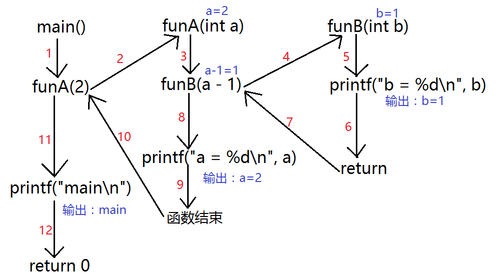
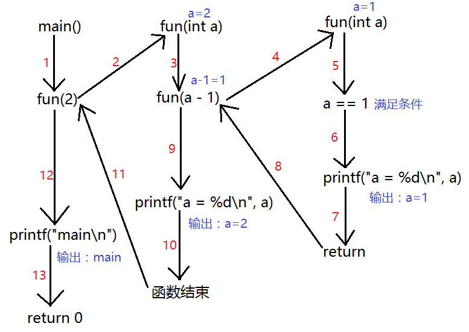

# 函数指针，回调函数与递归函数

---

## 函数指针

### 函数类型

通过什么来区分两个不同的函数

一个函数在编译时被分配一个入口地址，这个地址就称为函数的指针，函数名代表函数的入口地址

函数三要素：名称、参数、返回值。C 语言中的函数有自己特定的类型

C 语言中通过 `typedef` 为函数类型重命名：

```c
typedef int f(int, int); // f 为函数类型
typedef void p(int); // p 为函数类型
```

这一点和数组一样，因此我们可以用一个指针变量来存放这个入口地址，然后通过该指针变量调用函数

注意：通过函数类型定义的变量是不能够直接执行，因为没有函数体。只能通过类型定义一个函数指针指向某一个具体函数，才能调用

```c
#include <stdio.h>
#include <stdlib.h>
#include <string.h>

typedef void(p)(int, int);

void func(int a, int b)
{
    printf("%d %d\n", a, b);
}

void test()
{
    p p1;
    // p1(10, 20); // 错误，不能直接调用，只描述了函数类型，但是并没有定义函数体，没有函数体无法调用
    p *p2 = func;
    p2(10, 20); // 正确，指向有函数体的函数入口地址
}

int main()
{
    test();

    /*
        10 20
    */

    return 0;
}
```

### 函数指针(指向函数的指针)

* 函数指针定义方式(先定义函数类型，根据类型定义指针变量)
* 先定义函数指针类型，根据类型定义指针变量
* 直接定义函数指针变量

```c
#include <stdio.h>
#include <stdlib.h>
#include <string.h>

int my_func(int a, int b)
{
    printf("ret: %d\n", a + b);
    return 0;
}

// 先定义函数类型，通过类型定义指针
void test1()
{
    typedef int(FUNC_TYPE)(int, int);
    FUNC_TYPE *f = my_func;
    // 调用
    (*f)(10, 20);
    f(10, 20);
}

// 定义函数指针类型
void test2()
{
    typedef int (*FUNC_POINTER)(int, int);
    FUNC_POINTER f = my_func;
    // 调用
    (*f)(10, 20);
    f(10, 20);
}

// 直接定义函数指针变量
void test3()
{
    int (*f)(int, int) = my_func;
    // 调用
    (*f)(10, 20);
    f(10, 20);
}

int main()
{
    test1();
    test2();
    test3();

    /*
        ret: 30
        ret: 30
        ret: 30
        ret: 30
        ret: 30
        ret: 30
    */

    return 0;
}
```

### 函数指针数组

函数指针数组，每个元素都是函数指针

```c
#include <stdio.h>
#include <stdlib.h>
#include <string.h>

void func1(int a)
{
    printf("func1: %d\n", a);
}

void func2(int a)
{
    printf("func2: %d\n", a);
}

void func3(int a)
{
    printf("func3: %d\n", a);
}

void test()
{
#if 0
	// 定义函数指针
	void(*func_array[])(int) = {func1, func2, func3};
#else
    void (*func_array[3])(int);
    func_array[0] = func1;
    func_array[1] = func2;
    func_array[2] = func3;
#endif
    for (int i = 0; i < 3; i++)
    {
        func_array[i](10 + i);
        (*func_array[i])(10 + i);
    }
}

int main()
{
    test();

    /*
        ret: 30
        ret: 30
        ret: 30
        ret: 30
        ret: 30
        ret: 30
    */

    return 0;
}
```

---

## 回调函数

### 函数指针做函数参数

函数参数除了是普通变量，还可以是函数指针变量

```c
// 形参为普通变量
void fun(int x) {}
// 形参为函数指针变量
void fun(int (*p)(int a)) {}
```

函数指针变量常见的用途之一是把指针作为参数传递到其他函数，指向函数的指针也可以作为参数，以实现函数地址的传递

```c
#include <stdio.h>
#include <stdlib.h>
#include <string.h>

int plus(int a, int b)
{
    return a + b;
}

int sub(int a, int b)
{
    return a - b;
}

int mul(int a, int b)
{
    return a * b;
}

int division(int a, int b)
{
    return a / b;
}

// 函数指针做函数的参数 --- 回调函数
void Calculator(int (*myCalculate)(int, int), int a, int b)
{
    int ret = myCalculate(a, b); // dowork 中不确定用户选择的内容，由后期来指定运算规则
    printf("ret = %d\n", ret);
}

void test()
{
    printf("请输入操作符\n");
    printf("1、+ \n");
    printf("2、- \n");
    printf("3、* \n");
    printf("4、/ \n");

    int select = -1;
    scanf("%d", &select);

    int num1 = 0;
    printf("请输入第一个操作数：\n");
    scanf("%d", &num1);

    int num2 = 0;
    printf("请输入第二个操作数：\n");
    scanf("%d", &num2);

    switch (select)
    {
    case 1:
        Calculator(plus, num1, num2);
        break;
    case 2:
        Calculator(sub, num1, num2);
        break;
    case 3:
        Calculator(mul, num1, num2);
        break;
    case 4:
        Calculator(division, num1, num2);
        break;
    default:
        break;
    }
}

int main()
{
    test();

    /*
        请输入操作符
        1、+
        2、-
        3、*
        4、/
        2
        请输入第一个操作数：
        12
        请输入第二个操作数：
        3
        ret = 9
    */

    return 0;
}
```

注意：函数指针和指针函数的区别

* 函数指针是指向函数的指针
* 指针函数是返回类型为指针的函数

---

## 递归函数

### 递归函数基本概念

C 通过运行时堆栈来支持递归函数的实现。递归函数就是直接或间接调用自身的函数

### 普通函数调用

```c
#include <stdio.h>
#include <stdlib.h>
#include <string.h>

void funB(int b)
{
    printf("b = %d\n", b);
}

void funA(int a)
{
    funB(a - 1);
    printf("a = %d\n", a);
}

int main()
{
    funA(2);
    printf("main\n");

    /*
        b = 1
        a = 2
        main
    */

    return 0;
}
```



### 递归函数调用

```c
#include <stdio.h>
#include <stdlib.h>
#include <string.h>

void fun(int a)
{
    if (a == 1)
    {
        printf("a = %d\n", a);
        return; // 中断函数很重要
    }

    fun(a - 1);
    printf("a = %d\n", a);
}

int main()
{
    fun(4);
    printf("main\n");

    /*
        a = 1
        a = 2
        a = 3
        a = 4
        main
    */

    return 0;
}
```



* 递归实现给出一个数 8793，依次打印千位数字 8、百位数字 7、十位数字 9、个位数字 3

```c
#include <stdio.h>
#include <stdlib.h>
#include <string.h>

void recursion(int val)
{
    if (val == 0)
    {
        return;
    }
    int ret = val / 10;
    recursion(ret);
    printf("%d ", val % 10);
}

int main()
{
    recursion(8793);
    printf("\n");

    /*
        8 7 9 3
    */

    return 0;
}
```

### 递归实现字符串反转

```c
#include <stdio.h>
#include <stdlib.h>
#include <string.h>

int reverse1(char *str)
{
    if (str == NULL)
    {
        return -1;
    }

    if (*str == '\0') // 函数递归调用结束条件
    {
        return 0;
    }

    reverse1(str + 1);
    printf("%c", *str);

    return 0;
}

// 全局变量
char buf[1024] = {0};

int reverse2(char *str)
{
    if (str == NULL)
    {
        return -1;
    }

    if (*str == '\0') // 函数递归调用结束条件
    {
        return 0;
    }

    reverse2(str + 1);
    strncat(buf, str, 1);

    return 0;
}

int reverse3(char *str, char *dst)
{
    if (str == NULL || dst == NULL)
    {
        return -1;
    }

    if (*str == '\0') // 函数递归调用结束条件
    {
        return 0;
    }

    reverse3(str + 1, dst);
    strncat(dst, str, 1);

    return 0;
}

int main()
{
    char *str = "abcdefg";
    char dst[10] = {0};

    printf("%s\n", str);
    reverse1(str);
    printf("\n");
    printf("%s\n", str);

    printf("----------\n");

    printf("%s\n", str);
    reverse2(str);
    printf("%s\n", str);
    printf("%s\n", buf);

    printf("----------\n");

    printf("%s\n", str);
    reverse3(str, dst);
    printf("%s\n", str);
    printf("%s\n", dst);

    /*
        abcdefg
        gfedcba
        abcdefg
        ----------
        abcdefg
        abcdefg
        gfedcba
        ----------
        abcdefg
        abcdefg
        gfedcba
    */

    return 0;
}
```

---
