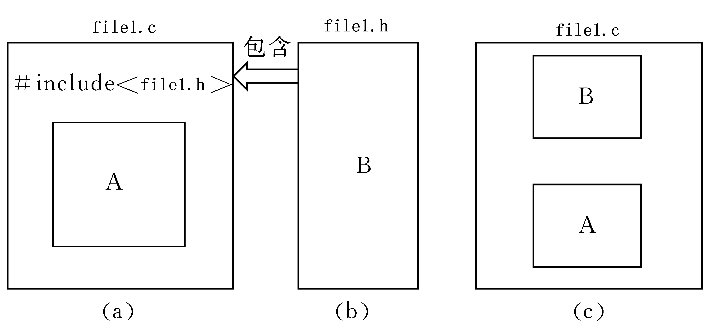

# 预处理与动态库

---

## 预处理

### 预处理的基本概念

C 语言对源程序处理的四个步骤：预处理、编译、汇编、链接

预处理是在程序源代码被编译之前，由预处理器(Preprocessor)对程序源代码进行的处理。这个过程并不对程序的源代码语法进行解析，但它会把源代码分割或处理成为特定的符号为下一步的编译做准备工作

### 文件包含指令(`#include`)

#### 文件包含处理

“文件包含处理”是指一个源文件可以将另外一个文件的全部内容包含进来。C 语言提供了 `#include` 命令用来实现“文件包含”的操作



#### `#incude <>` 和 `#include ""` 区别

* `""` 表示系统先在 `file1.c` 所在的当前目录找 `file1.h`，如果找不到，再按系统指定的目录检索
* `<>` 表示系统直接按系统指定的目录检索

注意

* `#include <>` 常用于包含库函数的头文件
* `#include ""` 常用于包含自定义的头文件
* 理论上 `#include` 可以包含任意格式的文件(`.c、.h`等)，但一般用于头文件的包含

### 宏定义

#### 无参数的宏定义(宏常量)

如果在程序中大量使用到了 100 这个值，那么为了方便管理，我们可以将其定义为：`const int num = 100;`，但是如果使用 `num` 定义一个数组，在不支持 C99 标准的编译器上是不支持的，因为 `num` 不是一个编译器常量，如果想得到了一个编译器常量，那么可以使用：`#define num 100`

在编译预处理时，将程序中在该语句以后出现的所有的 `num` 都用 100 代替。这种方法使用户能以一个简单的名字代替一个长的字符串，在预编译时将宏名替换成字符串的过程称为“宏展开”。宏定义，只在宏定义的文件中起作用

```c
#include <stdio.h>
#include <stdlib.h>
#include <string.h>

#define PI 3.1415

void test()
{
    double r = 10.0;
    double s = PI * r * r;
    printf("s = %lf\n", s);
}

int main()
{
    test();

    /*
        s = 314.150000
    */

    return 0;
}
```

说明：

* 宏名一般用大写，以便于与变量区别
* 宏定义可以是常数、表达式等
* 宏定义不作语法检查，只有在编译被宏展开后的源程序才会报错
* 宏定义不是 C 语言，不在行末加分号
* 宏名有效范围为从定义到本源文件结束
* 可以用 `#undef` 命令终止宏定义的作用域
* 在宏定义中，可以引用已定义的宏名

#### 带参数的宏定义(宏函数)

在项目中，经常把一些短小而又频繁使用的函数写成宏函数，这是由于宏函数没有普通函数参数压栈、跳转、返回等的开销，可以调高程序的效率

宏通过使用参数，可以创建外形和作用都与函数类似地类函数宏(function-like macro). 宏的参数也用圆括号括起来

```c
#include <stdio.h>
#include <stdlib.h>
#include <string.h>

#define SUM(x, y) ((x) + (y))
void test()
{
    // 仅仅只是做文本替换，下例替换为 int ret = ((10)+(20));
    // 不进行计算
    int ret = SUM(10, 20);
    printf("ret: %d\n", ret);
}

int main()
{
    test();

    /*
        ret: 30
    */

    return 0;
}
```

注意:

* 宏的名字中不能有空格，但是在替换的字符串中可以有空格。ANSIC 允许在参数列表中使用空格
* 用括号括住每一个参数，并括住宏的整体定义
* 用大写字母表示宏的函数名
* 如果打算宏代替函数来加快程序运行速度。假如在程序中只使用一次宏对程序的运行时间没有太大提高

### 条件编译

#### 基本概念

一般情况下，源程序中所有的行都参加编译。但有时希望对部分源程序行只在满足一定条件时才编译，即对这部分源程序行指定编译条件


#### 条件编译

防止头文件被重复包含引用

```h
#ifndef _SOMEFILE_H
#define _SOMEFILE_H

// 需要声明的变量、函数
// 宏定义
// 结构体

#endif
```

#### 一些特殊的预定宏

C 编译器，提供了几个特殊形式的预定义宏，在实际编程中可以直接使用，很方便

```c
#include <stdio.h>
#include <stdlib.h>
#include <string.h>

//	__FILE__ 宏所在文件的源文件名
//	__LINE__ 宏所在行的行号
//	__DATE__ 代码编译的日期
//	__TIME__ 代码编译的时间

void test()
{
    printf("%s\n", __FILE__);
    printf("%d\n", __LINE__);
    printf("%s\n", __DATE__);
    printf("%s\n", __TIME__);
}

int main()
{
    test();

    /*
        main.c
        13
        Aug 23 2022
        16:10:30
    */

    return 0;
}
```

---

## 动态库的封装和使用

### 库的基本概念

库是已经写好的、成熟的、可复用的代码。每个程序都需要依赖很多底层库，不可能每个人的代码从零开始编写代码，因此库的存在具有非常重要的意义

在开发的应用中经常有一些公共代码是需要反复使用的，就把这些代码编译为库文件

库可以简单看成一组目标文件的集合，将这些目标文件经过压缩打包之后形成的一个文件。像在 Windows 这样的平台上，最常用的 C 语言库是由集成按开发环境所附带的运行库，这些库一般由编译厂商提供

代码的分发方式：

* 源码：头文件 + 源文件
* 静态库：头文件(可选) + LIB 文件(可选) + DLL 文件
* 动态库：头文件 + LIB 文件

### windows 下静态库创建和使用

* 创建一个新项目，在已安装的模板中选择“常规”，在右边的类型下选择“空项目”，在名称和解决方案名称中输入 `staticlib`，点击确定
* 在解决方案资源管理器的头文件中添加 `mylib.h` 文件，在源文件添加 `mylib.c` 文件(即实现文件)
* 在 `mylib.h` 文件中添加如下代码

```c
#pragma once

int __cdecl myAdd(int a,int b);
```

* 在 `mylib.c` 文件中添加如下代码

```c
#include "mylib.h"

int myAdd(int a, int b) {
	return a + b;
}
```

* 配置项目属性。因为这是一个静态链接库，所以应在项目属性的“配置属性”下选择“常规”，在其下的配置类型中选择静态库 `.lib`
* 编译生成新的解决方案，在 Debug 文件夹下会得到 `mylib.lib`(对象文件库)，将该 `.lib` 文件和相应头文件给用户，用户就可以使用该库里的函数了

### 静态库的使用

* 方法一：配置项目属性
    * 添加工程的头文件目录：工程---属性---配置属性---c/c++---常规---附加包含目录：加上头文件存放目录
    * 添加文件引用的 `lib` 静态库路径：工程---属性---配置属性---链接器---常规---附加库目录：加上 `lib` 文件存放目录
    * 然后添加工程引用的 `lib` 文件名：工程---属性---配置属性---链接器---输入---附加依赖项：加上 `lib` 文件名
* 方法二：使用编译语句
    * `#pragma comment(lib, "./mylib.lib")`
* 方法三：添加工程中
    * 就像添加 `.h` 和 `.c` 文件一样，把 `lib` 文件添加到工程文件列表中去
    * 切换到"解决方案视图"，选中要添加 `lib` 的工程-->点击右键-->"添加"-->"现有项"-->选择 `lib` 文件-->确定

使用静态库中可能存在的一些问题，[链接](https://cloud.tencent.com/developer/article/1730911)

### 静态库优缺点

* 静态库对函数库的链接是放在编译时期完成的，静态库在程序的链接阶段被复制到了程序中，和程序运行的时候没有关系
* 程序在运行时与函数库再无瓜葛，移植方便
* 浪费空间和资源，所有相关的目标文件与牵涉到的函数库被链接合成一个可执行文件

内存和磁盘空间

静态链接这种方法很简单，原理上也很容易理解，在操作系统和硬件不发达的早期，绝大部门系统采用这种方案。随着计算机软件的发展，这种方法的缺点很快暴露出来，那就是静态链接的方式对于计算机内存和磁盘空间浪费非常严重。特别是多进程操作系统下，静态链接极大的浪费了内存空间。在现在的 linux 系统中，一个普通程序会用到 C 语言静态库至少在 1MB 以上，那么如果磁盘中有 2000 个这样的程序，就要浪费将近 2GB 的磁盘空间

程序开发和发布

空间浪费是静态链接的一个问题，另一个问题是静态链接对程序的更新、部署和发布也会带来很多麻烦。比如程序中所使用的 `mylib.lib` 是由一个第三方厂商提供的，当该厂商更新容量 `mylib.lib` 的时候，那么我们的程序就要拿到最新版的 `mylib.lib`，然后将其重新编译链接后，将新的程序整个发布给用户。这样的做缺点很明显，即一旦程序中有任何模块更新，整个程序就要重新编译链接、发布给用户，用户要重新安装整个程序

---

## windows 下动态库创建和使用

要解决空间浪费和更新困难这两个问题，最简单的办法就是把程序的模块相互分割开来，形成独立的文件，而不是将他们静态的链接在一起。简单地讲，就是不对哪些组成程序的目标程序进行链接，等程序运行的时候才进行链接。也就是说，把整个链接过程推迟到了运行时再进行，这就是动态链接的基本思想

### 动态库的创建

* 创建一个新项目，在已安装的模板中选择“常规”，在右边的类型下选择“空项目”，在名称和解决方案名称中输入 `mydll`，点击确定
* 在解决方案资源管理器的头文件中添加 `mydll.h` 文件，在源文件添加 `mydll.c` 文件(即实现文件)
* 在 `test.h` 文件中添加如下代码

```c
#pragma once

__declspec(dllexport) int myminus(int a, int b);
```

* 在 `test.c` 文件中添加如下代码

```c
#include "test.h"

__declspec(dllexport) int myminus(int a, int b){
	return a - b;
}
```

* 配置项目属性。因为这是一个动态链接库，所以应在项目属性的“配置属性”下选择“常规”，在其下的配置类型中选择动态库 `.dll`
* 编译生成新的解决方案，在 Debug 文件夹下会得到 `mydll.dll`(对象文件库)，将该 `.dll` 文件、`.lib` 文件和相应头文件给用户，用户就可以使用该库里的函数了


疑问一：`__declspec(dllexport)` 是什么意思

动态链接库中定义有两种函数：导出函数(export function)和内部函数(internal function)。导出函数可以被其它模块调用，内部函数在定义它们的 DLL 程序内部使用

疑问二：动态库的 `lib` 文件和静态库的 `lib` 文件的区别

在使用动态库的时候，往往提供两个文件：一个引入库 `.lib` 文件(也称“导入库文件”)和一个 DLL(`.dll`)文件。虽然引入库的后缀名也是 `lib`，但是，动态库的引入库文件和静态库文件有着本质的区别，对一个 DLL 文件来说，其引入库文件 `.lib` 包含该 DLL 导出的函数和变量的符号名，而 `.dll` 文件包含该 DLL 实际的函数和数据。在使用动态库的情况下，在编译链接可执行文件时，只需要链接该 DLL 的引入库文件，该 DLL 中的函数代码和数据并不复制到可执行文件，直到可执行程序运行时，才去加载所需的 DLL，将该 DLL 映射到进程的地址空间中，然后访问 DLL 中导出的函数

### 动态库的使用

* 方法一：隐式调用
    * 创建主程序 TestDll，将 `mydll.h`、`mydll.dll` 和 `mydll.lib` 复制到源代码目录下。
    * P.S：头文件 `Func.h` 并不是必需的，只是 C++ 中使用外部函数时，需要先进行声明)
    * 在程序中指定链接引用链接库: `#pragma comment(lib, "./mydll.lib")`
* 显式调用
    * `HANDLE hDll;` // 声明一个 dll 实例文件句柄
	* `hDll = LoadLibrary("mydll.dll");` // 导入动态链接库
	* `MYFUNC minus_test;` // 创建函数指针
    * `minus_test = (MYFUNC)GetProcAddress(hDll, "myminus");` // 获取导入函数的函数指针

Windows VS 平台上更多静态库与动态库的使用可以参见 [官方文档](https://docs.microsoft.com/zh-cn/cpp/build/walkthrough-creating-and-using-a-static-library-cpp?view=msvc-170)

---
