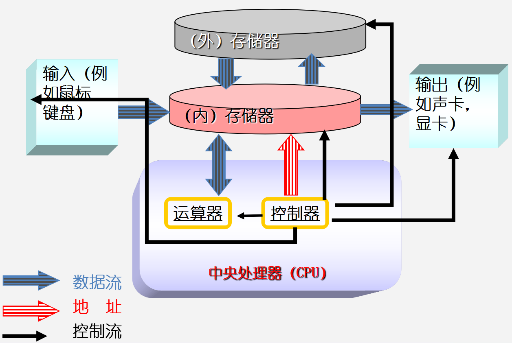
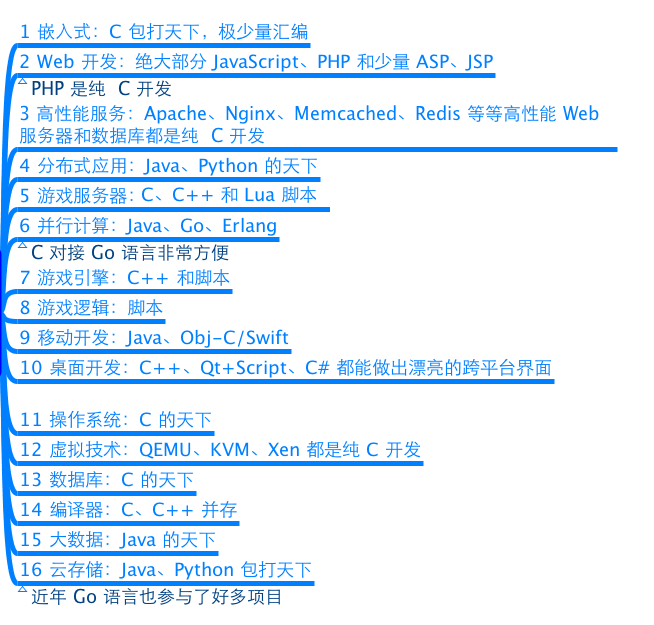
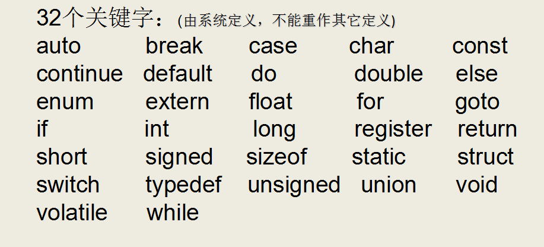
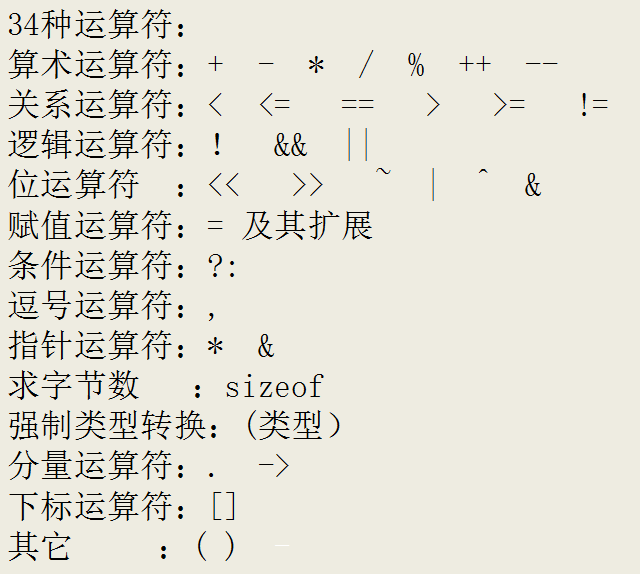
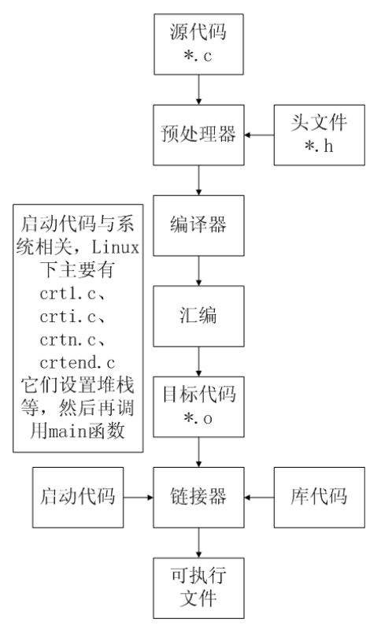

# helloworld 入门

C 语言是人和计算机交流的一种语言，计算机的组成如下



---

## 关于 C 语言

### C 语言特点

**优点**

* 代码量小
* 执行速度快
* 功能强大
* 编程自由

**缺点**

* 写代码实现周期长
* 可移植性较差
* 过于自由，经验不足易出错
* 对平台库依赖较多 

### C 语言应用领域

C 语言的应用极其广泛，从网站后台，到底层操作系统，从多媒体应用到大型网络游戏，均可用 C 语言来开发：



### C 语言关键字

C 语言仅有 32 个关键字，9 种控制语句，34 种运算符，却能完成无数的功能

**关键字**



**控制语句**


**运算符**



C 语言的 32 个关键字


---

## 第一个 C 语言程序

### 编写 C 语言代码

`main.c`

```c
#include <stdio.h>

int main()
{
    printf("hello world\n");
    // hello world

    return 0;
}
```

### 通过 gcc 编译 C 代码

`gcc`(GNU Compiler Collection，GNU 编译器套件)，是由 GNU 开发的编程语言编译器。`gcc` 原本作为 GNU 操作系统的官方编译器，现已被大多数类 Unix 操作系统(如 Linux、BSD、Mac OS 等)采纳为标准的编译器，`gcc` 同样适用于微软的 Windows

`gcc` 最初用于编译 C 语言，随着项目的发展 `gcc` 已经成为了能够编译 C、C++、Java、Ada、fortran、Object C、Object C++、Go 语言的编译器大家族

编译命令格式：

```sh
gcc [-option1] ... <filename>
g++ [-option1] ... <filename>
```

* 命令、选项和源文件之间使用空格分隔
* 一行命令中可以有零个、一个或多个选项
* 文件名可以包含文件的绝对路径，也可以使用相对路径
* 如果命令中不包含输出可执行文件的文件名，可执行文件的文件名会自动生成一个默认名，Linux 平台为 `a.out`，Windows 平台为 `a.exe`

`gcc、g++` 编译常用选项说明：

* `-o file` 指定生成的输出文件名为 `file`
* `-E` 只进行预处理
* `-S(大写)` 只进行预处理和编译
* `-c(小写)` 只进行预处理、编译和汇编

编译并运行

```sh
gcc -o main main.c && ./main
```

### 代码分析

`#include 头文件` 包含

* `#include` 的意思是头文件包含，`#include <stdio.h>` 代表包含 `stdio.h` 这个头文件
* 使用 C 语言库函数需要提前包含库函数对应的头文件，这里使用了 `printf()`，需要包含 `stdio.h` 头文件
* 可以通过 `man 3 printf` 查看 `printf` 所需的头文件

`#include <>` 与 `#include ""` 的区别：

* `<>` 表示系统直接按系统指定的目录检索
* `""` 表示系统先在 `""` 指定的路径(没写路径代表当前路径)查找头文件，如果找不到，再按系统指定的目录检索

`stdio.h` 是在操作系统的系统目录下

```sh
root@master:/# cd /usr/include/
root@master:/usr/include# pwd
/usr/include
root@master:/usr/include# ls -l | grep stdio.h
-rw-r--r--  1 root root  29950 Apr  7 09:24 stdio.h
root@master:/usr/include# 
```

`main` 函数

* 一个完整的 C 语言程序，是由一个、且只能有一个 `main()` 函数(又称主函数，必须有)和若干个其他函数结合而成(可选)
* `main` 函数是 C 语言程序的入口，程序是从 `main` 函数开始执行

`{}` 括号，程序体和代码块

* `{}` 叫代码块，一个代码块内部可以有一条或者多条语句
* C 语言每句可执行代码都是 `;` 分号结尾
* 所有的 `#` 开头的行，都代表预编译指令，预编译指令行结尾是没有分号的
* 所有的可执行语句必须是在代码块里面

注释

* `//` 叫行注释，注释的内容编译器是忽略的，注释主要的作用是在代码中加一些说明和解释，这样有利于代码的阅读
* `/**/` 叫块注释
* 块注释是 C 语言标准的注释方法
* 行注释是从 C++ 借鉴过来的

`printf` 函数

* `printf` 是 C 语言库函数，功能是向标准输出设备输出一个字符串
* `printf("hello world\n");` `\n` 的意思是回车换行

`return` 语句

* `return` 代表函数执行完毕，返回 `return` 代表函数的终止
* 如果 `main` 定义的时候前面是 `int`，那么 `return` 后面就需要写一个整数；如果 `main` 定义的时候前面是 `void`，那么 `return` 后面什么也不需要写
* 在 `main` 函数中 `return 0` 代表程序执行成功，`return -1` 代表程序执行失败
* `int main()` 和 `void main()` 在 C 语言中是一样的，但 C++ 只接受 `int main` 这种定义方式

---

## system 函数

### system 函数的使用

```c
#include <stdlib.h>

int system(const char *command);
```

解释：

* 功能：在已经运行的程序中执行另外一个外部程序
* 参数：外部可执行程序名字
* 返回值：
    * 成功：0
    * 失败：任意数字

demo:

```c
#include <stdio.h>
#include <stdlib.h>

int main()
{
    // system("calc"); // windows 平台
    system("ls"); // Linux 平台, 需要头文件 #include <stdlib.h>
    // main  main.c

    return 0;
}
```

---

## C 语言编译过程

### C 程序编译步骤

C 代码编译成可执行程序经过 4 步：

* **预处理**：宏定义展开、头文件展开、条件编译等，同时将代码中的注释删除，这里并不会检查语法
* **编译**：检查语法，将预处理后文件编译生成汇编文件
* **汇编**：将汇编文件生成目标文件(二进制文件)
* **链接**：C 语言写的程序是需要依赖各种库的，所以编译之后还需要把库链接到最终的可执行程序中去



### gcc 编译过程

**分步编译**

* 预处理：`gcc -E hello.c -o hello.i`
* 编  译：`gcc -S hello.i -o hello.s`
* 汇  编：`gcc -c hello.s -o hello.o`
* 链  接：`gcc    hello.o -o hello`

解释:

* `-E` 只进行预处理
* `-S(大写)` 只进行预处理和编译
* `-c(小写)` 只进行预处理、编译和汇编
* `-o file` 指定生成的输出文件名为 `file`

文件后缀:

* `.c` C 语言文件
* `.i` 预处理后的 C 语言文件
* `.s` 编译后的汇编文件
* `.o` 编译后的目标文件

编译运行结果如下:

```sh
root@master:/# ls
main.c
root@master:/# gcc -E main.c -o main.i
root@master:/# ls
main.c  main.i
root@master:/# gcc -S main.i -o main.s
root@master:/# ls
main.c  main.i  main.s
root@master:/# gcc -c main.s -o main.o
root@master:/# ls
main.c  main.i  main.o  main.s
root@master:/# gcc main.o -o main
root@master:/# ls
main  main.c  main.i  main.o  main.s
root@master:/# ./main
hello world
root@master:/#
```

**一步编译**

`gcc -o main main.c && ./main` 还是经过预处理、编译、汇编、链接的过程

```sh
root@master:/# ls
main.c
root@master:/# gcc -o main main.c && ./main
hello world
root@master:/# ls
main  main.c
root@master:/#
```

windows 平台 `gcc` 编译 4 步骤：

* 预处理 `-E xxx.i`	预处理文件 `gcc -E xxx.c -o xxx.i`
    * 头文件展开，不检查语法错误，可以展开任意文件
    * 宏定义替换，将宏名替换为宏值
    * 替换注释，变成空行
    * 展开条件编译，根据条件来展开指令
    * ...
* 编译 `-S xxx.s` 汇编文件 `gcc -S hello.i -o hello.s`
    * 逐行检查语法错误，整个编译 4 步骤中最耗时的过程
    * 若没有错误，将 C 程序翻译成汇编指令，得到 `.s` 汇编文件
* 汇编 `-c xxx.o` 目标文件 `gcc -c hello.s -o hello.o`
    * 翻译：将汇编指令翻译成对应的二进制编码
* 链接 `xxx.exe` 可执行文件 `gcc hello.o -o hello.exe`
    * 数据段合并
    * 数据地址回填
    * 库引入

如下图所示


### 查找程序所依赖的动态库

Windows 平台下，需要相应软件 [Depends.exe](./tools/Depends.exe)

双击打开，选中对应的 `exe` 文件即可查看运行该 `exe` 文件所依赖的动态库

---

## CPU 内部结构与寄存器

### 64 位和 32 位系统区别

* 寄存器是 CPU 内部最基本的存储单元
* CPU 对外是通过总线(地址、控制、数据)来和外部设备交互的，总线的宽度是 8 位，同时 CPU 的寄存器也是 8 位，那么这个 CPU 就叫 8 位CPU
* 如果总线是 32 位，寄存器也是 32 位的，那么这个 CPU 就是 32 位 CPU
* 有一种 CPU 内部的寄存器是 32 位的，但总线是 16 位，准 32 为 CPU
* 所有的 64 位 CPU 兼容 32 位指令，32 位要兼容 16 位指令，所以在 64 位 CPU 上是可以识别 32 位指令，当然太“古老”的指令可能在后续版本就摒弃掉了，所以也不是百分百兼容旧指令
* 在 64 位 CPU 构架上运行了 64 位软件操作系统，那么这个系统是 64 位
& 在 64 位 CPU 构架上，运行了 32 位软件操作系统，那么这个系统就是 32 位
* 64 位软件不能运行在 32 位CPU之上

### 寄存器名字

|||||
|:----:|:----:|:----:|:----:|
| 8 位 | 16 位 | 32 位 | 64 位 |
| A | AX | EAX | RAX |
| B | BX | EBX | RBX |
| C | CX | ECX | RCX |
| D | DX | EDX | RDX |

### 寄存器、缓存、内存三者关系

按与 CPU 远近来分，离得最近的是寄存器，然后缓存(CPU 缓存)，最后内存

CPU 计算时，先预先把要用的数据从硬盘读到内存，然后再把即将要用的数据读到寄存器。于是  `CPU <---> 寄存器 <---> 内存`，这就是它们之间的信息交换

那为什么有缓存呢？因为如果经常操作内存中的同一址地的数据，就会影响速度。于是就在寄存器与内存之间设置一个缓存

因为从缓存提取的速度远高于内存。当然缓存的价格肯定远远高于内存

由此可以看出，从远近来看：`CPU <---> 寄存器 <---> 缓存 <---> 内存`

---

## 汇编语言

C 语言嵌套汇编代码，常见格式如下:

```cpp
asm volatile(               
    /* volatile : 可选，禁止编译器对汇编代码进行优化 */
    "汇编语句模板" /* 汇编指令间使用'\n'分隔 */
    : "=限制符"(输出参数)
    : "限制符"(输入参数)
    : 损坏部分
);
```

其中：

* `asm` 表示后面的代码为内嵌汇编
* `volatile` 表示编译器不要优化代码，后面的指令保留原样
* 编写汇编指令模板，然后将 C 语言表达式与指令的操作数相关联，并告诉 GCC 对这些操作有哪些限制条件

内嵌汇编格式为 `汇编语句模板: 输出部分: 输入部分: 损坏部分`

demo:

```c
#include <stdio.h>

/* 赋值 */
static int value_assignment(int input)
{
    int ret = 0;

    asm volatile(
        /* ret = input */
        "movl %1, %0\n" /* 通过占位符指定交互的变量 ： %0:ret %1:input*/
        : "=r"(ret)
        : "r"(input));

    return ret;
}

int main()
{
    int input = 1;
    int ret = value_assignment(input);

    printf("input = %d\n", input);
    printf("ret = %d\n", ret);

    /*
        input = 1
        ret = 1
    */

    return 0;
}
```

对于上述示例，编译器做了如下工作： 

* 将 `ret` 通过限定符建议关联到某个合适的寄存器(可以不关联)
* 将 `input` 限定符建议关联到另一个合适的寄存器(可以不关联)
* 通过 `通用寄存器` 间接操作变量

下面是 `value_assignment()` 函数使用 `objdump` 反汇编的结果：

```c
static int value_assignment(int input) {
    1149:   f3 0f 1e fa             endbr64 
    114d:   55                          push   %rbp
    114e:   48 89 e5               mov    %rsp,%rbp
    1151:   89 7d ec                mov    %edi,-0x14(%rbp)      /* input */
  int ret = 0;
    1154:   c7 45 fc 00 00 00 00    movl   $0x0,-0x4(%rbp)  /* ret = 0 */

  asm volatile(
    115b:   8b 45 ec             mov    -0x14(%rbp),%eax /* 将栈上的 input 变量传递到 eax 寄存器 */
    115e:   89 c0                   mov    %eax,%eax              
    1160:   89 45 fc               mov    %eax,-0x4(%rbp)  /* eax 寄存器 的值传递到 栈上的 ret 变量 */
    "movl %1, %0\n" 
    :"=r"(ret) 
    :"r"(input)
  );

  return ret;
    1163:   8b 45 fc             mov    -0x4(%rbp),%eax
}
    1166:   5d                      pop    %rbp
    1167:   c3                       retq
```

可以看出编译做了优化，没有将 `ret` 和 `input` 根据限定符的建议关联到寄存器中，而是直接通过 通用寄存器与内存完成赋值操作

如果想查看 C 程序的汇编代码，很多 IDE 都提供了这项功能，反汇编

---

## 集成开发环境 IDE

集成开发环境(IDE，Integrated Development Environment)是用于提供程序开发环境的应用程序，一般包括代码编辑器、编译器、调试器和图形用户界面工具。集成了代码编写功能、分析功能、编译功能、调试功能等一体化的开发软件服务套。所有具备这一特性的软件或者软件套(组)都可以叫集成开发环境

常用的 IDE 有：

* Qt Creator，不仅可以开发 GUI 程序，也能开发 C++ 程序

在后续的 C++ Qt 教程中将会用到

* Microsoft Visual Studio，最强大的 C++ IDE。

由于微软在 VS 2013 中不建议再使用 C 的传统库函数 `scanf, strcpy, sprintf` 等，所以直接使用这些库函数会提示 C4996 错误

VS 建议采用带 `_s` 的函数，如 `scanf_s、strcpy_s`，但这些并不是标准 C 函数

要想继续使用此函数，需要在源文件中添加以下指令就可以避免这个错误提示：

```cpp
#define _CRT_SECURE_NO_WARNINGS     // 这个宏定义最好要放到 .c 文件的第一行
#pragma warning(disable:4996)	// 或者使用这个
```

* Visual Studio Code，目前最流行，使用得最多得的 IDE，轻量高效，跨平台，几乎能在其上面完成所有开发

---
