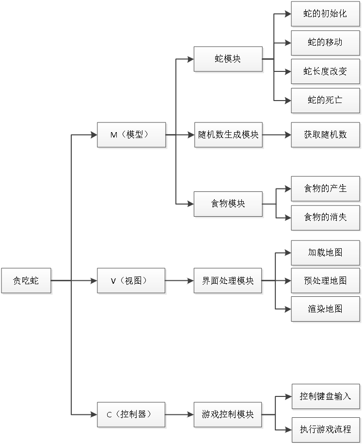

# 贪吃蛇小游戏

* 定义蛇对象、食物对象
* 初始化蛇、初始化食物
* 控制流程：
    * 蛇头和墙壁的碰撞
    * 蛇头和蛇身体的碰撞
    * 蛇头和食物的碰撞
        * 蛇身增长
        * 食物消失 -- 新食物产生
		* 分数累加
        * 移动速度增大
    * 蛇的移动
		* 自动移动
		* 手动控制移动：ASWD --- 左下上右
    * 显示分数
		* 排行榜 
* 图形界面

---

## 模块

流程图如下：



* 蛇的初始化
	* 蛇的初始化实际就是二维数组的初始化，该二维数组存储两个值，里面包含该蛇身体的坐标信息，它出现的初始位置是横纵坐标的中间位置
* 蛇的移动
	* 蛇的移动是通改变二维数组坐标位置来实现的，例如当蛇向右前进一个单位，则将尾每一个身体位置的坐标更改，同时改变蛇头、蛇身以及蛇尾的方向。这样整体来看来蛇就前进了一个单位
* 蛇的增长
	* 当蛇吃了正常食物后，蛇的长度会增加，增加蛇的长度就是在食物的位置增加一个二维数组并且将这个位置变为蛇头
* 蛇的死亡
	* 当蛇撞上障碍物、自身或者通关时，蛇会死亡，蛇死亡就是二维数组的销毁
* 食物的产生
	* 食物出现的位置产生都是随机的，这些因素由通过随机函数获取的随机数决定。食物的位置不能出现在障碍物和边界上
* 控制键盘输入
	* 通过获取键盘输入的W/w(上)、S/s(下)、A/a(左)、D/d(右)来改变蛇模块中移动方向，从而影响蛇的移动方向

---

## 具体流程

定义蛇对象:

```c
#define HIGH 20
#define WIDE 60

// 身体对象
struct Body
{
    int x;
    int y;
};

// 蛇对象
struct Snake
{
    struct Body body[HIGH * WIDE];
    int size;
} snake;
```
	
食物对象：

```c
// 食物对象
struct Food
{
    int x;
    int y;
} food;
```

分数： 

```c
// 得分
int score = 0;
```

封装一个函数，完成蛇的初始：

```c
// 初始化蛇
void initSnake()
{
    snake.size = 2;

    // 蛇头
    snake.body[0].x = WIDE / 2;
    snake.body[0].y = HIGH / 2;

    // 一节蛇身
    snake.body[1].x = WIDE / 2 - 1;
    snake.body[1].y = HIGH / 2;

    return;
}
```

初始化食物：

```c
// 初始化食物
void initFood()
{
    food.x = rand() % WIDE;
    food.y = rand() % HIGH;
}
```

修改控制台光标位置：

```c
#include <conio.h> 
#include <Windows.h>

// 去除光标
CONSOLE_CURSOR_INFO cci;
cci.dwSize = sizeof(cci);
cci.bVisible = FALSE;
SetConsoleCursorInfo(GetStdHandle(STD_OUTPUT_HANDLE), &cci);
```

会将光标位置，定位到初始化好的蛇头位置(`WIDE/2, HIGH/2`)，屏幕中间 

画出蛇和食物：封装函数，`initUI()`

```c
// 画蛇和食物
void initUI()
{
    // 光标移动位置
    COORD coord = {0};

    // 画蛇
    for (size_t i = 0; i < snake.size; i++)
    {
        coord.X = snake.body[i].x;
        coord.Y = snake.body[i].y;
        SetConsoleCursorPosition(GetStdHandle(STD_OUTPUT_HANDLE), coord);

        if (i == 0)
            putchar('@');
        else
            putchar('*');
    }
    // 去除蛇尾
    coord.X = lastX;
    coord.Y = lastY;
    SetConsoleCursorPosition(GetStdHandle(STD_OUTPUT_HANDLE), coord);
    putchar(' ');

    // 画食物
    coord.X = food.x;
    coord.Y = food.y;

    SetConsoleCursorPosition(GetStdHandle(STD_OUTPUT_HANDLE), coord);
    putchar('#');
}
```

蛇的移动控制：

* W：(0, -1) --> 影响蛇头
* S: (0, +1)
* A: (-1, 0)
* D: (+1, 0)

不回显：

* `getch()`	接收用户输入
* `char key = getch();`	编译时出错，尝试使用 `_getch();`

不阻塞：

* `kbhit();` 不阻塞判断用户输入。有用户输入，返回“真”，否则返回“假”值。编译时出错，尝试使用 `_kbhit();`

开始游戏：

```c
// 启动游戏
void playGame()
{
    char key = 'd';

    // 判断蛇撞墙
    while (snake.body[0].x >= 0 && snake.body[0].x < WIDE && snake.body[0].y >= 0 && snake.body[0].y < HIGH)
    {
        // 更新蛇
        initUI();

        // 接收用户按键输入 asdw
        if (_kbhit())
        {
            // 为真时，说明用户按下按键
            key = _getch();
        }

        switch (key)
        {
        case 'w':
        {
            kx = 0;
            ky = -1;
            break;
        }
        case 's':
        {
            kx = 0;
            ky = +1;
            break;
        }
        case 'd':
        {
            kx = +1;
            ky = 0;
            break;
        }
        case 'a':
        {
            kx = -1;
            ky = 0;
            break;
        }
        default:
        {
            break;
        }
        }

        // 蛇头撞身体：蛇头 == 任意一节身体
        for (size_t i = 1; i < snake.size; i++)
        {
            if (snake.body[0].x == snake.body[i].x && snake.body[0].y == snake.body[i].y)
            {
                // 游戏结束
                return;
            }
        }

        // 蛇头撞食物
        if (snake.body[0].x == food.x && snake.body[0].y == food.y)
        {
            // 食物消失
            initFood();
            // 身体增长
            snake.size++;
            // 加分
            score += 10;
            // 加速
            sleepTime -= 10;
        }

        // 存储蛇尾坐标
        lastX = snake.body[snake.size - 1].x;
        lastY = snake.body[snake.size - 1].y;

        // 蛇移动，前一节身体给后一节身体赋值
        for (size_t i = snake.size - 1; i > 0; i--)
        {
            snake.body[i].x = snake.body[i - 1].x;
            snake.body[i].y = snake.body[i - 1].y;
        }
        // 蛇头坐标根据用户按键，修改
        snake.body[0].x += kx;
        snake.body[0].y += ky;

        Sleep(sleepTime);
        // 清屏
        // system("cls");
    }
}
```

蛇头和墙壁的碰撞：

```c
snake.body[0].x >= 0 && snake.body[0].x < WIDE 
&& 
snake.body[0].y >= 0 && snake.body[0].y < HIGH
```

蛇头和身体的碰撞：蛇头的坐标和任意一节身体的坐标完全一致

```c
// 蛇头撞身体：蛇头 == 任意一节身体
for (size_t i = 1; i < snake.size; i++)
{
    if (snake.body[0].x == snake.body[i].x && snake.body[0].y == snake.body[i].y)
    {
        // 游戏结束
        return;
    }
}
```
	
蛇头和食物的碰撞：

```c
// 蛇头撞食物
if (snake.body[0].x == food.x && snake.body[0].y == food.y)
{
    // 食物消失
    initFood();
    // 身体增长
    snake.size++;
    // 加分
    score += 10;
    // 加速
    sleepTime -= 10;
}

// 存储蛇尾坐标
lastX = snake.body[snake.size - 1].x;
lastY = snake.body[snake.size - 1].y;
```

蛇移动：前一节身体给后一节身体赋值。蛇头按照 `aswd` 换算的坐标值进行变换

```c
// 蛇移动，前一节身体给后一节身体赋值
for (size_t i = snake.size - 1; i > 0; i--)
{
    snake.body[i].x = snake.body[i - 1].x;
    snake.body[i].y = snake.body[i - 1].y;
}
// 蛇头坐标根据用户按键，修改
snake.body[0].x += kx;
snake.body[0].y += ky;
```

画墙：

```c
// 画墙
void initWall()
{
    for (int i = 0; i <= HIGH; i++)
    {
        for (int j = 0; j <= WIDE; j++)
        {
            if (j == WIDE)
            {
                printf("|");
            }
            else if (i == HIGH)
            {
                printf("_");
            }
            else
            {
                printf(" ");
            }
        }
        printf("\n");
    }
}
```

去除蛇尾：蛇移动之前保存蛇尾坐标

定义全局变量：`lastX, lastY;`

```c
// 存储蛇尾坐标
lastX = snake.body[snake.size - 1].x;
lastY = snake.body[snake.size - 1].y;
```

在 `initUI` 中，将蛇尾替换为 `' '`

```c
// 去除蛇尾
coord.X = lastX;
coord.Y = lastY;
SetConsoleCursorPosition(GetStdHandle(STD_OUTPUT_HANDLE), coord);
putchar(' ');
```

去除光标：

```c
typedef struct _CONSOLE_CURSOR_INFO {
	DWORD  dwSize;		// 大小
    BOOL   bVisible;	// 是否可见
} CONSOLE_CURSOR_INFO;
```

定义结构体变量：

```c
// 去除光标
CONSOLE_CURSOR_INFO cci;
cci.dwSize = sizeof(cci);
cci.bVisible = FALSE;
```

设置光标不可见生效：

```c
SetConsoleCursorInfo(GetStdHandle(STD_OUTPUT_HANDLE), &cci);
```

在 `main` 函数中，调用一次即可生效
	
显示分数

`playGame` 调用结束时，打印全局 `score` 值

```c
// 打印分数
void showScore()
{
    // 将光标默认位置移动至不干扰游戏的任意位置
    COORD coord;

    coord.X = 0;
    coord.Y = HIGH + 2;
    SetConsoleCursorPosition(GetStdHandle(STD_OUTPUT_HANDLE), coord);

    printf("Game Over!!!\n");
    printf("Score: %d\n\n\n", score);
}
```

加速：全局定义变量

```c
sleepTime = 400;
Sleep(sleepTime);

// 成功吃食物
sleepTim -= 10;
```

---
