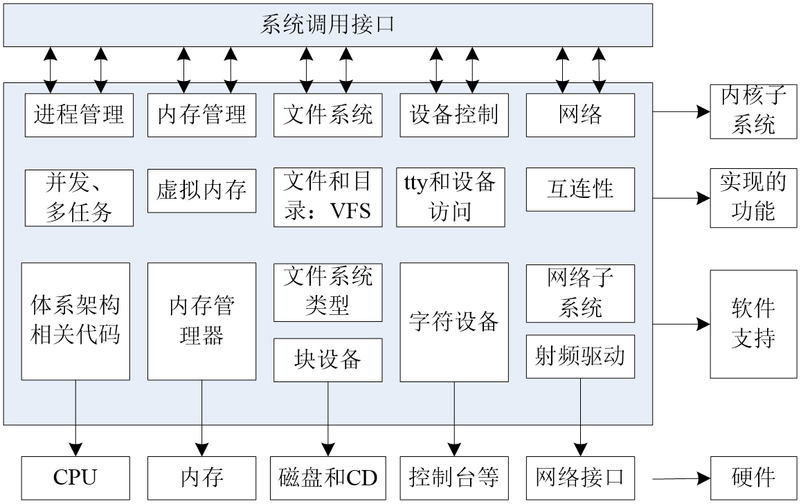
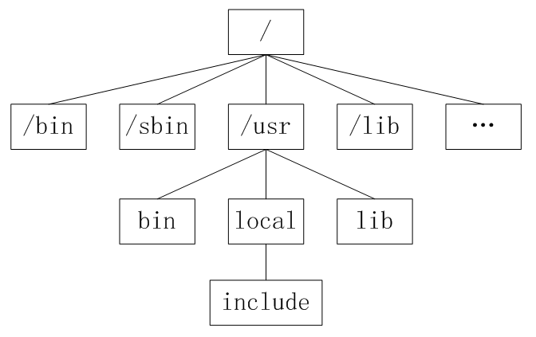
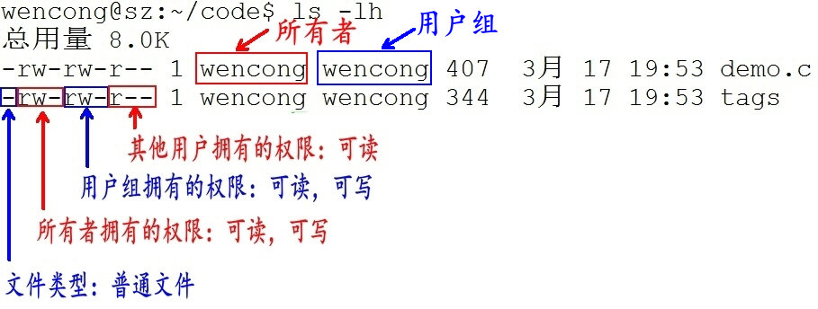
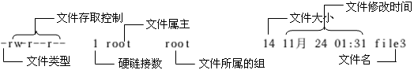

# Linux 操作入门

---

## 简介

操作系统在计算机系统中承上启下的地位：向下封装硬件，向上提供操作接口



Linux 具有如下的优秀的特点：

* 开放性
* 完全免费
* 多用户
* 多任务
* 良好的用户界面
* 设备独立性
* 提供了丰富的网络功能
* 可靠的系统安全性
* 良好的可移植性

X Window 系统是一个非常出色的图形窗口系统，是类UNIX系统的图形用户界面的工业标准。X Window系统最重要的特征之一就是它的结构与设备无关

X Window 系统的主要特点有如下几点：

* X Window系统是客户机/服务器结构的。X Window 的实现是与操作系统内核分开的，其主要由 X Server 和 X Client 两部分组成
* X Window 系统不是 Unix/Linux 操作系统的必须的构成部分，而只是一个可选的应用程序组件

---

## 文件系统

### 目录和路径

#### 目录

* 目录是一组相关文件的集合
* 一个目录下面除了可以存放文件之外还可以存放其他目录，即可包含子目录
* 在确定文件、目录位置时，DOS 和 Unix/Linux 都采用 `路径名+文件名` 的方式。路径反映的是目录与目录之间的关系

#### 路径

Unix/Linux 路径由到达定位文件的目录组成。在 Unix/Linux 系统中组成路径的目录分割符为斜杠 `/`，而 DOS 则用反斜杠 `\` 来分割各个目录

路径分为绝对路径和相对路径：

* 绝对路径
    * 绝对路径是从目录树的树根 `/` 目录开始往下直至到达文件所经过的所有节点目录
    * 下级目录接在上级目录后面用 `/` 隔开
    * 注意：绝对路径都是从 `/` 开始的，所以第一个字符一定是 `/`
* 相对路径
    * 相对路径是指目标目录相对于当前目录的位置
    * 如果不在当前目录下，则需要使用两个特殊目录 `.` 和 `..` 了。目录 `.` 指向当前目录，而目录 `..` 指向上一级目录

### 文件系统

#### Windows 和 Linux 文件系统区别

在 windows 平台下，打开“计算机”，看到的是一个个的驱动器盘符，每个驱动器都有自己的根目录结构，这样形成了多个树并列的情形

在 Linux 下，我们是看不到这些驱动器盘符，看到的是文件夹(目录)

1994 年，Linux 对根文件目录做了统一的规范，推出 FHS(Filesystem Hierarchy Standard)的 Linux 文件系统层次结构标准。FHS 标准规定了 Linux 根目录各文件夹的名称及作用，统一了 Linux 界命名混乱的局面

和 Windows 操作系统类似，所有 Unix/Linux 的数据都是由文件系统按照树型目录结构管理的。而且 Unix/Linux 操作系统同样要区分文件的类型，判断文件的存取属性和可执行属性

Unix/Linux 也采用了树状结构的文件系统，它由目录和目录下的文件一起构成。但 Unix/Linux 文件系统不使用驱动器这个概念，而是使用单一的根目录结构，所有的分区都挂载到单一的 `/` 目录上，其结构示意图如图所示



#### Linux 目录结构

* `/`：根目录，一般根目录下只存放目录，在 Linux 下有且只有一个根目录。所有的东西都是从这里开始
* `/bin`: `/usr/bin`: 可执行二进制文件的目录，如常用的命令 `ls、tar、mv、cat` 等
* `/boot`：放置 linux 系统启动时用到的一些文件，如 Linux 的内核文件：`/boot/vmlinuz`，系统引导管理器：`/boot/grub`
* `/dev`：存放 linux 系统下的设备文件，访问该目录下某个文件，相当于访问某个设备，常用的是挂载光驱 `mount /dev/cdrom /mnt`
* `/etc`：系统配置文件存放的目录，不建议在此目录下存放可执行文件，重要的配置文件有 `/etc/inittab、/etc/fstab、/etc/init.d、/etc/X11、/etc/sysconfig、/etc/xinetd.d`
* `/home`：系统默认的用户家目录，新增用户账号时，用户的家目录都存放在此目录下，`~` 表示当前用户的家目录，`~edu` 表示用户 `edu` 的家目录
* `/lib`: `/usr/lib、/usr/local/lib`：系统使用的函数库的目录，程序在执行过程中，需要调用一些额外的参数时需要函数库的协助
* `/lost+fount`：系统异常产生错误时，会将一些遗失的片段放置于此目录下
* `/mnt`: `/media`：光盘默认挂载点，通常光盘挂载于 `/mnt/cdrom` 下，也不一定，可以选择任意位置进行挂载
* `/opt`：给主机额外安装软件所摆放的目录
* `/proc`：此目录的数据都在内存中，如系统核心，外部设备，网络状态，由于数据都存放于内存中，所以不占用磁盘空间，比较重要的目录有 `/proc/cpuinfo、/proc/interrupts、/proc/dma、/proc/ioports、/proc/net/*` 等
* `/root`：系统管理员 `root` 的家目录
* `/sbin`: `/usr/sbin、/usr/local/sbin`：放置系统管理员使用的可执行命令，如 `fdisk、shutdown、mount` 等。与 `/bin` 不同的是，这几个目录是给系统管理员 `root` 使用的命令，一般用户只能"查看"而不能设置和使用
* `/tmp`：一般用户或正在执行的程序临时存放文件的目录，任何人都可以访问，重要数据不可放置在此目录下
* `/srv`：服务启动之后需要访问的数据目录，如 `www` 服务需要访问的网页数据存放在 `/srv/www` 内
* `/usr`：应用程序存放目录，`/usr/bin` 存放应用程序，`/usr/share` 存放共享数据，`/usr/lib` 存放不能直接运行的，却是许多程序运行所必需的一些函数库文件。`/usr/local`: 存放软件升级包。`/usr/share/doc`: 系统说明文件存放目录。`/usr/share/man`:  程序说明文件存放目录
* `/var`：放置系统执行过程中经常变化的文件，如随时更改的日志文件 `/var/log`、`/var/log/message`：所有的登录文件存放目录，`/var/spool/mail`：邮件存放的目录，`/var/run`：程序或服务启动后，其 `PID` 存放在该目录下

### 一切皆文件

Unix/Linux 对数据文件(`*.mp3、*.bmp`)，程序文件(`*.c、*.h、*.o`)，设备文件(LCD、触摸屏、鼠标)，网络文件(`socket`)等的管理都抽象为文件，使用统一的方式方法管理

在 Unix/Linux 操作系统中也必须区分文件类型，通过文件类型可以判断文件属于可执行文件、文本文件还是数据文件。在 Unix/Linux 系统中文件可以没有扩展名

#### 文件分类

通常，Unix/Linux 系统中常用的文件类型有5种：普通文件、目录文件、设备文件、管道文件和链接文件

* 普通文件

普通文件是计算机操作系统用于存放数据、程序等信息的文件，一般都长期存放于外存储器(磁盘、磁带等)中。普通文件一般包括文本文件、数据文件、可执行的二进制程序文件等

在 Unix/Linux 中可以通过 `file` 命令来查看文件的类型。如果 `file` 文件后面携带文件名，则查看指定文件的类型，如果携带通配符 `*`，则可以查看当前目录下的所有文件的类型

```sh
# file main.c
main.c: C source, ASCII text
# file *
main:   ELF 64-bit LSB shared object, x86-64, version 1 (SYSV), dynamically linked, interpreter /lib64/ld-linux-x86-64.so.2, BuildID[sha1]=54498620e30acd9275a1cac8bcaeb95e97953889, for GNU/Linux 3.2.0, not stripped
main.c: C source, ASCII text
# 
```

* 目录文件

Unix/Linux 系统把目录看成是一种特殊的文件，利用它构成文件系统的树型结构

目录文件只允许系统管理员对其进行修改，用户进程可以读取目录文件，但不能对它们进行修改

每个目录文件至少包括两个条目，`..` 表示上一级目录，`.` 表示该目录本身

```sh
# ls -al
total 32
drwxr-xr-x 2 root root  4096 Aug  3 20:10 .
drwxr-xr-x 5 root root  4096 Aug  1 10:43 ..
-rwxr-xr-x 1 root root 17240 Aug  3 16:31 main
-rw-r--r-- 1 root root    50 Aug  3 20:10 main.c
# 
```

* 设备文件

Unix/Linux 系统把每个设备都映射成一个文件，这就是设备文件。它是用于向 I/O 设备提供连接的一种文件，分为字符设备和块设备文件

字符设备的存取以一个字符为单位，块设备的存取以字符块为单位。每一种 I/O 设备对应一个设备文件，存放在 `/dev` 目录中，如行式打印机对应 `/dev/lp`，第一个软盘驱动器对应 `/dev/fd0`

```sh
# lsblk
NAME   MAJ:MIN RM SIZE RO TYPE MOUNTPOINT
vda    252:0    0  40G  0 disk 
└─vda1 252:1    0  40G  0 part /
#
```

* 管道文件

管道文件也是 Unix/Linux 中较特殊的文件类型，这类文件多用于进程间的通信

* 链接文件

似于 windows 下的快捷方式，链接又可以分为软链接(符号链接)和硬链接

### 文件权限

文件权限就是文件的访问控制权限，即哪些用户和组群可以访问文件以及可以执行什么样的操作

Unix/Linux 系统是一个典型的多用户系统，不同的用户处于不同的地位，对文件和目录有不同的访问权限。为了保护系统的安全性，Unix/Linux 系统除了对用户权限作了严格的界定外，还在用户身份认证、访问控制、传输安全、文件读写权限等方面作了周密的控制

在 Unix/Linux 中的每一个文件或目录都包含有访问权限，这些访问权限决定了谁能访问和如何访问这些文件和目录

#### 访问用户

通过设定权限可以从以下三种访问方式限制访问权限：

* 只允许用户自己访问(所有者)

所有者就是创建文件的用户，用户是所有用户所创建文件的所有者，用户可以允许所在的用户组能访问用户的文件

* 允许一个预先指定的用户组中的用户访问(用户组)

用户都组合成用户组，例如，某一类或某一项目中的所有用户都能够被系统管理员归为一个用户组，一个用户能够授予所在用户组的其他成员的文件访问权限

* 允许系统中的任何用户访问(其他用户)

用户也将自己的文件向系统内的所有用户开放，在这种情况下，系统内的所有用户都能够访问用户的目录或文件。在这种意义上，系统内的其他所有用户就是 `other` 用户类

#### 访问权限

用户能够控制一个给定的文件或目录的访问程度，一个文件或目录可能有读、写及执行权限：

* 读权限 `r`。对文件而言，具有读取文件内容的权限；对目录来说，具有浏览目录的权限
* 写权限 `w`。对文件而言，具有新增、修改文件内容的权限；对目录来说，具有删除、移动目录内文件的权限
* 可执行权限 `x`。对文件而言，具有执行文件的权限；对目录了来说该用户具有进入目录的权限

Unix/Linux 系统只允许文件的属主(所有者)或超级用户改变文件的读写权限

#### 示例说明

```sh
# ls -lh
total 24K
-rwxr-xr-x 1 root root 17K Aug  3 16:31 main
-rw-r--r-- 1 root root  50 Aug  3 20:10 main.c
# 
```



* 第 1 个字母代表文件的类型：`d` 代表文件夹、`-` 代表普通文件、`c` 代表硬件字符设备、`b` 代表硬件块设备、`s` 表示管道文件、`l` 代表软链接文件
* 后 9 个字母分别代表三组权限：文件所有者、用户者、其他用户拥有的权限。每一个用户都有它自身的读、写和执行权限
    * 第一组权限控制访问自己的文件权限，即文件所有者权限
    * 第二组权限控制用户组访问其中一个用户的文件的权限
    * 第三组权限控制其他所有用户访问一个用户的文件的权限

这三组权限赋予用户不同类型(即所有者、用户组和其他用户)的读、写及执行权限就构成了一个有 9 种类型的权限组

---

## 常用命令

### 命令使用方法

#### Linux 命令格式

```sh
command [-options] [parameter1] ...
```
说明：

* `command`：命令名，相应功能的英文单词或单词的缩写
* `[-options]`：选项，可用来对命令进行控制，也可以省略，`[]` 代表可选
* `[parameter1] ...`：传给命令的参数，可以是零个一个或多个

```sh
# ls -a /home/root/
.  ..  codes  download  p.txt  sources  .swp  test
#
```

#### 查看帮助文档

* `--help`

一般是 Linux 命令自带的帮助信息，并不是所有命令都自带这个选项

如想查看命令 `ls` 的用法：`ls --help`

```sh
# ls --help
Usage: ls [OPTION]... [FILE]...
List information about the FILEs (the current directory by default).
Sort entries alphabetically if none of -cftuvSUX nor --sort is specified.

Mandatory arguments to long options are mandatory for short options too.
  -a, --all                  do not ignore entries starting with .
  -A, --almost-all           do not list implied . and ..
      --author               with -l, print the author of each file
  -b, --escape               print C-style escapes for nongraphic characters
      --block-size=SIZE      with -l, scale sizes by SIZE when printing them;
                               e.g., '--block-size=M'; see SIZE format below
  -B, --ignore-backups       do not list implied entries ending with ~
  -c                         with -lt: sort by, and show, ctime (time of last
                               modification of file status information);
                               with -l: show ctime and sort by name;
                               otherwise: sort by ctime, newest first
...
```

* `man`

`man` 是 Linux 提供的一个手册，包含了绝大部分的命令、函数使用说明

该手册分成很多章节(section)，使用 `man` 时可以指定不同的章节来浏览不同的内容

`man` 中各个 section 意义如下：

* Standard commands(标准命令)
* System calls(系统调用，如 `open，write`)
* Library functions(库函数，如 `printf，fopen`)
* Special devices(设备文件的说明，`/dev` 下各种设备）
* File formats(文件格式，如 passwd)
* Games and toys(游戏和娱乐)
* Miscellaneous(杂项、惯例与协定等，例如 Linux 档案系统、网络协定、ASCII 码；`environ`全局变量)
* Administrative Commands(管理员命令，如 `ifconfig`)

`man` 使用格式如下：

```sh
man [选项] 命令名
```

`man` 设置了如下的功能键：

| 功能键 | 功能 |
|:----:|:----:|
| 空格键 | 显示手册页的下一屏 |
| Enter 键 | 一次滚动手册页的一行 |
| `b` | 回滚一屏 |
| `f` | 前滚一屏 |
| `q` | 退出 `man` 命令 |
| `h` | 列出所有功能键 |
| `/word` | 搜索 `word` 字符串 |

如想查看 `ls` 的用法：`man 1 ls` (1：为数字“1”，代表第 1 个 section，标准命令)

```sh
# man 1 ls
LS(1)                                                                                                           User Commands                                                                                                           LS(1)

NAME
       ls - list directory contents

SYNOPSIS
       ls [OPTION]... [FILE]...

DESCRIPTION
       List information about the FILEs (the current directory by default).  Sort entries alphabetically if none of -cftuvSUX nor --sort is specified.

       Mandatory arguments to long options are mandatory for short options too.

       -a, --all
              do not ignore entries starting with .

       -A, --almost-all
              do not list implied . and ..

       --author
              with -l, print the author of each file
 Manual page ls(1) line 1 (press h for help or q to quit)
```

实际上不指定第几个章节也用查看，如，`man ls`

但是，有一种情况，假如，命令的名字和函数的名字刚好重名(如：`printf`)，它既是命令，也可以是库函数，如果不指定章节号，`man printf`，它只查看命令的用法，不会查询函数的用法，因为 `man` 是按照手册的章节号的顺序进行搜索的

```sh
# man printf
PRINTF(1)                                                                                                       User Commands                                                                                                       PRINTF(1)

NAME
       printf - format and print data

SYNOPSIS
       printf FORMAT [ARGUMENT]...
       printf OPTION

DESCRIPTION
       Print ARGUMENT(s) according to FORMAT, or execute according to OPTION:

       --help display this help and exit

       --version
              output version information and exit

       FORMAT controls the output as in C printf.  Interpreted sequences are:

       \"     double quote

 Manual page printf(1) line 1 (press h for help or q to quit)
```

`PRINTF(1)` 1，代表标准命令

所以，使用 `man` 手册时，最好指定章节号

```sh
# man 3 printf
PRINTF(3)                                                                                                 Linux Programmer's Manual                                                                                                 PRINTF(3)

NAME
       printf, fprintf, dprintf, sprintf, snprintf, vprintf, vfprintf, vdprintf, vsprintf, vsnprintf - formatted output conversion

SYNOPSIS
       #include <stdio.h>

       int printf(const char *format, ...);
       int fprintf(FILE *stream, const char *format, ...);
       int dprintf(int fd, const char *format, ...);
       int sprintf(char *str, const char *format, ...);
       int snprintf(char *str, size_t size, const char *format, ...);

       #include <stdarg.h>

       int vprintf(const char *format, va_list ap);
       int vfprintf(FILE *stream, const char *format, va_list ap);
       int vdprintf(int fd, const char *format, va_list ap);
       int vsprintf(char *str, const char *format, va_list ap);
       int vsnprintf(char *str, size_t size, const char *format, va_list ap);
 Manual page printf(3) line 1 (press h for help or q to quit)
```

### 使用技巧

* 自动补全

在敲出命令的前几个字母的同时，按下 `tab` 键，系统会自动帮我们补全命令

* 历史命令

当系统执行过一些命令后，可按上下键翻看以前的命令，`history` 将执行过的命令列举出来

### 常用命令

#### 文件管理

##### 查看文件信息：`ls`

`ls` 是英文单词 list 的简写，其功能为列出目录的内容，是用户最常用的命令之一，它类似于 DOS 下的 `dir` 命令

Linux 文件或者目录名称最长可以有 256 个字符，以 `.` 开头的文件为隐藏文件，需要用 `-a` 参数才能显示

`ls` 常用参数：

| 参数 | 含义 |
|:----:|:----:|
| `-a` | 显示指定目录下所有子目录与文件，包括隐藏文件 |
| `-l` | 以列表方式显示文件的详细信息 |
| `-h` | 配合 `-l` 以人性化的方式显示文件大小 |

```sh
# ls
main  main.c
# ls -a
.  ..  main  main.c
# ls -lh
total 24K
-rwxr-xr-x 1 root root 17K Aug  3 16:31 main
-rw-r--r-- 1 root root  50 Aug  3 20:10 main.c
#
```

图中列出的信息含义如下图所示



与 DOS 下的文件操作类似，在 Unix/Linux 系统中，也同样允许使用特殊字符来同时引用多个文件名，这些特殊字符被称为通配符

| 通配符 | 含义 |
|:----:|:----:|
| `*` | 文件代表文件名中所有字符 |
| `ls te*` | 查找以 `te` 开头的文件 |
| `ls *html` | 查找结尾为 `html` 的文件 |
| `?` | 代表文件名中任意一个字符 |
| `ls ?.c` | 只找第一个字符任意，后缀为 `.c` 的文件 |
| `ls a.?` | 只找只有 3 个字符，前 2 字符为 `a.`，最后一个字符任意的文件 |
| `[]` | `[` 和 `]` 将字符组括起来，表示可以匹配字符组中的任意一个。`-` 用于表示字符范围 |
| `[abc]` | 匹配 `a、b、c` 中的任意一个 |
| `[a-f]` | 匹配从 `a` 到 `f` 范围内的的任意一个字符 |
| `ls [a-f]*` | 找到从 `a` 到 `f` 范围内的的任意一个字符开头的文件 |
| `ls a-f` | 查找文件名为 `a-f` 的文件，当 `-` 处于方括号之外失去通配符的作用 |
| `\` | 如果要使通配符作为普通字符使用，可以在其前面加上转义字符。`?` 和 `*` 处于方括号内时不用使用转义字符就失去通配符的作用
| `ls \*a` | 查找文件名为 `*a` 的文件 |

##### 输出重定向命令：`>`

Linux 允许将命令执行结果重定向到一个文件，本应显示在终端上的内容保存到指定文件中

如：`ls > test.txt` (`test.txt` 如果不存在，则创建，存在则覆盖其内容)

```sh
# ls
demo.txt
# ls > test1.txt
# ls
demo.txt  test1.txt
# cat test1.txt
demo.txt
test1.txt
# touch test2.txt
# ls
demo.txt  test1.txt  test2.txt
# cat test1.txt
demo.txt
test1.txt
# ls > test1.txt
# cat test1.txt
demo.txt
test1.txt
test2.txt
#
```

`>` 输出重定向会覆盖原来的内容，`>>` 输出重定向则会追加到文件的尾部

##### 分屏显示：`more`

查看内容时，在信息过长无法在一屏上显示时，会出现快速滚屏，使得用户无法看清文件的内容，此时可以使用 `more` 命令，每次只显示一页，按下空格键可以显示下一页，按下 `q` 键退出显示，按下 `h` 键可以获取帮助

```sh
# man 1 printf | more
PRINTF(1)                                           User Commands                                           PRINTF(1)

NAME
       printf - format and print data

SYNOPSIS
       printf FORMAT [ARGUMENT]...
       printf OPTION

DESCRIPTION
       Print ARGUMENT(s) according to FORMAT, or execute according to OPTION:

       --help display this help and exit

       --version
              output version information and exit

       FORMAT controls the output as in C printf.  Interpreted sequences are:

       \"     double quote

       \\     backslash

       \a     alert (BEL)

       \b     backspace

       \c     produce no further output

--More--
```

##### 管道：`|`

管道：一个命令的输出可以通过管道做为另一个命令的输入，`|` 的左右分为两端，左端塞东西(写)，右端取东西(读)

```sh
# ls -alh | more
total 12K
drwxr-xr-x 2 root root 4.0K Aug  3 22:21 .
drwxr-xr-x 6 root root 4.0K Jan 19  2022 ..
-rw-r--r-- 1 root root    0 Aug  3 22:19 demo.txt
-rw-r--r-- 1 root root   29 Aug  3 22:22 test1.txt
-rw-r--r-- 1 root root    0 Aug  3 22:21 test2.txt
#
```

##### 清屏：`clear` 

`clear` 作用为清除终端上的显示(类似于 DOS 的 3 清屏功能)，也可使用快捷键：`Ctrl + 1`

##### 切换工作目录：`cd` 

`cd` 命令可以帮助用户切换工作目录。Linux 所有的目录和文件名大小写敏感

`cd` 后面可跟绝对路径，也可以跟相对路径。如果省略目录，则默认切换到当前用户的主目录

| 命令 | 含义 |
|:----:|:----:|
| `cd` | 切换到当前用户的主目录(`/home/用户目录`)，用户登陆的时候，默认的目录就是用户的主目录 |
| `cd ~` | 切换到当前用户的主目录(`/home/用户目录`) |
| `cd .` | 切换到当前目录 |
| `cd ..` | 切换到上级目录 |
| `cd -` | 可进入上一个进入的目录 |

如果路径是从根路径开始的，则路径的前面需要加上 `/`，如 `/mnt`，通常进入某个目录里的文件夹，前面不用加 `/`

##### 显示当前路径：`pwd`

使用 `pwd` 命令可以显示当前的工作目录

##### 创建目录：`mkdir`

通过 `mkdir` 命令可以创建一个新的目录。参数 `-p` 可递归创建目录

需要注意的是新建目录的名称不能与当前目录中已有的目录或文件同名，并且目录创建者必须对当前目录具有写权限

```sh
root@master:/home/root/test# ls
demo.txt  test1.txt  test2.txt
root@master:/home/root/test# mkdir test
root@master:/home/root/test# ls
demo.txt  test  test1.txt  test2.txt
root@master:/home/root/test# mkdir -p a/b/c
root@master:/home/root/test# ls
a  demo.txt  test  test1.txt  test2.txt
root@master:/home/root/test# cd ./a/b
root@master:/home/root/test/a/b# ls
c
root@master:/home/root/test/a/b#
```

##### 删除目录：`rmdir`

可使用 `rmdir` 命令删除一个目录。必须离开目录，并且目录必须为空目录，不然提示删除失败

##### 删除文件：`rm`

可通过 `rm` 删除文件或目录。使用 `rm` 命令要小心，因为文件删除后不能恢复。为了防止文件误删，可以在 `rm` 后使用 `-i` 参数以逐个确认要删除的文件

常用参数及含义如下表所示：

| 参数 | 含义 |
|:----:|:----:|
| `-i` | 以进行交互式方式执行 |
| `-f` | 强制删除，忽略不存在的文件，无需提示 |
| `-r` | 递归地删除目录下的内容，删除文件夹时必须加此参数 |

```sh
root@master:/home/root/test# ls
a  demo.txt  test  test1.txt  test2.txt
root@master:/home/root/test# rm test/
rm: cannot remove 'test/': Is a directory
root@master:/home/root/test# rm -r test/
root@master:/home/root/test# ls
a  demo.txt  test1.txt  test2.txt
root@master:/home/root/test# rm a
rm: cannot remove 'a': Is a directory
root@master:/home/root/test# rm -f a
rm: cannot remove 'a': Is a directory
root@master:/home/root/test# rm -rf a
root@master:/home/root/test# ls
demo.txt  test1.txt  test2.txt
root@master:/home/root/test#
```

##### 建立链接文件：`ln`

* Linux 链接文件类似于 Windows 下的快捷方式
* 链接文件分为软链接和硬链接
* 软链接：软链接不占用磁盘空间，源文件删除则软链接失效
* 硬链接：硬链接只能链接普通文件，不能链接目录

使用格式：

```sh
ln 源文件 链接文件
ln -s 源文件 链接文件
```

如果没有 `-s` 选项代表建立一个硬链接文件，两个文件占用相同大小的硬盘空间，即使删除了源文件，链接文件还是存在，所以 `-s` 选项是更常见的形式

注意：如果软链接文件和源文件不在同一个目录，源文件要使用绝对路径，不能使用相对路径

```sh
root@master:/home/root/test# ls
demo.txt  test1.txt  test2.txt
root@master:/home/root/test# ln demo.txt demo_hard.txt
root@master:/home/root/test# ln -s demo.txt demo_soft.txt
root@master:/home/root/test# ls -l
total 12
-rw-r--r-- 2 root root  5 Aug  4 16:19 demo_hard.txt
lrwxrwxrwx 1 root root  8 Aug  4 16:19 demo_soft.txt -> demo.txt
-rw-r--r-- 2 root root  5 Aug  4 16:19 demo.txt
-rw-r--r-- 1 root root 29 Aug  3 22:22 test1.txt
-rw-r--r-- 1 root root  0 Aug  3 22:21 test2.txt
root@master:/home/root/test#
```

##### 查看或者合并文件内容：`cat`

```sh
root@master:/home/root/test# cat demo.txt
demo
root@master:/home/root/test# cat test1.txt
demo.txt
test1.txt
test2.txt
root@master:/home/root/test# cat demo.txt test1.txt > test2.txt
root@master:/home/root/test# cat test2.txt
demo
demo.txt
test1.txt
test2.txt
root@master:/home/root/test#
```

##### 拷贝文件：`cp`

`cp` 命令的功能是将给出的文件或目录复制到另一个文件或目录中，相当于 DOS 下的 copy 命令

常用选项说明：

| 选项 | 含义 |
|:----:|:----:|
| `-a` | 该选项通常在复制目录时使用，它保留链接、文件属性，并递归地复制目录，简单而言，保持文件原有属性 |
| `-f` | 覆盖已经存在的目标文件而不提示 |
| `-i` | 交互式复制，在覆盖目标文件之前将给出提示要求用户确认 |
| `-r` | 若给出的源文件是目录文件，则 `cp` 将递归复制该目录下的所有子目录和文件，目标文件必须为一个目录名 |
| `-v` | 显示拷贝进度 |

```sh
root@master:/# cp -irv /home/root/test/ /home/root/codes/
'/home/root/test/' -> '/home/root/codes/test'
'/home/root/test/test1.txt' -> '/home/root/codes/test/test1.txt'
'/home/root/test/demo.txt' -> '/home/root/codes/test/demo.txt'
'/home/root/test/demo_hard.txt' -> '/home/root/codes/test/demo_hard.txt'
'/home/root/test/test2.txt' -> '/home/root/codes/test/test2.txt'
'/home/root/test/demo_soft.txt' -> '/home/root/codes/test/demo_soft.txt'
'/home/root/test/d' -> '/home/root/codes/test/d'
root@master:/# cd /home/root/codes/
root@master:/home/root/codes# ls
cplusplus  mpython  test
root@master:/home/root/codes#
```

##### 移动文件：`mv`

用户可以使用 `mv` 命令来移动文件或目录，也可以给文件或目录重命名

常用选项说明：

| 选项 | 含义 |
|:----:|:----:|
| `-f` | 禁止交互式操作，如有覆盖也不会给出提示 |
| `-i` | 确认交互方式操作，如果 `mv` 操作将导致对已存在的目标文件的覆盖，系统会询问是否重写，要求用户回答以避免误覆盖文件 |
| `-v` | 显示移动进度 |

```sh
root@master:/home/root/codes/temp# ls
demo_hard.txt  demo_soft.txt  demo.txt  test1.txt  test2.txt
root@master:/home/root/codes/temp# mv test1.txt test.txt
root@master:/home/root/codes/temp# ls
demo_hard.txt  demo_soft.txt  demo.txt  test2.txt  test.txt
root@master:/home/root/codes/temp# mv -v ./* /home/root/test/tmp/
renamed './demo_hard.txt' -> '/home/root/test/tmp/demo_hard.txt'
renamed './demo_soft.txt' -> '/home/root/test/tmp/demo_soft.txt'
renamed './demo.txt' -> '/home/root/test/tmp/demo.txt'
renamed './test2.txt' -> '/home/root/test/tmp/test2.txt'
renamed './test.txt' -> '/home/root/test/tmp/test.txt'
root@master:/home/root/codes/temp# ls
root@master:/home/root/codes/temp# cd /home/root/test/tmp/
root@master:/home/root/test/tmp# ls
demo_hard.txt  demo_soft.txt  demo.txt  test2.txt  test.txt
root@master:/home/root/test/tmp#
```

##### 获取文件类型：`file`

Linux 系统文件类型不是根据文件扩展名分类的，通过 `file` 命令可以确认文件具体类型

```sh
root@master:/home/root/test# ls
demo_hard.txt  demo_soft.txt  demo.txt  test1.txt  test2.txt  tmp
root@master:/home/root/test# file demo.txt
demo.txt: ASCII text
root@master:/home/root/test# file demo_soft.txt
demo_soft.txt: symbolic link to demo.txt
root@master:/home/root/test#
```

##### 归档管理：`tar`

计算机中的数据经常需要备份，`tar` 是 Unix/Linux 中最常用的备份工具，此命令可以把一系列文件归档到一个大文件中，也可以把档案文件解开以恢复数据

`tar` 使用格式

```c
tar [参数] 打包文件名 文件
```

`tar` 命令很特殊，其参数前面可以使用 `-`，也可以不使用

常用参数：

| 参数 | 含义 |
| `-c` | 生成档案文件，创建打包文件 |
| `-v` | 列出归档解档的详细过程，显示进度|
| `-f` | 指定档案文件名称，`f` 后面一定是 `.tar` 文件，所以必须放选项最后 |
| `-t` | 列出档案中包含的文件 |
| `-x` | 解开档案文件 |

注意：除了 `f` 需要放在参数的最后，其它参数的顺序任意

```sh
root@master:/home/root/test/tmp# ls
demo_hard.txt  demo_soft.txt  demo.txt  test2.txt  test.txt
root@master:/home/root/test/tmp# tar -cvf test.tar test.txt test2.txt
test.txt
test2.txt
root@master:/home/root/test/tmp# ls -lh
total 32K
-rw-r--r-- 1 root root   5 Aug  4 16:41 demo_hard.txt
-rw-r--r-- 1 root root   5 Aug  4 16:41 demo_soft.txt
-rw-r--r-- 1 root root   5 Aug  4 16:41 demo.txt
-rw-r--r-- 1 root root  34 Aug  4 16:41 test2.txt
-rw-r--r-- 1 root root 10K Aug  4 17:01 test.tar
-rw-r--r-- 1 root root  29 Aug  4 16:41 test.txt
root@master:/home/root/test/tmp# rm test.txt test2.txt
root@master:/home/root/test/tmp# ls
demo_hard.txt  demo_soft.txt  demo.txt  test.tar
root@master:/home/root/test/tmp# tar -xvf test.tar
test.txt
test2.txt
root@master:/home/root/test/tmp# ls
demo_hard.txt  demo_soft.txt  demo.txt  test2.txt  test.tar  test.txt
root@master:/home/root/test/tmp#
```

##### 文件压缩解压：`gzip`

* `tar` 与 `gzip` 命令结合使用实现文件打包、压缩
* `tar` 只负责打包文件，但不压缩，用 `gzip` 压缩 `tar` 打包后的文件，其扩展名一般用 `xxxx.tar.gz`

`gzip` 使用格式如下：

```sh
gzip [选项] 被压缩文件
```

常用选项：

| 选项 | 含义 |
|:----:|:----:|
| `-d` | 解压 |
| `-r` | 压缩所有子目录 |

```sh
root@master:/home/root/test/tmp# ls -lh
total 36K
-rw-r--r-- 1 root root    5 Aug  4 16:41 demo_hard.txt
-rw-r--r-- 1 root root    5 Aug  4 16:41 demo_soft.txt
-rw-r--r-- 1 root root    5 Aug  4 16:41 demo.txt
-rw-r--r-- 1 root root   34 Aug  4 16:41 test2.txt
-rw-r--r-- 1 root root  10K Aug  4 17:01 test.tar
-rw-r--r-- 1 root root   29 Aug  4 16:41 test.txt
drwxr-xr-x 2 root root 4.0K Aug  4 17:02 tmp
root@master:/home/root/test/tmp# gzip -r test.tar test.tar.gz
root@master:/home/root/test/tmp# ls
demo_hard.txt  demo_soft.txt  demo.txt  test2.txt  test.tar.gz  test.txt  tmp
root@master:/home/root/test/tmp# gzip -d test.tar.gz
root@master:/home/root/test/tmp# ls
demo_hard.txt  demo_soft.txt  demo.txt  test2.txt  test.tar  test.txt  tmp
root@master:/home/root/test/tmp#
```

`tar` 这个命令并没有压缩的功能，它只是一个打包的命令，但是在 `tar` 命令中增加一个选项(`-z`)可以调用 `gzip` 实现了一个压缩的功能，实行一个先打包后压缩的过程

压缩用法：

```sh
tar -czvf 压缩包包名 文件1 文件2 ...
``

`-z` 指定压缩包的格式为：`file.tar.gz`

```sh
root@master:/home/root/test/tmp# ls
demo_hard.txt  demo_soft.txt  demo.txt  test2.txt  test.tar  test.txt  tmp
root@master:/home/root/test/tmp# tar -zcvf test.tar.gz demo.txt test.txt test2.txt
demo.txt
test.txt
test2.txt
root@master:/home/root/test/tmp# ls
demo_hard.txt  demo_soft.txt  demo.txt  test2.txt  test.tar  test.tar.gz  test.txt  tmp
root@master:/home/root/test/tmp#
```

解压用法： 

```c
tar zxvf 压缩包包名
```

`-z` 指定压缩包的格式为：`file.tar.gz`

```sh
root@master:/home/root/test/tmp/tmp# ls
test.tar.gz
root@master:/home/root/test/tmp/tmp# tar -zxvf test.tar.gz
demo.txt
test.txt
test2.txt
root@master:/home/root/test/tmp/tmp# ls
demo.txt  test2.txt  test.tar.gz  test.txt
root@master:/home/root/test/tmp/tmp#
```

解压到指定目录：`-C`

```sh
root@master:/home/root/test/tmp/tmp# ls
test.tar.gz
root@master:/home/root/test/tmp/tmp# cd ..
root@master:/home/root/test/tmp# ls
demo_hard.txt  demo_soft.txt  demo.txt  test2.txt  test.tar  test.txt  tmp
root@master:/home/root/test/tmp# cd ..
root@master:/home/root/test# tar -zxvf ./tmp/tmp/test.tar.gz -C /home/root/codes/
demo.txt
test.txt
test2.txt
root@master:/home/root/test# ls /home/root/codes/
cplusplus  demo.txt  mpython  temp  test2.txt  test.txt
root@master:/home/root/test#
```

##### 文件压缩解压：`bzip2`

用法：

* `tar` 与 `bzip2` 命令结合使用实现文件打包、压缩(用法和 `gzip` 一样)
* `tar` 只负责打包文件，但不压缩，用 `bzip2` 压缩 `tar` 打包后的文件，其扩展名一般用 `xxxx.tar.bz2`
* 在 `tar` 命令中增加一个选项(`-j`)可以调用 `bzip2` 实现了一个压缩的功能，实行一个先打包后压缩的过程
* 压缩用法：`tar -cjvf 压缩包包名 文件...`(`tar jcvf bk.tar.bz2 *.c`)
* 解压用法：`tar -xjvf 压缩包包名`(`tar jxvf bk.tar.bz2`)

##### 文件压缩解压：`zip`

* 通过 `zip` 压缩文件的目标文件不需要指定扩展名，默认扩展名为 `zip`
* 压缩文件：`zip [-r] 目标文件(没有扩展名) 源文件`
* 解压文件：`unzip -d 解压后目录文件 压缩文件`

```sh
root@master:/home/root/test/tmp# ls
demo_hard.txt  demo_soft.txt  demo.txt  test2.txt  test.txt
root@master:/home/root/test/tmp# zip myzip *.txt
  adding: demo_hard.txt (stored 0%)
  adding: demo_soft.txt (stored 0%)
  adding: demo.txt (stored 0%)
  adding: test2.txt (deflated 29%)
  adding: test.txt (deflated 31%)
root@master:/home/root/test/tmp# ls
demo_hard.txt  demo_soft.txt  demo.txt  myzip.zip  test2.txt  test.txt
root@master:/home/root/test/tmp# rm *.txt
root@master:/home/root/test/tmp# ls
myzip.zip
root@master:/home/root/test/tmp# unzip -d ./test myzip.zip
Archive:  myzip.zip
 extracting: ./test/demo_hard.txt
 extracting: ./test/demo_soft.txt
 extracting: ./test/demo.txt
  inflating: ./test/test2.txt
  inflating: ./test/test.txt
root@master:/home/root/test/tmp# ls
myzip.zip  test
root@master:/home/root/test/tmp# cd test/
root@master:/home/root/test/tmp/test# ls
demo_hard.txt  demo_soft.txt  demo.txt  test2.txt  test.txt
root@master:/home/root/test/tmp/test#
```

##### 查看命令位置：`which`

```sh
root@master:/home/root/test/tmp/test# which python3
/usr/bin/python3
root@master:/home/root/test/tmp/test# which sudo
/usr/bin/sudo
root@master:/home/root/test/tmp/test#
```

#### 用户、权限管理

* 用户是 Unix/Linux 系统工作中重要的一环，用户管理包括用户与组账号的管理
* 在 Unix/Linux 系统中，不论是由本机或是远程登录系统，每个系统都必须拥有一个账号，并且对于不同的系统资源拥有不同的使用权限
* Unix/Linux 系统中的 root 账号通常用于系统的维护和管理，它对 Unix/Linux 操作系统的所有部分具有不受限制的访问权限
* 在 Unix/Linux 安装的过程中，系统会自动创建许多用户账号，而这些默认的用户就称为“标准用户”
* 在大多数版本的 Unix/Linux 中，都不推荐直接使用 root 账号登录系统

##### 查看当前用户：`whoami`

`whoami` 该命令用户查看当前系统当前账号的用户名。可通过 `cat /etc/passwd` 查看系统用户信息

由于系统管理员通常需要使用多种身份登录系统，例如通常使用普通用户登录系统，然后再以 `su` 命令切换到 `root` 身份对传统进行管理。这时候就可以使用 `whoami` 来查看当前用户的身份

```sh
root@master:~# whoami
root
root@master:~#
```

##### 退出登录账户：`exit`

* 如果是图形界面，退出当前终端
* 如果是使用 `ssh` 远程登录，退出登陆账户
* 如果是切换后的登陆用户，退出则返回上一个登陆账号

##### 切换用户：`su`

可以通过 `su` 命令切换用户，`su` 后面可以加 `-`

`su` 和 `su –` 命令不同之处在于，`su -` 切换到对应的用户时会将当前的工作目录自动转换到切换后的用户主目录：

如果是 ubuntu 平台，需要在命令前加 `sudo`，如果在某些操作需要管理员才能操作，ubuntu 无需切换到 root 用户即可操作，只需加 `sudo` 即可。`sudo` 是 ubuntu 平台下允许系统管理员让普通用户执行一些或者全部的 root 命令的一个工具，减少了 `root` 用户的登陆和管理时间，提高了安全性

| 命令 | 含义 |
|:----:|:----:|
| `su` | 切换到 root 用户 |
| `su root` | 切换到 root 用户 |
| `su -` | 切换到 root 用户，同时切换目录到 `/root` |
| `su - root` | 切换到 root 用户，同时切换目录到 `/root` |
| `su 普通用户` | 切换到普通用户 |
| `su - 普通用户` | 切换到普通用户，同时切换普通用户所在的目录 |

##### 添加、删除组账号：groupadd、groupdel

* `groupadd 新建组账号`
* `groupdel 组账号`
* `cat /etc/group` 查看用户组

```sh
root@master:~# groupadd abc
root@master:~# groupdel abc
root@master:~# groupdel abc
groupdel: group 'abc' does not exist
root@master:~#
```

##### 添加用户账号：useradd

在 Unix/Linux 中添加用户账号可以使用 `adduser` 或 `useradd` 命令，因为 `adduser` 命令是指向 `useradd` 命令的一个链接，因此，这两个命令的使用格式完全一样

`useradd` 命令的使用格式如下：

```sh
useradd [参数] 新建用户账号
```

| 参数 | 含义 |
|:----:|:----:|
| `d <dirname>` | 指定用户登录系统时的主目录，如果不使用该参数，系统自动在 `/home` 目录下建立与用户名同名目录为主目录 |
| `-m` | 自动建立目录 |
| `-g` | 指定组名称 |

相关说明：

* Linux 每个用户都要有一个主目录，主目录就是第一次登陆系统，用户的默认当前目录(`/home/用户`)
* 每一个用户必须有一个主目录，所以用 `useradd` 创建用户的时候，一定给用户指定一个主目录
* 用户的主目录一般要放到根目录的 `home` 目录下，用户的主目录和用户名是相同的
* 如果创建用户的时候，不指定组名，那么系统会自动创建一个和用户名一样的组名

| 命令 | 含义 |
|:----:|:----:|
| `useradd -d /home/abc abc -m` | 创建 abc 用户，如果 `/home/abc` 目录不存在，就自动创建这个目录，同时用户属于 abc 组 |
| `useradd -d /home/a a -g test -m` | 创建一个用户名字叫 a，主目录在 `/home/a`，如果主目录不存在，就自动创建主目录，同时用户属于 test 组 |
| `cat /etc/passwd` | 查看系统当前用户名 |

##### 删除用户：userdel

| 命令 | 含义 |
|:----:|:----:|
| `userdel abc(用户名)` | 删除 abc 用户，但不会自动删除用户的主目录 |
| `userdel -r abc(用户名) | 删除用户，同时删除用户的主目录 |

##### 修改用户所在组：usermod

使用方法：`usermod -g 用户组 用户名`

```sh
root@master:/home# groupadd abc
root@master:/home# useradd -d /home/abc abc -g abc -m
root@master:/home# ls
abc  root
root@master:/home# su abc
$
$ pwd
/home
$ ls
abc  root
$ cd  abc
$ echo "user: abc, hello world" >> demo.txt
$ exit
root@master:/home# ls abc -l
total 4
-rw-rw-r-- 1 abc abc 23 Aug  4 20:24 demo.txt
root@master:/home# groupadd test
root@master:/home# usermod -g test abc
root@master:/home# ls abc -l
total 4
-rw-rw-r-- 1 abc test 23 Aug  4 20:24 demo.txt
root@master:/home#
```

##### 设置用户密码：passwd

在 Unix/Linux 中，超级用户可以使用 passwd 命令为普通用户设置或修改用户口令。用户也可以直接使用该命令来修改自己的口令，而无需在命令后面使用用户名

```sh
root@master:/home# ls
abc  root
root@master:/home# passwd abc
New password:
Retype new password:
passwd: password updated successfully
root@master:/home# su abc
$ whoami
abc
$ exit
root@master:/home# whoami
root
root@master:/home#
```

##### 查询用户登录情况：last

不管是哪位用户从哪里登录，管理员都可以通过 `last` 命令查出，以及是否有人非法登录

##### 修改文件权限：chmod

`chmod` 修改文件权限有两种使用格式：字母法与数字法

字母法：`chmod u/g/o/a +/-/= rwx 文件`

| `[u/g/o/a]` | 含义 |
|:----:|:----:|
| `u` | user 表示该文件的所有者 |
| `g` | group 表示与该文件的所有者属于同一组(group)者，即用户组 |
| `o` | other 表示其他以外的人 |
| `a` | all 表示这三者皆是 |

| `[+-=]` | 含义 |
|:----:|:----:|
| `+` | 增加权限 | 
| `-` | 撤销权限 |
| `=` | 设定权限 |

| `rwx` | 含义 |
|:----:|:----:|
| `r` | read 表示可读取，对于一个目录，如果没有 `r` 权限，那么就意味着不能通过 `ls` 查看这个目录的内容 |
| `w` | write 表示可写入，对于一个目录，如果没有 `w` 权限，那么就意味着不能在目录下创建新的文件 |
| `x` | excute 表示可执行，对于一个目录，如果没有 `x` 权限，那么就意味着不能通过 `cd` 进入这个目录 |

`chmod o+w file` 给文件 file 的其它用户增加写权限

```sh
root@master:/home# ls
abc  root
root@master:/home# su abc
$ pwd
/home
$ ls
abc  root
$ cd abc
$ pwd
/home/abc
$ ls
demo.txt
$ ls -lh
total 4.0K
-rw-rw-r-- 1 abc test 23 Aug  4 20:24 demo.txt
$ chmod o+w demo.txt
$ ls -lh
total 4.0K
-rw-rw-rw- 1 abc test 23 Aug  4 20:24 demo.txt
$
```

`chmod u-r file` 给文件 file 的拥有者减去读的权限

```sh
$ ls -lh
total 4.0K
-rw-rw-rw- 1 abc test 23 Aug  4 20:24 demo.txt
$ chmod u-r demo.txt
$ ls -lh
total 4.0K
--w-rw-rw- 1 abc test 23 Aug  4 20:24 demo.txt
$
```

`chmod g=x file` 设置文件 file 的同组用户的权限为可执行，同时去除读、写权限

```sh
$ ls -lh
total 4.0K
--w-rw-rw- 1 abc test 23 Aug  4 20:24 demo.txt
$ chmod g=x demo.txt
$ ls -lh
total 4.0K
--w---xrw- 1 abc test 23 Aug  4 20:24 demo.txt
$
```

数字法：`rwx` 这些权限也可以用数字来代替

| `rwx-` | 含义 |
|:----:|:----:|
| `r` | 读取权限，数字代号为 4 |
| `w` | 写入权限，数字代号为 2 |
| `x` | 执行权限，数字代号为 1 |
| `-` | 不具任何权限，数字代号为 0 |

如执行：

```sh
chmod u=rwx, g=rx, o=r filename 
```

就等同于：

```sh
chmod u=7, g=5, o=4 filename
```

`chmod 751 file`：

* 文件所有者：读、写、执行权限
* 同组用户：读、执行的权限
* 其它用户：执行的权限

```sh
$ ls -lh
total 4.0K
--w---xrw- 1 abc test 23 Aug  4 20:24 demo.txt
$ chmod 751 demo.txt
$ ls -lh
total 4.0K
-rwxr-x--x 1 abc test 23 Aug  4 20:24 demo.txt
$
```

`chmod 777 file`：所有用户拥有读、写、执行权限

```sh
$ ls -lh
total 4.0K
-rwxr-x--x 1 abc test 23 Aug  4 20:24 demo.txt
$ chmod 777 demo.txt
$ ls -lh
total 4.0K
-rwxrwxrwx 1 abc test 23 Aug  4 20:24 demo.txt
$
```

注意：如果想递归所有目录加上相同权限，需要加上参数 `-R`

如：`chmod 777 test/ -R` 递归 `test` 目录下所有文件加 777 权限

##### 修改文件所有者：chown

使用方法：`chown 用户名 文件或目录名`

```sh
root@master:/home/abc# ll demo.txt
-rwxrwxrwx 1 abc test 23 Aug  4 20:24 demo.txt*
root@master:/home/abc# chown user demo.txt
root@master:/home/abc# ll demo.txt
-rwxrwxrwx 1 user test 23 Aug  4 20:24 demo.txt*
root@master:/home/abc#
```

##### 修改文件所属组：chgrp

使用方法：`chgrp 用户组名 文件或目录名`

```sh
root@master:/home/abc# ll demo.txt
-rwxrwxrwx 1 user test 23 Aug  4 20:24 demo.txt*
root@master:/home/abc# chgrp gp demo.txt
root@master:/home/abc# ll demo.txt
-rwxrwxrwx 1 user gp 23 Aug  4 20:24 demo.txt*
root@master:/home/abc#
```

#### 系统管理

#### 查看进程信息：ps

进程是一个具有一定独立功能的程序，它是操作系统动态执行的基本单元

`ps` 命令可以查看进程的详细状况，常用选项(选项可以不加 `-`)如下

| 选项 | 含义 |
|:----:|:----:|
| `-a` | 显示终端上的所有进程，包括其他用户的进程 |
| `-u` | 显示进程的详细状态 |
| `-x` | 显示没有控制终端的进程 |
| `-w` | 显示加宽，以便显示更多的信息 |
| `-r` | 只显示正在运行的进程 |

```sh
root@master:/home/abc# ps -a
    PID TTY          TIME CMD
3480225 pts/4    00:00:54 htop
3482007 pts/1    00:00:00 su
3482009 pts/1    00:00:00 bash
3483402 pts/0    00:00:00 su
3483403 pts/0    00:00:00 sh
3483983 pts/2    00:00:00 ps
root@master:/home/abc#
```

#####  终止进程：kill

`kill` 命令指定进程号的进程，需要配合 `ps` 使用

使用格式：

```sh
kill [-signal] pid
```

信号值从 0 到 15，其中 9 为绝对终止，可以处理一般信号无法终止的进程，一般不要随意 `kill` 掉教程

首先写一个死循环

```sh
root@master:/home/root/codes/temp# cat 1.py
while True:
    continue
root@master:/home/root/codes/temp# python3 1.py

```

`kill 3484043`：3484043 为应用程序所对应的进程号

```sh
root@master:~# ps -a
    PID TTY          TIME CMD
3482007 pts/1    00:00:00 su
3482009 pts/1    00:00:00 bash
3483402 pts/0    00:00:00 su
3483403 pts/0    00:00:00 sh
3484043 pts/2    00:01:43 python3
3484066 pts/4    00:00:00 ps
root@master:~# kill 3484043
root@master:~# ps -a
    PID TTY          TIME CMD
3482007 pts/1    00:00:00 su
3482009 pts/1    00:00:00 bash
3483402 pts/0    00:00:00 su
3483403 pts/0    00:00:00 sh
3484069 pts/4    00:00:00 ps
root@master:~#
```

有些进程不能直接杀死，这时候需要加一个参数 `-9`，`-9` 代表强制结束

```sh
root@master:~# ps -a
    PID TTY          TIME CMD
3482007 pts/1    00:00:00 su
3482009 pts/1    00:00:00 bash
3483402 pts/0    00:00:00 su
3483403 pts/0    00:00:00 sh
3484085 pts/2    00:00:06 python3
3484091 pts/4    00:00:00 ps
root@master:~# kill -9 3484085
root@master:~# ps -a
    PID TTY          TIME CMD
3482007 pts/1    00:00:00 su
3482009 pts/1    00:00:00 bash
3483402 pts/0    00:00:00 su
3483403 pts/0    00:00:00 sh
3484095 pts/4    00:00:00 ps
root@master:~#
```

##### 后台程序：&、jobs、fg

* 用户可以将一个前台执行的程序调入后台执行，方法为：`命令 &`
* 如果程序已经在执行，`ctrl + z` 可以将程序调入后台
* `jobs` 查看后台运行程序
* `fg 编号`(编号为通过 `jobs` 查看的编号)，将后台运行程序调出到前台

##### 关机重启：reboot、shutdown、init

| 命令 | 含义 |
|:----:|:----:|
| `reboot` | 重新启动操作系统 |
| `shutdown –r now` | 重新启动操作系统，`shutdown` 会给别的用户提示 |
| `shutdown -h now` | 立刻关机，其中 `now` 相当于时间为 0 的状态 |
| `shutdown -h 20:25` | 系统在当天的 20:25 会关机 |
| `shutdown -h + 10` | 系统再过十分钟后自动关机 |
| `init 0` | 关机 |
| `init 6` | 重启 |

##### 字符界面和图形界面切换

在 redhat 平台下，可通过命令进行切换：

* `init 3` 切换到字符界面
* `init 5` 切换到图形界面

通过快捷键切换:

* `Ctrl + Alt + F2` 切换到字符界面
* `Ctrl + Alt + F7` 切换到图形界面


##### 查看或配置网卡信息：ifconfig

`ifconfig`，它会显示所有网卡的信息:

```sh
root@master:/home/root/codes/temp# ifconfig
eth0: flags=4163<UP,BROADCAST,RUNNING,MULTICAST>  mtu 1500
        inet 172.28.97.52  netmask 255.255.240.0  broadcast 172.28.111.255
        inet6 fe80::216:3eff:fe13:9ccb  prefixlen 64  scopeid 0x20<link>
        ether 00:16:3e:13:9c:cb  txqueuelen 1000  (Ethernet)
        RX packets 31410216  bytes 10235642167 (10.2 GB)
        RX errors 0  dropped 0  overruns 0  frame 0
        TX packets 28258999  bytes 12147313515 (12.1 GB)
        TX errors 0  dropped 0 overruns 0  carrier 0  collisions 0

lo: flags=73<UP,LOOPBACK,RUNNING>  mtu 65536
        inet 127.0.0.1  netmask 255.0.0.0
        inet6 ::1  prefixlen 128  scopeid 0x10<host>
        loop  txqueuelen 1000  (Local Loopback)
        RX packets 10710858  bytes 2518427017 (2.5 GB)
        RX errors 0  dropped 0  overruns 0  frame 0
        TX packets 10710858  bytes 2518427017 (2.5 GB)
        TX errors 0  dropped 0 overruns 0  carrier 0  collisions 0

root@master:/home/root/codes/temp#
```

| 显示字段 | 说明 |
|:----:|:----:|
| `eth0` | 网络接口名称 |
| `Link encap` | 链路封装协议 |
| `Hwaddr` | 网络接口的 MAC 地址 |
| `Inet addr` | IP 地址 |
| `Bcast` | 广播地址 |
| `Mask` | 子网掩码 |
| `UP` | 网络接口状态标识，UP 已经启用，DOWN 已经停用 |
| `BROADCAST` | 广播标识，标识网络接口是否支持广播 |
| `RUNNING` | 传输标识，标识网络接口是否已经开始传输分组数据 |
| `MULTICAST` | 多播标识，标识网络接口是否支持多播 |
| `MTU，Metric` | `MTU`: 最大传输单位，单位：字节。`Metric`: 度量值，用于 RIP 建立网络路由用 |
| `RX bytes` | 接收数据字节统计 |
| `TX bytes` | 发送数据字节统计 |

我们可以通过 `ifconfig` 配置网络参数：

* 只有 root 才能用 `ifconfig` 配置参数，其他用户只能查看网络配置
* `ifconfig 网络接口名称 [地址协议类型] [address] [参数]`
* 地址协议类型如：inet(IPv4)，inet6(IPv6)等
* 如: `ifconfig eth0 inet 192.168.10.254 netmask 255.255.255.0 up`

常用参数：

| 参数 | 功能 |
|:----:|:----:|
| `-a` | 显示所有网络接口状态 |
| `inet [IP地址]` | 设置 IP 地址 |
| `netmask [子网掩码]` | 设置子网掩码 |
| `up` | 启用网络接口 |
| `down` | 关闭网络接口 |

`ifconfig` 配置的网络参数在内存中，计算机重新启动之后就失效了，如果需要持久有效就需要修改网络接口的配置文件：

* redhat 修改 `/etc/sysconfig/network-scripts/ifcfg-eth0` 文件

```sh
IPADDR=IP地址
GATEWAY=默认网关
```

* ubuntu 修改 `/etc/NetworkManager/system-connections/Wired connection 1` 文件

```sh
[ipv4]
method=manual
addresses1=IP地址; 24; 默认网关;
```

#####  测试远程主机连通性：ping

* `ping` 通过 ICMP 协议向远程主机发送 `ECHO_REQUEST` 请求，期望主机回复 `ECHO_REPLY` 消息
* 通过 `ping` 命令可以检查是否与远程主机建立了 TCP/IP 连接

使用方法：`ping [参数] 远程主机IP地址`

| 参数 | 功能 |
|:----:|:----:|
| `-a` | 每次相应时都发出声音警示 |
| `-A` | 表示以实际往返相应时间为间隔，连续发送消息 |
| `-f` | 连续不断发送消息，不管是否收到相应 |
| `-n` | 只显示主机 IP，不需要把 IP 解释成主机名 |
| `-c` | 发送指定次数数据报信息后停止，`ping -c 5 192.168.10.254` |
| `-i` | 每次发送消息时间间隔，默认一秒，`ping -i 2 192.168.10.254` |
| `-s` | 分组数据大小，默认 64 字节 |
| `-w` | 以秒为单位的超时值，一旦超时，就立即停止 |

```sh
root@master:~# ping 180.101.49.12
PING 180.101.49.12 (180.101.49.12) 56(84) bytes of data.
64 bytes from 180.101.49.12: icmp_seq=1 ttl=50 time=17.5 ms
64 bytes from 180.101.49.12: icmp_seq=2 ttl=50 time=17.6 ms
64 bytes from 180.101.49.12: icmp_seq=3 ttl=50 time=17.6 ms
^Z
[3]+  Stopped                 ping 180.101.49.12
root@master:~# ping 180.101.49.12 -c 4
PING 180.101.49.12 (180.101.49.12) 56(84) bytes of data.
64 bytes from 180.101.49.12: icmp_seq=1 ttl=50 time=17.5 ms
64 bytes from 180.101.49.12: icmp_seq=2 ttl=50 time=17.6 ms
64 bytes from 180.101.49.12: icmp_seq=3 ttl=50 time=17.6 ms
64 bytes from 180.101.49.12: icmp_seq=4 ttl=50 time=17.6 ms

--- 180.101.49.12 ping statistics ---
4 packets transmitted, 4 received, 0% packet loss, time 3004ms
rtt min/avg/max/mdev = 17.543/17.559/17.573/0.010 ms
root@master:~#
```

---

## 编辑器

### vi 介绍

vi 有输入和命令两种工作模式。输入模式(也叫插入模式)用于输入字符。命令模式则是用来运行一些编排文件、存档以及离开 vi 等操作命令。当执行 vi 后，首先进入命令模式，此时输入的任何字符都被视为命令

### vi 最基本操作

#### 打开文件

`vi filename`：打开或新建文件，并将光标置于第一行行首，如果文件不存在，则会新建文件

#### 编辑文件

如果通过 vi 打开一个已经存在的文件，首先进入命令模式，此时输入的任何字符都被视为命令，不能输入内容

按 `i` 进入插入模式，可编辑文件内容，按 `esc` 退出插入模式，进入命令模式

#### 保存文件

一定要先退出插入模式(按 Esc 进入命令模式)，然后，`shift + zz`(按住 `shift` + 按两下 `z` 键)即可保存退出当前文件


### vi 实用命令

#### vi 的插入模式

| 按键 | 功能 |
|:----:|:----:|
| `a` | 光标位置右边插入文字 |
| `i` | 光标位置当前处插入文字 |
| `o` | 光标位置下方开启新行 |
| `O` | 光标位置上方开启新行 |
| `I` | 光标所在行首插入文字 |
| `A` | 光标所在行尾插入文字 |

#### vi 的退出

| 按键 | 功能 |
|:----:|:----:| 
| `ZZ(shift+z+z)` | 保存退出 |
| `:wq` | 保存退出 |
| `:x` | 保存退出 |
| `:w filename` | 保存到指定文件 |
| `:q` | 退出，如果文件修改但没有保存，会提示无法退出 |
| `:q!` | 退出，不保存 |
| `:!命令` | 暂时离开 vi，执行命令 |

#### vi 的删除和修改功能

| 按键 | 功能 |
| `[n]x` | 删除光标后 `n` 个字符 |
| `[n]X` | 删除光标前 `n` 个字符 |
| `D` | 删除光标所在开始到此行尾的字符 |
| `[n]dd` | 删除从当前行开始的 `n` 行(准确来讲，是剪切，剪切不粘贴即为删除) |
| `[n]yy` | 复制从当前行开始的 `n` 行 |
| `p` | 把粘贴板上的内容插入到当前行 |
| `dG` | 删除光标所在行开始到文件尾的所有字符 |
| `J` | 合并两行 |
| `.` | 执行上一次操作 |
| `u` | 撤销前一个命令 |

#### vi 的行定位功能

| 按键 | 功能 |
|:----:|:----:|
| `Ctrl + f` | 向前滚动一个屏幕 |
| `Ctrl + b` | 向后滚动一个屏幕 |
| `gg` | 到文件第一行行首 |
| `G` | 到文件最后一行行首，G 必须为大写 |
| `:$` | 到文件最后一行行首 |
| `[n]G` 或 `[n]gg` | 到指定行，`n` 为目标行数 |

#### vi 的文本查找功能

| 按键 | 功能 |
|:----:|:----:|
| `/字符串` | 查找指定字符串 |
| `n` | 寻找下一个 |
| `N` | 回到前一个 |
| `?` | 寻找上一个 |
| `/^字符串` | 查找以字符串开始的行 |
| `/字符串$` | 查找以字符串结尾的行 |
| `/a.b` | 查找字符串 `a` 任意字符 `b` |

#### vi 的替换功能

| 按键 | 功能 |
|:----:|:----:|
| `r` | 替换当前光标字符 |
| `:r 文件名` | 在光标当前位置下一行载入另一个文件 |
| `:s/p1/p2/g` | 将当前行中所有 `p1` 均用 `p2` 替代 |
| `:g/p1/s//p2/g` | 将文件中所有 `p1` 均用 `p2` 替代 |
| `:n1,n2s/p1/p2/g` | 将 `n1` 到 `n2` 行中所有 `p1` 均用 `p2` 替代 |

#### vi 的 set 指令

| 按键 | 功能 |
|:----:|:----:|
| `:set ic` | 搜寻时不区分大小写 |
| `:set noic` | 搜寻时区分大小写 |
| `:set nu` | 显示行号 |
| `:set nonu` | 不显示行号 |

---

## 远程操作

### SSH 介绍

SSH 为 Secure Shell 的缩写，由 IETF 的网络工作小组(Network Working Group)所制定；SSH 为建立在应用层和传输层基础上的安全协议

SSH 是目前较可靠，专为远程登录会话和其他网络服务提供安全性的协议。常用于远程登录，以及用户之间进行资料拷贝

### 远程登录

操作命令：`ssh -l username hostip`

| 参数 | 含义 |
|:----:|:----:|
| `-l` | 选项，是字母 `l`，不是数字 `1` |
| `username` | 被远程登录的用户名 |
| `hostip` | 被远程登录的 ip 地址 |

注意：远程登录的两台机器必须要能 `ping` 通

### 远程传输文件

SSH 提供了一些命令和 shell 用来登录远程服务器。在默认情况下，不允许用户拷贝文件，但还是提供了一个 `scp` 命令

| 参数 | 含义 |
|:----:|:----:|
| `RemoteUserName` | 远程用户名 |
| `RemoteHostIp` | 远程 `ip` |
| `RemoteFile` | 远程文件，可带上路径 |
| `FileName` | 拷贝到本地后的名字，可带上路径，不带路径拷贝到当前目录 |

* 本地文件复制到远程：

```sh
scp FileName RemoteUserName@RemoteHostIp:RemoteFile
scp FileName RemoteHostIp:RemoteFolder
scp FileName RemoteHostIp:RemoteFile
```

* 本地目录复制到远程：

```sh
scp -r FolderName RemoteUserName@RemoteHostIp:RemoteFolder
scp -r FolderName RemoteHostIp:RemoteFolder
```

* 远程文件复制到本地：

```sh
scp RemoteUserName@RemoteHostIp:RemoteFile FileName
scp RemoteHostIp:RemoteFolder FileName
scp RemoteHostIp:RemoteFile FileName
```

* 远程目录复制到本地：

```sh
scp -r RemoteUserName@RemoteHostIp:RemoteFolder FolderName
scp -r RemoteHostIp:RemoteFolder FolderName
```

---
