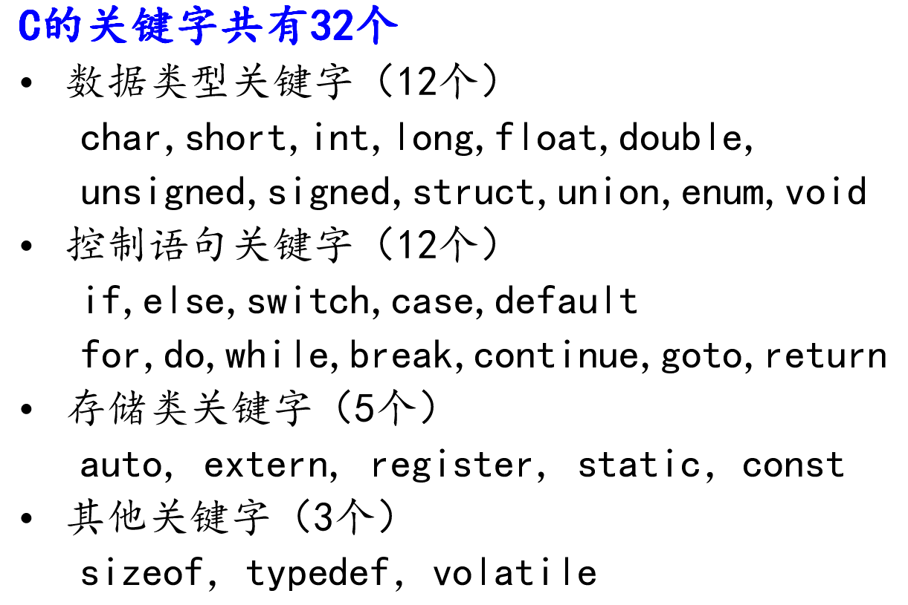
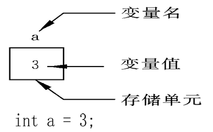
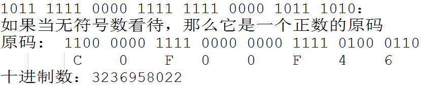
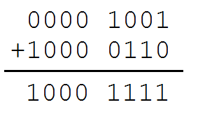
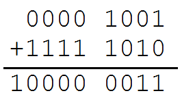
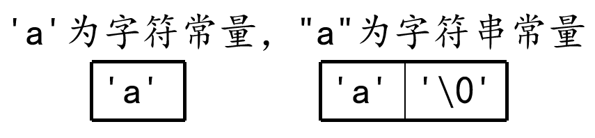

# 变量类型与数据类型

---

## 常量与变量

### 关键字



###  数据类型

数据类型的作用：编译器预算对象(变量)分配的内存空间大小


### 常量

* 在程序运行过程中，其值不能被改变的量
* 常量一般出现在表达式或赋值语句中

常量定义方法:

* `"hello"、'A'、-10、3.1415926`(浮点常量)	
* `#define PI 3.1415`，注意：没有分号 `;` 结束标记，**推荐** 使用宏定义常量。定义语法：`#define 宏名 宏值`
* `const int a = 10;`。定义语法：`const 类型名 变量名 = 变量值`
    * `const` 关键字：被该关键字修饰的变量，表示为只读变量，但是可以通过指针进行修改

| 常量 | 举例 |
|:----:|:----:|
| 整型常量 | 100, 200, -100, 0 |
| 实型常量 | 3.14, 0.125, -3.123 |
| 字符型常量 | `'a', 'b', '1', '\n'` |
| 字符串常量 | `"a", "ab", "12356"` |

```c
#include <stdio.h>

#define PI 3.14

int main()
{
    // 求圆的面积与周长
    double r;
    printf("请输入圆的半径 r:\n");
    scanf("%lf", &r);

    double area = PI * PI * r;
    double length = 2 * PI * r;

    printf("面积为 %lf\n", area);
    printf("周长为 %lf\n", length);

    /*
        请输入圆的半径 r:
        10
        面积为 98.596000
        周长为 62.800000
    */

    return 0;
}
```

### 变量

* 在程序运行过程中，其值可以改变
* 变量在使用前必须先定义，定义变量前必须有相应的数据类型
* 定义变量时，尽量不要重名

变量三要素：类型名、变量名、变量值。变量值可以是一个表达式

定义语法(一般方法)：

```c
类型名 变量名 = 变量值;
```

变量的声明：

* `int a;` 没有变量值的变量定义叫做声明
* `extern int a;` 添加了关键字 `extern`

变量的定义：

```c
int a = 40;
````

变量定义会开辟内存空间；变量声明不会开辟内存空间


变量要想使用必须有定义

* 当编译器编译程序时，在变量使用之前，必须要看到变量定义。如果没有看到变量定义，编译器会自动找寻一个变量声明提升成为定义
* 如果该变量的声明前有 `extern` 关键字，无法提升



**声明和定义区别**:

* 声明变量不需要建立存储空间，如：`extern int a;`
* 定义变量需要建立存储空间，如：`int b;`

**变量特点**:

* 变量在编译时为其分配相应的内存空间
* 可以通过其名字和地址访问相应内存

```c
#include <stdio.h>

int main()
{
    // extern 关键字只做声明，不能做任何定义，后面还会学习，这里先了解
    // 声明一个变量 a，a 在这里没有建立存储空间
    extern int a;
    // a = 10; // err, 没有空间，就不可以赋值

    int b = 10; // 定义一个变量 b，b 的类型为 int，b 赋值为 10

    return 0;
}
```

从广义的角度来讲声明中包含着定义，即定义是声明的一个特例，所以并非所有的声明都是定义：

* `int b` 它既是声明，同时又是定义
* 对于 `extern b` 来讲它只是声明不是定义

一般的情况下，把建立存储空间的声明称之为“定义”，而把不需要建立存储空间的声明称之为“声明”

标识符是变量和常量的统称

**符命名规则**:

* 通常常量使用大写、变量使用小写，大小写严格区分
* 标识符不能是关键字，系统函数名等
* 标识符只能由字母、数字、下划线组成，第一个字符必须为字母或下划线，数字不能开头
* 标识符中命名应简单明了

### 使用示例

```c
#include <stdio.h>

#define MAX 10 // 声明了一个常量，名字叫 MAX，值是 10，常量的值一旦初始化不可改

int main()
{
    int a;            // 定义了一个变量，其类型为 int，名字叫 a
    const int b = 10; // 定义一个 const 常量，名为叫 b，值为 10
    // b = 11; // err，常量的值不能改变
    // MAX = 100;	// err，常量的值不能改变

    a = MAX;           // 将 abc 的值设置为 MAX 的值
    printf("%d\n", a); // 打印变量 a 的值
    a = 123;
    printf("%d\n", a); // 打印变量 a 的值

    /*
        10
        123
    */

    return 0;
}
```

---

## 整型

### 整型变量的定义和输出

| 打印格式 | 含义 |
|:----:|:----:|
| `%d` | 输出一个有符号的 10 进制 `int` 类型 |
| `%o`(字母 `o`) | 输出 8 进制的 `int` 类型 |
| `%x` | 输出 16 进制的 `int` 类型，字母以小写输出 |
| `%X` | 输出 16 进制的 `int` 类型，字母以大写输出 |
| `%u` | 输出一个 10 进制的无符号数 |

```c
#include <stdio.h>

int main()
{
    int a = 123;   // 定义变量 a，以 10 进制方式赋值为 123
    int b = 0567;  // 定义变量 b，以 8 进制方式赋值为 0567
    int c = 0xabc; // 定义变量 c，以 16 进制方式赋值为 0xabc

    printf("a = %d\n", a);
    printf("8 进制：b = %o\n", b);
    printf("10 进制：b = %d\n", b);
    printf("16 进制：c = %x\n", c);
    printf("16 进制：c = %X\n", c);
    printf("10 进制：c = %d\n", c);

    unsigned int d = 0xffffffff; // 定义无符号 int 变量 d，以 16 进制方式赋值
    printf("有符号方式打印：d = %d\n", d);
    printf("无符号方式打印：d = %u\n", d);

    /*
        a = 123
        8 进制：b = 567
        10 进制：b = 375
        16 进制：c = abc
        16 进制：c = ABC
        10 进制：c = 2748
        有符号方式打印：d = -1
        无符号方式打印：d = 4294967295
    */

    return 0;
}
```

### 整型变量的输入

```c
#include <stdio.h>

int main()
{
    int a;
    printf("请输入 a 的值：");

    // 不要加 "\n"
    scanf("%d", &a);
    printf("a = %d\n", a); // 打印 a 的值

    /*
        请输入 a 的值：12
        a = 12
    */

    return 0;
}
```

### short、int、long、long long

| 数据类型 | 占用空间 |
|:----:|:----:|
| `short`(短整型) | 2 字节 |
| `int`(整型) | 4 字节 |
| `long`(长整形) | Windows 为 4 字节，Linux 32 位为 4 字节，64 位为 8 字节 |
| `long long`(长长整形) | 8 字节 |

**注意**：

* 需要注意的是，整型数据在内存中占的字节数与所选择的操作系统有关。虽然 C 语言标准中没有明确规定整型数据的长度，但 `long` 类型整数的长度不能短于 `int` 类型，`short` 类型整数的长度不能长于 `int` 类型
* 当一个小的数据类型赋值给一个大的数据类型，不会出错，因为编译器会自动转化。但当一个大的类型赋值给一个小的数据类型，那么就可能丢失高位

| 整型常量 | 所需类型 |
|:----:|:----:|
| `10` | 代表 `int` 类型 |
| `10l, 10L` | 代表 `long` 类型 |
| `10ll, 10LL` | 代表 `long long` 类型 |
| `10u, 10U` | 代表 `unsigned int` 类型 |
| `10ul, 10UL` | 代表 `unsigned long` 类型 |
| `10ull, 10ULL` | 代表 `unsigned long long` 类型 |

| 打印格式 | 含义 |
|:----:|:----:|
| `%hd` | 输出 `short` 类型 |
| `%d` | 输出 `int` 类型 |
| `%ld` | 输出 `long` 类型 |
| `%lld` | 输出 `long long` 类型 |
| `%hu` | 输出 `unsigned short` 类型 |
| `%u` | 输出 `unsigned int` 类型 |
| `%lu` | 输出 `unsigned long` 类型 |
| `%llu` | 输出 `unsigned long long` 类型 |

使用起来非常简单，有符号，最后一位一定是 `d`，无符号则是 `u`，再根据类型，在前面添加类似缩写即可，`short` 是加个 `s`，`int` 不加，`long` 加 `l`，`long long` 加 `ll`

```c
#include <stdio.h>

int main()
{
    short a = 10;
    int b = 10;
    long c = 10l;       // 或者 10L
    long long d = 10ll; // 或者 10LL

    printf("sizeof(a) = %lu\n", sizeof(a));
    printf("sizeof(b) = %lu\n", sizeof(b));
    printf("sizeof(c) = %lu\n", sizeof(c));
    printf("sizeof(c) = %lu\n", sizeof(d));

    printf("short a = %hd\n", a);
    printf("int b = %d\n", b);
    printf("long c = %ld\n", c);
    printf("long long d = %lld\n", d);

    unsigned short a2 = 20u;
    unsigned int b2 = 20u;
    unsigned long c2 = 20ul;
    unsigned long long d2 = 20ull;

    printf("unsigned short a = %hu\n", a2);
    printf("unsigned int b = %u\n", b2);
    printf("unsigned long c = %lu\n", c2);
    printf("unsigned long long d = %llu\n", d2);

    /*
        sizeof(a) = 2
        sizeof(b) = 4
        sizeof(c) = 8
        sizeof(c) = 8
        short a = 10
        int b = 10
        long c = 10
        long long d = 10
        unsigned short a = 20
        unsigned int b = 20
        unsigned long c = 20
        unsigned long long d = 20
    */

    return 0;
}
```

### 有符号数和无符号数区别

有符号数是最高位为符号位，0 代表正数，1 代表负数

```c
#include <stdio.h>

int main()
{
    signed int a = -1089474374; // 定义有符号整型变量 a
    printf("%X\n", a);          // 结果为 BF0FF0BA

    // BF0FF0BA

    return 0;
}
```

无符号数最高位不是符号位，而就是数的一部分，无符号数不可能是负数



```c
#include <stdio.h>

int main()
{
    unsigned int a = 3236958022; // 定义无符号整型变量 a
    printf("%X\n", a);           // 结果为 C0F00F46

    // C0F00F46

    return 0;
}
```

当程序要处理一个不可能出现负值的时候，一般用无符号数，这样可以增大数的表达最大值

有符号和无符号整型取值范围如下:

| 数据类型 | 占用空间 | 取值范围 |
|:----:|:----:|:----:|
| `short` | 2 字节 | -32768 到 32767 $[-2^{15}, 2^{15}-1]$ |
| `int` | 4 字节 | -2147483648 到 2147483647 $[-2^{31}, 2^{31}-1]$ |
| `long` | 4 字节 | -2147483648 到 2147483647 $[-2^{31}, 2^{31}-1]$ |
| `unsigned short` | 2 字节 | 0 到 65535 $[0, 2^{16}-1]$ |
| `unsigned int` | 4 字节 | 0 到 4294967295 $[0, 2^{32}-1]$ |
| `unsigned long` | 4 字节 | 0 到 4294967295 $[0, 2^{32}-1]$ |

输出格式主要有 `%d, %u, %o, %x, %hd, %hu, %ld, %lu, %lld, %llu, %c, %f, %lf`

最常用的是 `%d, %u, %x, %c, %s` 

---

## sizeof 关键字

* `sizeof` 不是函数，所以不需要包含任何头文件，它的功能是计算一个变量或者数据类型的大小，单位为字节
* `sizeof` 的返回值为 `size_t`，`sizeof(类型名)` 或者 `sizeof(变量名)`
* `size_t` 类型在 32 位操作系统下是 `unsigned int`，是一个无符号的整数，使用 `%u` 接收返回值

```c
#include <stdio.h>

int main()
{
    int a;
    int b = sizeof(a); // sizeof 得到指定值占用内存的大小，单位：字节
    printf("b = %d\n", b);

    size_t c = sizeof(a);
    printf("c = %lu\n", c); // 用无符号数的方式输出 c 的值

    /*
        b = 4
        c = 4
    */

    return 0;
}
```

----

## 字符型

### 字符变量的定义和输出

字符型变量用于存储一个单一字符，在 C 语言中用 `char` 表示，其中每个字符变量都会占用 1 个字节。在给字符型变量赋值时，需要用一对英文半角格式的单引号 `''` 把字符括起来

字符变量实际上并不是把该字符本身放到变量的内存单元中去，而是将该字符对应的 ASCII 编码放到变量的存储单元中。`char` 的本质就是一个 1 字节大小的整型

```c
#include <stdio.h>

int main()
{
    char ch = 'a';
    printf("sizeof(ch) = %lu\n", sizeof(ch));

    printf("ch[%%c] = %c\n", ch); // 打印字符
    printf("ch[%%d] = %d\n", ch); // 打印 a 的 ASCII的值

    char A = 'A';
    char a = 'a';
    printf("a = %d\n", a); // 97
    printf("A = %d\n", A); // 65

    printf("A = %c\n", 'a' - 32); // 小写 a 转大写 A
    printf("a = %c\n", 'A' + 32); // 大写 A 转小写 a

    ch = ' ';
    printf("空字符：%d\n", ch);    // 空字符 ASCII 值为 32
    printf("A = %c\n", 'a' - ' '); // 小写 a 转大写 A
    printf("a = %c\n", 'A' + ' '); // 大写 A 转小写 a

    /*
        sizeof(ch) = 1
        ch[%c] = a
        ch[%d] = 97
        a = 97
        A = 65
        A = A
        a = a
        空字符：32
        A = A
        a = a
    */

    return 0;
}
```

### 字符变量的输入

```c
#include <stdio.h>

int main()
{
    char ch;
    printf("请输入 ch 的值：");

    // 不要加 \n
    scanf("%c", &ch);
    printf("ch = %c\n", ch); // 打印 ch 的字符

    /*
        请输入 ch 的值：d
        ch = d
    */

    return 0;
}
```

### ASCII 对照表

| ASCII 值 | 控制字符 | ASCII 值 | 字符 | ASCII 值 | 字符 | ASCII 值 | 字符 |
|:----:|:----:|:----:|:----:|:----:|:----:|:----:|:----:|
| 0 | NUT | 32 | (space) | 64 | @ | 96 | 、|
| 1 | SOH | 33 | ! | 65 | A | 97 | a |
| 2 | STX | 34 | " | 66 | B | 98 | b |
| 3 | ETX | 35 | # | 67 | C | 99 | c |
| 4 | EOT | 36 | $ | 68 | D | 100 | d |
| 5 | ENQ | 37 | % | 69 | E | 101 | e |
| 6 | ACK | 38 | & | 70 | F | 102 | f |
| 7 | BEL | 39 | , | 71 | G | 103 | g |
| 8 | BS | 40 | ( | 72 | H | 104 | h |
| 9 | HT | 41 | ) | 73 | I | 105 | i |
| 10 | LF | 42 | * | 74 | J | 106 | j |
| 11 | VT | 43 | + | 75 | K | 107 | k |
| 12 | FF | 44 | , | 76 | L | 108 | l |
| 13 | CR | 45 | - | 77 | M | 109 | m |
| 14 | SO | 46 | . | 78 | N | 110 | n |
| 15 | SI | 47 | / | 79 | O | 111 | o |
| 16 | DLE | 48 | 0 | 80 | P | 112 | p |
| 17 | DCI | 49 | 1 | 81 | Q | 113 | q |
| 18 | DC2 | 50 | 2 | 82 | R | 114 | r |
| 19 | DC3 | 51 | 3 | 83 | S | 115 | s |
| 20 | DC4 | 52 | 4 | 84 | T | 116 | t |
| 21 | NAK | 53 | 5 | 85 | U | 117 | u |
| 22 | SYN | 54 | 6 | 86 | V | 118 | v |
| 23 | TB | 55 | 7  | 87 | W | 119 | w |
| 24 | CAN | 56 | 8 | 88 | X | 120 | x |
| 25 | EM | 57 | 9 | 89 | Y | 121 | y |
| 26 | SUB | 58 | : | 90 | Z | 122 | z |
| 27 | ESC | 59 | ; | 91 | [ | 123 | { |
| 28 | FS | 60 | < | 92 | / | 124 | \| |
| 29 | GS | 61 | = | 93 | ] | 125 | } |
| 30 | RS | 62 | > | 94 | ^ | 126 | ` |
| 31 | US | 63 | ? | 95 | _ | 127 | DEL |

ASCII 码大致由以下两部分组成：

* ASCII 非打印控制字符： ASCII 表上的数字 0-31 分配给了控制字符，用于控制像打印机等一些外围设备
* ASCII 打印字符：数字 32-126 分配给了能在键盘上找到的字符，当查看或打印文档时就会出现。数字 127 代表 `Del` 命令

### 转义字符

| 转义字符 | 含义 | ASCII 码值(十进制) |
|:----:|:----:|:----:|
| `\a` | 警报 | 007 |
| `\b` | 退格(BS)，将当前位置移到前一列 | 008 |
| `\f` | 换页(FF)，将当前位置移到下页开头 | 012 |
| `\n` | 换行(LF)，将当前位置移到下一行开头 | 010 |
| `\r` | 回车(CR)，将当前位置移到本行开头 | 013 |
| `\t` | 水平制表(HT)，跳到下一个 TAB 位置 | 009 |
| `\v` | 垂直制表(VT) | 011 |
| `\\` | 代表一个反斜线字符 `\` | 092 |
| `\'` | 代表一个单引号(撇号)字符 | 039 |
| `\"` | 代表一个双引号字符 | 034 |
| `\?` | 代表一个问号 | 063 |
| `\0` | 数字 0 | 000 |
| `\ddd` | 8 进制转义字符，d 范围 0~7 | 3 位 8 进制 |
| `\xhh` | 16 进制转义字符，h 范围 0~9，`a~f，A~F` | 3 位 16 进制 |

注意：前 7 个字符是不可打印的，`\n` 和 `\0`

```c
#include <stdio.h>

int main()
{
    printf("abc");
    printf("\refg\n"); // \r 切换到句首，\n 为换行键

    printf("abc");
    printf("\befg\n"); // \b 为退格键，\n 为换行键

    printf("%d\n", '\123'); // \123 为 8 进制转义字符，0123 对应 10 进制数为 83
    printf("%d\n", '\x23'); // \x23 为 16 进制转义字符，0x23 对应 10 进制数为 35

    /*
        efg
        abefg
        83
        35
    */

    return 0;
}
```

---

## 实型(浮点型)

在 C 语言中，浮点型变量分为两种：单精度浮点数(`float`)、双精度浮点数(`double`)，但是 `double` 型变量所表示的浮点数比 `float` 型变量更精确

由于浮点型变量是由有限的存储单元组成的，因此只能提供有限的有效数字。在有效位以外的数字将被舍去，这样可能会产生一些误差

不以 `f` 结尾的常量是 `double` 类型，以 `f` 结尾的常量(如 `3.14f`)是 `float` 类型

输出时，`float` 是 `%f`，`double` 是 `%lf`，默认保留 6 位小数

```c
#include <stdio.h>

int main()
{
    // 传统方式赋值
    float a = 3.14f; // 或 3.14F
    double b = 3.14;

    printf("a = %f\n", a);
    printf("b = %lf\n", b);

    // 科学法赋值
    a = 3.2e3f; // 3.2*1000 = 3200，e 可以写 E
    printf("a1 = %f\n", a);

    a = 100e-3f; // 100*0.001 = 0.1
    printf("a2 = %f\n", a);

    a = 3.1415926f;
    printf("a3 = %f\n", a); // 结果为 3.141593

    /*
        a = 3.140000
        b = 3.140000
        a1 = 3200.000000
        a2 = 0.100000
        a3 = 3.141593
    */

    return 0;
}
```

---

## 进制

进制也就是进位制，是人们规定的一种进位方法。 对于任何一种进制— `X` 进制，就表示某一位置上的数运算时是逢 `X` 进一位。 十进制是逢十进一，十六进制是逢十六进一，二进制就是逢二进一，以此类推，`x` 进制就是逢 `x` 进位

数据在计算机中主要是以补码的形式存储的

一个字节为 8 个二进制，称为 8 位，8 个 `bit`，计算机中存储的最小单位是字节。数据存储是习惯以“字节”(`Byte`)为单位

### C 语言如何表示相应进制数

* 十进制，以正常数字 1-9 开头，如 `123`
* 八进制，以数字 0 开头，如 `0123`
* 十六进制，以 `0x` 开头，如 `0x123`
* 二进制，C 语言不能直接书写二进制数

```c
#include <stdio.h>

int main()
{
    int a = 123;   // 十进制方式赋值
    int b = 0123;  // 八进制方式赋值，以数字 0 开头
    int c = 0xABC; // 十六进制方式赋值

    // 如果在 printf 中输出一个十进制数那么用 %d，八进制用 %o，十六进制是 %x
    printf("十进制：%d\n", a);
    printf("八进制：%o\n", b); // %o,为字母 o,不是数字
    printf("十六进制：%x\n", c);

    /*
        十进制：123
        八进制：123
        十六进制：abc
    */

    return 0;
}
```

---

## 计算机内存数值存储方式

### 原码

一个数的原码(原始的二进制码)有如下特点：

* 最高位做为符号位，0 表示正，为 1 表示负
* 其它数值部分就是数值本身绝对值的二进制数
* 负数的原码是在其绝对值的基础上，最高位变为 1

下面数值以 1 字节大小描述:

| 十进制数 | 原码 |
|:----:|:----:|
| +15 | 0000 1111 |
| -15 | 1000 1111 |
| +0 | 0000 0000 |
| -0 | 1000 0000 |

原码表示法简单易懂，与带符号数本身转换方便，只要符号还原即可，但当两个正数相减或不同符号数相加时，必须比较两个数哪个绝对值大，才能决定谁减谁，才能确定结果是正还是负，所以原码不便于加减运算

### 反码

* 对于正数，反码与原码相同
* 对于负数，符号位不变，其它部分取反(1 变 0，0 变 1)

| 十进制数 | 反码 |
|:----:|:----:|
| +15 | 0000 1111 |
| -15 | 1111 0000 |
| +0 | 0000 0000 |
| -0 | 1111 1111 |

反码运算也不方便，通常用来作为求补码的中间过渡

### 补码

在计算机系统中，数值一律用补码来存储

补码特点：

* 对于正数，原码、反码、补码相同
* 对于负数，其补码为它的反码加 1
* 补码符号位不动，其他位求反，最后整个数加 1，得到原码

| 十进制数 | 补码 |
|:----:|:---:|
| +15 | 0000 1111 |
| -15 | 1111 0001 |
| +0 | 0000 0000 |
| -0 | 0000 0000 |

```c
#include <stdio.h>

int main()
{
    int a = -15;

    printf("%x\n", a);
    // fffffff1
    // fffffff1 对应的二进制：1111 1111 1111 1111 1111 1111 1111 0001
    // 符号位不变，其它取反：1000 0000 0000 0000 0000 0000 0000 1110
    // 上面加 1：1000 0000 0000 0000 0000 0000 0000 1111  最高位 1 代表负数，就是 -15

    return 0;
}
```

### 补码的意义

**示例 1**：用 8 位二进制数分别表示 +0 和 -0

| 十进制数 | 原码 |
|:----:|:----:|
| +0 | 0000 0000 |
| -0 | 1000 0000 |

| 十进制数 | 反码 |
|:----:|:----:|
| +0 | 0000 0000 |
| -0 | 1111 1111 |

不管以原码方式存储，还是以反码方式存储，0 也有两种表示形式。为什么同样一个 0 有两种不同的表示方法呢

但是如果以补码方式存储，补码统一了 0 的编码

| 十进制数 | 补码 |
|:----:|:----:|
| +0 | 0000 0000 |
| -0 | 10000 0000 由于只用 8 位描述，最高位 1 丢弃，变为 0000 0000 |

**示例 2**：计算 9-6 的结果

* 以原码方式相加



结果为 -15，不正确

* 以补码方式相加



最高位的 1 溢出，剩余 8 位二进制表示的是 3，正确

在计算机系统中，数值一律用补码来存储，主要原因是：

* 统一了零的编码
* 将符号位和其它位统一处理
* 将减法运算转变为加法运算
* 两个用补码表示的数相加时，如果最高位(符号位)有进位，则进位被舍弃

### 数值溢出

当超过一个数据类型能够存放最大的范围时，数值会溢出

有符号位最高位溢出的区别：符号位溢出会导致数的正负发生改变，但最高位的溢出会导致最高位丢失

| 数据类型 | 占用空间 | 取值范围 |
|:----:|:----:|:----:|
| `char` | 1 字节 | -128 到 127 $[-2^7, 2^7-1]$
| `unsigned char` | 1 字节 | 0 到 255 $[0, 2^8-1]$

```c
#include <stdio.h>

int main()
{
    char ch;

    // 符号位溢出会导致数的正负发生改变
    ch = 0x7f + 2; // 127 + 2
    printf("%d\n", ch);
    // 0111 1111
    // +2 后 1000 0001，这是负数补码，其原码为 1111 1111，结果为 -127

    // 最高位的溢出会导致最高位丢失
    unsigned char ch2;
    ch2 = 0xff + 1; // 255 + 1
    printf("%u\n", ch2);
    // 1111 1111
    // +1 后 10000 0000，char 只有 8 位最高位的溢出，结果为 0000 0000，十进制为 0

    ch2 = 0xff + 2; // 255 + 1
    printf("%u\n", ch2);
    // 1111 1111
    // +1 后 10000 0001，char 只有 8 位最高位的溢出，结果为 0000 0001，十进制为 1

    /*
        main.c: In function ‘main’:
        main.c:15:11: warning: unsigned conversion from ‘int’ to ‘unsigned char’ changes value from ‘256’ to ‘0’ [-Woverflow]
        15 |     ch2 = 0xff + 1; // 255 + 1
            |           ^~~~
        main.c:20:11: warning: unsigned conversion from ‘int’ to ‘unsigned char’ changes value from ‘257’ to ‘1’ [-Woverflow]
        20 |     ch2 = 0xff + 2; // 255 + 1
            |           ^~~~
        -127
        0
        1
    */

    return 0;
}
```

---

## 类型限定符

| 限定符 | 含义 |
|:----:|:----:|
| `extern` | 声明一个变量，`extern` 声明的变量没有建立存储空间。`extern int a;` // 变量在定义的时候创建存储空间 |
| `const` | 定义一个常量，常量的值不能修改。`const int a = 10;` |
| `volatile` | 防止编译器优化代码 |
| `register` | 定义寄存器变量，没有内存地址，提高效率。`register` 是建议型的指令，而不是命令型的指令，如果 CPU 有空闲寄存器，那么 `register` 就生效，如果没有空闲寄存器，那么 `register` 无效 |

---

## 字符串格式化输出和输入

### 字符串常量

* 字符串是内存中一段连续的 `char` 空间，以 `\0`(数字 0)结尾(一定有)
* 字符串常量是由双引号括起来的字符序列，如 `"china"、"C program"，"$12.5"` 等都是合法的字符串常量

字符串常量与字符常量的不同



每个字符串的结尾，编译器会自动的添加一个结束标志位 `\0`，即 `"a"` 包含两个字符 `'a'` 和 `'\0'`

* `"abc"` 等价于 `'a''b''c''\0'`
* `'a'` 不等价 `"a"`(`'a''\0'`)

### printf 函数和 putchar 函数

`printf` 是输出一个字符串，`putchar` 输出一个 `char`，可直接使用 ASCII 码

`printf` 格式字符：

| 打印格式 | 对应数据类型 | 含义 |
|:----:|:----:|:----:|
| `%d` | `int` | 接受整数值并将它表示为有符号的十进制整数 |
| `%hd` | `short int` | 短整数 |
| `%hu` | `unsigned short` | 无符号短整数 |
| `%o` | `unsigned int` | 无符号 8 进制整数 |
| `%u` | `unsigned int` | 无符号 10 进制整数 |
| `%x, %X` | `unsigned int` | 无符号 16 进制整数，`x` 对应的是 `abcdef`，`X` 对应的是 `ABCDEF` |
| `%f` | `float` | 单精度浮点数 |
| `%lf` | `double` | 双精度浮点数 |
| `%e, %E` | `double` | 科学计数法表示的数，此处 `e` 的大小写代表在输出时用的 `e` 的大小写 |
| `%c` | `char` | 字符型。可以把输入的数字按照 ASCII 码相应转换为对应的字符 |
| `%s` | `char *` | 字符串。输出字符串中的字符直至字符串中的空字符（字符串以 `\0` 结尾，这个 `\0` 即空字符) |
| `%p` | `void *` | 以 16 进制形式输出指针 |
| `%%` | `%` | 输出一个百分号 |

`printf` 附加格式：

| 字符 | 含义 |
|:----:|:----:|
| `l`(字母 `l`) | 附加在 `d, u, x, o` 前面，表示长整数 |
| `-` | 左对齐 |
| `m`(代表一个整数) | 数据最小宽度 |
| 0 | 将输出的前面补上 0 直到占满指定列宽为止不可以搭配使用 `-` |
| `m.n`(代表一个整数) | `m` 指域宽，即对应的输出项在输出设备上所占的字符数。`n` 指精度，用于说明输出的实型数的小数位数。对数值型的来说，未指定 `n` 时，隐含的精度为 `n = 6` 位 |
| `%0m.nf` | 其中 `f`：表示打印实型，一共有 `m` 位(整数、小数、小数点)，`n` 位小数。0：表示不足 `m` 位时，用 0 凑够 `m` 位 |
| `%%` | 显示一个 `%`。转义字符 `\` 对 `%` 转义无效 |
| `%Ns` | 显示 `N` 个字符的字符串。不足 `N` 用空格向左填充 |
| `%0Ns` | 显示 `N` 个字符的字符串。不足 `N` 用 0 向左填充 |
| `%-Ns` | 显示 `N` 个字符的字符串。不足 `N` 用空格向右填充 |

```c
#include <stdio.h>

int main()
{
    int a = 100;
    printf("a = %d\n", a); // 格式化输出一个字符串
    printf("%p\n", &a);    // 输出变量 a 在内存中的地址编号
    printf("%%d\n");

    char c = 'a';
    putchar(c); // putchar 只有一个参数，就是要输出的 char
    long a2 = 100;
    printf("%ld, %lx, %lo\n", a2, a2, a2);

    long long a3 = 1000;
    printf("%lld, %llx, %llo\n", a3, a3, a3);

    int abc = 10;
    printf("abc = '%6d'\n", abc);
    printf("abc = '%-6d'\n", abc);
    printf("abc = '%06d'\n", abc);
    printf("abc = '%-06d'\n", abc);

    double d = 12.3;
    printf("d = \' %-10.3lf \'\n", d);

    /*
        main.c: In function ‘main’:
        main.c:22:12: warning: '0' flag ignored with '-' flag in gnu_printf format [-Wformat=]
        22 |     printf("abc = '%-06d'\n", abc);
            |            ^~~~~~~~~~~~~~~~~
        a = 100
        0x7ffd31d8eb68
        %d
        a100, 64, 144
        1000, 3e8, 1750
        abc = '    10'
        abc = '10    '
        abc = '000010'
        abc = '10    '
        d = ' 12.300     '
    */

    return 0;
}
```

### scanf 函数与 getchar 函数

* `getchar` 是从标准输入设备读取一个 `char`，返回该获取的字符的 ASCII 码
* `scanf` 通过 `%` 转义的方式可以得到用户通过标准输入设备输入的数据

`scanf` 接收字符串：

* `scanf` 具有安全隐患。如果存储空间不足，数据能存储到内存中，但不被保护。空间不足不要使用
* `scanf` 函数接收字符串时， 碰到空格和换行会自动终止。不能使用 `scanf` 的 `%s` 接收带有空格的字符串
* 将 `#define _CRT_SECURE_NO_WARNINGS` 添加到程序第一行。解决 `scanf 4996` 错误

```c
#include <stdio.h>

int main()
{
    char ch1;
    char ch2;
    char ch3;
    int a;
    int b;

    printf("请输入 ch1 的字符：");
    ch1 = getchar();
    printf("ch1 = %c\n", ch1);

    getchar(); // 测试此处 getchar() 的作用

    printf("请输入 ch2 的字符：");
    ch2 = getchar();
    printf("\'ch2 = %ctest\'\n", ch2);

    getchar(); // 测试此处 getchar() 的作用
    printf("请输入 ch3 的字符：");
    scanf("%c", &ch3); // 这里第二个参数一定是变量的地址，而不是变量名
    printf("ch3 = %c\n", ch3);

    printf("请输入 a 的值：");
    scanf("%d", &a);
    printf("a = %d\n", a);

    printf("请输入 b 的值：");
    scanf("%d", &b);
    printf("b = %d\n", b);

    /*
        请输入 ch1 的字符：a
        ch1 = a
        请输入 ch2 的字符：d
        'ch2 = dtest'
        请输入 ch3 的字符：e
        ch3 = e
        请输入 a 的值：1
        a = 1
        请输入 b 的值：2
        b = 2
    */

    return 0;
}
```

---
