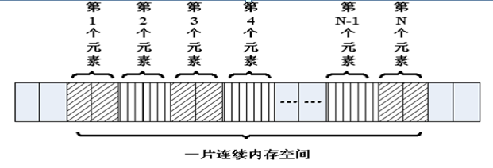

# 数组和字符串

---

## 概述

数组就是在内存中连续的相同类型的变量空间。同一个数组所有的成员都是相同的数据类型，同时所有的成员在内存中的地址是连续的



数组属于构造数据类型:

* 一个数组可以分解为多个数组元素：这些数组元素可以是基本数据类型或构造类型

```c
int a[10];  
struct Stu boy[10];
```

* 按数组元素类型的不同，数组可分为：数值数组、字符数组、指针数组、结构数组等类别

```c
int a[10];
char s[10];
char *p[10];
```

通常情况下，数组元素下标的个数也称为维数，根据维数的不同，可将数组分为一维数组、二维数组、三维数组、四维数组等

通常情况将二维及以上的数组称为多维数组

---

## 一维数组

### 一维数组的定义和使用

* 数组名字符合标识符的书写规定(数字、英文字母、下划线)
* 数组名不能与其它变量名相同，同一作用域内是唯一的
* 方括号 `[]` 中常量表达式表示数组元素的个数

```c
int a[3] 表示数组 a 有 3 个元素
其下标从 0 开始计算，因此 3 个元素分别为 a[0], a[1], a[2]
```

* 定义数组时 `[]` 内最好是常量，使用数组时 `[]` 内即可是常量，也可以是变量

```c
#include <stdio.h>

int main()
{
    int a[10]; // 定义了一个数组，名字叫 a，有 10 个成员，每个成员都是 int 类型
    // a[0], ... ,a[9]，没有 a[10]
    // 没有 a 这个变量，a 是数组的名字，但不是变量名，它是常量
    a[0] = 0;
    // ...
    a[9] = 9;

    int i = 0;
    for (i = 0; i < 10; i++)
    {
        a[i] = i; // 给数组赋值
    }

    // 遍历数组，并输出每个成员的值
    for (i = 0; i < 10; i++)
    {
        printf("%d ", a[i]);
    }
    printf("\n");

    // 0 1 2 3 4 5 6 7 8 9

    return 0;
}
```

### 一维数组的初始化

在定义数组的同时进行赋值，称为初始化。全局数组若不初始化，编译器将其初始化为零。局部数组若不初始化，内容为随机值

```c
int a[10] = { 1, 2, 3, 4, 5, 6, 7, 8, 9, 10 }; // 定义一个数组，同时初始化所有成员变量
int a[10] = { 1, 2, 3 }; // 初始化前三个成员，后面所有元素都设置为 0
int a[10] = { 0 }; // 所有的成员都设置为 0
	
// [] 中不定义元素个数，定义时必须初始化
int a[] = { 1, 2, 3, 4, 5 }; // 定义了一个数组，有 5 个成员
```

### 数组名

数组名是一个地址的常量，代表数组中首元素的地址

```c
#include <stdio.h>

int main()
{
    int a[10] = {1, 2, 3, 4, 5, 6, 7, 8, 9, 10}; // 定义一个数组，同时初始化所有成员变量

    printf("a = %p\n", a);
    printf("&a[0] = %p\n", &a[0]);

    int n = sizeof(a);     // 数组占用内存的大小，10 个 int 类型，10 * 4  = 40
    int n0 = sizeof(a[0]); // 数组第 0 个元素占用内存大小，第 0 个元素为 int，4

    int i = 0;
    for (i = 0; i < sizeof(a) / sizeof(a[0]); i++)
    {
        printf("%d ", a[i]);
    }
    printf("\n");

    /*
        a = 0x7ffc7e9bc340
        &a[0] = 0x7ffc7e9bc340
        1 2 3 4 5 6 7 8 9 10
    */

    return 0;
}
```

### 强化训练

一维数组的最值

```c
#include <stdio.h>

int main()
{
    int a[] = {1, -2, 3, -4, 5, -6, 7, -8, -9, 10}; // 定义一个数组，同时初始化所有成员变量

    int i = 0;
    int max = a[0];
    for (i = 1; i < sizeof(a) / sizeof(a[0]); i++)
    {
        if (a[i] > max)
        {
            max = a[i];
        }
    }
    printf("数组中最大值为：%d\n", max);

    // 数组中最大值为：10

    return 0;
}
```

一维数组的逆置

```c
#include <stdio.h>

int main()
{
    int a[] = {1, -2, 3, -4, 5, -6, 7, -8, -9, 10}; // 定义一个数组，同时初始化所有成员变量
    int i = 0;

    for (i = 0; i < sizeof(a) / sizeof(a[0]); i++)
    {
        printf("%d ", a[i]);
    }
    printf("\n");

    i = 0;
    int j = sizeof(a) / sizeof(a[0]) - 1;
    int tmp;

    while (i < j)
    {
        tmp = a[i];
        a[i] = a[j];
        a[j] = tmp;

        i++;
        j--;
    }

    for (i = 0; i < sizeof(a) / sizeof(a[0]); i++)
    {
        printf("%d ", a[i]);
    }
    printf("\n");

    /*
        1 -2 3 -4 5 -6 7 -8 -9 10
        10 -9 -8 7 -6 5 -4 3 -2 1
    */

    return 0;
}
```

冒泡排序

```c
#include <stdio.h>

int main()
{
    int a[] = {1, -2, 3, -4, 5, -6, 7, -8, -9, 10}; // 定义一个数组，同时初始化所有成员变量

    int i = 0;
    int j = 0;
    int n = sizeof(a) / sizeof(a[0]);
    int tmp;

    for (i = 0; i < n; i++)
    {
        printf("%d ", a[i]);
    }
    printf("\n");

    // 1、流程
    // 2、试数
    for (i = 0; i < n - 1; i++)
    {
        for (j = 0; j < n - i - 1; j++) // 内循环的目的是比较相邻的元素，把大的放到后面
        {
            if (a[j] > a[j + 1])
            {
                tmp = a[j];
                a[j] = a[j + 1];
                a[j + 1] = tmp;
            }
        }
    }

    for (i = 0; i < n; i++)
    {
        printf("%d ", a[i]);
    }
    printf("\n");

    /*
        1 -2 3 -4 5 -6 7 -8 -9 10
        -9 -8 -6 -4 -2 1 3 5 7 10
    */

    return 0;
}
```

---

## 二维数组

### 二维数组的定义和使用

二维数组定义的一般形式是

```c
类型说明符 数组名[常量表达式1][常量表达式2];
```

其中常量表达式1 表示第一维下标的长度，常量表达式2 表示第二维下标的长度

```c
int a[3][4];
```

* 命名规则同一维数组
* 定义了一个三行四列的数组，数组名为 `a` 其元素类型为整型，该数组的元素个数为 3×4 个，即


二维数组 `a` 是按行进行存放的，先存放 `a[0]` 行，再存放 `a[1]` 行、`a[2]` 行，并且每行有四个元素，也是依次存放的

* 二维数组在概念上是二维的：其下标在两个方向上变化，对其访问一般需要两个下标
* 在内存中并不存在二维数组，二维数组实际的硬件存储器是连续编址的，也就是说内存中只有一维数组，即放完一行之后顺次放入第二行，和一维数组存放方式是一样的

```c
#include <stdio.h>

int main()
{
    // 定义了一个二维数组，名字叫a
    // 由 3 个一维数组组成，这个一维数组是 int [4]
    // 这 3 个一维数组的数组名分别为 a[0], a[1], a[2]
    int a[3][4];

    a[0][0] = 0;
    // ...
    a[2][3] = 12;

    // 给数组每个元素赋值
    int i = 0;
    int j = 0;
    int num = 0;
    for (i = 0; i < 3; i++)
    {
        for (j = 0; j < 4; j++)
        {
            a[i][j] = num++;
        }
    }

    // 遍历数组，并输出每个成员的值
    for (i = 0; i < 3; i++)
    {
        for (j = 0; j < 4; j++)
        {
            printf("%d, ", a[i][j]);
        }
        printf("\n");
    }

    /*
        0, 1, 2, 3,
        4, 5, 6, 7,
        8, 9, 10, 11,
    */

    return 0;
}
```

### 二维数组的初始化

```c
// 分段赋值 int a[3][4] = {{1, 2, 3, 4}, {5, 6, 7, 8}, {9, 10, 11, 12}};
int a[3][4] = 
{ 
    {1, 2, 3, 4},
	{5, 6, 7, 8},
	{9, 10, 11, 12}
};
 
// 连续赋值
int a[3][4] = {1, 2, 3, 4 , 5, 6, 7, 8, 9, 10, 11, 12};
 
// 可以只给部分元素赋初值，未初始化则为 0
int a[3][4] = { 1, 2, 3, 4};
 
// 所有的成员都设置为 0
int a[3][4] = {0};
 
// [] 中不定义元素个数，定义时必须初始化
int a[][4] = {1, 2, 3, 4, 5, 6, 7, 8};
```

### 数组名

数组名是一个地址的常量，代表数组中首元素的地址

```c
#include <stdio.h>

int main()
{
    // 定义了一个二维数组，名字叫 a
    // 二维数组是本质上还是一维数组，此一维数组有 3 个元素
    // 每个元素又是一个一维数组 int[4]
    int a[3][4] = {1, 2, 3, 4, 5, 6, 7, 8, 9, 10, 11, 12};

    // 数组名为数组首元素地址，二维数组的第 0 个元素为一维数组
    // 第 0 个一维数组的数组名为 a[0]
    printf("a = %p\n", a);
    printf("a[0] = %p\n", a[0]);

    // 测二维数组所占内存空间，有 3 个一维数组，每个一维数组的空间为 4*4
    // sizeof(a) = 3 * 4 * 4 = 48
    printf("sizeof(a) = %lu\n", sizeof(a));

    // 测第 0 个元素所占内存空间，a[0] 为第 0 个一维数组 int[4] 的数组名，4*4 = 16
    printf("sizeof(a[0]) = %lu\n", sizeof(a[0]));

    // 测第 0 行 0 列元素所占内存空间，第 0 行 0 列元素为一个 int 类型，4 字节
    printf("sizeof(a[0][0]) = %lu\n", sizeof(a[0][0]));

    // 求二维数组行数
    printf("i = %lu\n", sizeof(a) / sizeof(a[0]));

    // 求二维数组列数
    printf("j = %lu\n", sizeof(a[0]) / sizeof(a[0][0]));

    // 求二维数组行*列总数
    printf("n = %lu\n", sizeof(a) / sizeof(a[0][0]));

    /*
        a = 0x7ffcfbd74000
        a[0] = 0x7ffcfbd74000
        sizeof(a) = 48
        sizeof(a[0]) = 16
        sizeof(a[0][0]) = 4
        i = 3
        j = 4
        n = 12
    */

    return 0;
}
```

### 强化训练

```c
#include <stdio.h>

int main()
{
    // 二维数组：  五行、三列
    // 行代表人：  老大到老五
    // 列代表科目：语、数、外
    float a[5][3] = {{80, 75, 56}, {59, 65, 71}, {59, 63, 70}, {85, 45, 90}, {76, 77, 45}};

    int i, j, person_low[3] = {0};
    float s = 0, lesson_aver[3] = {0};

    for (i = 0; i < 3; i++)
    {
        for (j = 0; j < 5; j++)
        {
            s = s + a[j][i];
            if (a[j][i] < 60)
            {
                person_low[i]++;
            }
        }

        lesson_aver[i] = s / 5;
        s = 0;
    }

    printf("各科的平均成绩:\n");
    for (i = 0; i < 3; i++)
    {
        printf("%.2f\n", lesson_aver[i]);
    }

    printf("各科不及格的人数:\n");
    for (i = 0; i < 3; i++)
    {
        printf("%d\n", person_low[i]);
    }

    /*
        各科的平均成绩:
        71.80
        65.00
        66.40
        各科不及格的人数:
        2
        1
        2
    */

    return 0;
}
```

---

## 多维数组

多维数组的定义与二维数组类似，其语法格式具体如下：

```c
数组类型修饰符 数组名 [n1][n2]...[nn];
```

例如:

```c
int a[3][4][5];
```

定义了一个三维数组，数组的名字是 `a`，数组的长度为 3，每个数组的元素又是一个二维数组，这个二维数组的长度是 4，并且这个二维数组中的每个元素又是一个一维数组，这个一维数组的长度是 5，元素类型是 `int`

```c
#include <stdio.h>

int main()
{
    // int a[3][4][5] ; // 定义了一个三维数组，有 3 个二维数组 int[4][5]
    int a[3][4][5] = {{{1, 2, 3, 4, 5}, {6, 7, 8, 9, 10}, {0}, {0}}, {{0}, {0}, {0}, {0}}, {{0}, {0}, {0}, {0}}};

    int i, j, k;
    for (i = 0; i < 3; i++)
    {
        for (j = 0; j < 4; j++)
        {
            for (k = 0; k < 5; k++)
            {
                // 添加访问元素代码
                printf("%d, ", a[i][j][k]);
            }
            printf("\n");
        }
    }

    /*
        1, 2, 3, 4, 5,
        6, 7, 8, 9, 10,
        0, 0, 0, 0, 0,
        0, 0, 0, 0, 0,
        0, 0, 0, 0, 0,
        0, 0, 0, 0, 0,
        0, 0, 0, 0, 0,
        0, 0, 0, 0, 0,
        0, 0, 0, 0, 0,
        0, 0, 0, 0, 0,
        0, 0, 0, 0, 0,
        0, 0, 0, 0, 0,
    */

    return 0;
}
```

---

## 字符数组与字符串

### 字符数组与字符串区别

* C 语言中没有字符串这种数据类型，可以通过 `char` 的数组来替代
* 字符串一定是一个 `char` 的数组，但 `char` 的数组未必是字符串
* 数字 0(和字符 `\0` 等价)结尾的 `char` 数组就是一个字符串，但如果 `char` 数组没有以数字 0 结尾，那么就不是一个字符串，只是普通字符数组，所以字符串是一种特殊的 `char` 的数组

```c
#include <stdio.h>

int main()
{
    char c1[] = {'c', ' ', 'p', 'r', 'o', 'g'}; // 普通字符数组
    printf("c1 = %s\n", c1);                    // 乱码，因为没有 \0 结束符

    // 以 \0(\0 就是数字 0)结尾的字符数组是字符串
    char c2[] = {'c', ' ', 'p', 'r', 'o', 'g', '\0'};
    printf("c2 = %s\n", c2);

    // 字符串处理以 \0 (数字 0)作为结束符，后面的 'h', 'l', 'l', 'e', 'o' 不会输出
    char c3[] = {'c', ' ', 'p', 'r', 'o', 'g', '\0', 'h', 'l', 'l', 'e', 'o', '\0'};
    printf("c3 = %s\n", c3);

    /*
        c1 = c prog
        c2 = c prog
        c3 = c prog
    */

    return 0;
}
```

### 字符串的初始化

```c
#include <stdio.h>

// C 语言没有字符串类型，通过字符数组模拟
// C 语言字符串，以字符 \0， 数字 0
int main()
{
    // 不指定长度，没有 0 结束符，有多少个元素就有多长
    char buff[] = {'a', 'b', 'c'};
    printf("buff = %s\n", buff); //乱码

    // 指定长度，后面没有赋值的元素，自动补 0
    char buf2[100] = {'a', 'b', 'c'};
    char buf[1000] = {"hello"};
    printf("buf2 = %s\n", buf2);

    // 所有元素赋值为 0
    char buf3[100] = {0};

    // char buf4[2] = {'1', '2', '3'}; // 数组越界

    char buf5[50] = {'1', 'a', 'b', '0', '7'};
    printf("buf5 = %s\n", buf5);

    char buf6[50] = {'1', 'a', 'b', 0, '7'};
    printf("buf6 = %s\n", buf6);

    char buf7[50] = {'1', 'a', 'b', '\0', '7'};
    printf("buf7 = %s\n", buf7);

    // 使用字符串初始化，编译器自动在后面补 0，常用
    char buf8[] = "agjdslgjlsdjg";

    // \0 后面最好不要连着数字，有可能几个数字连起来刚好是一个转义字符
    // \ddd 八进制字义字符，\xdd 十六进制转移字符
    // \012 相当于 \n
    char str[] = "\012abc";
    printf("str == %s\n", str);

    /*
        buff = abc
        buf2 = abc
        buf5 = 1ab07
        buf6 = 1ab
        buf7 = 1ab
        str ==
        abc
    */

    return 0;
}
```

### 字符串的输入输出

由于字符串采用了 `\0` 标志，字符串的输入输出将变得简单方便

```c
#include <stdio.h>

int main()
{
    char str[100];

    printf("input string: \n");
    scanf("%s", str); // scanf("%s", str) // 默认以空格分隔
    printf("output:%s\n", str);

    /*
        input string:
        string string
        output:string
    */

    return 0;
}
```

**gets()**

```c
#include <stdio.h>
char *gets(char *s);
```

* 功能：从标准输入读入字符，并保存到 `s` 指定的内存空间，直到出现换行符或读到文件结尾为止
* 参数：
    * `s`: 字符串首地址
* 返回值：
    * 成功：读入的字符串
    * 失败：`NULL`

`gets(str)` 与 `scanf("%s", str)` 的区别：

* `gets(str)` 允许输入的字符串含有空格
* `scanf("%s", str)` 不允许含有空格

注意：由于 `scanf()` 和 `gets()` 无法知道字符串 `s` 大小，必须遇到换行符或读到文件结尾为止才接收输入，因此容易导致字符数组越界(缓冲区溢出)的情况

```c
char str[100];
printf("请输入 str: \n");
gets(str);
printf("str = %s\n", str);
```

**fgets()**

```c
#include <stdio.h>
char *fgets(char *s, int size, FILE *stream);
```

* 功能：从 `stream` 指定的文件内读入字符，保存到 `s` 所指定的内存空间，直到出现换行字符、读到文件结尾或是已读了 `size - 1` 个字符为止，最后会自动加上字符 `\0` 作为字符串结束
* 参数：
    * `s`：字符串
    * `size`：指定最大读取字符串的长度 `size - 1`
    * `stream`：文件指针，如果读键盘输入的字符串，固定写为 `stdin`
* 返回值：
    * 成功：成功读取的字符串
    * 读到文件尾或出错：`NULL`

`fgets()` 在读取一个用户通过键盘输入的字符串的时候，同时把用户输入的回车也做为字符串的一部分。通过 `scanf` 和 `gets` 输入一个字符串的时候，不包含结尾的 `\n`，但通过 `fgets` 结尾多了 `\n`。`fgets()` 函数是安全的，不存在缓冲区溢出的问题

```c
char str[100];
printf("请输入 str: \n");
fgets(str, sizeof(str), stdin);
printf("str = \"%s\"\n", str);
```

**puts()**

```c
#include <stdio.h>
int puts(const char *s);
```

* 功能：标准设备输出 `s` 字符串，在输出完成后自动输出一个 `\n`
* 参数：
    * `s`：字符串首地址
* 返回值：
    * 成功：非负数
    * 失败：-1

```c
printf("hello world");
puts("hello world");
```

**fputs()**

```c
#include <stdio.h>
int fputs(const char *str, FILE *stream);
```

* 功能：将 `str` 所指定的字符串写入到 `stream` 指定的文件中，字符串结束符 `\0` 不写入文件
* 参数：
    * `str`：字符串
    * `stream`：文件指针，如果把字符串输出到屏幕，固定写为 `stdout`
* 返回值：
    * 成功：0
    * 失败：-1

`fputs()` 是 `puts()` 的文件操作版本，但 `fputs()` 不会自动输出一个 `\n`

```c
printf("hello world");
puts("hello world");
fputs("hello world", stdout);
```

**strlen()**

```c
#include <string.h>
size_t strlen(const char *s);
```

* 功能：计算指定指定字符串 `s` 的长度，不包含字符串结束符 `\0`
* 参数：
    * `s`：字符串首地址
* 返回值：字符串 `s` 的长度，`size_t` 为 `unsigned int` 类型

```c
char str[] = "abc\0defg";
int n = strlen(str);
printf("n = %d\n", n);
```

### 字符串追加

```c
#include <stdio.h>

int main()
{
    char str1[] = "abcdef";
    char str2[] = "123456";
    char dst[100];

    int i = 0;
    while (str1[i] != 0)
    {
        dst[i] = str1[i];
        i++;
    }

    int j = 0;
    while (str2[j] != 0)
    {
        dst[i + j] = str2[j];
        j++;
    }
    dst[i + j] = 0; // 字符串结束符

    printf("dst = %s\n", dst);

    // dst = abcdef123456

    return 0;
}
```

---
