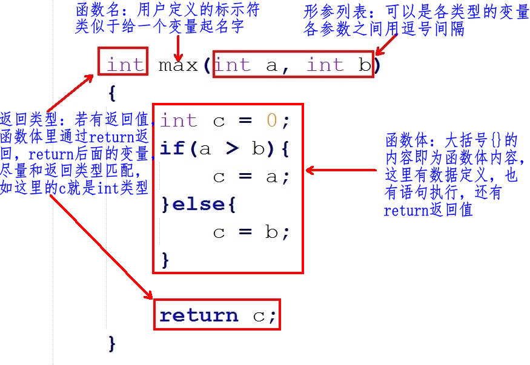
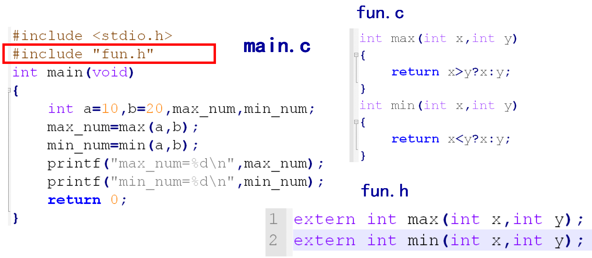

# 函数

---

## 概述

### 函数分类

C 程序是由函数组成的，C 代码都是由主函数 `main()` 开始执行的。函数是 C 程序的基本模块，是用于完成特定任务的程序代码单元

从函数定义的角度看，函数可分为系统函数和用户定义函数两种：

* 系统函数，即库函数：这是由编译系统提供的，用户不必自己定义这些函数，可以直接使用它们，如 `printf()`
* 用户定义函数：用以解决用户的专门需要

### 函数的作用

函数的使用可以省去重复代码的编写，降低代码重复率，提高程序模块化组织性

```c
#include <stdio.h>

// 求两数的最大值
int max(int a, int b)
{
    if (a > b)
    {
        return a;
    }
    else
    {
        return b;
    }
}

int main()
{
    // 操作 1
    // ...
    int a1 = 10, b1 = 20, c1 = 0;
    c1 = max(a1, b1); // 调用 max()

    printf("max(a1, b1) = %d\n", c1);

    // 操作 2
    // ...
    int a2 = 11, b2 = 21, c2 = 0;
    c2 = max(a2, b2); // 调用 max()

    printf("max(a2, b2) = %d\n", c2);

    /*
        max(a1, b1) = 20
        max(a2, b2) = 21
    */

    return 0;
}
```

* 函数可以让程序更加模块化，从而有利于程序的阅读，修改和完善

### 函数的调用

当调用函数时，需要关心 5 要素：

* 头文件：包含指定的头文件
* 函数名字：函数名字必须和头文件声明的名字一样
* 功能：需要知道此函数能干嘛后才调用
* 参数：参数类型要匹配
* 返回值：根据需要接收返回值

```c
#include <time.h>
time_t time(time_t *t);
```

* 功能：获取当前系统时间
* 参数：常设置为 `NULL`
* 返回值：当前系统时间，`time_t` 相当于 `long` 类型，单位为毫秒
 
```c
#include <stdlib.h>
void srand(unsigned int seed);
```

* 功能：用来设置 `rand()` 产生随机数时的随机种子
* 参数：如果每次 `seed` 相等，`rand()` 产生随机数相等
* 返回值：无

```c
#include <stdlib.h>
int rand(void);
```

* 功能：返回一个随机数值
* 参数：无
* 返回值：随机数

```c
#include <stdio.h>
#include <time.h>
#include <stdlib.h>

int main()
{
    time_t tm = time(NULL);  // 得到系统时间
    srand((unsigned int)tm); // 随机种子只需要设置一次即可

    int r = rand();
    printf("r = %d\n", r);

    // r = 1391819817

    return 0;
}
```

---

## 函数的定义

### 函数定义格式

函数定义的一般形式:

```c
返回类型 函数名(形式参数列表)
{
    数据定义部分;
	执行语句部分;
}
```



### 函数名字、形参、函数体、返回值

**函数名**

理论上是可以随意起名字，最好起的名字见名知意，应该让用户看到这个函数名字就知道这个函数的功能。注意，函数名的后面有个圆换号 `()`，代表这个为函数，不是普通的变量名

**形参列表**

在定义函数时指定的形参，在未出现函数调用时，它们并不占内存中的存储单元，因此称它们是形式参数或虚拟参数，简称形参，表示它们并不是实际存在的数据，所以，形参里的变量不能赋值

```c
void max(int a = 10, int b = 20) // error，形参不能赋值
{
}
```

在定义函数时指定的形参，必须是 `类型+变量` 的形式：

```c
// 1: right 类型+变量
void max(int a, int b)
{
}

// 2: error 只有类型，没有变量
void max(int, int)
{
}

// 3: error 只有变量，没有类型
int a, int b;
void max(a, b)
{
}
```

在定义函数时指定的形参，可有可无，根据函数的需要来设计，如果没有形参，圆括号内容为空，或写一个 `void` 关键字

```c
// 没形参，圆括号内容为空
void max()
{
}
 
// 没形参，圆括号内容为 void 关键字
void max(void)
{
}
```

**函数体**

花括号 `{}` 里的内容即为函数体的内容，这里为函数功能实现的过程

**返回值**

函数的返回值是通过函数中的 `return` 语句获得的，`return` 后面的值也可以是一个表达式

* 尽量保证 `return` 语句中表达式的值和函数返回类型是同一类型

```c
int max() // 函数的返回值为 int 类型
{
	int a = 10;
	return a; // 返回值 a 为 int 类型，函数返回类型也是 int，匹配
}
```

* 如果函数返回的类型和 `return` 语句中表达式的值不一致，则以函数返回类型为准，即函数返回类型决定返回值的类型。对数值型数据，可以自动进行类型转换

```c
double max() // 函数的返回值为 double 类型
{
	int a = 10;
	return a; // 返回值 a 为 int 类型，它会转为 double 类型再返回
}
```

注意：如果函数返回的类型和 `return` 语句中表达式的值不一致，而它又无法自动进行类型转换，程序则会报错

* `return` 语句的另一个作用为中断 `return` 所在的执行函数，类似于 `break` 中断循环、`switch` 语句一样

```c
int max()
{
	return 1; // 执行到，函数已经被中断，所以下面的 return 2 无法被执行到
	return 2; // 没有执行
}
```

* 如果函数带返回值，`return` 后面必须跟着一个值，如果函数没有返回值，函数名字的前面必须写一个 `void` 关键字，这时可以通过 `return` 中断函数(也可以不用)，只是这时，`return` 后面不带内容(分号 `;` 除外)

```c
void max() // 最好要有 void 关键字
{
	return; // 中断函数，这个可有可无
}
```

---

## 函数的调用

### 函数执行流程

```c
#include <stdio.h>

void print_test()
{
    printf("this is for test\n");
}

int main()
{
    print_test(); // print_test 函数的调用

    // this is for test

    return 0;
}
```

* 进入 `main()` 函数
* 调用 `print_test()` 函数：
    * 它会在 `main()` 函数的前寻找有没有一个名字叫 `print_test` 的函数定义
    * 如果找到，接着检查函数的参数，这里调用函数时没有传参，函数定义也没有形参，参数类型匹配
    * 开始执行 `print_test()` 函数，这时候，`main()` 函数里面的执行会阻塞(停)在 `print_test()` 这一行代码，等待 `print_test()` 函数的执行
* `print_test()` 函数执行完(这里打印一句话)，`main()` 才会继续往下执行，执行到 `return 0`，程序执行完毕

### 函数的形参和实参

* 形参出现在函数定义中，在整个函数体内都可以使用，离开该函数则不能使用
* 实参出现在主调函数中，进入被调函数后，实参也不能使用
* 实参变量对形参变量的数据传递是“值传递”，即单向传递，只由实参传给形参，而不能由形参传回来给实参
* 在调用函数时，编译系统临时给形参分配存储单元。调用结束后，形参单元被释放
* 实参单元与形参单元是不同的单元。调用结束后，形参单元被释放，函数调用结束返回主调函数后则不能再使用该形参变量。实参单元仍保留并维持原值。因此，在执行一个被调用函数时，形参的值如果发生改变，并不会改变主调函数中实参的值

### 无参函数调用

如果是调用无参函数，则不能加上“实参”，但括号不能省略

```c
#include <stdio.h>

// 函数的定义
void test()
{
    printf("ddd\n");
}

int main()
{
    // 函数的调用
    test();    // right 圆括号() 不能省略
    test(250); // error 函数调用中的参数太多

    /*
        ddd
        ddd
    */

    return 0;
}
```

注意：linux `gcc` 不报错

### 有参函数调用

* 如果实参表列包含多个实参，则各参数间用逗号隔开

```c
#include <stdio.h>

// 函数的定义
void test(int a, int b)
{
    printf("%d, %d\n", a, b);
}

int main()
{
    int p = 10, q = 20;
    test(p, q); // 函数的调用

    // 10, 20

    return 0;
}
```

* 实参与形参的个数应相等，类型应匹配(相同或赋值兼容)。实参与形参按顺序对应，一对一地传递数据
* 实参可以是常量、变量或表达式，无论实参是何种类型的量，在进行函数调用时，它们都必须具有确定的值，以便把这些值传送给形参。所以，这里的变量是在圆括号 `()` 外面定义好、赋好值的变量

```c
#include <stdio.h>

// 函数的定义
void test(int a, int b)
{
    printf("%d, %d\n", a, b);
}

int main()
{
    // 函数的调用
    int p = 10, q = 20;
    test(p, q);        // right
    test(11, 30 - 10); // right
    // test(int a, int b); // error 不应该在圆括号里定义变量，应输入表达式

    /*
        10, 20
        11, 20
    */

    return 0;
}
```

### 函数返回值

* 如果函数定义没有返回值，函数调用时不能写 `void` 关键字，调用函数时也不能接收函数的返回值

```c
#include <stdio.h>

// 函数的定义
void test()
{
    printf("ddd\n");
}

int main()
{
    // 函数的调用
    test();      // right
    void test(); // error，void 关键字只能出现在定义，不可能出现在调用的地方
    // int a = test();	// error，函数定义根本就没有返回值。"void" 类型的值不能用于初始化 "int" 类型的实体

    // ddd

    return 0;
}
```

linux `gcc` 对于 `void test();` 不视为错误，视为函数声明

* 如果函数定义有返回值，这个返回值根据需要可用可不用；假如要使用这个函数返回值，需定义一个匹配类型的变量来接收

```c
#include <stdio.h>

// 函数的定义，返回值为 int 类型
int test()
{
    printf("test\n");
}

int main()
{
    // 函数的调用
    int a = test(); // right，a 为 int 类型
    int b;
    b = test(); // right，和上面等级

    // 虽然调用成功，但没有意义， p 为 char *，函数返回值为 int，类型不匹配
    char *p = test();
    // warning: initialization of ‘char *’ from ‘int’ makes pointer from integer without a cast [-Wint-conversion]

    // error，必须定义一个匹配类型的变量来接收返回值
    // int只是类型，没有定义变量
    // int = test();

    // error，必须定义一个匹配类型的变量来接收返回值
    // int只是类型，没有定义变量
    int test();

    /*
        test
        test
        test
    */

    return 0;
}
```

linux `gcc` 对于 `int test();` 不视为错误，视为函数声明

---

## 函数的声明

如果使用用户自己定义的函数，而该函数与调用它的函数(即主调函数)不在同一文件中，或者函数定义的位置在主调函数之后，则必须在调用此函数之前对被调用的函数作声明

所谓函数声明，就是在函数尚在未定义的情况下，事先将该函数的有关信息通知编译系统，相当于告诉编译器，函数在后面定义，以便使编译能正常进行

注意：一个函数只能被定义一次，但可以声明多次

```c
#include <stdio.h>

int max(int x, int y); // 函数的声明，分号不能省略
// int max(int, int); // 另一种方式

int main()
{
    int a = 10, b = 25, num_max = 0;
    num_max = max(a, b); // 函数的调用

    printf("num_max = %d\n", num_max);

    // num_max = 25

    return 0;
}

// 函数的定义
int max(int x, int y)
{
    return x > y ? x : y;
}
```

函数定义和声明的区别：

* 定义是指对函数功能的确立，包括指定函数名、函数类型、形参及其类型、函数体等，它是一个完整的、独立的函数单位
* 声明的作用则是把函数的名字、函数类型以及形参的个数、类型和顺序(注意，不包括函数体)通知编译系统，以便在对包含函数调用的语句进行编译时，据此对其进行对照检查(例如函数名是否正确，实参与形参的类型和个数是否一致)

---

## main 函数与 exit 函数

在 `main` 函数中调用 `exit` 和 `return` 结果是一样的，但在子函数中调用 `return` 只是代表子函数终止了，在子函数中调用 `exit`，那么程序终止

```c
#include <stdio.h>
#include <stdlib.h>

void fun()
{
    printf("fun\n");
    // return;
    exit(0);
}

int main()
{
    fun();
    while (1)
        ;

    // fun

    return 0;
}
```

---

## 多文件(分文件)编程

### 分文件编程

* 把函数声明放在头文件 `xxx.h` 中，在主函数中包含相应头文件
* 在头文件对应的 `xxx.c` 中实现 `xxx.h` 声明的函数



`fun.h`，使用 `extern` 关键字声明函数

```h
extern int min(int x, int y);
extern int max(int x, int y);
```

`fun.c`

```c
int min(int x, int y)
{
    return x < y ? x : y;
}

int max(int x, int y)
{
    return x > y ? x : y;
}
```

`m.c`

```c
#include <stdio.h>
#include "fun.h"

int main()
{
    int num1 = 10, num2 = 12;

    int num_min = min(num1, num2);
    int num_max = max(num1, num2);

    printf("min(num1, num2) = %d\n", num_min);
    printf("max(num1, num2) = %d\n", num_max);

    /*
        min(num1, num2) = 10
        max(num1, num2) = 12
    */

    return 0;
}
```

### 防止头文件重复包含

当一个项目比较大时，往往都是分文件，这时候有可能不小心把同一个头文件 `include` 多次，或者头文件嵌套包含

`a.h` 中包含 `b.h`

```c
#include "b.h"
```

`b.h` 中包含 `a.h`

```c
#include "a.h"
```

`main.c` 中使用其中头文件

```c
#include <stdio.h>
#include "a.h"

int main()
{

    /*
        ...
        a.h:1:15: error: #include nested too deeply
        1 | #include "b.h"
        |
    */

    return 0;
}
```

为了避免同一个文件被 `include` 多次，C/C++ 中有两种方式，一种是 `#ifndef` 方式，一种是 `#pragma once` 方式

* 方法一

```c
#ifndef __SOMEFILE_H__
#define __SOMEFILE_H__
 
// 声明语句
 
#endif
```

* 方法二

```c
#pragma once
 
// 声明语句
```

---
