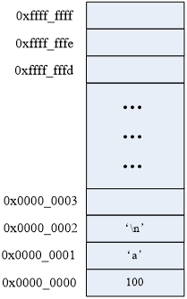
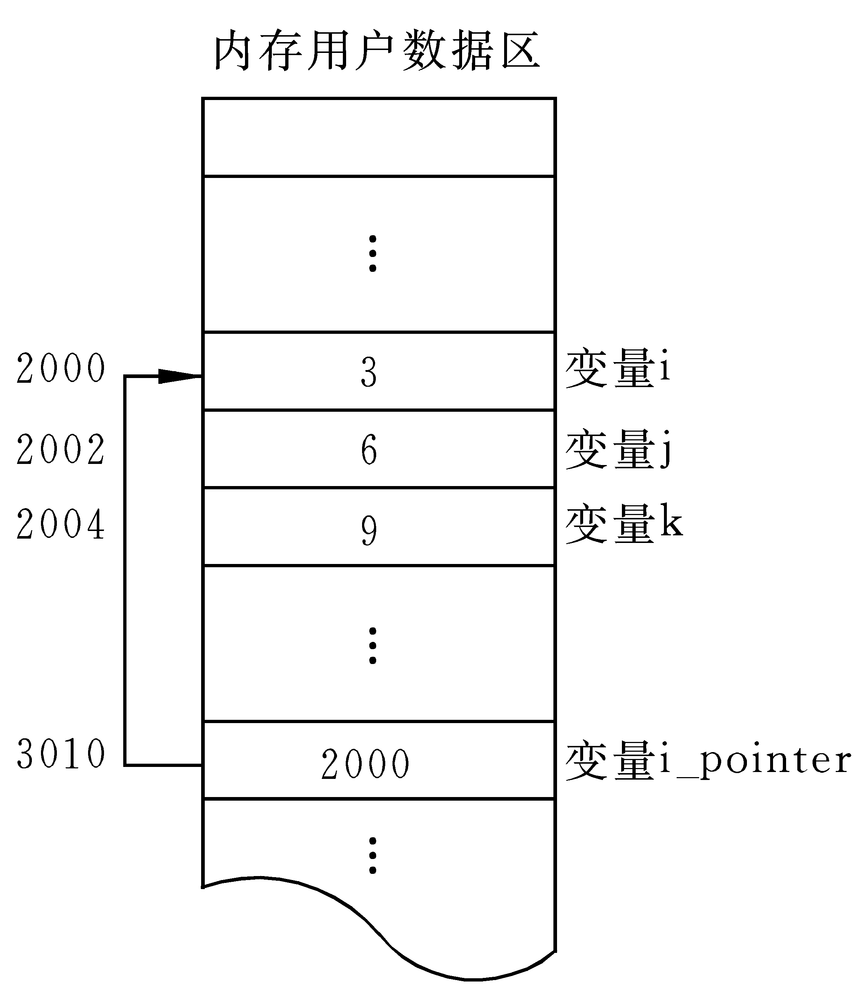

# 指针

---

## 概述

### 内存

内存含义：

* 存储器：计算机的组成中，用来存储程序和数据，辅助 CPU 进行运算处理的重要部分
* 内存：内部存贮器，暂存程序/数据—掉电丢失 SRAM、DRAM、DDR、DDR2、DDR3
* 外存：外部存储器，长时间保存程序/数据—掉电不丢 ROM、ERRROM、FLASH(NAND、NOR)、硬盘、光盘

内存是沟通 CPU 与硬盘的桥梁：

* 暂存放 CPU 中的运算数据
* 暂存与硬盘等外部存储器交换的数据

### 物理存储器和存储地址空间

有关内存的两个概念：物理存储器和存储地址空间

物理存储器：实际存在的具体存储器芯片

* 主板上装插的内存条
* 显示卡上的显示 RAM 芯片
* 各种适配卡上的 RAM 芯片和 ROM 芯片

存储地址空间：对存储器编码的范围。在软件上常说的内存是指这一层含义

* 编码：对每个物理存储单元(一个字节)分配一个号码
* 寻址：可以根据分配的号码找到相应的存储单元，完成数据的读写

### 内存地址

* 将内存抽象成一个很大的一维字符数组
* 编码就是对内存的每一个字节分配一个 32 位或 64 位的编号(与 32 位或者 64 位处理器相关)
* 这个内存编号称之为内存地址

内存中的每一个数据都会分配相应的地址：

* `char`: 占一个字节分配一个地址
* `int`: 占四个字节分配四个地址
* `float`、`struct`、函数、数组等



### 指针和指针变量

* 内存区的每一个字节都有一个编号，这就是“地址”
* 如果在程序中定义了一个变量，在对程序进行编译或运行时，系统就会给这个变量分配内存单元，并确定它的内存地址(编号)
* 指针的实质就是内存“地址”。指针就是地址，地址就是指针
* 指针是内存单元的编号，指针变量是存放地址的变量
* 通常叙述时会把指针变量简称为指针，实际含义并不一样



---

## 指针基础知识

### 指针变量的定义和使用

* 指针也是一种数据类型，指针变量也是一种变量
* 指针变量指向谁，就把谁的地址赋值给指针变量
* `*` 操作符操作的是指针变量指向的内存空间，指针的解引用，间接引用
* `*p`：将 `p` 变量的内容取出，当成地址看待，找到该地址对应的内存空间
    * 如果做左值：存数据到空间中
    * 如果做右值：取出空间中的内容

```c
#include <stdio.h>

int main()
{
    int a = 0;
    char b = 100;
    printf("%p, %p\n", &a, &b); // 打印 a, b 的地址

    // int * 代表是一种数据类型，int * 指针类型，p 才是变量名
    // 定义了一个指针类型的变量，可以指向一个 int 类型变量的地址
    int *p;
    p = &a;             // 将 a 的地址赋值给变量 p，p 也是一个变量，值是一个内存地址编号
    printf("%d\n", *p); // p 指向了 a 的地址，*p 就是 a 的值

    char *p1 = &b;
    printf("%c\n", *p1); // *p1 指向了 b 的地址，*p1 就是 b 的值

    /*
        0x7ffc536fcee4, 0x7ffc536fcee3
        0
        d
    */

    return 0;
}
```
注意：`&` 可以取得一个变量在内存中的地址。但是，不能取寄存器变量，因为寄存器变量不在内存里，而在 CPU 里面，所以是没有地址的

### 通过指针间接修改变量的值


```c
#include <stdio.h>

int main()
{
    int a = 0;
    int b = 11;
    int *p = &a;

    *p = 100;
    printf("a = %d, *p = %d\n", a, *p);

    p = &b;
    *p = 22;
    printf("b = %d, *p = %d\n", b, *p);

    /*
        a = 100, *p = 100
        b = 22, *p = 22
    */

    return 0;
}
```

### 指针大小

* 使用 `sizeof()` 测量指针的大小，得到的总是：4 或 8
* `sizeof()` 测的是指针变量指向存储地址的大小
* 32 位平台，所有的指针(地址)都是 32 位(4 字节)；64 位平台都是 64 位(8 字节)

```c
#include <stdio.h>

int main()
{
    int *p1;
    int **p2;
    char *p3;
    char **p4;
    printf("sizeof(p1) = %lu\n", sizeof(p1));
    printf("sizeof(p2) = %lu\n", sizeof(p2));
    printf("sizeof(p3) = %lu\n", sizeof(p3));
    printf("sizeof(p4) = %lu\n", sizeof(p4));
    printf("sizeof(double *) = %lu\n", sizeof(double *));

    /*
        sizeof(p1) = 8
        sizeof(p2) = 8
        sizeof(p3) = 8
        sizeof(p4) = 8
        sizeof(double *) = 8
    */

    return 0;
}
```

### 野指针和空指针

野指针：

* 没有一个有效的地址空间
* 存在一个地址，但该值不是可访问的内存区域

野指针不会直接引发错误，操作野指针指向的内存区域才会出问题

```c
#include <stdio.h>

int main()
{
    int a = 100;
    int *p;

    p = a; // 把 a 的值赋值给指针变量 p，p 为野指针，ok，不会有问题，但没有意义

    p = 0x12345678; // 给指针变量 p 赋值，p 为野指针，ok，不会有问题，但没有意义

    *p = 1000; // 操作野指针指向未知区域，内存出问题，err

    /*
        main.c: In function ‘main’:
        main.c:8:7: warning: assignment to ‘int *’ from ‘int’ makes pointer from integer without a cast [-Wint-conversion]
            8 |     p = a; // 把 a 的值赋值给指针变量 p，p 为野指针，ok，不会有问题，但没有意义
            |       ^
        main.c:10:7: warning: assignment to ‘int *’ from ‘int’ makes pointer from integer without a cast [-Wint-conversion]
        10 |     p = 0x12345678; // 给指针变量 p 赋值，p 为野指针，ok，不会有问题，但没有意义
            |       ^
        Segmentation fault
    */

    return 0;
}
```

但是，野指针和有效指针变量保存的都是数值，为了标志此指针变量没有指向任何变量(空闲可用)，C 语言中，可以把 `NULL` 赋值给此指针，这样就标志此指针为空指针，没有任何指针

```c
int *p = NULL;
```

`p` 所对应的存储空间一定是一个无效的访问区域

`NULL` 是一个值为 0 的宏常量：

```c
#define NULL ((void *)0)
```

### 万能指针 void *

`void *` 指针可以指向任意变量的内存空间，可以接收任意一种变量地址。但是，在使用**必须**借助“强转”具体化数据类型

```c
#include <stdio.h>

int main()
{
    void *p = NULL;

    int a = 10;
    p = (void *)&a; // 指向变量时，最好转换为 void *

    // 使用指针变量指向的内存时，转换为 int *
    *((int *)p) = 11;
    printf("a = %d\n", a);

    /*
        a = 11
    */

    return 0;
}
```

### const 修饰的指针变量

修饰指针：

* `const int *p;` 可以修改 `p`，不可以修改 `*p`
* `int const *p;` 同上
* `int * const p;` 可以修改 `*p`，不可以修改 `p`
* `const int *const p;`	不可以修改 `p`，不可以修改 `*p`

总结：`const` 向右修饰，被修饰的部分即为只读

常用：在函数形参内，用来限制指针所对应的内存空间为只读

```c
#include <stdio.h>

int main()
{
    int a = 100;
    int b = 200;

    // 指向常量的指针
    // 修饰 *，指针指向内存区域不能修改，指针指向可以变
    const int *p1 = &a; // 等价于 int const *p1 = &a;
    // *p1 = 111; //err
    p1 = &b; // ok

    // 指针常量
    // 修饰 p1，指针指向不能变，指针指向的内存可以修改
    int *const p2 = &a;
    // p2 = &b; // err
    *p2 = 222; // ok

    /*
     */

    return 0;
}
```

在编辑程序时，指针作为函数参数，如果不想修改指针对应内存空间的值，需要使用 `const` 修饰指针数据类型

---

## 指针和数组

### 数组名

数组名字是数组的首元素地址，但它是一个地址常量，指针是变量，可以用数组名给指针赋值

```c
#include <stdio.h>

int main()
{
    int a[] = {1, 2, 3, 4, 5, 6, 7, 8, 9};
    printf("a = %p\n", a);
    printf("&a[0] = %p\n", &a[0]);

    // a = 10; // err，数组名只是常量，表达式必须是可修改的左值

    /*
        a = 0x7ffd12f9b8b0
        &a[0] = 0x7ffd12f9b8b0
    */

    return 0;
}
```

### 指针操作数组元素

取数组元素

```c
int arr[] = {1,3, 5, 7, 8};
int *p = arr;  
```

就有 `arr[i] == *(arr+0) == p[0] == *(p+0)`


```c
#include <stdio.h>

int main()
{
    int a[] = {1, 2, 3, 4, 5, 6, 7, 8, 9};
    int i = 0;
    int n = sizeof(a) / sizeof(a[0]);

    for (i = 0; i < n; i++)
    {
        // printf("%d, ", a[i]);
        printf("%d, ", *(a + i));
    }
    printf("\n");

    int *p = a; // 定义一个指针变量保存 a 的地址
    for (i = 0; i < n; i++)
    {
        p[i] = 2 * i;
    }

    for (i = 0; i < n; i++)
    {
        printf("%d, ", *(p + i));
    }
    printf("\n");

    /*
        1, 2, 3, 4, 5, 6, 7, 8, 9,
        0, 2, 4, 6, 8, 10, 12, 14, 16,
    */

    return 0;
}
```

### 指针加减运算

数据类型对指针的作用：

* 间接引用：
    * 决定了从指针存储的地址开始，向后读取的字节数(与指针本身存储空间无关)
* 加减运算：
    * 决定了指针进行 +1/-1 操作向后加过的字节数

**加法运算**

* 指针计算不是简单的整数相加
* 如果是一个 `int *`，+1 的结果是增加一个 `int` 的大小
* 如果是一个 `char *`，+1 的结果是增加一个 `char` 大小

```c
#include <stdio.h>

int main()
{
    int a;
    int *p = &a;
    printf("%p\n", p);
    p += 2; // 移动了 2 个 int
    printf("%p\n", p);

    char b = 0;
    char *p1 = &b;
    printf("%p\n", p1);
    p1 += 2; // 移动了 2 个 char
    printf("%p\n", p1);

    /*
        0x7fffc3fe8044
        0x7fffc3fe804c
        0x7fffc3fe8043
        0x7fffc3fe8045
    */

    return 0;
}
```

通过改变指针指向操作数组元素

```c
#include <stdio.h>

int main()
{
    int a[] = {1, 2, 3, 4, 5, 6, 7, 8, 9};
    int i = 0;
    int n = sizeof(a) / sizeof(a[0]);

    int *p = a;
    for (i = 0; i < n; i++)
    {
        printf("%d, ", *p);
        p++;
    }
    printf("\n");

    /*
        1, 2, 3, 4, 5, 6, 7, 8, 9,
    */

    return 0;
}
```

**减法运算**

```c
#include <stdio.h>

int main()
{
    int a[] = {1, 2, 3, 4, 5, 6, 7, 8, 9};
    int i = 0;
    int n = sizeof(a) / sizeof(a[0]);

    int *p = a + n - 1;
    for (i = 0; i < n; i++)
    {
        printf("%d, ", *p);
        p--;
    }
    printf("\n");

    int arr[] = {1, 2, 3, 4};
    int *p1 = arr;
    int *p2 = &arr;

    printf("%p\n", p1);
    printf("%p\n", p2);

    printf("%p\n", arr);
    printf("%p\n", &arr);

    printf("%p\n", p1 + 1);
    printf("%p\n", p2 + 1);

    printf("%p\n", arr);
    printf("%p\n", &arr + 1);

    /*
        main.c: In function ‘main’:
        main.c:19:15: warning: initialization of ‘int *’ from incompatible pointer type ‘int (*)[4]’ [-Wincompatible-pointer-types]
        19 |     int *p2 = &arr;
            |               ^
        9, 8, 7, 6, 5, 4, 3, 2, 1,
        0x7ffec5a70110
        0x7ffec5a70110
        0x7ffec5a70110
        0x7ffec5a70110
        0x7ffec5a70114
        0x7ffec5a70114
        0x7ffec5a70110
        0x7ffec5a70120
    */

    return 0;
}
```

注意：

`&数组名 + 1`，加过一个数组的大小(数组元素个数 x `sizeof`(数组元素类型)或者 `sizeof`(数组名))

指针 +- 指针：

* 指针 + 指针：`error`
* 指针 - 指针：
    * 普通变量来说，语法允许，无实际意义
    * 数组来说：偏移过的元素个数

```c
#include <stdio.h>

int main()
{
    int a[] = {1, 2, 3, 4, 5, 6, 7, 8, 9};
    int *p2 = &a[2]; // 第 2 个元素地址
    int *p1 = &a[1]; // 第 1 个元素地址
    printf("p1 = %p, p2 = %p\n", p1, p2);

    int n1 = p2 - p1;           // n1 = 1
    int n2 = (int)p2 - (int)p1; // n2 = 4
    printf("n1 = %d, n2 = %d\n", n1, n2);

    /*
        main.c: In function ‘main’:
        main.c:11:14: warning: cast from pointer to integer of different size [-Wpointer-to-int-cast]
        11 |     int n2 = (int)p2 - (int)p1; // n2 = 4
            |              ^
        main.c:11:24: warning: cast from pointer to integer of different size [-Wpointer-to-int-cast]
        11 |     int n2 = (int)p2 - (int)p1; // n2 = 4
            |                        ^
        p1 = 0x7fffcfb4cce4, p2 = 0x7fffcfb4cce8
        n1 = 1, n2 = 4
    */

    return 0;
}
```


### 指针数组 

指针数组，它是数组，数组的每个元素都是指针类型。指针数组本质是一个二级指针，二维数组也是一个二级指针

```c
#include <stdio.h>

int main()
{
    // 指针数组
    int *p[3];
    int a = 1;
    int b = 2;
    int c = 3;
    int i = 0;

    p[0] = &a;
    p[1] = &b;
    p[2] = &c;

    for (i = 0; i < sizeof(p) / sizeof(p[0]); i++)
    {
        printf("%d, ", *(p[i]));
    }
    printf("\n");

    // 1, 2, 3,

    return 0;
}
```

---

## 多级指针 

* C 语言允许有多级指针存在，在实际的程序中一级指针最常用，其次是二级指针
* 二级指针就是指向一个一级指针变量地址的指针，三级指针基本用不着
* 多级指针，不能跳跃定义，`n` 级指针是 `n - 1` 级指针的地址


```c
int a = 10;
int *p = &a; // 一级指针
*p = 100; // *p 就是 a
 
int **q = &p;
// *q 就是 p
// **q 就是 a
 
int ***t = &q;
// *t 就是 q
// **t 就是 p
// ***t 就是 a
```

demo:

```c
int a = 0;

int *p = &a; // 一级指针是 变量的地址

int **pp = &p; // 二级指针是一级指针的地址

int ***ppp = &pp; // 三级指针是二级指针的地址	

int ****pppp = &ppp; // 四级指针是三级指针的地址

// ...
```

对应关系：

```c
ppp == &pp; // 三级指针

*ppp == pp == &p; // 二级指针

**ppp == *pp == p == &a; //	一级指针

***ppp == **pp == *p == a; // 普通整型变量

// ...
```

---

## 指针和函数

栈帧：

* 当函数调用时，系统会在 `stack` 空间上申请一块内存区域，用来供函数调用，主要存放形参和局部变量(定义在函数内部)
* 当函数调用结束，这块内存区域自动被释放(消失)

有传值和传址两种，指针与数组在函数参数和返回值方面有：

* 指针做函数参数，调用时，传有效的地址值
* 数组做函数参数，传递不再是整个数组，而是数组的首地址(一个指针)
* 指针做函数返回值，不能返回局部变量的地址值
* 数组做函数返回值，C 语言不允许这样做，只能写成指针形式

### 函数形参改变实参的值

```c
#include <stdio.h>

void swap1(int x, int y)
{
    int tmp;
    tmp = x;
    x = y;
    y = tmp;
    printf("x = %d, y = %d\n", x, y);
}

void swap2(int *x, int *y)
{
    int tmp;
    tmp = *x;
    *x = *y;
    *y = tmp;
}

int main()
{
    int a = 3;
    int b = 5;
    printf("a = %d, b = %d\n", a, b);

    swap1(a, b); // 值传递
    printf("a = %d, b = %d\n", a, b);

    a = 3;
    b = 5;
    printf("a = %d, b = %d\n", a, b);
    swap2(&a, &b); // 地址传递
    printf("a = %d, b = %d\n", a, b);

    /*
        a = 3, b = 5
        x = 5, y = 3
        a = 3, b = 5
        a = 3, b = 5
        a = 5, b = 3
    */

    return 0;
}
```

### 数组名做函数参数

数组名做函数参数，函数的形参会退化为指针：

```c
void BubbleSort(int arr[10]) == void BubbleSort(int arr[])  == void BubbleSort(int *arr);
```

传递不再是整个数组，而是数组的首地址

```c
#include <stdio.h>

void printArrary(int *a, int n)
{
    int i = 0;
    for (i = 0; i < n; i++)
    {
        printf("%d, ", a[i]);
    }
    printf("\n");
}

int main()
{
    int a[] = {1, 2, 3, 4, 5, 6, 7, 8, 9};
    int n = sizeof(a) / sizeof(a[0]);

    // 数组名做函数参数
    printArrary(a, n);

    // 1, 2, 3, 4, 5, 6, 7, 8, 9,

    return 0;
}
```

### 指针做为函数的返回值

```c
#include <stdio.h>

int a = 10;

int *getA()
{
    return &a;
}

int main()
{
    *(getA()) = 111;
    printf("a = %d\n", a);

    // a = 111

    return 0;
}
```

---

## 指针和字符串

* `char str1[] = {'h', 'i', '\0'};` 变量，可读可写
* `char str2[] = "hi";`	变量，可读可写
* `char *str3 = "hi";` 常量，只读
    * `str3` 变量中，存储的是字符串常量 `hi` 中首个字符 `h` 的地址值
    * `str3[1] = 'H';` // 错误
* `char *str4 = {'h', 'i', '\0'};` // 错误

当字符串(字符数组)，做函数参数时，不需要提供 2 个参数，因为每个字符串都有 `\0`

### 字符指针

```c
#include <stdio.h>

int main()
{
    char str[] = "hello world";
    char *p = str;
    *p = 'm';
    p++;
    *p = 'i';
    printf("%s\n", str);

    p = "mike jiang";
    printf("%s\n", p);

    char *q = "test";
    printf("%s\n", q);

    char str1[] = "hello world";

    char *cstr = "hello world";
    char *cstr2 = "hello world";

    printf("&str = %p\n", str);
    printf("&str1 = %p\n", str1);
    printf("&cstr = %p\n", cstr);
    printf("&cstr2 = %p\n", cstr2);

    /*
        millo world
        mike jiang
        test
        &str = 0x7ffe389dc530
        &str1 = 0x7ffe389dc53c
        &cstr = 0x561d96429014
        &cstr2 = 0x561d96429014
    */

    return 0;
}
```

### 字符指针做函数参数

```c
#include <stdio.h>

void mystrcat(char *dest, const char *src)
{
    int len1 = 0;
    int len2 = 0;
    while (dest[len1])
    {
        len1++;
    }
    while (src[len2])
    {
        len2++;
    }

    int i;
    for (i = 0; i < len2; i++)
    {
        dest[len1 + i] = src[i];
    }
}

int main()
{
    char dst[100] = "hello mike";
    char src[] = "123456";

    mystrcat(dst, src);
    printf("dst = %s\n", dst);

    // dst = hello mike123456

    return 0;
}
```

### const 修饰的指针变量

```c
#include <stdio.h>
#include <stdlib.h>
#include <string.h>

int main(void)
{
    // const 修饰一个变量为只读
    const int a = 10;
    // a = 100; // err

    // 指针变量，指针指向的内存，2 个不同概念
    char buf[] = "aklgjdlsgjlkds";

    // 从左往右看，跳过类型，看修饰哪个字符
    // 如果是 *， 说明指针指向的内存不能改变
    // 如果是指针变量，说明指针的指向不能改变，指针的值不能修改
    const char *p = buf;
    // 等价于上面 char const *p1 = buf;
    // p[1] = '2'; // err
    p = "agdlsjaglkdsajgl"; // ok

    char *const p2 = buf;
    p2[1] = '3';
    // p2 = "salkjgldsjaglk"; // err

    // p3 为只读，指向不能变，指向的内存也不能变
    const char *const p3 = buf;

    return 0;
}
```

### 指针数组做为 main 函数的形参

无参 `main` 函数：

```c
int main(void) == int main();
```

带参数的 `main` 函数:

```c
 int main(int argc, char *argv[]) == int main(int argc, char **argv);
```

* `main` 函数是操作系统调用的，第一个参数标明 `argc` 数组的成员数量，`argv` 数组的每个成员都是 `char *` 类型
* `argc` 表示给 `main` 函数传递的参数的总个数，程序名字本身算一个参数
* `argv` 是命令行参数的字符串数组，数组的每一个元素都是字符串 `char*` 

```c
#include <stdio.h>

// argc: 传参数的个数(包含可执行程序)
// argv：指针数组，指向输入的参数
int main(int argc, char *argv[])
{

    // 指针数组，它是数组，每个元素都是指针
    // char *a[] = {"aaaaaaa", "bbbbbbbbbb", "ccccccc"};
    int i = 0;

    printf("argc = %d\n", argc);
    for (i = 0; i < argc; i++)
    {
        printf("%s\n", argv[i]);
    }

    // ./main aaa bbb ccc

    /*
        argc = 4
        ./main
        aaa
        bbb
        ccc
    */

    return 0;
}
```

命令行中使用 `gcc` 编译生成可执行文件，如：`main`

```sh
./main abc xyz zhangsan lisi 
		-->
argc --- 5
./main -- argv[0]
abc -- argv[1]
xyz -- argv[2]
zhangsan -- argv[3]
lisi -- argv[4]
```

### 项目开发常用字符串应用模型

#### strstr 中的 while 和 do-while 模型

利用 `strstr` 标准库函数找出一个字符串中 `substr` 出现的个数


**while 模型**

```c
#include <stdio.h>
#include <stdlib.h>
#include <string.h>

int main(void)
{
    char *p = "11abcd111122abcd333abcd3322abcd3333322qqq";
    int n = 0;

    while ((p = strstr(p, "abcd")) != NULL)
    {
        // 能进来，肯定有匹配的子串
        // 重新设置起点位置
        p = p + strlen("abcd");
        n++;

        if (*p == 0) // 如果到结束符
        {
            break;
        }
    }

    printf("n = %d\n", n);

    // n = 4

    return 0;
}
```

**do-while 模型**

```c
#include <stdio.h>
#include <stdlib.h>
#include <string.h>

int main(void)
{
    char *p = "11abcd111122abcd333abcd3322abcd3333322qqq";
    int n = 0;

    do
    {
        p = strstr(p, "abcd");
        if (p != NULL)
        {
            n++; // 累计个数

            // 重新设置查找的起点
            p = p + strlen("abcd");
        }
        else // 如果没有匹配的字符串，跳出循环
        {
            break;
        }
    } while (*p != 0); // 如果没有到结尾

    printf("n = %d\n", n);

    // n = 4

    return 0;
}
```

#### 两头堵模型

求非空字符串元素的个数：

```c
#include <stdio.h>
#include <stdlib.h>
#include <string.h>
#include <ctype.h>

int fun(char *p, int *n)
{
    if (p == NULL || n == NULL)
    {
        return -1;
    }

    int begin = 0;
    int end = strlen(p) - 1;

    // 从左边开始
    // 如果当前字符为空，而且没有结束
    while (p[begin] == ' ' && p[begin] != 0)
    {
        begin++; // 位置从右移动一位
    }

    // 从右往左移动
    while (p[end] == ' ' && end > 0)
    {
        end--; // 往左移动
    }

    if (end == 0)
    {
        return -2;
    }

    // 非空元素个数
    *n = end - begin + 1;

    return 0;
}

int main(void)
{
    char *p = "      abcddsgadsgefg      ";
    int ret = 0;
    int n = 0;

    ret = fun(p, &n);
    if (ret != 0)
    {
        return ret;
    }
    printf("非空字符串元素个数：%d\n", n);

    // 非空字符串元素个数：14

    return 0;
}
```

#### 字符串反转模型(逆置)

```c
#include <stdio.h>
#include <stdlib.h>
#include <string.h>

int inverse(char *p)
{
    if (p == NULL)
    {
        return -1;
    }
    char *str = p;
    int begin = 0;
    int end = strlen(str) - 1;
    char tmp;

    while (begin < end)
    {
        // 交换元素
        tmp = str[begin];
        str[begin] = str[end];
        str[end] = tmp;

        begin++; // 往右移动位置
        end--;   // 往左移动位置
    }

    return 0;
}

int main(void)
{
    // char *str = "abcdefg"; // 文件常量区，内容不允许修改
    char str[] = "abcdef";

    int ret = inverse(str);
    if (ret != 0)
    {
        return ret;
    }

    printf("str ========== %s\n", str);

    // str ========== fedcba

    return 0;
}
```

### 字符串处理函数

这些字符串处理函数往往有一个通性，函数调用结束的返回值和存放结果的 `dest` 参数是一致的

#### strcpy()

```c
#include <string.h>
char *strcpy(char *dest, const char *src);
```

* 功能：把 `src` 所指向的字符串复制到 `dest` 所指向的空间中，`\0` 也会拷贝过去
* 参数：
    * `dest`：目的字符串首地址
    * `src`：源字符首地址
* 返回值：
	成功：返回 `dest` 字符串的首地址
	失败：`NULL`

注意：如果参数 `dest` 所指的内存空间不够大，可能会造成缓冲溢出的错误情况，字体上不安全

```c
#include <stdio.h>
#include <string.h>

int main(void)
{
    char dest[20] = "123456789012345678";
    printf("%s\n", dest);

    char src[] = "hello world";
    strcpy(dest, src);

    printf("%s\n", dest);

    for (int i = 0; i < sizeof(dest) / sizeof(char); i++)
    {
        printf("%c\n", dest[i]);
    }
    printf("\n");

    /*
        123456789012345678
        hello world
        h
        e
        l
        l
        o

        w
        o
        r
        l
        d

        3
        4
        5
        6
        7
        8


    */

    return 0;
}
```

#### strncpy()

```c
#include <string.h>
char *strncpy(char *dest, const char *src, size_t n);
```

* 功能：把 `src` 指向字符串的前 `n` 个字符复制到 `dest` 所指向的空间中，是否拷贝结束符看指定的长度是否包含 `\0`，默认不加 `\0`
    * `n > strlen(src)`: 只拷贝 `src` 的大小，添加 `\0`
    * `n < strlen(src)`: 只拷贝 `n` 字节大小，不添加 `\0`
* 参数：
    * `dest`：目的字符串首地址
    * `src`：源字符首地址
    * `n`：指定需要拷贝字符串个数
* 返回值：
	成功：返回 `dest` 字符串的首地址
	失败：`NULL`

```c
#include <stdio.h>
#include <string.h>

int main(void)
{
    char dest[20];
    char dest2[20];

    char src[] = "hello world";

    // \0 也拷贝过来了
    strncpy(dest, src, sizeof(src));
    printf("%s\n", dest);

    dest[5] = '\0';
    printf("%s\n", dest);


    strncpy(dest2, src, sizeof(src) - 2);
    printf("%s\n", dest2);

    dest2[sizeof(src) - 2] = '\0';
    printf("%s\n", dest2);

    /*
        hello world
        hello
        hello worl��V
        hello worl
    */

    return 0;
}
```

#### strcat()

```c
#include <string.h>
char *strcat(char *dest, const char *src);
```

* 功能：将 `src` 字符串连接到 `dest` 的尾部，`\0` 也会追加过去
* 参数：
    * `dest`：目的字符串首地址
	* `src`：源字符首地址
* 返回值：
    * 成功：返回 `dest` 字符串的首地址
	* 失败：`NULL`

```c
#include <stdio.h>
#include <string.h>

int main(void)
{
    char str[30] = "123";
    char src[30] = "hello world";
    printf("%s\n", strcat(str, src));
    printf("%s\n", strcat(src, str));

    /*
        123hello world
        hello world123hello world
    */

    return 0;
}
```

#### strncat()

```c
#include <string.h>
char *strncat(char *dest, const char *src, size_t n);
```

* 功能：将 `src` 字符串前 `n` 个字符连接到 `dest` 的尾部，`\0` 也会追加过去
* 参数：
    * `dest`：目的字符串首地址
    * `src`：源字符首地址
    * `n`：指定需要追加字符串个数
* 返回值：
    * 成功：返回 `dest` 字符串的首地址
    * 失败：`NULL`

```c
#include <stdio.h>
#include <string.h>

int main(void)
{
    char str[20] = "123";
    char *src = "hello world";
    printf("%s\n", strncat(str, src, 5));

    /*
        123hello
    */

    return 0;
}
```

#### strcmp()

```c
#include <string.h>
int strcmp(const char *s1, const char *s2);
```

* 功能：比较 `s1` 和 `s2` 的大小，比较的是字符 ASCII 码大小
* 参数：
    * `s1`：字符串1 首地址
    * `s2`：字符串2 首地址
* 返回值：
    * 相等：0
    * 大于：> 0 在不同操作系统 `strcmp` 结果会不同，返回 ASCII 差值
    * 小于：< 0

```c
#include <stdio.h>
#include <string.h>

int main(void)
{
    char *str1 = "hello world";
    char *str2 = "hello mike";

    int res = strcmp(str1, str2);

    if (res == 0)
    {
        printf("str1 == str2\n");
    }
    else if (res > 0)
    {
        printf("str1 > str2\n");
    }
    else
    {
        printf("str1 < str2\n");
    }

    /*
        str1 > str2
    */

    return 0;
}
```

#### strncmp()

```c
#include <string.h>
int strncmp(const char *s1, const char *s2, size_t n);
```

* 功能：比较 `s1` 和 `s2` 前 `n` 个字符的大小，比较的是字符 ASCII 码大小
* 参数：
    * `s1`：字符串1 首地址
	* `s2`：字符串2 首地址
	* `n`：指定比较字符串的数量
返回值：
	相等：0
	大于：> 0
	小于：< 0

```c
#include <stdio.h>
#include <string.h>

int main(void)
{
    char *str1 = "hello world";
    char *str2 = "hello mike";
    int res = strncmp(str1, str2, 5);

    if (res == 0)
    {
        printf("str1 == str2\n");
    }
    else if (res > 0)
    {
        printf("str1 > str2\n");
    }
    else
    {
        printf("str1 < str2\n");
    }

    /*
        str1 == str2
    */

    return 0;
}
```

#### sprintf()

```c
#include <stdio.h>
int sprintf(char *str, const char *format, ...);
```

* 功能：根据参数 `format` 字符串来转换并格式化数据，然后将结果输出到 `str` 指定的空间中，直到出现字符串结束符 `\0` 为止
* 参数：
    * `str`：字符串首地址
	* `format`：字符串格式，用法和 `printf()` 一样
* 返回值：
    * 成功：实际格式化的字符个数
    * 失败：-1

```c
#include <stdio.h>
#include <string.h>

int main(void)
{
    char dst[100] = {0};
    // char *dest = "123456789123456789123456789"; // Segmentation fault
    char dest[] = {'1', '2', '3', '4', '5', '6', '7', '8', '9', '1', '2', '3', '4', '5', '6', '7', '8', '9', '1', '2', '3', '4', '5', '6', '7', '8', '9'};

    int a = 10;
    char src[] = "hello world";
    printf("a = %d, src = %s", a, src);
    printf("\n");

    int len = sprintf(dst, "a = %d, src = %s", a, src);
    printf("dst = \" %s\"\n", dst);
    printf("len = %d\n", len);

    int l = sprintf(dest, "a = %d, src = %s", a, src);
    printf("dest = \" %s\"\n", dest);
    printf("len = %d\n", l);

    /*
        a = 10, src = hello world
        dst = " a = 10, src = hello world"
        len = 25
        dest = " a = 10, src = hello world"
        len = 25
    */

    return 0;
}
```

#### sscanf()

```c
#include <stdio.h>
int sscanf(const char *str, const char *format, ...);
```

* 功能：从 `str` 指定的字符串读取数据，并根据参数 `format` 字符串来转换并格式化数据
* 参数：
    * `str`：指定的字符串首地址
	* `format`：字符串格式，用法和 `scanf()` 一样
* 返回值：
    * 成功：参数数目，成功转换的值的个数
    * 失败：-1

```c
#include <stdio.h>
#include <string.h>

int main(void)
{
    char src[] = "a=10, b=20";
    int a;
    int b;
    sscanf(src, "a=%d,  b=%d", &a, &b);
    printf("a:%d, b:%d\n", a, b);

    /*
        a:10, b:20
    */

    return 0;
}
```

#### strchr()

```c
#include <string.h>
char *strchr(const char *s, int c);
```

* 功能：在字符串 `s` 中查找字母 `c` 出现的位置
* 参数：
    * `s`：字符串首地址
	* `c`：匹配字母(字符)
* 返回值：
    * 成功：返回第一次出现的 `c` 地址
    * 失败：`NULL`

```c
#include <stdio.h>
#include <string.h>

int main(void)
{
    char src[] = "ddda123abcd";
    char *p = strchr(src, 'a');
    printf("p = %s\n", p);

    /*
        p = a123abcd
    */

    return 0;
}
```

`strrchr()` 是自右向左，在字符串 `str` 中找一个字符出现的位置，并返回字符在字符串中的地址

#### strstr()

```c
#include <string.h>
char *strstr(const char *haystack, const char *needle);
```

* 功能：在字符串 `haystack` 中查找字符串 `needle` 第一次出现的位置
* 参数：
    * `haystack`：源字符串首地址
	* `needle`：匹配字符串首地址
* 返回值：
    * 成功：返回第一次出现的 `needle` 地址
    * 失败：`NULL`

```c
#include <stdio.h>
#include <string.h>

int main(void)
{
    char src[] = "ddddabcd123abcd333abcd";
    char *p = strstr(src, "abcd");
    printf("p = %s\n", p);

    /*
        p = abcd123abcd333abcd
    */

    return 0;
}
```

#### strtok()

```c
#include <string.h>
char *strtok(char *str, const char *delim);
```

* 功能：来将字符串分割成一个个片段。当 `strtok()` 在参数 `s` 的字符串中发现参数 `delim` 中包含的分割字符时，则会将该字符改为 `\0` 字符，当连续出现多个时只替换第一个为 `\0`
* 参数：
    * `str`：指向欲分割的字符串
	* `delim`：为分割字符串中包含的所有字符
* 返回值：
    * 成功：分割后字符串首地址
	* 失败：`NULL`

**注意**

* `strtok` 拆分字符串是直接在原串上操作，所以要求参1 必须可读可写
* 在第一次调用时：`strtok()` 必需给予参数 `s` 字符串
* 往后的调用则将参数 `s` 设置成 `NULL`，每次调用成功则返回指向被分割出片段的指针

```c
#include <stdio.h>
#include <string.h>

int main(void)
{
    char a[100] = "adc*fvcv.ebcy*hghbdfg$casdert";
    char *s = strtok(a, ".*$"); // 将 "*" 分割的子串取出
    while (s != NULL)
    {
        printf("%s\n", s);
        s = strtok(NULL, "*");
    }

    /*
        adc
        fvcv.ebcy
        hghbdfg$casdert
    */

    return 0;
}
```

#### atoi()

```c
#include <stdlib.h>
int atoi(const char *nptr);
```

* 功能：`atoi()` 会扫描 `nptr` 字符串，跳过前面的空格字符，直到遇到数字或正负号才开始做转换，而遇到非数字或字符串结束符 `\0` 才结束转换，并将结果返回返回值
* 参数：
    * `nptr`：待转换的字符串
* 返回值：成功转换后整数

错误使用：

```c
"abc123" --> 0;	
"12abc345" ---> 12;  
"123xyz" --> 123;
```

类似的函数有，当然必须要求原串是可转换的字符串：

* `atof()`：把一个小数形式的字符串转化为一个浮点数
* `atol()`：将一个字符串转化为 `long` 类型

```c
#include <stdio.h>
#include <stdlib.h>

int main(void)
{
    char str1[] = "          -10";
    int num1 = atoi(str1);
    printf("num1 = %d\n", num1);

    char str2[] = "0.123";
    double num2 = atof(str2);
    printf("num2 = %lf\n", num2);

    char str3[] = "123L";
    long num3 = atol(str3);
    printf("num3 = %ld\n", num3);

    /*
        num1 = -10
        num2 = 0.123000
        num3 = 123
    */

    return 0;
}
```

---

## 指针小结

| 定义 | 说明 | 
|:----:|:----:|
| `int i` | 定义整形变量 |
| `int *p` | 定义一个指向 `int` 的指针变量 |
| `int a[10]` | 定义一个有 10 个元素的数组，每个元素类型为 `int` |
| `int *p[10]` | 定义一个有 10 个元素的数组，每个元素类型为 `int*` |
| `int func()` | 定义一个函数，返回值为 `int` 型 |
| `int *func()` | 定义一个函数，返回值为 `int*` 型 |
| `int **p` | 定义一个指向 `int` 的指针的指针，二级指针 |

---
