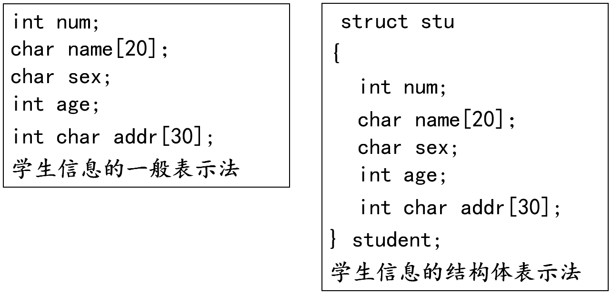
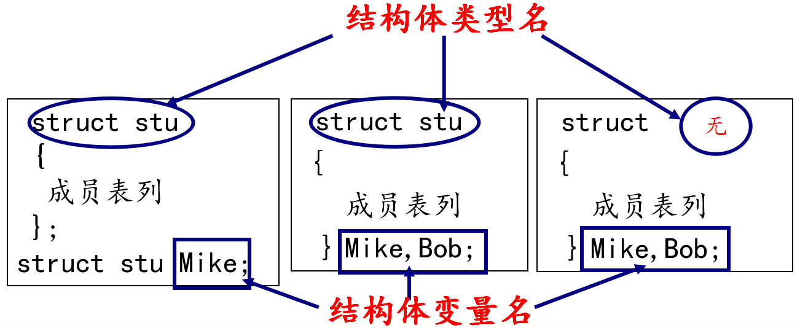
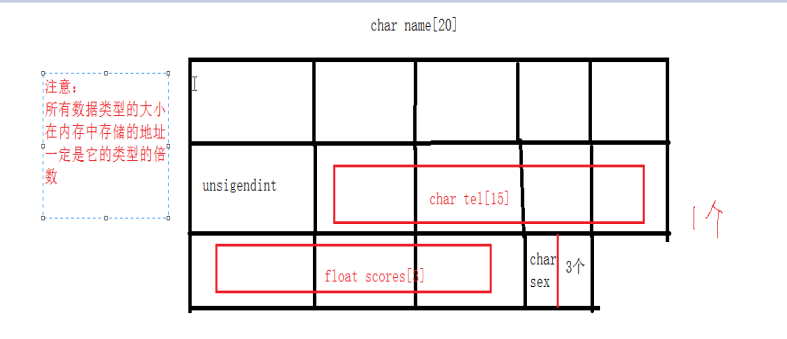
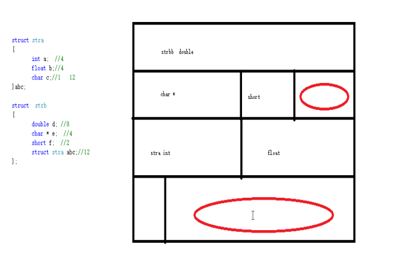
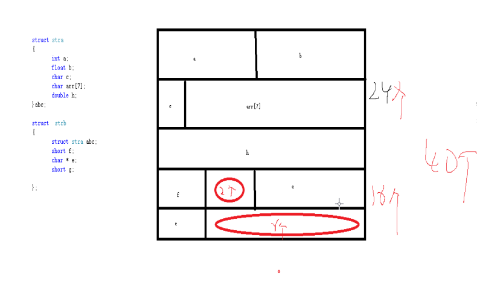
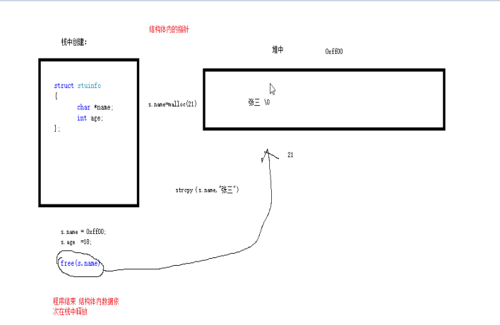
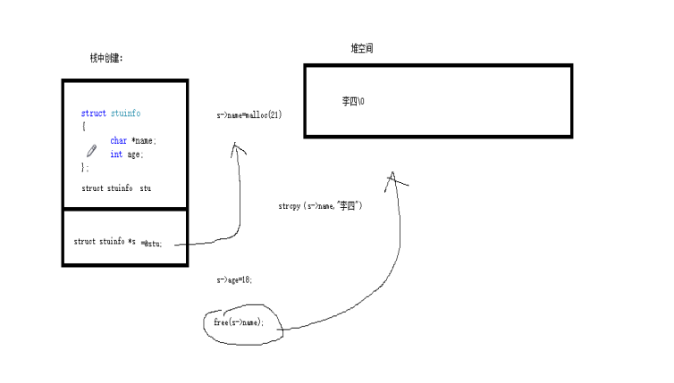
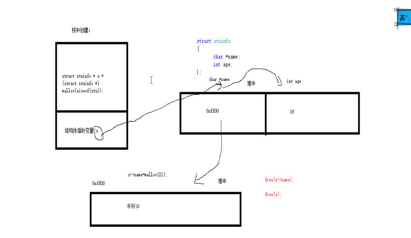

# 复合类型(自定义类型)

---

## 结构体

### 概述

数组：描述一组具有相同类型数据的有序集合，用于处理大量相同类型的数据运算

有时我们需要将不同类型的数据组合成一个有机的整体，如：一个学生有学号/姓名/性别/年龄/地址等属性。显然单独定义以上变量比较繁琐，数据不便于管理

C 语言中给出了另一种构造数据类型——结构体



也可以称为复合类型：


### 结构体变量的定义和初始化

定义结构体变量的方式：

* 先声明结构体类型再定义变量名
* 在声明类型的同时定义变量
* 直接定义结构体类型变量(无类型名)

```c
struct 结构体名称 
{
    结构体成员列表;    
};
```



结构体类型和结构体变量关系：

* 结构体类型：指定了一个结构体类型，它相当于一个模型，但其中并无具体数据，系统对之也不分配实际内存单元
* 结构体变量：系统根据结构体类型(内部成员状况)为之分配空间

定义结构体变量：

* `struct 结构体名称 结构体变量名`
* `结构体变量名.机构体成员列表 = 值`
* 如果是字符串类型，需要使用 `strcpy`

```c
#include <stdio.h>

// 结构体类型的定义
struct stu
{
    char name[50];
    int age;
};

// 定义类型同时定义变量
struct stu2
{
    char name[50];
    int age;
} s2 = {"lily", 22};

struct
{
    char name[50];
    int age;
} s3 = {"yuri", 25};

int main()
{
    // 先定义类型，再定义变量(常用)
    struct stu s1 = {"mike", 18};

    return 0;
}
```

### 结构体成员的使用

```c
#include <stdio.h>
#include <string.h>

// 结构体类型的定义
struct stu
{
    char name[50];
    int age;
};

int main()
{
    struct stu s1;

    // 如果是普通变量，通过点运算符操作结构体成员
    strcpy(s1.name, "abc");
    s1.age = 18;
    printf("s1.name = %s, s1.age = %d\n", s1.name, s1.age);

    // 如果是指针变量，通过 -> 操作结构体成员
    strcpy((&s1)->name, "test");
    (&s1)->age = 22;
    printf("(&s1)->name = %s, (&s1)->age = %d\n", (&s1)->name, (&s1)->age);

    /*
        s1.name = abc, s1.age = 18
        (&s1)->name = test, (&s1)->age = 22
    */

    return 0;
}
```

### 结构体大小和内存结构

结构体大小：结构体需要根据数据类型进行内存对齐

```c
#include <stdio.h>

struct stus
{
    char name[20];
    int age;
    char tel[15];
    float scores[3];
    char sex;
} stu;

int main()
{
    printf("%lu\n", sizeof(stu));

    /*
        56
    */

    return 0;
}
```

内存结构模型图：



注意：

* 所有数据类型的大小在内存中存储的资质一定是他的类型的倍数
* 写结构体位置根据数据类型从大到小的方式书写
* 有利于节省空间，不利于输出格式的阅读；利于输出格式的阅读，不利于节省空间；需要根据当时权重进行排列

结构体大小

* 模型图1



* 模型图2



注意下结构体嵌套结构体：


### 结构体数组

```c
#include <stdio.h>

// 统计学生成绩
struct stu
{
    int num;
    char name[20];
    char sex;
    float score;
};

int main()
{
    // 定义一个含有 5 个元素的结构体数组并将其初始化
    struct stu boy[5] = {
        {101, "Li ping", 'M', 45},
        {102, "Zhang ping", 'M', 62.5},
        {103, "He fang", 'F', 92.5},
        {104, "Cheng ling", 'F', 87},
        {105, "Wang ming", 'M', 58}};

    int i = 0;
    int c = 0;
    float ave, s = 0;
    for (i = 0; i < 5; i++)
    {
        s += boy[i].score; // 计算总分
        if (boy[i].score < 60)
        {
            c += 1; // 统计不及格人的分数
        }
    }

    printf("s = %f\n", s);                        // 打印总分数
    ave = s / 5;                                  // 计算平均分数
    printf("average = %f\ncount = %d\n", ave, c); // 打印平均分与不及格人数

    printf("message:\n");
    for (i = 0; i < 5; i++)
    {
        printf("name = %s, score = %f\n", boy[i].name, boy[i].score);
        // printf(" name=%s,  score=%f\n", (boy+i)->name, (boy+i)->score);
    }

    /*
        s = 345.000000
        average = 69.000000
        count = 2
        message:
        name = Li ping, score = 45.000000
        name = Zhang ping, score = 62.500000
        name = He fang, score = 92.500000
        name = Cheng ling, score = 87.000000
        name = Wang ming, score = 58.000000
    */

    return 0;
}
```

### 结构体套结构体

```c
#include <stdio.h>

struct person
{
    char name[20];
    char sex;
};

struct stu
{
    int id;
    struct person info;
};

int main()
{
    struct stu s[2] = {1, "lily", 'F', 2, "yuri", 'M'};

    int i = 0;
    for (i = 0; i < 2; i++)
    {
        printf("id = %d\tinfo.name = %s\tinfo.sex = %c\n", s[i].id, s[i].info.name, s[i].info.sex);
    }

    /*
        id = 1  info.name = lily        info.sex = F
        id = 2  info.name = yuri        info.sex = M
    */

    return 0;
}
```

### 结构体赋值

```c
#include <stdio.h>
#include <string.h>

// 结构体类型的定义
struct stu
{
    char name[50];
    int age;
};

int main()
{
    struct stu s1;

    // 如果是普通变量，通过点运算符操作结构体成员
    strcpy(s1.name, "abc");
    s1.age = 18;
    printf("s1.name = %s, s1.age = %d\n", s1.name, s1.age);
    printf("&s1 = %p\n", &s1);

    // 相同类型的两个结构体变量，可以相互赋值
    // 把 s1 成员变量的值拷贝给 s2 成员变量的内存
    // s1 和 s2 只是成员变量的值一样而已，它们还是没有关系的两个变量
    struct stu s2 = s1;
    // memcpy(&s2, &s1, sizeof(s1));
    printf("s2.name = %s, s2.age = %d\n", s2.name, s2.age);
    printf("&s2 = %p\n", &s2);

    /*
        s1.name = abc, s1.age = 18
        &s1 = 0x7ffea4c6f840
        s2.name = abc, s2.age = 18
        &s2 = 0x7ffea4c6f880
    */

    return 0;
}
```

### 结构体和指针

模型图：

* 结构体包含指针对应的空间



* 结构体指针



* 在堆中开辟结构体



**指向普通结构体变量的指针**

```c
#include <stdio.h>

// 结构体类型的定义
struct stu
{
    char name[50];
    int age;
};

int main()
{
    struct stu s1 = {"lily", 18};

    // 如果是指针变量，通过 -> 操作结构体成员
    struct stu *p = &s1;
    printf("p->name = %s, p->age = %d\n", p->name, p->age);
    printf("(*p).name = %s, (*p).age = %d\n", (*p).name, (*p).age);

    /*
        p->name = lily, p->age = 18
        (*p).name = lily, (*p).age = 18
    */

    return 0;
}
```

**堆区结构体变量**

```c
#include <stdio.h>
#include <string.h>
#include <stdlib.h>

// 结构体类型的定义
struct stu
{
    char name[50];
    int age;
};

int main()
{
    struct stu *p = NULL;

    p = (struct stu *)malloc(sizeof(struct stu));

    // 如果是指针变量，通过 -> 操作结构体成员
    strcpy(p->name, "test");
    p->age = 22;

    printf("p->name = %s, p->age = %d\n", p->name, p->age);
    printf("(*p).name = %s, (*p).age = %d\n", (*p).name, (*p).age);

    free(p);
    p = NULL;

    /*
        p->name = test, p->age = 22
        (*p).name = test, (*p).age = 22
    */

    return 0;
}
```

**结构体套一级指针**

```c
#include <stdio.h>
#include <string.h>
#include <stdlib.h>

// 结构体类型的定义
struct stu
{
    char *name; // 一级指针
    int age;
};

int main()
{
    struct stu *p = NULL;

    p = (struct stu *)malloc(sizeof(struct stu));

    p->name = malloc(strlen("test") + 1);
    strcpy(p->name, "test");
    p->age = 22;

    printf("p->name = %s, p->age = %d\n", p->name, p->age);
    printf("(*p).name = %s, (*p).age = %d\n", (*p).name, (*p).age);

    if (p->name != NULL)
    {
        free(p->name);
        p->name = NULL;
    }

    if (p != NULL)
    {
        free(p);
        p = NULL;
    }

    /*
        p->name = test, p->age = 22
        (*p).name = test, (*p).age = 22
    */

    return 0;
}
```

### 结构体做函数参数

**结构体普通变量做函数参数**

结构体做为形参，不会改变主函数中实参的值

```c
#include <stdio.h>
#include <string.h>

// 结构体类型的定义
struct stu
{
    char name[50];
    int age;
};

// 函数参数为结构体普通变量
void set_stu(struct stu tmp)
{
    strcpy(tmp.name, "mike");
    tmp.age = 18;
    printf("tmp.name = %s, tmp.age = %d\n", tmp.name, tmp.age);
}

int main()
{
    struct stu s = {0};
    set_stu(s); // 值传递
    printf("s.name = %s, s.age = %d\n", s.name, s.age);

    /*
        tmp.name = mike, tmp.age = 18
        s.name = , s.age = 0
    */

    return 0;
}
```

**结构体指针变量做函数参数**

结构体指针做为形参，发生改变

```c
#include <stdio.h>
#include <string.h>

// 结构体类型的定义
struct stu
{
    char name[50];
    int age;
};

// 函数参数为结构体指针变量
void set_stu_pro(struct stu *tmp)
{
    strcpy(tmp->name, "mike");
    tmp->age = 18;
}

int main()
{
    struct stu s = {0};
    set_stu_pro(&s); // 地址传递
    printf("s.name = %s, s.age = %d\n", s.name, s.age);

    // s.name = mike, s.age = 18

    return 0;
}
```

**结构体数组名做函数参数**

```c
#include <stdio.h>

// 结构体类型的定义
struct stu
{
    char name[50];
    int age;
};

// void set_stu_pro(struct stu tmp[100], int n)
// void set_stu_pro(struct stu tmp[], int n)
void set_stu_pro(struct stu *tmp, int n)
{
    int i = 0;
    for (i = 0; i < n; i++)
    {
        sprintf(tmp->name, "name%d%d%d", i, i, i);
        tmp->age = 20 + i;
        tmp++;
    }
}

int main()
{
    struct stu s[3] = {0};
    int i = 0;
    int n = sizeof(s) / sizeof(s[0]);
    set_stu_pro(s, n); // 数组名传递

    for (i = 0; i < n; i++)
    {
        printf("%s, %d\n", s[i].name, s[i].age);
    }

    /*
        name000, 20
        name111, 21
        name222, 22
    */

    return 0;
}
```

**const 修饰结构体指针形参变量**

```c
#include <stdio.h>

// 结构体类型的定义
struct stu
{
    char name[50];
    int age;
};

void fun1(struct stu *const p)
{
    // p = NULL; // err
    p->age = 10; // ok
}

// void fun2(struct stu const* p)
void fun2(const struct stu *p)
{
    p = NULL; // ok
    // p->age = 10; // err
}

void fun3(const struct stu *const p)
{
    // p = NULL; // err
    // p->age = 10; // err
}

int main()
{
    /*
     */

    return 0;
}
```

---

## 共用体(联合体)

* 联合 `union` 是一个能在同一个存储空间存储不同类型数据的类型

```c
union 共用体名称
{
    成员列表 共用体变量名;
};  
```

* 联合体所占的内存长度等于其最长成员的长度倍数，也有叫做共用体
* 同一内存段可以用来存放几种不同类型的成员，但每一瞬时只有一种起作用
* 共用体变量中起作用的成员是最后一次存放的成员，在存入一个新的成员后原有的成员的值会被覆盖
* 共用体变量的地址和它的各成员的地址都是同一地址

```c
#include <stdio.h>

// 共用体也叫联合体
union Test
{
    unsigned char a;
    unsigned int b;
    unsigned short c;
};

int main()
{
    // 定义共用体变量
    union Test tmp;

    // 1、所有成员的首地址是一样的
    printf("%p, %p, %p\n", &(tmp.a), &(tmp.b), &(tmp.c));

    // 2、共用体大小为最大成员类型的大小
    printf("%lu\n", sizeof(union Test));

    // 3、一个成员赋值，会影响另外的成员
    // 左边是高位，右边是低位
    // 低位放低地址，高位放高地址
    tmp.b = 0x44332211;

    printf("%x\n", tmp.a); // 11
    printf("%x\n", tmp.c); // 2211

    tmp.a = 0x00;
    printf("short: %x\n", tmp.c); // 2200
    printf("int: %x\n", tmp.b);   // 44332200

    /*
        0x7ffef9aacd34, 0x7ffef9aacd34, 0x7ffef9aacd34
        4
        11
        2211
        short: 2200
        int: 44332200
    */

    return 0;
}
```

---

## 枚举

枚举：将变量的值一一列举出来，变量的值只限于列举出来的值的范围内

枚举类型定义：

```c
enum 枚举名
{
	枚举值表;
};
```

* 在枚举值表中应列出所有可用值，也称为枚举元素
* 枚举值是常量，不能在程序中用赋值语句再对它赋值
* 举元素本身由系统定义了一个表示序号的数值从 0 开始顺序定义为 0，1，2 ...

```c
#include <stdio.h>

enum weekday
{
    sun = 2,
    mon,
    tue,
    wed,
    thu,
    fri,
    sat
};

enum bool
{
    flase,
    true
};

int main()
{
    enum weekday a, b, c;
    a = sun;
    b = mon;
    c = tue;
    printf("%d, %d, %d\n", a, b, c);

    enum bool flag;
    flag = true;

    if (flag == 1)
    {
        printf("flag 为真\n");
    }

    /*
        2, 3, 4
        flag 为真
    */

    return 0;
}
```

应用方向：流程化操作，枚举与 `switch` 联合使用

---

## typedef

`typedef` 为 C 语言的关键字，作用是为一种数据类型(基本类型或自定义数据类型)定义一个新名字，不能创建新类型

与 `#define` 不同，`typedef` 仅限于数据类型，而不是能是表达式或具体的值 `#define` 发生在预处理，`typedef` 发生在编译阶段

```c
#include <stdio.h>

typedef int INT;
typedef char BYTE;
typedef BYTE T_BYTE;
typedef unsigned char UBYTE;

typedef struct type
{
    UBYTE a;
    INT b;
    T_BYTE c;
} TYPE, *PTYPE;

int main()
{
    TYPE t;
    t.a = 254;
    t.b = 10;
    t.c = 'c';

    PTYPE p = &t;
    printf("%u, %d, %c\n", p->a, p->b, p->c);

    // 254, 10, c

    return 0;
}
```

---
