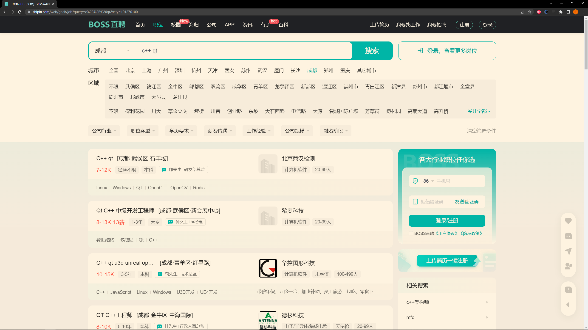

# Qt 概述

---

##  什么是 Qt

Qt 是一个跨平台的 C++ 图形用户界面应用程序框架。它为应用程序开发者提供建立艺术级图形界面所需的所有功能。它是完全面向对象的，很容易扩展，并且允许真正的组件编程

---

## Qt 的发展史

* 1991 年，Qt 最早由奇趣科技开发
* 1996 年，进入商业领域，它也是目前流行的 Linux 桌面环境 KDE 的基础
* 2008 年，奇趣科技被诺基亚公司收购，Qt 称为诺基亚旗下的编程语言
* 2012 年，Qt 又被 Digia 公司收购
* 2014 年 4 月，跨平台的集成开发环境 Qt Creator3.1.0 发布，同年 5 月 20 日发布了 Qt5.3 正式版，至此 Qt 实现了对 iOS、Android、WP 等各平台的全面支持

当前最新版本为 6.3.1

本教程使用的版本为 5.14.1

---

## 支持的平台

* Windows 系列
* Unix，Linux，X11
* Mac OS
* 嵌入式 – 有帧缓冲支持的嵌入式 Linux 平台，Windows CE
* Android，IOS

---

##  Qt 版本

Qt 按照不同的版本发行，分为商业版和开源版

* 商业版。为商业软件提供开发，他们提供传统商业软件发行版，并且提供在商业有效期内的免费升级和技术支持服务
* 开源的 LGPL 版本。为了开发自有而设计的开放源码软件，它提供了和商业版本同样的功能，在 GNU 通用公共许可下，它是免费的

本教程使用的是开源版

---

## Qt 下载与安装

下载地址:

[https://download.qt.io/](https://download.qt.io/)

默认安装，根据实际情况选择组件

* Qt 对不同的平台提供了不同版本的安装包，可根据实际情况自行下载安装，本文档使用 `qt-opensource-windows-x86-5.14.2.exe` 版本

---

## Qt 优点

* 跨平台，几乎支持所有的平台
* 接口简单，容易上手，学习 QT 框架对学习其他框架有参考意义 
* 一定程度上简化了内存回收机制 
* 开发效率高，能够快速的构建应用程序
* 有很好的社区氛围，市场份额在缓慢上升
* 可以进行嵌入式开发

---

## 成功案例

* Linux 桌面环境 KDE
* WPS Office 办公软件
* Skype 网络电话
* Google Earth 谷歌地图
* VLC 多媒体播放器
* VirtualBox 虚拟机
* ...

---
