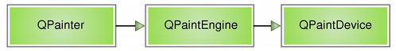
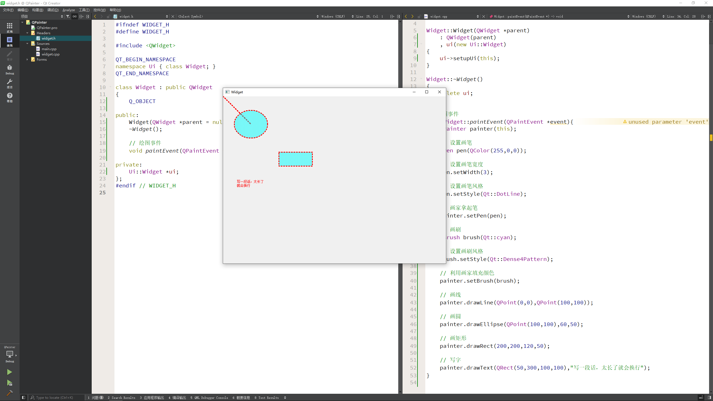
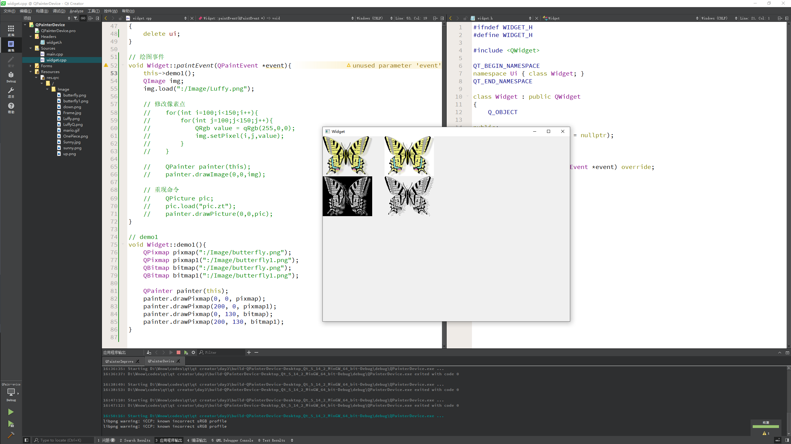

# 绘图和绘图设备

---

## QPainter

Qt 的绘图系统允许使用相同的 API 在屏幕和其它打印设备上进行绘制。整个绘图系统基于 `QPainter`，`QPainterDevice` 和 `QPaintEngine` 三个类

* `QPainter` 用来执行绘制的操作
* `QPaintDevice` 是一个二维空间的抽象，这个二维空间允许 `QPainter` 在其上面进行绘制，也就是 `QPainter` 工作的空间
* `QPaintEngine` 提供了画笔 `QPainter` 在不同的设备上进行绘制的统一的接口
    * `QPaintEngine` 类应用于 `QPainter` 和 `QPaintDevice` 之间，通常对开发人员是透明的。除非你需要自定义一个设备，否则你是不需要关心 `QPaintEngine` 这个类的。可以把 `QPainter`理解成画笔
    * 把 `QPaintDevice` 理解成使用画笔的地方，比如纸张、屏幕等
    * 而对于纸张、屏幕而言，肯定要使用不同的画笔绘制，为了统一使用一种画笔，设计了 `QPaintEngine` 类，这个类让不同的纸张、屏幕都能使用一种画笔

下图给出了这三个类之间的层次结构:



上面的示意图告诉我们，Qt 的绘图系统实际上是，使用 `QPainter` 在 `QPainterDevice` 上进行绘制，它们之间使用 `QPaintEngine` 进行通讯(也就是翻译 `QPainter` 的指令)

下面通过一个实例来介绍 `QPainter` 的使用：

`widget.h`

```h
#ifndef WIDGET_H
#define WIDGET_H

#include <QWidget>

QT_BEGIN_NAMESPACE
namespace Ui { class Widget; }
QT_END_NAMESPACE

class Widget : public QWidget
{
    Q_OBJECT

public:
    Widget(QWidget *parent = nullptr);
    ~Widget();

    // 绘图事件
    void paintEvent(QPaintEvent *event) override;

private:
    Ui::Widget *ui;
};
#endif // WIDGET_H
```

注意我们重写了 `QWidget` 的 `paintEvent()` 函数。接下来就是 `PaintedWidget` 的源代码：

`widget.cpp`

```cpp
#include "widget.h"
#include "ui_widget.h"
#include <QPainter>

Widget::Widget(QWidget *parent)
    : QWidget(parent)
    , ui(new Ui::Widget)
{
    ui->setupUi(this);
}

Widget::~Widget()
{
    delete ui;
}

// 绘图事件
void Widget::paintEvent(QPaintEvent *event){
    QPainter painter(this);

    // 设置画笔
    QPen pen(QColor(255,0,0));

    // 设置画笔宽度
    pen.setWidth(3);

    // 设置画笔风格
    pen.setStyle(Qt::DotLine);

    // 画家拿起笔
    painter.setPen(pen);

    // 画刷
    QBrush brush(Qt::cyan);

    // 设置画刷风格
    brush.setStyle(Qt::Dense4Pattern);

    // 利用画家填充颜色
    painter.setBrush(brush);

    // 画线
    painter.drawLine(QPoint(0,0),QPoint(100,100));

    // 画圆
    painter.drawEllipse(QPoint(100,100),60,50);

    // 画矩形
    painter.drawRect(200,200,120,50);

    // 写字
    painter.drawText(QRect(50,300,100,100),"写一段话，太长了就会换行");
}
```

在构造函数中，`paintEvent()` 函数是绘制的代码。首先，我们在栈上创建了一个 `QPainter` 对象，也就是说，每次运行 `paintEvent()` 函数的时候，都会重建这个 `QPainter` 对象。注意，这一点可能会引发某些细节问题：由于我们每次重建 `QPainter`，因此第一次运行时所设置的画笔颜色、状态等，第二次再进入这个函数时就会全部丢失。有时候我们希望保存画笔状态，就必须自己保存数据，否则的话则需要将 `QPainter` 作为类的成员变量

`QPainter` 接收一个 `QPaintDevice` 指针作为参数。`QPaintDevice` 有很多子类，比如 `QImage`，以及 `QWidget`。注意回忆一下，`QPaintDevice` 可以理解成要在哪里去绘制，而现在我们希望画在这个组件，因此传入的是 `this` 指针

`QPainter` 有很多以 `draw` 开头的函数，用于各种图形的绘制，比如这里的 `drawLine()`，`drawRect()` 以及 `drawEllipse()` 等。当绘制轮廓线时，使用 `QPainter` 的 `pen()` 属性

效果如下:



接下来看一下绘图方面的高级设置，代码如下

`widget.h`

```c
#ifndef WIDGET_H
#define WIDGET_H

#include <QWidget>

QT_BEGIN_NAMESPACE
namespace Ui { class Widget; }
QT_END_NAMESPACE

class Widget : public QWidget
{
    Q_OBJECT

public:
    Widget(QWidget *parent = nullptr);
    ~Widget();

    // 坐标
    int pos;

    // 绘图事件
    void paintEvent(QPaintEvent *event) override;

private:
    Ui::Widget *ui;
};
#endif // WIDGET_H
```

`widget.cpp`

```c
#include "widget.h"
#include "ui_widget.h"
#include <QPainter>

Widget::Widget(QWidget *parent)
    : QWidget(parent)
    , ui(new Ui::Widget)
{
    ui->setupUi(this);

    this->pos=0;
    // 点击移动按钮，移动图片
    this->connect(ui->pushButton,&QPushButton::clicked,[=](){
        this->pos+=20;

        // 手动调用绘图事件
        this->update();
    });
}

Widget::~Widget()
{
    delete ui;
}

// 绘图事件
void Widget::paintEvent(QPaintEvent *event){
    // 高级设置
    QPainter painter(this);

    //    painter.drawEllipse(QPoint(100,100),50,50);

    // 设置抗锯齿效果，效率稍微低
    //    painter.setRenderHint(QPainter::Antialiasing);

    //    painter.drawEllipse(QPoint(300,300),50,50);

    //    painter.drawRect(QRect(20,20,50,50));

    // 移动画家
    //    painter.translate(100,0);

    // 保存画家状态(100,0)
    //    painter.save();

    //    painter.drawRect(QRect(20,20,50,50));

    //    painter.translate(100,0);

    // 取出画家状态(100,0)
    //    painter.restore();

    //    painter.drawRect(QRect(20,20,50,50));

    // 画资源图片

    // 如果超出屏幕，强制回到起点
    if(this->pos > this->width()){
        this->pos=0;
    }
    painter.drawPixmap(this->pos,40,QPixmap(":/Image/Luffy.png"));

}
```

---

## 绘图设备

绘图设备是指继承 `QPainterDevice` 的子类。Qt 提供了很多这样的类，例如 `QPixmap`、`QBitmap`、`QImage` 和 `QPicture`。其中

* `QPixmap` 专门为图像在屏幕上的显示做了优化
* `QBitmap` 是 `QPixmap` 的一个子类，它的色深限定为 1，可以使用 `QPixmap` 的 `isQBitmap()` 函数来确定这个 `QPixmap` 是不是一个 `QBitmap`
* `QImage` 专门为图像的像素级访问做了优化 
* `QPicture` 则可以记录和重现 `QPainter` 的各条命令

### QPixmap、QBitmap、QImage

`QPixmap` 继承了 `QPaintDevice`，因此，可以使用 `QPainter` 直接在上面绘制图形

`QPixmap` 也可以接受一个字符串作为一个文件的路径来显示这个文件，比如你想在程序之中打开 `png、jpeg` 之类的文件，就可以使用 `QPixmap`。使用 `QPainter` 的 `drawPixmap()` 函数可以把这个文件绘制到一个 `QLabel`、`QPushButton` 或者其他的设备上面。`QPixmap` 是针对屏幕进行特殊优化的，因此，它与实际的底层显示设备息息相关。注意，这里说的显示设备并不是硬件，而是操作系统提供的原生的绘图引擎。所以，在不同的操作系统平台下，`QPixmap` 的显示可能会有所差别

`QBitmap` 继承自 `QPixmap`，因此具有 `QPixmap` 的所有特性，提供单色图像。`QBitmap` 的色深始终为 1. 色深这个概念来自计算机图形学，是指用于表现颜色的二进制的位数。计算机里面的数据都是使用二进制表示的。为了表示一种颜色也会使用二进制。比如要表示 8 种颜色，需要用 3 个二进制位，这时色深是 3. 因此，所谓色深为 1，也就是使用 1 个二进制位表示颜色。1 个位只有两种状态：0 和 1，因此它所表示的颜色就有两种，黑和白。所以说，`QBitmap` 实际上是只有黑白两色的图像数据

由于 `QBitmap` 色深小，因此只占用很少的存储空间，所以适合做光标文件和笔刷

下面来看同一个图像文件在 `QPixmap` 和 `QBitmap` 下的不同表现：

```cpp
// 绘图事件
void Widget::paintEvent(QPaintEvent *event){
    this->demo1();
}

// demo1
void Widget::demo1(){
    QPixmap pixmap(":/Image/butterfly.png");
    QPixmap pixmap1(":/Image/butterfly1.png");
    QBitmap bitmap(":/Image/butterfly.png");
    QBitmap bitmap1(":/Image/butterfly1.png");

    QPainter painter(this);
    painter.drawPixmap(0, 0, pixmap);
    painter.drawPixmap(200, 0, pixmap1);
    painter.drawPixmap(0, 130, bitmap);
    painter.drawPixmap(200, 130, bitmap1);
}
```



这里给出了两张 png 图片。`butterfly1.png` 是没有透明色的纯白背景，而 `butterfly.png` 是具有透明色的背景。我们分别使用 `QPixmap` 和 `QBitmap` 来加载它们。注意看它们的区别：白色的背景在 `QBitmap` 中消失了，而透明色在 `QBitmap` 中转换成了黑色；其他颜色则是使用点的疏密程度来体现的

`QPixmap` 使用底层平台的绘制系统进行绘制，无法提供像素级别的操作，而 `QImage` 则是使用独立于硬件的绘制系统，实际上是自己绘制自己，因此提供了像素级别的操作，并且能够在不同系统之上提供一个一致的显示形式

我们声明了一个 `QImage` 对象，大小是 300 x 300，颜色模式是 RGB32，即使用 32 位数值表示一个颜色的 RGB 值，也就是说每种颜色使用 8 位。然后我们对每个像素进行颜色赋值，从而构成了这个图像。我们可以把 `QImage` 想象成一个 RGB 颜色的二维数组，记录了每一像素的颜色

```cpp
void PaintWidget::paintEvent(QPaintEvent *)
{
    QPainter painter(this);
    QImage image(300, 300, QImage::Format_RGB32);
    QRgb value;

    // 将图片背景填充为白色
    image.fill(Qt::white);

    // 改变指定区域的像素点的值
    for(int i=50; i<100; ++i)
    {
        for(int j=50; j<100; ++j)
        {
            value = qRgb(255, 0, 0); // 红色
            image.setPixel(i, j, value);
        }
    }

    // 将图片绘制到窗口中
    painter.drawImage(QPoint(0, 0), image);
}
```

`QImage` 与 `QPixmap` 的区别

* `QPixmap` 主要是用于绘图，针对屏幕显示而最佳化设计，`QImage` 主要是为图像 I/O、图片访问和像素修改而设计的
* `QPixmap` 依赖于所在的平台的绘图引擎，故例如反锯齿等一些效果在不同的平台上可能会有不同的显示效果，`QImage` 使用 Qt 自身的绘图引擎，可在不同平台上具有相同的显示效果
* 由于 `QImage` 是独立于硬件的，也是一种 `QPaintDevice`，因此我们可以在另一个线程中对其进行绘制，而不需要在 GUI 线程中处理，使用这一方式可以很大幅度提高 UI 响应速度
* `QImage` 可通过 `setPixpel()` 和 `pixel()` 等方法直接存取指定的像素

`QImage` 与 `QPixmap` 之间的转换:

* `QImage` 转 `QPixmap`

使用 `QPixmap` 的静态成员函数: `fromImage()`

```cpp
QPixmap	fromImage(const QImage & image, Qt::ImageConversionFlags flags = Qt::AutoColor);
```

* `QPixmap` 转 `QImage`:

使用 `QPixmap` 类的成员函数: `toImage()`

```c
QImage toImage() const
```

### QPicture

最后一个需要说明的是 `QPicture`。这是一个可以记录和重现 `QPainter` 命令的绘图设备

`QPicture` 将 `QPainter` 的命令序列化到一个 IO 设备，保存为一个平台独立的文件格式。这种格式有时候会是元文件(`meta-files`)。Qt 的这种格式是二进制的，不同于某些本地的元文件，Qt 的 pictures 文件没有内容上的限制，只要是能够被 `QPainter` 绘制的元素，不论是字体还是 `pixmap`，或者是变换，都可以保存进一个 picture 中

`QPicture` 是平台无关的，因此它可以使用在多种设备之上，比如 svg、pdf、ps、打印机或者屏幕。回忆下这里所说的 `QPaintDevice`，实际上是说可以有 `QPainter` 绘制的对象。`QPicture` 使用系统的分辨率，并且可以调整 `QPainter` 来消除不同设备之间的显示差异

如果要记录下 `QPainter` 的命令，首先要使用 `QPainter::begin()` 函数，将 `QPicture` 实例作为参数传递进去，以便告诉系统开始记录，记录完毕后使用 `QPainter::end()` 命令终止。代码示例如下：

```cpp
void PaintWidget::paintEvent(QPaintEvent *)
{
    QPicture pic;
    QPainter painter;
    // 将图像绘制到QPicture中,并保存到文件
    painter.begin(&pic);
    painter.drawEllipse(20, 20, 100, 50);
    painter.fillRect(20, 100, 100, 100, Qt::red);
    painter.end();
    pic.save("drawing.pic");

    // 将保存的绘图动作重新绘制到设备上
    pic.load("drawing.pic");
    painter.begin(this);
    painter.drawPicture(200, 200, pic);
    painter.end();
}
```

---

## 小结

* `QPainter` 绘图
    * 绘图事件 `void paintEvent(QPaintEvent *);`
    * 创建画家 `QPainter painter(this)`，其中 `this` 代表绘图设备
    * 画线、圆、矩形、文字
    * 设置画笔 `QPen painter.setPen()` 设置笔宽度、风格
    * 设置画刷 `QBrush painter.setBrush()` 设置画刷风格
* 绘图高级设置
    * 设置抗锯齿 `painter.setRenderHint(QPainter::Antialiasing);`
    * 移动画家 `painter.translate(100, 0);`
    * 保存画家状态 `painter.save();`
    * 取出画家状态 `painter.restore();`
    * 利用画家画资源图片 `painter.drawPixmap(posX, 0, QPixmap(":/Image/Luffy.png"));`
    * 手动调用绘图事件 `update()`
* 绘图设备
    * `QPixmap` 对不同的平台显示做了优化
    * `QImage` 可以对像素级进行访问
    * `QPicture` 记录和重新绘图指令

---
