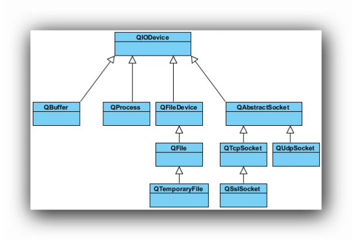
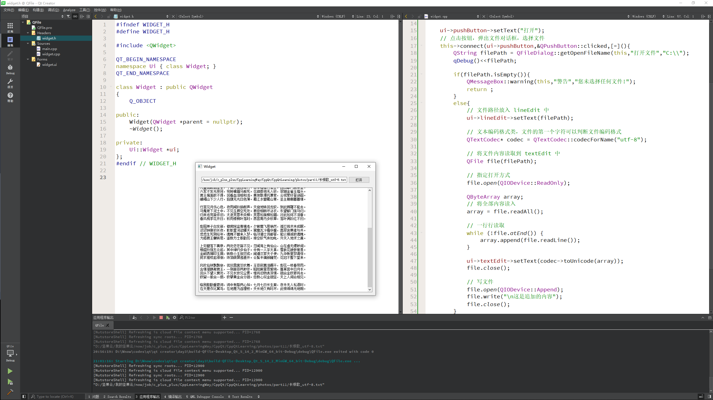
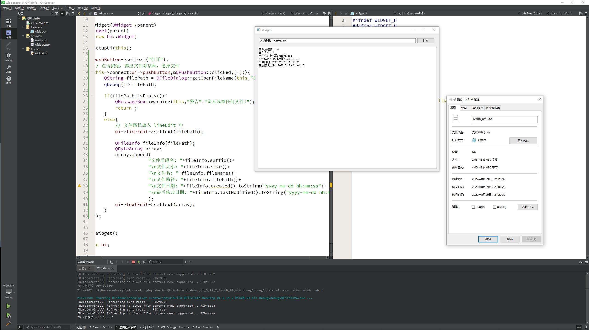

# 文件系统

文件操作是应用程序必不可少的部分。Qt 作为一个通用开发库，提供了跨平台的文件操作能力。Qt 通过 `QIODevice` 提供了对 I/O 设备的抽象，这些设备具有读写字节块的能力。下面是 I/O 设备的类图(Qt5)



* `QIODevice`：所有 I/O 设备类的父类，提供了字节块读写的通用操作以及基本接口
* `QFileDevice`：Qt5 新增加的类，提供了有关文件操作的通用实现
* `QFlie`：访问本地文件或者嵌入资源
* `QTemporaryFile`：创建和访问本地文件系统的临时文件
* `QBuffer`：读写 `QbyteArray`，内存文件
* `QProcess`：运行外部程序，处理进程间通讯
* `QAbstractSocket`：所有套接字类的父类
* `QTcpSocket`：TCP 协议网络数据传输
* `QUdpSocket`：传输 UDP 报文
* `QSslSocket`：使用 SSL/TLS 传输数据

**文件系统分类**

* 顺序访问设备：是指它们的数据只能访问一遍：从头走到尾，从第一个字节开始访问，直到最后一个字节，中途不能返回去读取上一个字节，这其中，`QProcess`、`QTcpSocket`、`QUdpSoctet` 和 `QSslSocket` 是顺序访问设备
* 随机访问设备：可以访问任意位置任意次数，还可以使用 `QIODevice::seek()` 函数来重新定位文件访问位置指针，`QFile`、`QTemporaryFile` 和 `QBuffer` 是随机访问设备

---

## 文件读写

`widget.cpp`

```cpp
#include "widget.h"
#include "ui_widget.h"
#include <QtDebug>
#include <QFileDialog>
#include <QMessageBox>
#include <QFile>
#include <QTextCodec>

Widget::Widget(QWidget *parent)
    : QWidget(parent)
    , ui(new Ui::Widget)
{
    ui->setupUi(this);

    ui->pushButton->setText("打开");
    // 点击按钮，弹出文件对话框，选择文件
    this->connect(ui->pushButton,&QPushButton::clicked,[=](){
        QString filePath = QFileDialog::getOpenFileName(this,"打开文件","C:\\");
        qDebug()<<filePath;

        if(filePath.isEmpty()){
            QMessageBox::warning(this,"警告","您未选择任何文件!");
            return ;
        }
        else{
            // 文件路径放入 lineEdit 中
            ui->lineEdit->setText(filePath);

            // 文本编码格式类，文件的第一个字符可以判断文件编码格式
            QTextCodec* codec = QTextCodec::codecForName("utf-8");

            // 将文件内容读取到 textEdit 中
            QFile file(filePath);

            // 指定打开方式
            file.open(QIODevice::ReadOnly);

            QByteArray array;
            // 将全部内容读入
            array = file.readAll();

            // 一行行读取
            while (!file.atEnd()) {
                array.append(file.readLine());
            }

            ui->textEdit->setText(codec->toUnicode(array));
            file.close();

            // 写文件
            file.open(QIODevice::Append);
            file.write("\n这是追加的内容");
            file.close();
        }
    });
}

Widget::~Widget()
{
    delete ui;
}
```



---

## 文件信息类

代码如下：

```cpp
#include "widget.h"
#include "ui_widget.h"
#include <QtDebug>
#include <QFileDialog>
#include <QMessageBox>
#include <QFile>
#include <QTextCodec>
#include <QFileInfo>
#include <QDateTime>

Widget::Widget(QWidget *parent)
    : QWidget(parent)
    , ui(new Ui::Widget)
{
    ui->setupUi(this);

    ui->pushButton->setText("打开");
    // 点击按钮，弹出文件对话框，选择文件
    this->connect(ui->pushButton,&QPushButton::clicked,[=](){
        QString filePath = QFileDialog::getOpenFileName(this,"打开文件","D:\\");
        qDebug()<<filePath;

        if(filePath.isEmpty()){
            QMessageBox::warning(this,"警告","您未选择任何文件!");
            return ;
        }
        else{
            // 文件路径放入 lineEdit 中
            ui->lineEdit->setText(filePath);

            QFileInfo fileInfo(filePath);
            QByteArray array;
            array.append(
                        "文件后缀名: "+fileInfo.suffix()+
                        "\n文件大小: "+fileInfo.size()+
                        "\n文件名: "+fileInfo.fileName()+
                        "\n文件路径: "+fileInfo.filePath()+
                        "\n文件日期: "+fileInfo.created().toString("yyyy-mm-dd hh:mm:ss")+
                        "\n最后修改日期: "+fileInfo.lastModified().toString("yyyy-mm-dd hh:mm:ss")
                        );
            ui->textEdit->setText(array);
        }
    });
}

Widget::~Widget()
{
    delete ui;
}
```



---

## 基本文件操作

文件操作是应用程序必不可少的部分。Qt 作为一个通用开发库，提供了跨平台的文件操作能力。在所有的 I/O 设备中，文件 I/O 是最重要的部分之一。因为大多数的程序依旧需要首先访问本地文件。`QFile` 提供了从文件中读取和写入数据的能力

通常会将文件路径作为参数传给 `QFile` 的构造函数。不过也可以在创建好对象最后，使用 `setFileName()` 来修改。`QFile` 需要使用 `/` 作为文件分隔符，不过，它会自动将其转换成操作系统所需要的形式。例如 `C:/windows` 这样的路径在 Windows 平台下同样是可以的

`QFile` 主要提供了有关文件的各种操作，比如打开文件、关闭文件、刷新文件等。我们可以使用 `QDataStream` 或 `QTextStream` 类来读写文件，也可以使用 `QIODevice` 类提供的 `read()`、`readLine()`、`readAll()` 以及 `write()` 这样的函数。值得注意的是，有关文件本身的信息，比如文件名、文件所在目录的名字等，则是通过 `QFileInfo` 获取，而不是自己分析文件路径字符串。
下面使用一段代码来看看 `QFile` 有关操作：

```cpp
int main(int argc, char *argv[])
{
    QApplication app(argc, argv);
 
    QFile file("in.txt");
    if (!file.open(QIODevice::ReadOnly | QIODevice::Text)) {
        qDebug() << "Open file failed.";
        return -1;
    } else {
        while (!file.atEnd()) {
            qDebug() << file.readLine();
        }
    }
 
    QFileInfo info(file);
    qDebug() << info.isDir();
    qDebug() << info.isExecutable();
    qDebug() << info.baseName();
    qDebug() << info.completeBaseName();
    qDebug() << info.suffix();
    qDebug() << info.completeSuffix();
 
    return app.exec();
}
```

* 首先使用 `QFile` 创建了一个文件对象。这个文件名字是 `in.txt`。如果你不知道应该把它放在哪里，可以使用 `QDir::currentPath()` 来获得应用程序执行时的当前路径。只要将这个文件放在与当前路径一致的目录下即可
* 使用 `open()` 函数打开这个文件，打开形式是只读方式，文本格式。这个类似于 `fopen()` 的 `r` 这样的参数。`open()` 函数返回一个 `bool` 类型，如果打开失败，在控制台输出一段提示然后程序退出。否则，利用 `while` 循环，将每一行读到的内容输出
* 可以使用 `QFileInfo` 获取有关该文件的信息。`QFileInfo` 有很多类型的函数，我们只举出一些例子。比如：
    * `isDir()` 检查该文件是否是目录
    * `isExecutable()` 检查该文件是否是可执行文件等
    * `baseName()` 可以直接获得文件名
    * `completeBaseName()` 获取完整的文件名
    * `suffix()` 则直接获取文件后缀名
    * `completeSuffix()` 获取完整的文件后缀

可以由下面的示例看到，`baseName()` 和 `completeBaseName()`，以及 `suffix()` 和 `completeSuffix()` 的区别：

```cpp
QFileInfo fi("/tmp/archive.tar.gz");
QString base = fi.baseName();  // base = "archive"
QString base = fi.completeBaseName();  // base = "archive.tar"
QString ext = fi.suffix();  // ext = "gz"
QString ext = fi.completeSuffix();  // ext = "tar.gz"
```

---

## 二进制文件读写

`QDataStream` 提供了基于 `QIODevice` 的二进制数据的序列化。数据流是一种二进制流，这种流完全不依赖于底层操作系统、CPU 或者字节顺序(大端或小端)。例如，在安装了 Windows 平台的 PC 上面写入的一个数据流，可以不经过任何处理，直接拿到运行了 Solaris 的 SPARC 机器上读取。由于数据流就是二进制流，因此也可以直接读写没有编码的二进制数据，例如图像、视频、音频等

`QDataStream` 既能够存取 C++ 基本类型，如 `int`、`char`、`short` 等，也可以存取复杂的数据类型，例如自定义的类。实际上，`QDataStream` 对于类的存储，是将复杂的类分割为很多基本单元实现的

结合 `QIODevice`，`QDataStream` 可以很方便地对文件、网络套接字等进行读写操作。从代码开始看起：

```cpp
QFile file("file.dat");
file.open(QIODevice::WriteOnly);
QDataStream out(&file);
out << QString("the answer is");
out << (qint32)42;
```

* 在这段代码中，首先打开一个名为 `file.dat` 的文件(注意，为简单起见，并没有检查文件打开是否成功，这在正式程序中是不允许的)。然后将刚刚创建的 `file` 对象的指针传递给一个 `QDataStream` 实例 `out`。类似于 `std::cout` 标准输出流，`QDataStream` 也重载了输出重定向 `<<` 运算符。后面的代码就很简单了：将 `the answer is` 和数字 42 输出到数据流。由于 `out` 对象建立在 `file` 之上，因此相当于将问题和答案写入 `file`

* 需要指出一点：最好使用 Qt 整型来进行读写，比如程序中的 `qint32`。这保证了在任意平台和任意编译器都能够有相同的行为

如果你直接运行这段代码，你会得到一个空白的 `file.dat`，并没有写入任何数据。这是因为 `file` 没有正常关闭。为性能起见，数据只有在文件关闭时才会真正写入。因此必须在最后添加一行代码：

```cpp
file.close(); // 如果不想关闭文件，可以使用 file.flush();
```

接下来将存储到文件中的答案取出来

```cpp
QFile file("file.dat");
file.open(QIODevice::ReadOnly);
QDataStream in(&file);
QString str;
qint32 a;
in >> str >> a;
```

唯一需要注意的是，你必须按照写入的顺序，将数据读取出来。顺序颠倒的话，程序行为是不确定的，严重时会直接造成程序崩溃

那么，既然 `QIODevice` 提供了 `read()`、`readLine()` 之类的函数，为什么还要有 `QDataStream` 呢？`QDataStream` 同 `QIODevice` 有什么区别？区别在于，`QDataStream` 提供流的形式，性能上一般比直接调用原始 API 更好一些。我们通过下面一段代码看看什么是流的形式：

```cpp
QFile file("file.dat");
file.open(QIODevice::ReadWrite);
 
QDataStream stream(&file);
QString str = "the answer is 42";
 
stream << str;
```

---

## 文本文件读写

上一节介绍了有关二进制文件的读写。二进制文件比较小巧，却不是人可读的格式。而文本文件是一种人可读的文件。为了操作这种文件，需要使用 `QTextStream` 类。`QTextStream` 和 `QDataStream`的使用类似，只不过它是操作纯文本文件的

`QTextStream` 会自动将 Unicode 编码同操作系统的编码进行转换，这一操作对开发人员是透明的。它也会将换行符进行转换，同样不需要自己处理。`QTextStream` 使用 16 位的 `QChar` 作为基础的数据存储单位，同样，它也支持 C++ 标准类型，如 `int` 等。实际上，这是将这种标准类型与字符串进行了相互转换

`QTextStream` 同 `QDataStream` 的使用基本一致，例如下面的代码将把 `The answer is 42` 写入到 `file.txt` 文件中：

```cpp
QFile data("file.txt");
if (data.open(QFile::WriteOnly | QIODevice::Truncate)) 
{
    QTextStream out(&data);
    out << "The answer is " << 42;
}
```

这里在 `open()` 函数中增加了 `QIODevice::Truncate` 打开方式。可以从下表中看到这些打开方式的区别：

| 枚举值 | 描述 |
|:----:|:----:|
| `QIODevice::NotOpen` | 未打开 |
| `QIODevice::ReadOnly` | 以只读方式打开 |
| `QIODevice::WriteOnly` | 以只写方式打开 |
| `QIODevice::ReadWrite` | 以读写方式打开 |
| `QIODevice::Append` | 以追加的方式打开，新增加的内容将被追加到文件末尾 |
| `QIODevice::Truncate` | 以重写的方式打开，在写入新的数据时会将原有数据全部清除，游标设置在文件开头 |
| `QIODevice::Text` | 在读取时，将行结束符转换成 `\n`；在写入时，将行结束符转换成本地格式，例如 Win32 平台上是 `\r\n` |
| `QIODevice::Unbuffered` | 忽略缓存 |

在这里使用了 `QFile::WriteOnly | QIODevice::Truncate`，也就是以只写并且覆盖已有内容的形式操作文件。注意，`QIODevice::Truncate` 会直接将文件内容清空
 
虽然 `QTextStream` 的写入内容与 `QDataStream` 一致，但是读取时却会有些困难：

```cpp
QFile data("file.txt");
if (data.open(QFile::ReadOnly)) 
{
    QTextStream in(&data);
    QString str;
    int ans = 0;
    in >> str >> ans;
}
```

在使用 `QDataStream` 的时候，这样的代码很方便，但是使用了 `QTextStream` 时却有所不同：读出的时候，`str` 里面将是 `The answer is 42`，`ans` 是 0。这是因为当使用 `QDataStream` 写入的时候，实际上会在要写入的内容前面，额外添加一个这段内容的长度值。而以文本形式写入数据，是没有数据之间的分隔的。因此，使用文本文件时，很少会将其分割开来读取，而是使用诸如使用：

* `QTextStream::readLine()`	读取一行
* `QTextStream::readAll()` 读取所有文本

这种函数之后再对获得的 `QString` 对象进行处理

默认情况下，`QTextStream` 的编码格式是 Unicode，如果需要使用另外的编码，可以使用：
`stream.setCodec("UTF-8");`

这样的函数进行设置

---

## 小结

* 文件读写
    * 读文件
        * `QFile file(文件路径);`
        * `file.open` 指定打开方式 `QIODevice::ReadOnly`
        * 利用 `file.readAll` 一次性全部读取
        * 利用 `file.readLine` 按行读取
        * `file.close` 关闭文件对象
        * 读取 `gbk` 格式
            * `QTextCodec* codec = QTextCodec::codecForName("gbk");`
            * `codec->toUnicode(array)`
    * 写文件
        * `QFile file(路径);`
        * `file.open(QIODevice::Append); // QIODevice::Append 追加的方式写文件`
        * `file.write("\n这是一段追加内容");`
        * `file.close();`
* 文件信息类
    * `QFileInfo info(路径);`    
    * `info` 获取文件信息
    * 后缀名：`suffix`；文件大小：`size`；文件名：`filename`；文件路径：`filePath`
    * 创建日期 `created` 修改日期 `lastModify`
    * `QDateTime` 需要用 `toString` 转为自己制定的输出格式

---
