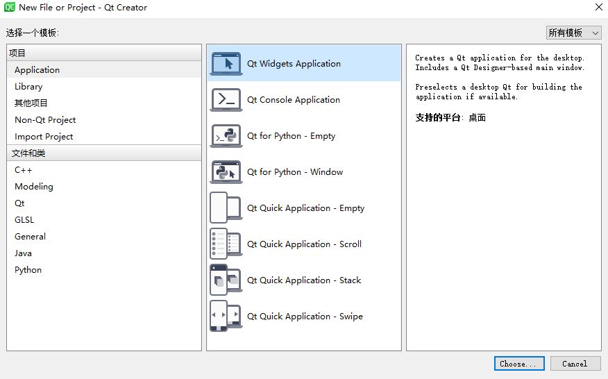
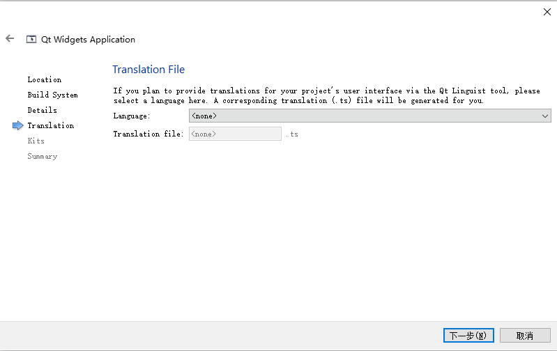

# 创建 Qt 项目

---

## 使用向导创建

打开 Qt Creator 界面选择 New Project 或者选择菜单栏 `文件` -`新建文件或项目` 菜单项


弹出 New Project 对话框，选择 Qt Widgets Application



选择 `Choose` 按钮，弹出如下对话框


设置项目名称和路径，按照向导进行下一步，路径中不能有中文


选择编译套件





向导会默认添加一个继承自 `CMainWindow` 类，可以在此修改类的名字和基类。默认的基类有 `QMainWindow`、`QWidget` 以及 `QDialog` 三个，我们可以保持默认，选择 `QMainWindow`


系统会默认给我们添加 `main.cpp`、`mywidget.cpp`、`mywidget.h` 和一个 `.pro` 项目文件，点击完成，即可创建出一个 Qt 桌面程序

对于手动创建项目，过程也差不多，在空项目的基础上安装提示添加相应文件即可

---

## .pro 文件

在使用 Qt 向导生成的应用程序 `.pro` 文件内容如下：

```cpp
QT       += core gui

greaterThan(QT_MAJOR_VERSION, 4): QT += widgets

CONFIG += c++11

# The following define makes your compiler emit warnings if you use
# any Qt feature that has been marked deprecated (the exact warnings
# depend on your compiler). Please consult the documentation of the
# deprecated API in order to know how to port your code away from it.
DEFINES += QT_DEPRECATED_WARNINGS

# You can also make your code fail to compile if it uses deprecated APIs.
# In order to do so, uncomment the following line.
# You can also select to disable deprecated APIs only up to a certain version of Qt.
#DEFINES += QT_DISABLE_DEPRECATED_BEFORE=0x060000    # disables all the APIs deprecated before Qt 6.0.0

SOURCES += \
    main.cpp \
    mainwindow.cpp

HEADERS += \
    mainwindow.h

FORMS += \
    mainwindow.ui

# Default rules for deployment.
qnx: target.path = /tmp/$${TARGET}/bin
else: unix:!android: target.path = /opt/$${TARGET}/bin
!isEmpty(target.path): INSTALLS += target
```

忽略一些注释，主要格式如下：

```cpp
QT       += core gui  // 包含的模块
greaterThan(QT_MAJOR_VERSION, 4): QT += widgets // 大于 Qt4 版本 才包含 widget 模块
TARGET = QtFirst  // 应用程序名，生成的 .exe 程序名称
TEMPLATE = app    // 模板类型，应用程序模板
SOURCES += main.cpp\   // 源文件
        mainwindow.cpp
HEADERS  += mainwindow.h   // 头文件
```

`.pro` 就是工程文件(project)，它是 `qmake` 自动生成的用于生产 `makefile` 的配置文件。`.pro` 文件的写法如下：

* 注释。从“#”开始，到这一行结束
* 模板变量告诉 `qmake` 为这个应用程序生成哪种 `makefile`。下面是可供使用的选择：`TEMPLATE = app`
    * `app` - 建立一个应用程序的 `makefile`。这是默认值，所以如果模板没有被指定，这个将被使用
    * `lib` - 建立一个库的 `makefile`
    * `vcapp` - 建立一个应用程序的 VisualStudio 项目文件。
    * `vclib` - 建立一个库的 VisualStudio 项目文件。
    * `subdirs` - 这是一个特殊的模板，它可以创建一个能够进入特定目录并且为一个项目文件生成 `makefile` 并且为它调用 `make` 的 `makefile`
* #指定生成的应用程序名：`TARGET = QtDemo`
* #工程中包含的头文件：`HEADERS += include/painter.h`
* #工程中包含的 `.ui` 设计文件：`FORMS += forms/painter.ui`
* #工程中包含的源文件：`SOURCES += sources/main.cpp sources`
* #工程中包含的资源文件：`RESOURCES += qrc/painter.qrc`
* `greaterThan(QT_MAJOR_VERSION, 4): QT += widgets`。这条语句的含义是
    * 如果 `QT_MAJOR_VERSION` 大于 4(也就是当前使用的 Qt5 及更高版本)需要增加 `widgets` 模块
    * 如果项目仅需支持 Qt5，也可以直接添加 `QT += widgets` 一句。不过为了保持代码兼容，最好还是按照 `QtCreator` 生成的语句编写
* #配置信息
    * `CONFIG` 用来告诉 `qmake` 关于应用程序的配置信息。
    * `CONFIG += c++11`	使用 c++11 的特性

在这里使用 `+=`，是因为我们添加的配置选项到任何一个已经存在中。这样做比使用 `=` 那样替换已经指定的所有选项更安全

---

## 一个最简单的 Qt 应用程序

`main` 入口函数中

```cpp
#include "mainwindow.h"

#include <QApplication>

int main(int argc, char *argv[])
{
    QApplication a(argc, argv);
    MainWindow w;
    w.show();
    return a.exec();
}
```

解释：

* `main` 函数中的参数 `int argc, char *argv[]`，其中 `argc` 是命令行变量数量，`char *argv[]` 是命令行参数数组
* Qt 系统提供的标准类名声明头文件没有 `.h` 后缀
* Qt 一个类对应一个头文件，类名就是头文件名
* `QApplication` 应用程序类
    * 管理图形用户界面应用程序的控制流和主要设置
    * 是 Qt 的整个后台管理的命脉它包含主事件循环，在其中来自窗口系统和其它资源的所有事件处理和调度。它也处理应用程序的初始化和结束，并且提供对话管理
    * 对于任何一个使用 Qt 的图形用户界面应用程序，都正好存在一个 `QApplication` 对象，而不论这个应用程序在同一时间内是不是有 0、1、2 或更多个窗口
* `a.exec()`
    * 程序进入消息循环，阻塞功能，等待对用户输入进行响应。这里 `main()` 把控制权转交给 Qt，Qt 完成事件处理工作，当应用程序退出的时候 `exec()` 的值就会返回。在 `exec()` 中，Qt 接受并处理用户和系统的事件并且把它们传递给适当的窗口部件

运行代码，结果如下:


---
