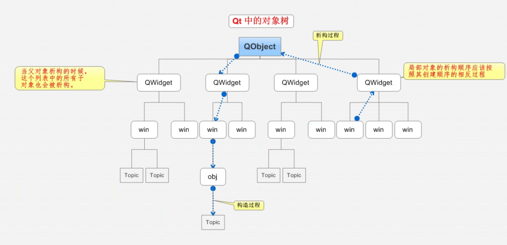
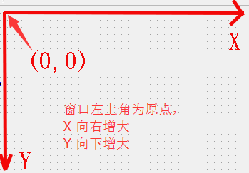

# 第一个 Qt 小程序

Qt5 的基本模块如下:


---

## 按钮的创建

在 Qt 程序中，最常用的控件之一就是按钮了，首先来看下如何创建一个按钮

`widget.cpp`

```cpp
#include "widget.h"
#include "ui_widget.h"
#include <QPushButton>

Widget::Widget(QWidget *parent)
    : QWidget(parent)
    , ui(new Ui::Widget)
{
    ui->setupUi(this);

    // 按钮
    QPushButton * btn = new QPushButton;
    // 顶层弹出
    btn->show();

    // 显示到当前窗口，需要依赖于当前窗口
    btn->setParent(this);
    // 显示文本
    btn->setText("Button 按钮");

    // 按钮 2
    QPushButton * btn2 = new QPushButton("Button 按钮2", this);

    // 移动 btn2
    btn2->move(100,100);
    // 重置窗口大小
    this->resize(300,400);
    // 重置 btn2 大小
    btn2->resize(100,100);
    // 窗口标题
    this->setWindowTitle("主窗口标题");
    // 设置窗口默认大小，不能缩放
    this->setFixedSize(400,500);
}

Widget::~Widget()
{
    delete ui;
}
```

上面代码中，一个按钮其实就是一个 `QPushButton` 类下的对象，如果只是创建出对象，是无法显示到窗口中的，所以我们需要依赖一个父窗口，也就是指定一个父亲，利用 `setParent` 函数即可，如果想设置按钮上显示的文字利用 `setText`，移动按钮位置用 `move` 等等
	
对于窗口而言，我们可以修改左上角窗口的标题：`setWindowTitle`，重新指定窗口大小：`resize`，或者设置固定的窗口大小 `setFixedSize`

---

## 对象模型(对象树)

在 Qt 中创建对象的时候会提供一个 `parent` 对象指针，下面来解释这个 `parent` 到底是干什么的

* `QObject` 是以对象树的形式组织起来的
    * 当你创建一个 `QObject` 对象时，会看到 `QObject` 的构造函数接收一个 `QObject` 指针作为参数，这个参数就是 `parent`，也就是父对象指针。这相当于，在创建 `QObject` 对象时，可以提供一个其父对象，我们创建的这个 `QObject` 对象会自动添加到其父对象的 `children()` 列表
    * 当父对象析构的时候，这个列表中的所有对象也会被析构(注意，这里的父对象并不是继承意义上的父类)。这种机制在 GUI 程序设计中相当有用。例如，一个按钮有一个 `QShortcut`(快捷键)对象作为其子对象。当删除按钮的时候，这个快捷键理应被删除。这是合理的
* `QWidget` 是能够在屏幕上显示的一切组件的父类
    * `QWidget` 继承自 `QObject`，因此也继承了这种对象树关系。一个孩子自动地成为父组件的一个子组件。因此，它会显示在父组件的坐标系统中，被父组件的边界剪裁。例如，当用户关闭一个对话框的时候，应用程序将其删除，那么，我们希望属于这个对话框的按钮、图标等应该一起被删除。事实就是如此，因为这些都是对话框的子组件
    * 当然，我们也可以自己删除子对象，它们会自动从其父对象列表中删除。比如，当我们删除了一个工具栏时，其所在的主窗口会自动将该工具栏从其子对象列表中删除，并且自动调整屏幕显示

Qt 引入对象树的概念，在一定程度上解决了内存问题

* 当一个 `QObject` 对象在堆上创建的时候，Qt 会同时为其创建一个对象树。不过，对象树中对象的顺序是没有定义的。这意味着，销毁这些对象的顺序也是未定义的
* 任何对象树中的 `QObject` 对象 `delete` 的时候，如果这个对象有 `parent`，则自动将其从 `parent` 的 `children()` 列表中删除；如果有孩子，则自动 `delete` 每一个孩子。Qt 保证没有 `QObject` 会被 `delete` 两次，这是由析构顺序决定的

如果 `QObject` 在栈上创建，Qt 保持同样的行为。正常情况下，这也不会发生什么问题。来看下下面的代码片段：

```cpp
{
    QWidget window;
    QPushButton quit("Quit", &window);
}
```

作为父组件的 `window` 和作为子组件的 `quit` 都是 `QObject` 的子类(事实上，它们都是 `QWidget` 的子类，而 `QWidget` 是 `QObject` 的子类)

这段代码是正确的，`quit` 的析构函数不会被调用两次，因为标准 C++ 要求，局部对象的析构顺序应该按照其创建顺序的相反过程。因此，这段代码在超出作用域时，会先调用 `quit` 的析构函数，将其从父对象 `window` 的子对象列表中删除，然后才会再调用 `window` 的析构函数

但是，如果使用下面的代码：

```cpp
{
    QPushButton quit("Quit");
    QWidget window;
    quit.setParent(&window);
}
```

情况又有所不同，析构顺序就有了问题

在上面的代码中，作为父对象的 `window` 会首先被析构，因为它是最后一个创建的对象。在析构过程中，它会调用子对象列表中每一个对象的析构函数，也就是说，`quit` 此时就被析构了。然后，代码继续执行，在 `window` 析构之后，`quit` 也会被析构，因为 `quit` 也是一个局部变量，在超出作用域的时候当然也需要析构。但是，这时候已经是第二次调用 `quit` 的析构函数了，C++ 不允许调用两次析构函数，因此，程序崩溃了

由此看到，Qt 的对象树机制虽然帮助我们在一定程度上解决了内存问题，但是也引入了一些值得注意的事情。这些细节在今后的开发过程中很可能时不时跳出来烦扰一下，所以，我们最好从开始就养成良好习惯，在 Qt 中，尽量在构造的时候就指定 `parent` 对象，并且大胆在堆上创建

---

## 案例

下面以一个自定义控件 `MyPushButton` 为案例，演示下上述过程:

`mypushbutton.h`

```cpp
#ifndef MYPUSHBUTTON_H
#define MYPUSHBUTTON_H

#include <QWidget>
#include <QPushButton>

class MyPushButton : public QPushButton
{
    Q_OBJECT
public:
    explicit MyPushButton(QWidget *parent = nullptr);

    ~MyPushButton();

signals:

};

#endif // MYPUSHBUTTON_H
```

`mypushbutton.cpp`

```cpp
#include "mypushbutton.h"
#include <QDebug>

MyPushButton::MyPushButton(QWidget *parent) : QPushButton(parent)
{

}

MyPushButton::~MyPushButton()
{
    qDebug()<<"MyPushButton 的析构函数";
}
```

`widget.cpp`

```cpp
#include "widget.h"
#include "ui_widget.h"
#include <QPushButton>
#include "mypushbutton.h"
#include <QDebug>

Widget::Widget(QWidget *parent)
    : QWidget(parent)
    , ui(new Ui::Widget)
{
    ui->setupUi(this);

    // 创建自定义按钮
    MyPushButton * myBtn = new MyPushButton;
    // 增加到对象树上
    myBtn->setParent(this);
    myBtn->setText("我的按钮");
    myBtn->move(20,20);
    /*
    Widget 的析构函数
    MyPushButton 的析构函数
    */
}

Widget::~Widget()
{
    qDebug()<<"Widget 的析构函数";
    delete ui;
}
```

对象树模型



---

## Qt 窗口坐标体系

**坐标体系**：

以左上角为原点(0, 0)，X 向右增加，Y 向下增加



---
