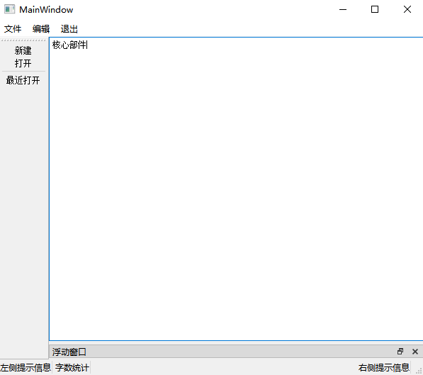
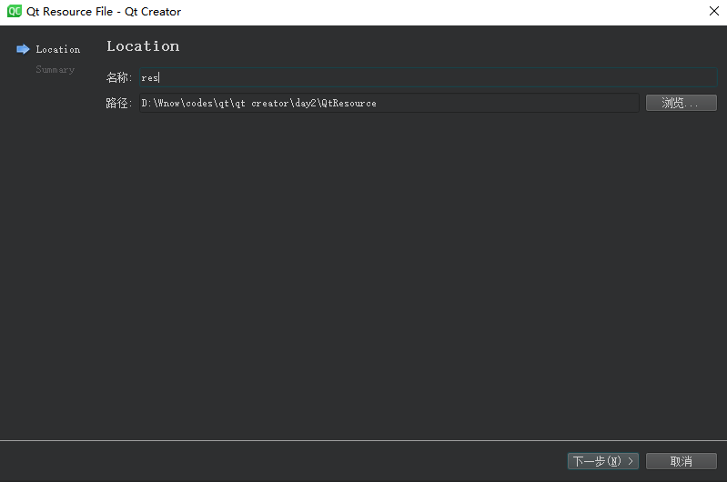
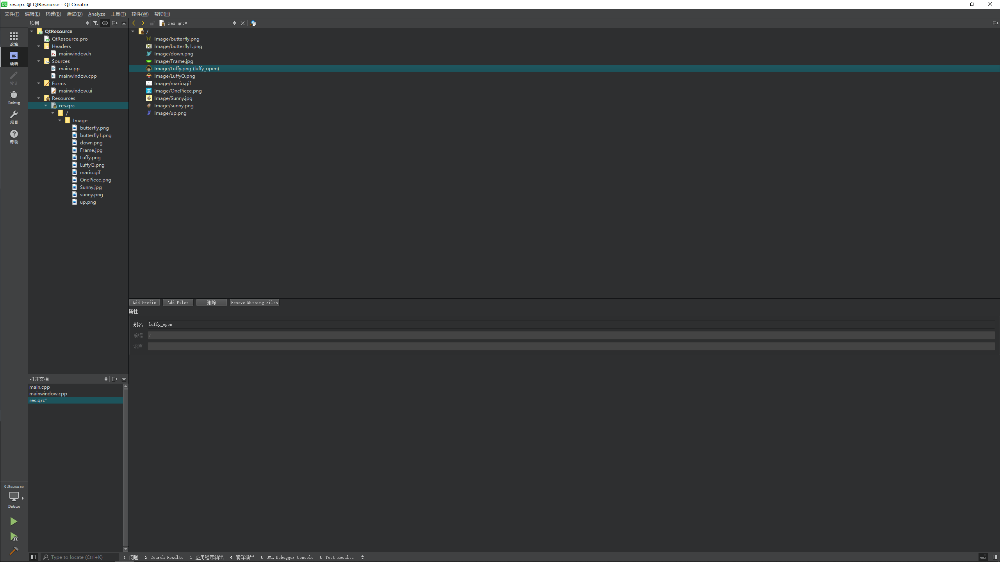

# QMainWindow

`QMainWindow` 是一个为用户提供主窗口程序的类，包含一个菜单栏(`menu bar`)、多个工具栏(`tool bars`)、多个锚接部件(`dock widgets`)、一个状态栏(`status bar`)及一个中心部件(`central widget`)，是许多应用程序的基础，如文本编辑器，图片编辑器等


---

## 菜单栏

一个主窗口最多只有一个菜单栏。位于主窗口顶部、主窗口标题栏下面

* 创建菜单栏，通过 `QMainWindow` 类的 `menubar()` 函数获取主窗口菜单栏指针

```cpp
QMenuBar *menuBar() const;
```

* 创建菜单，调用 `QMenu` 的成员函数 `addMenu` 来添加菜单

```cpp
QAction* addMenu(QMenu * menu);
QMenu* addMenu(const QString &title);
QMenu* addMenu(const QIcon &icon, const QString &title);
```

* 创建菜单项，调用 `QMenu` 的成员函数 `addAction` 来添加菜单项

```cpp
QAction* activeAction() const;
QAction* addAction(const QString &text);
QAction* addAction(const QIcon &icon, const QString & text);
QAction* addAction(const QString &text, const QObject * receiver, const char * member, const QKeySequence &shortcut = 0);
QAction* addAction(const QIcon &icon, const QString &text,const QObject * receiver, const char * member, const QKeySequence &shortcut = 0);
```

Qt 并没有专门的菜单项类，只是使用一个 `QAction` 类，抽象出公共的动作。当我们把 `QAction` 对象添加到菜单，就显示成一个菜单项，添加到工具栏，就显示成一个工具按钮。用户可以通过点击菜单项、点击工具栏按钮、点击快捷键来激活这个动作

demo:

```cpp
// 创建菜单栏，至多有一个
QMenuBar *bar = menuBar();
this->setMenuBar(bar);

// 创建菜单
QMenu *fileMenu = bar->addMenu("文件");
QMenu *editMenu = bar->addMenu("编辑");
QMenu *exitMenu = bar->addMenu("退出");

// 创建菜单项
QAction *newAction = fileMenu->addAction("新建");
QAction *openAction = fileMenu->addAction("打开");
QAction *recentAction = fileMenu->addAction("最近打开");
// 添加分割线
fileMenu->addSeparator();
QAction *closeAction = fileMenu->addAction("关闭");
```

---

## 工具栏

主窗口的工具栏上可以有多个工具条，通常采用一个菜单对应一个工具条的的方式，也可根据需要进行工具条的划分。

* 直接调用 `QMainWindow` 类的 `addToolBar()` 函数获取主窗口的工具条对象，每增加一个工具条都需要调用一次该函数
* 插入属于工具条的动作，即在工具条上添加操作
    * 通过 `QToolBar` 类的 `addAction` 函数添加
* 工具条是一个可移动的窗口，它的停靠区域由 `QToolBar` 的 `allowAreas` 决定，包括：
    * `Qt::LeftToolBarArea` 停靠在左侧
    * `Qt::RightToolBarArea` 停靠在右侧
    * `Qt::TopToolBarArea` 停靠在顶部
    * `Qt::BottomToolBarArea` 停靠在底部
    * `Qt::AllToolBarAreas` 以上四个位置都可停靠
    * 使用 `setAllowedAreas()` 函数指定停靠区域：
        * `setAllowedAreas(Qt::LeftToolBarArea | Qt::RightToolBarArea)`
    * 使用 `setMoveable()` 函数设定工具栏的可移动性：
        * `setMoveable(false)` 工具条不可移动，只能停靠在初始化的位置上

demo:

```cpp
// 工具栏，可以有多个，堆区创建，对象自己调用
QToolBar *toolBar = new QToolBar(this);
this->addToolBar(Qt::LeftToolBarArea,toolBar);

// 设置只允许左右停靠
toolBar->setAllowedAreas(Qt::LeftToolBarArea | Qt::RightToolBarArea);

// 设置浮动
toolBar->setFloatable(false);

// 设置移动
//    toolBar->setMovable(false);

// 工具栏中放入小的部件
toolBar->addAction(newAction);
toolBar->addAction(openAction);
// 添加分割线
toolBar->addSeparator();
toolBar->addAction(recentAction);
```

---

## 状态栏

* 派生自 `QWidget` 类，使用方法与 `QWidget` 类似，`QStatusBar` 类常用成员函数
* 状态栏也只能最多有一个

```cpp
// 添加小部件
void addWidget(QWidget * widget, int stretch = 0);
// 插入小部件
int	insertWidget(int index, QWidget * widget, int stretch = 0);
// 删除小部件
void removeWidget(QWidget * widget);
```

demo:

```cpp
// 状态栏，至多一个
QStatusBar *stBar = statusBar();
this->setStatusBar(stBar);

QLabel *label1 = new QLabel("左侧提示信息",this);
stBar->addWidget(label1);

QLabel *label2 = new QLabel("右侧提示信息",this);
stBar->addPermanentWidget(label2);

QLabel *label12 = new QLabel("字数统计",this);
stBar->addWidget(label12);
```

---

## 铆接部件

铆接部件 `QDockWidget`，也称浮动窗口，可以有多个

```cpp
QDockWidget * dock = new QDockWidget("标题", this);
addDockWidget(Qt::LeftDockWidgetArea, dock);
// 设置区域范围
dock->setAllowedAreas(Qt::LeftDockWidgetArea | Qt::RightDockWidgetArea | Qt::TopDockWidgetArea);
```

demo:

```cpp
// 铆接部件(浮动窗口)，只能有一个
QDockWidget *dock = new QDockWidget("浮动窗口",this);
//    this->addDockWidget(Qt::TopDockWidgetArea,dock);
this->addDockWidget(Qt::BottomDockWidgetArea,dock);

// 只允许左右停靠
dock->setAllowedAreas(Qt::LeftDockWidgetArea | Qt::RightDockWidgetArea);
```

---

## 核心部件(中心部件)

除了以上几个部件，中心显示的部件都可以作为核心部件，例如一个记事本文件，可以利用 `QTextEdit` 做核心部件

```cpp
QTextEdit * edit = new QTextEdit(this);
setCentralWidget(edit);
```

demo:

```cpp
// 核心部件，只能有一个
QTextEdit *edit = new QTextEdit(this);
this->setCentralWidget(edit);
```

以上效果如下图所示:



---

## 资源文件

Qt 资源系统是一个跨平台的资源机制，用于将程序运行时所需要的资源以二进制的形式存储于可执行文件内部。如果你的程序需要加载特定的资源(图标、文本翻译等)，那么，将其放置在资源文件中，就再也不需要担心这些文件的丢失。也就是说，如果你将资源以资源文件形式存储，它是会编译到可执行文件内部

使用 Qt Creator 可以很方便地创建资源文件。我们可以在工程上点右键，选择 `添加新文件...`，可以在 Qt 分类下找到 `Qt 资源文件`：


点击 `选择...` 按钮，打开 `新建 Qt 资源文件` 对话框。在这里输入资源文件的名字和路径：



点击下一步，选择所需要的版本控制系统，然后直接选择完成。我们可以在 Qt Creator 的左侧文件列表中看到 `资源文件` 一项，也就是新创建的资源文件

右侧的编辑区有个 `添加`，我们首先需要添加前缀，比如将前缀取名为 `images`。然后选中这个前缀，继续点击添加文件，可以找到我们所需添加的文件，接下来还可以添加另外的前缀或者另外的文件

当添加完成之后，可以像前面一章讲解的那样，通过使用 `:` 开头的路径来找到这个文件。比如，我们的前缀是 `/images`，文件是 `Luffy.png`，那么就可以使用 `:/images/Luffy.png` 找到这个文件


这么做带来的一个问题是，如果以后要更改文件名，那么，所有使用了这个名字的路径都需要修改。所以更好的办法是，我们给这个文件去一个别名，以后就以这个别名来引用这个文件。具体做法是，选中这个文件，添加别名信息：



这样，我们可以直接使用 `:/liffy_open` 引用到这个资源，无需关心图片的真实文件名。
如果我们使用文本编辑器打开 `res.qrc` 文件，就会看到一下内容：

```xml
<RCC>
    <qresource prefix="/">
        <file>Image/butterfly.png</file>
        <file>Image/butterfly1.png</file>
        <file>Image/down.png</file>
        <file>Image/Frame.jpg</file>
        <file alias="luffy_open">Image/Luffy.png</file>
        <file>Image/LuffyQ.png</file>
        <file>Image/mario.gif</file>
        <file>Image/OnePiece.png</file>
        <file>Image/Sunny.jpg</file>
        <file>Image/sunny.png</file>
        <file>Image/up.png</file>
    </qresource>
</RCC>
```

通过原名和别名访问文件:

```cpp
// 给新建添加小图标
//    ui->actionnew->setIcon(QIcon("D:/Luffy.png"));

// 资源文件的添加 ": + 前缀 + 文件名称"

//    ui->actionnew->setIcon(QIcon(":/Image/Luffy.png"));
ui->actionnew->setIcon(QIcon(":/luffy_open"));

ui->actionopen_recently->setIcon(QIcon(":/Image/LuffyQ.png"));
```

效果如下:


可以对比一下，看看 Qt Creator 帮我们生成的是怎样的 `qrc` 文件。当编译工程之后，可以在构建目录中找到 `qrc_res.cpp` 文件，这就是 Qt 将我们的资源编译成了 C++ 代码

[qrc_res.cpp](../codes/part5/build-QtResource-Desktop_Qt_5_14_2_MinGW_64_bit-Debug/debug/qrc_res.cpp)

---
