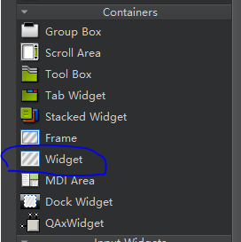
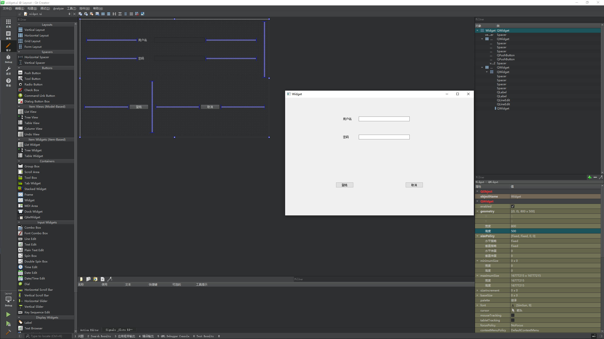

# 布局管理器

所谓 GUI 界面，归根结底，就是一堆组件的叠加。我们创建一个窗口，把按钮放上面，把图标放上面，这样就成了一个界面。在放置时，组件的位置尤其重要。我们必须要指定组件放在哪里，以便窗口能够按照我们需要的方式进行渲染。这就涉及到组件定位的机制

Qt 提供了两种组件定位机制：**绝对定位和布局定位**

* 绝对定位就是一种最原始的定位方法：给出这个组件的坐标和长宽值

这样，Qt 就知道该把组件放在哪里以及如何设置组件的大小。但是这样做带来的一个问题是，如果用户改变了窗口大小，比如点击最大化按钮或者使用鼠标拖动窗口边缘，采用绝对定位的组件是不会有任何响应的。这也很自然，因为你并没有告诉 Qt，在窗口变化时，组件是否要更新自己以及如何更新。或者，还有更简单的方法：禁止用户改变窗口大小。但这总不是长远之计

* 布局定位：你只要把组件放入某一种布局，布局由专门的布局管理器进行管理。当需要调整大小或者位置的时候，Qt 使用对应的布局管理器进行调整

布局定位完美的解决了使用绝对定位的缺陷。Qt 提供的布局中以下三种是最常用的：

* `QHBoxLayout`：按照水平方向从左到右布局
* `QVBoxLayout`：按照竖直方向从上到下布局
* `QGridLayout`：在一个网格中进行布局，类似于 `HTML` 的 `table`

---

## 系统提供的布局控件

这 4 个为系统给我们提供的布局的控件，但是使用起来不是非常的灵活，这里就不详细介绍了

---

## 利用 widget 做布局

第二种布局方式是利用控件里的 `widget` 来做布局，在 `Containers` 中

在 `widget` 中的控件可以进行水平、垂直、栅格布局等操作，比较灵活

在布局的同时我们需要灵活运用弹簧的特性让我们的布局更加的美观，下面是一个登陆窗口，利用 `widget` 可以搭建出如下登陆界面：

---
