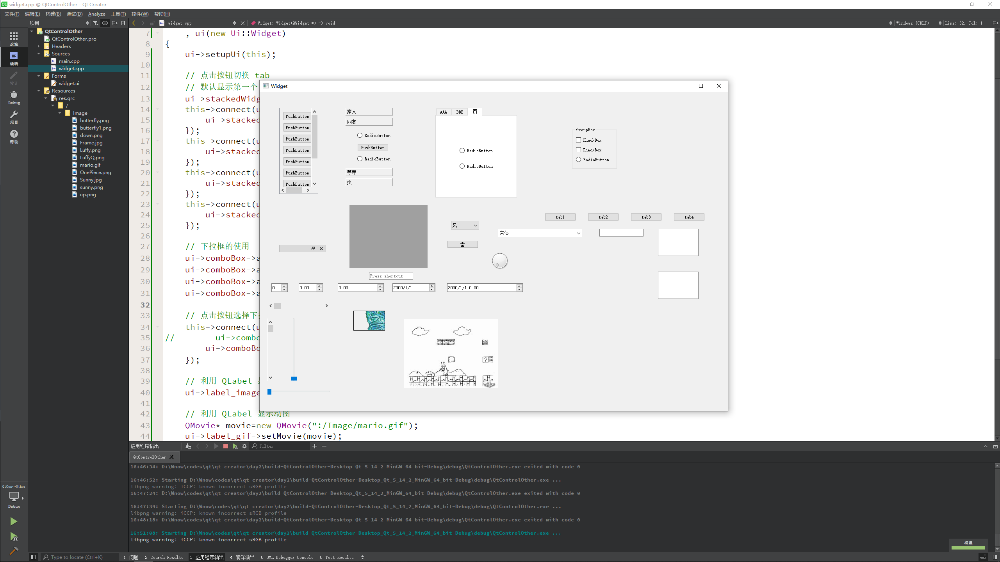
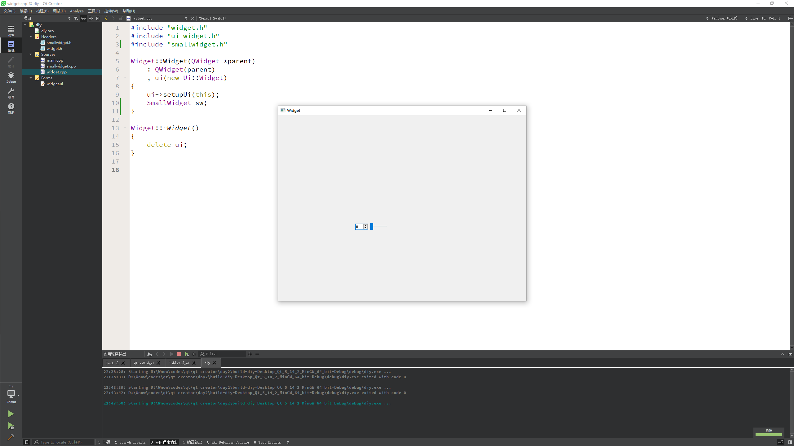

# 常用控件

Qt 为应用程序界面开发提供的一系列的控件，下面介绍两种最常用一些控件，所有控件的使用方法我们都可以通过帮助文档获取

---

## 按钮 Button

* `QPushButton` 最常用按钮，里面可以加图片
* `QToolButton` 工具按钮 用于显示图片
    * `toolButtonStyle` 设置显示图片和文件
    * `autoRaise` 透明凸起效果
* `QRadioButton` 单选按钮
    * 默认选中 `setChecked(true)`
* `QCheckBox` 复选按钮
    * `stateChanged` 信号
    * 0 未选中
    * 1 半选中
    * 2 选中

```c
// 单选按钮默认选择
ui->rbtn_women->setChecked(true);
// 点击按钮，打印输出
this->connect(ui->rbtn_women,&QRadioButton::clicked,[=](){
    qDebug()<<"选择了女性";
});
// 选择了女性

// 复选按钮
this->connect(ui->cbx1,&QCheckBox::stateChanged,[=](int state){
    if(state==2){
        qDebug()<<"AAA";
    }
});
```

---

## QListWidget

* 创建项 `QListWidgetItem* item = new QListWidgetItem("锄禾日当午");`
* 将项加载到控件中
* `ui->listWidget->addItem(item);`
* 设置对齐方式 `item->setTextAlignment(Qt::AlignHCenter);`
* `ui->listWidget->addItems(list);` 可以一次性放入所有内容

```c
// listWigdet
QListWidgetItem *item = new QListWidgetItem("赠药山高僧惟俨二首");
item->setTextAlignment(Qt::AlignCenter);
ui->listWidget->addItem(item);

// QStringList QList<QString>
QStringList list;
list<<"练得身形似鹤形"<<"千株松下两函经"<<"我来问道无馀说"<<"云在青霄水在瓶";
ui->listWidget->addItems(list);
```

---

## QTreeWidget 树控件

* 设置头
    * `ui->treeWidget->setHeaderLabels(QStringList()<<"英雄"<<"英雄简介");`
* 创建根项目
    * `QTreeWidgetItem* liItem = new QTreeWidgetItem(QStringList()<<"力量");`
* 将根项目添加到树控件中
    * `ui->treeWidget->addTopLevelItem(liItem);`
* 挂载子项目
    * `QTreeWidgetItem* l1 = new QTreeWidgetItem(heroL1);`
    * `liItem->addChild(l1);`

```c
// TreeWidget 树控件使用
// 设置头
ui->treeWidget->setHeaderLabels(QStringList()<<"角色"<<"角色简介");
// 创建根
QTreeWidgetItem* itemLei = new QTreeWidgetItem(QStringList()<<"雷系");
QTreeWidgetItem* itemFeng = new QTreeWidgetItem(QStringList()<<"风系");
QTreeWidgetItem* itemShui = new QTreeWidgetItem(QStringList()<<"水系");
// 将根放入到树中
ui->treeWidget->addTopLevelItem(itemLei);
ui->treeWidget->addTopLevelItem(itemFeng);
ui->treeWidget->addTopLevelItem(itemShui);
QTreeWidgetItem* itemLei1 = new QTreeWidgetItem(QStringList()<<"雷电将军"<<"副 C");
QTreeWidgetItem* itemFeng1 = new QTreeWidgetItem(QStringList()<<"温迪"<<"辅助");
QTreeWidgetItem* itemShui1 = new QTreeWidgetItem(QStringList()<<"莫娜"<<"副 C");
QTreeWidgetItem* itemLei2 = new QTreeWidgetItem(QStringList()<<"八重神子"<<"副 C");
QTreeWidgetItem* itemFeng2 = new QTreeWidgetItem(QStringList()<<"枫原万叶"<<"辅助");
QTreeWidgetItem* itemShui2 = new QTreeWidgetItem(QStringList()<<"行秋"<<"副 C");
QTreeWidgetItem* itemLei3 = new QTreeWidgetItem(QStringList()<<"菲谢尔"<<"副 C");
QTreeWidgetItem* itemFeng3 = new QTreeWidgetItem(QStringList()<<"砂糖"<<"主 C");
QTreeWidgetItem* itemShui3 = new QTreeWidgetItem(QStringList()<<"芭芭拉"<<"辅助");

itemLei->addChild(itemLei1);
itemLei->addChild(itemLei2);
itemLei->addChild(itemLei3);

itemFeng->addChild(itemFeng1);
itemFeng->addChild(itemFeng2);
itemFeng->addChild(itemFeng3);

itemShui->addChild(itemShui1);
itemShui->addChild(itemShui2);
itemShui->addChild(itemShui3);
```

---

## QTableWidget 表格控件使用

* 设置列 `ui->tableWidget->setColumnCount(3);`
* 设置水平表头 `ui->tableWidget->setHorizontalHeaderLabels(QStringList()<<"姓名"<<"性别"<<"年龄");`
* 设置行数 `ui->tableWidget->setRowCount(5);`
* 设置正文 `ui->tableWidget->setItem(行, 列, new QTableWidgetItem("字符串"));`

```c
// tableWidget

// 设置列数
ui->tableWidget->setColumnCount(3);

// 设置水平表头
ui->tableWidget->setHorizontalHeaderLabels(QStringList()<<"姓名"<<"系"<<"地区");

// 设置行数
ui->tableWidget->setRowCount(5);

QList<QString> nameList;
nameList<<"雷电将军"<<"八重神子"<<"枫原万叶"<<"行秋"<<"砂糖";
QStringList xiList;
xiList<<"雷"<<"雷"<<"风"<<"水"<<"风";
QList<QString> areaList;
areaList<<"稻妻"<<"稻妻"<<"稻妻"<<"璃月"<<"蒙德";
for(int i=0;i<5;i++){
    ui->tableWidget->setItem(i,0,new QTableWidgetItem(nameList[i]));
    ui->tableWidget->setItem(i,1,new QTableWidgetItem(xiList[i]));
    ui->tableWidget->setItem(i,2,new QTableWidgetItem(areaList[i]));
}
```

---

## 其他常用控件

* 栈控件
    * `ui->stackedWidget->setCurrentIndex(0);`
    * 切换栈显示内容
* 下拉框
    `ui->comboBox->addItem("奔驰");`
    * 设置选中
    * `ui->comboBox->setCurrentIndex(2);`
    * `ui->comboBox->setCurrentText("拖拉机");`
* `Qlabel` 显示图片
    * `ui->label_img->setPixmap(QPixmap(":/Image/butterfly.png"));`
* `QLabel` 显示 gif 图片
    * `QMovie* movie =new QMovie(":/Image/mario.gif");`
    * `ui->label_movie->setMovie(movie);`
    * `movie->start();`

```c
// 点击按钮切换 tab
// 默认显示第一个 tab1
ui->stackedWidget->setCurrentIndex(0);
this->connect(ui->pBtn1,&QPushButton::clicked,[=](){
    ui->stackedWidget->setCurrentIndex(0);
});
this->connect(ui->pBtn2,&QPushButton::clicked,[=](){
    ui->stackedWidget->setCurrentIndex(1);
});
this->connect(ui->pBtn3,&QPushButton::clicked,[=](){
    ui->stackedWidget->setCurrentIndex(2);
});
this->connect(ui->pBtn4,&QPushButton::clicked,[=](){
    ui->stackedWidget->setCurrentIndex(3);
});

// 下拉框的使用
ui->comboBox->addItem("风");
ui->comboBox->addItem("雷");
ui->comboBox->addItem("水");
ui->comboBox->addItem("火");

// 点击按钮选择下拉框内容
this->connect(ui->pBtnLei,&QPushButton::clicked,[=](){
//        ui->comboBox->setCurrentIndex(1);
    ui->comboBox->setCurrentText("雷");
});

// 利用 QLabel 显示图片
ui->label_image->setPixmap(QPixmap(":/Image/down.png"));

// 利用 QLabel 显示动图
QMovie* movie=new QMovie(":/Image/mario.gif");
ui->label_gif->setMovie(movie);
movie->start();
```

### QLabel 控件使用

`QLabel` 是最常用的控件之一，其功能很强大，可以用来显示文本，图片和动画等

#### 显示文字(普通文本、html)

通过 `QLabel` 类的 `setText` 函数设置显示的内容:

```c
void setText(const QString & str);
```

* 可以显示普通文本字符串

```c
QLable *label = new QLable;
label->setText(“Hello, World!”);
````

* 可以显示 HTML 格式的字符串，比如显示一个链接:

```c
QLabel* label = new QLabel(this);
label->setText("Hello, World");
label->setText("<h1><a href=\"https://www.baidu.com\">百度一下</a></h1>");
label->setOpenExternalLinks(true);
```

其中 `setOpenExternalLinks()` 函数是用来设置用户点击链接之后是否自动打开链接，如果参数指定为 `true` 则会自动打开

#### 显示图片

可以使用 `QLabel` 成员函数 `setPixmap` 设置图片

```c
void setPixmap(const QPixmap &q);
```

首先定义 `QPixmap` 对象

```c
QPixmap pixmap;
```

然后加载图片

```c
pixmap.load(":/Image/boat.jpg");
```

最后将图片设置到 `QLabel` 中

```c
QLabel* label = new QLabel;
label.setPixmap(pixmap);
```

#### 显示动画

可以使用 `QLabel` 成员函数 `setMovie` 加载动画，可以播放 `gif` 格式的文件

```c
void setMovie(QMovie* movie);
```

首先定义 `QMovied` 对象，并初始化:

```c
QMovie *movie = new QMovie(":/Mario.gif");
```

播放加载的动画：

```c
movie->start();
```

将动画设置到 `QLabel` 中：

```c
QLabel* label = new QLabel；
label->setMovie(movie);
```

### QLineEdit

Qt 提供的单行文本编辑框

#### 设置/获取内容

* 获取编辑框内容使用 `text()`，函数声明如下：

```c
QString	text() const
```

* 设置编辑框内容

```c
void setText(const QString &q);
```

#### 设置显示模式

使用 `QLineEdit` 类的 `setEchoMode()` 函数设置文本的显示模式，函数声明:

```c
void setEchoMode(EchoMode mode);
```

`EchoMode` 是一个枚举类型，一共定义了四种显示模式:

* `QLineEdit::Normal` 模式显示方式，按照输入的内容显示
* `QLineEdit::NoEcho` 不显示任何内容，此模式下无法看到用户的输入
* `QLineEdit::Password` 密码模式，输入的字符会根据平台转换为特殊字符
* `QLineEdit::PasswordEchoOnEdit` 编辑时显示字符否则显示字符作为密码

另外，我们再使用 `QLineEdit` 显示文本的时候，希望在左侧留出一段空白的区域，那么，就可以使用 `QLineEdit` 给我们提供的 `setTextMargins` 函数：

```c
void setTextMargins(int left, int top, int right, int bottom);
```

用此函数可以指定显示的文本与输入框上下左右边界的间隔的像素数

#### 其他控件

Qt 中控件的使用方法可参考 Qt 提供的帮助文档



---

## 自定义控件

* 右键项目- 添加新文件
* Qt- Qt 设计师界面类
* 在 ui 文件中设计自定义控件
* 在主窗口中拖拽 `Widget` 做提升的操作
* 在自定义控件中 封装对外接口
    * `SpinBox` 和 `slider` 控件交互
    * `getValue` 获取显示数字
    * `setValue` 设置数字

在搭建 Qt 窗口界面的时候，在一个项目中很多窗口，或者是窗口中的某个模块会被经常性的重复使用。一般遇到这种情况我们都会将这个窗口或者模块拿出来做成一个独立的窗口类，以备以后重复使用

在使用 Qt 的 ui 文件搭建界面的时候，工具栏栏中只提供了标准的窗口控件，如果想使用自定义控件怎么办

例如：从 `QWidget` 派生出一个类 `MineWidget`，实现了一个自定窗口

```minewidget.h`

```c
#ifndef MINEWIDGET_H
#define MINEWIDGET_H

#include <QWidget>

namespace Ui {
class MineWidget;
}

class MineWidget : public QWidget
{
    Q_OBJECT

public:
    explicit MineWidget(QWidget *parent = nullptr);
    ~MineWidget();

    // 设置值
    void setValue(int value);

    // 获取值
    int getValue();

private:
    Ui::MineWidget *ui;
};

#endif // MINEWIDGET_H
```

```minewidget.c`

```c
#include "minewidget.h"
#include "ui_minewidget.h"

MineWidget::MineWidget(QWidget *parent) :
    QWidget(parent),
    ui(new Ui::MineWidget)
{
    ui->setupUi(this);

    // 修改 SpinBox 右侧的滚动条跟着移动
    void(QSpinBox::* spinBoxP)(int) = &QSpinBox::valueChanged;
    this->connect(ui->spinBox,spinBoxP,[=](int value){
        ui->horizontalSlider->setValue(value);
    });

    // 右侧滚动条移动，左侧数字发生改变
    this->connect(ui->horizontalSlider,&QSlider::valueChanged,[=](int value){
        ui->spinBox->setValue(value);
    });
}

MineWidget::~MineWidget()
{
    delete ui;
}

// 设置值
void MineWidget::setValue(int value){
    ui->horizontalSlider->setValue(value);
}

// 获取值
int MineWidget::getValue(){
    return ui->horizontalSlider->value();
}
```

这个 `MineWidget` 可以作为独立的窗口显示，也可以作为一个控件来使用

运行程序，这个 `widget` 中就能显示出自定义的窗口了



---
