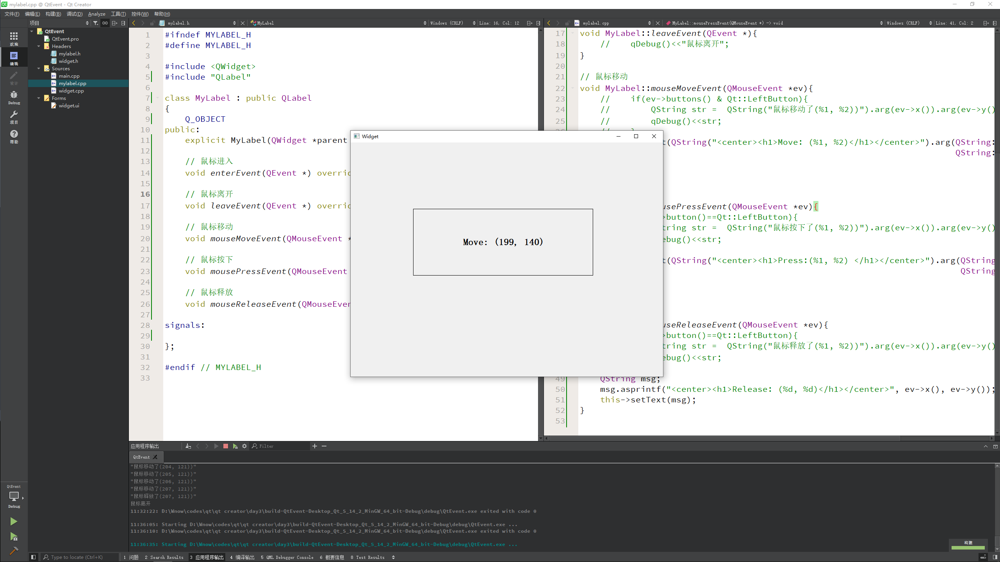

# Qt 消息机制和事件

---

## 事件

事件(`event`)是由系统或者 Qt 本身在不同的时刻发出的。当用户按下鼠标、敲下键盘，或者是窗口需要重新绘制的时候，都会发出一个相应的事件。一些事件在对用户操作做出响应时发出，如键盘事件等；另一些事件则是由系统自动发出，如计时器事件

在前面也简单提到，Qt 程序需要在 `main()` 函数创建一个 `QApplication` 对象，然后调用它的 `exec()` 函数。这个函数就是开始 Qt 的事件循环。在执行 `exec()` 函数之后，程序将进入事件循环来监听应用程序的事件。当事件发生时，Qt 将创建一个事件对象。Qt 中所有事件类都继承于 `QEvent`。在事件对象创建完毕后，Qt 将这个事件对象传递给 `QObject` 的 `event()` 函数。`event()` 函数并不直接处理事件，而是按照事件对象的类型分派给特定的事件处理函数(`event handler`)，关于这一点，会在后边详细说明

在所有组件的父类 `QWidget` 中，定义了很多事件处理的回调函数，如

* `keyPressEvent()`
* `keyReleaseEvent()`
* `mouseDoubleClickEvent()`
* `mouseMoveEvent()`
* `mousePressEvent()`
* `mouseReleaseEvent()` 
* 等等

这些函数都是 `protected virtual` 的，也就是说可以在子类中重新实现这些函数。下面来看一个例子：

`mylabel.h`

```c
#ifndef MYLABEL_H
#define MYLABEL_H

#include <QWidget>
#include "QLabel"

class MyLabel: public QLabel
{
    Q_OBJECT
public:
    explicit MyLabel(QWidget *parent = nullptr);

    // 鼠标进入
    void enterEvent(QEvent *) override;

    // 鼠标离开
    void leaveEvent(QEvent *) override;

    // 鼠标移动
    void mouseMoveEvent(QMouseEvent *ev) override;

    // 鼠标按下
    void mousePressEvent(QMouseEvent *ev) override;

    // 鼠标释放
    void mouseReleaseEvent(QMouseEvent *ev) override;

signals:

};

#endif // MYLABEL_H
```

`mylabel.c`

```c
#include "mylabel.h"
#include "QDebug"
#include "QMouseEvent"

MyLabel::MyLabel(QWidget *parent) : QLabel(parent)
{
    // 设置鼠标追踪
    this->setMouseTracking(true);
}

// 鼠标进入
void MyLabel::enterEvent(QEvent *){
    //    qDebug()<<"鼠标进入";
}

// 鼠标离开
void MyLabel::leaveEvent(QEvent *){
    //    qDebug()<<"鼠标离开";
}

// 鼠标移动
void MyLabel::mouseMoveEvent(QMouseEvent *ev){
    //    if(ev->buttons() & Qt::LeftButton){
    //        QString str =  QString("鼠标移动了(%1, %2))").arg(ev->x()).arg(ev->y());
    //        qDebug()<<str;
    //    }
    this->setText(QString("<center><h1>Move: (%1, %2)</h1></center>").arg(QString::number(ev->x()),
                                                                          QString::number(ev->y())));

}

// 鼠标按下
void MyLabel::mousePressEvent(QMouseEvent *ev){
    //    if(ev->button()==Qt::LeftButton){
    //        QString str =  QString("鼠标按下了(%1, %2))").arg(ev->x()).arg(ev->y());
    //        qDebug()<<str;
    //    }
    this->setText(QString("<center><h1>Press:(%1, %2) </h1></center>").arg(QString::number(ev->x()),
                                                                           QString::number(ev->y())));

}

// 鼠标释放
void MyLabel::mouseReleaseEvent(QMouseEvent *ev){
    //    if(ev->button()==Qt::LeftButton){
    //        QString str =  QString("鼠标释放了(%1, %2))").arg(ev->x()).arg(ev->y());
    //        qDebug()<<str;
    //    }
    QString msg;
    msg.asprintf("<center><h1>Release: (%d, %d)</h1></center>", ev->x(), ev->y());
    this->setText(msg);
}
```

* `EventLabel` 继承了 `QLabel`，覆盖了 `mousePressEvent()`、`mouseMoveEvent()` 和 `MouseReleaseEvent()` 三个函数。我们并没有添加什么功能，只是在鼠标按下(`press`)、鼠标移动(`move`)和鼠标释放(`release`)的时候，把当前鼠标的坐标值显示在这个 `Label` 上面。由于 `QLabel` 是支持 HTML 代码的，因此直接使用了 HTML 代码来格式化文字
* `QString` 的 `arg()` 函数可以自动替换掉 `QString` 中出现的占位符。其占位符以 `%` 开始，后面是占位符的位置，例如 `%1`，`%2` 这种 `QString("[%1, %2]").arg(x).arg(y);` 语句将会使用 `x` 替换 `%1`，`y` 替换 `%2`，因此，生成的 `QString` 为 `[x, y]`
* 在 `mouseReleaseEvent()` 函数中使用了另外一种 `QString` 的构造方法，类似 C 风格的格式化函数 `asprintf()` 来构造 `QString`

运行上面的代码，当点击了一下鼠标之后，`label` 上将显示鼠标当前坐标值



为什么要点击鼠标之后才能在 `mouseMoveEvent()` 函数中显示鼠标坐标值

这是因为 `QWidget` 中有一个 `mouseTracking` 属性，该属性用于设置是否追踪鼠标。只有鼠标被追踪时，`mouseMoveEvent()` 才会发出。如果 `mouseTracking` 是 `false`(默认即是)，组件在至少一次鼠标点击之后，才能够被追踪，也就是能够发出 `mouseMoveEvent()` 事件。如果 `mouseTracking`为 `true`，则 `mouseMoveEvent()` 直接可以被发出

知道了这一点，就可以在 `main()` 函数中添加如下代码：

```c
label->setMouseTracking(true);
```

在运行程序就没有问题了

---

## 定时器

`widget.h`

```c
#ifndef WIDGET_H
#define WIDGET_H

#include <QWidget>

QT_BEGIN_NAMESPACE
namespace Ui { class Widget; }
QT_END_NAMESPACE

class Widget : public QWidget
{
    Q_OBJECT

public:
    Widget(QWidget *parent = nullptr);
    ~Widget();

    // 添加定时器
    void timerEvent(QTimerEvent *e) override;

    // 第一个定时器标识
    int id1;
    // 第二个定时器标识
    int id2;

private:
    Ui::Widget *ui;
};

#endif // WIDGET_H
```

`widget.cpp`

```c
#include "widget.h"
#include "ui_widget.h"
#include "QTimer"
#include "QPushButton"

Widget::Widget(QWidget *parent)
    : QWidget(parent)
    , ui(new Ui::Widget)
{
    ui->setupUi(this);

    // 开启定时器
    this->id1 = this->startTimer(1000);
    this->id2 = this->startTimer(2000);

    // 创建定时器对象
    QTimer* time1=new QTimer(this);

    // 每隔 500 ms 发送信号
    this->connect(time1,&QTimer::timeout,[=](){
        // 每隔 0.5 秒，数字++
        static int num3=1;
        ui->label_4->setText(QString::number(num3++));
    });

    // 点击按钮开始
    this->connect(ui->pushButton_2,&QPushButton::clicked,[=](){
        time1->start(500);
    });
    // 点击按钮暂停
    this->connect(ui->pushButton,&QPushButton::clicked,[=](){
        time1->stop();
    });
}

Widget::~Widget()
{
    delete ui;
}

// 添加定时器
void Widget::timerEvent(QTimerEvent *e){
    if(e->timerId()==this->id1){
        // 每隔一秒，数字++
        static int num=1;
        ui->label_2->setText(QString::number(num++));
    }
    if(e->timerId() == this->id2){
        // 每隔两秒，数字++
        static int num2=1;
        ui->label_3->setText(QString::number(num2++));
    }
}
```

---

## 事件分发器与过滤器


全部代码如下:

`mylabel.h`

```c
#ifndef MYLABEL_H
#define MYLABEL_H

#include <QWidget>
#include "QLabel"

class MyLabel : public QLabel
{
    Q_OBJECT
public:
    explicit MyLabel(QWidget *parent = nullptr);

    // 鼠标进入
    void enterEvent(QEvent *) override;

    // 鼠标离开
    void leaveEvent(QEvent *) override;

    // 鼠标移动
    void mouseMoveEvent(QMouseEvent *ev) override;

    // 鼠标按下
    void mousePressEvent(QMouseEvent *ev) override;

    // 鼠标释放
    void mouseReleaseEvent(QMouseEvent *ev) override;

    // 事件分发器
    bool event(QEvent *e) override;

signals:

};

#endif // MYLABEL_H
```

`widget.h`

```c
#ifndef WIDGET_H
#define WIDGET_H

#include <QWidget>

QT_BEGIN_NAMESPACE
namespace Ui { class Widget; }
QT_END_NAMESPACE

class Widget : public QWidget
{
    Q_OBJECT

public:
    Widget(QWidget *parent = nullptr);
    ~Widget();

    // 添加定时器
    void timerEvent(QTimerEvent *e) override;

    // 第一个定时器标识
    int id1;

    // 第二个定时器标识
    int id2;

    // 重写过滤器事件
    bool eventFilter(QObject *obj, QEvent *event) override;

private:
    Ui::Widget *ui;
};

#endif // WIDGET_H
```

`mylabel.cpp`

```c
#include "mylabel.h"
#include "QDebug"
#include "QMouseEvent"

MyLabel::MyLabel(QWidget *parent) : QLabel(parent)
{
    // 设置鼠标追踪
    this->setMouseTracking(true);
}

// 鼠标进入
void MyLabel::enterEvent(QEvent *){
    //    qDebug()<<"鼠标进入";
}

// 鼠标离开
void MyLabel::leaveEvent(QEvent *){
    //    qDebug()<<"鼠标离开";
}

// 鼠标移动
void MyLabel::mouseMoveEvent(QMouseEvent *ev){
    //    if(ev->buttons() & Qt::LeftButton){
    //        QString str =  QString("鼠标移动了(%1, %2))").arg(ev->x()).arg(ev->y());
    //        qDebug()<<str;
    //    }
    this->setText(QString("<center><h1>Move: (%1, %2)</h1></center>").arg(QString::number(ev->x()),
                                                                          QString::number(ev->y())));

}

// 鼠标按下
void MyLabel::mousePressEvent(QMouseEvent *ev){
    //    if(ev->button()==Qt::LeftButton){
    QString str =  QString("鼠标按下了(%1, %2))").arg(ev->x()).arg(ev->y());
    qDebug()<<str;
    //    }
    //    this->setText(QString("<center><h1>Press:(%1, %2) </h1></center>").arg(QString::number(ev->x()),
    //                                                                           QString::number(ev->y())));

}

// 鼠标释放
void MyLabel::mouseReleaseEvent(QMouseEvent *ev){
    //    if(ev->button()==Qt::LeftButton){
    //        QString str =  QString("鼠标释放了(%1, %2))").arg(ev->x()).arg(ev->y());
    //        qDebug()<<str;
    //    }
    QString msg;
    msg.asprintf("<center><h1>Release: (%d, %d)</h1></center>", ev->x(), ev->y());
    this->setText(msg);
}

// 事件分发器，用途，分发事件
bool MyLabel::event(QEvent *e){
    if(e->type() == QEvent::MouseButtonPress){
        // 如果是鼠标按下，拦截事件，不向下分发
        QMouseEvent* ev = static_cast<QMouseEvent *>(e);
        QString str =  QString("event 鼠标按下了(%1, %2))").arg(ev->x()).arg(ev->y());
        qDebug()<<str;
        return true;
    }

    // 其他事件抛给父类处理
    return QLabel::event(e);
}
```

`widget.cpp`

```c
#include "widget.h"
#include "ui_widget.h"
#include "QTimer"
#include "QPushButton"
#include "QDebug"
#include "QMouseEvent"

Widget::Widget(QWidget *parent)
    : QWidget(parent)
    , ui(new Ui::Widget)
{
    ui->setupUi(this);

    // 开启定时器
    this->id1 = this->startTimer(1000);
    this->id2 = this->startTimer(2000);

    // 创建定时器对象
    QTimer* time1=new QTimer(this);

    // 每隔 500 ms 发送信号
    this->connect(time1,&QTimer::timeout,[=](){
        // 每隔 0.5 秒，数字++
        static int num3=1;
        ui->label_4->setText(QString::number(num3++));
    });

    // 点击按钮开始
    this->connect(ui->pushButton_2,&QPushButton::clicked,[=](){
        time1->start(500);
    });
    // 点击按钮暂停
    this->connect(ui->pushButton,&QPushButton::clicked,[=](){
        time1->stop();
    });

    // 给 Label 添加事件过滤器，做更高级的拦截

    // 给控件安装过滤器
    ui->label->installEventFilter(this);

}

Widget::~Widget()
{
    delete ui;
}

// 添加定时器
void Widget::timerEvent(QTimerEvent *e){
    if(e->timerId()==this->id1){
        // 每隔一秒，数字++
        static int num=1;
        ui->label_2->setText(QString::number(num++));
    }
    if(e->timerId() == this->id2){
        // 每隔两秒，数字++
        static int num2=1;
        ui->label_3->setText(QString::number(num2++));
    }
}

// 重写过滤器事件
bool Widget::eventFilter(QObject *obj, QEvent *e){
    if(obj == ui->label){
        if(e->type() == QEvent::MouseButtonPress){
            QMouseEvent* ev = static_cast<QMouseEvent *>(e);
            // 如果是鼠标按下，拦截事件，不向下分发
            QString str = QString("eventFilter 鼠标按下了(%1, %2))").arg(ev->x()).arg(ev->y());
            qDebug()<<str;
            return true;
        }
    }

    // 其他事件抛给父类
    return QWidget::eventFilter(obj,e);
}
```

---

## event()

事件对象创建完毕后，Qt 将这个事件对象传递给 `QObject` 的 `event()` 函数。`event()` 函数并不直接处理事件，而是将这些事件对象按照它们不同的类型，分发给不同的事件处理器 `event handler`

如上所述，`event()` 函数主要用于事件的分发。所以，如果你希望在事件分发之前做一些操作，就可以重写这个 `event()` 函数了。例如，我们希望在一个 `QWidget` 组件中监听 `tab` 键的按下，那么就可以继承 `QWidget`，并重写它的 `event()` 函数，来达到这个目的：

```c
bool CustomWidget::event(QEvent *e)
{
    if (e->type() == QEvent::KeyPress) {
        QKeyEvent *keyEvent = static_cast<QKeyEvent *>(e);
        if (keyEvent->key() == Qt::Key_Tab) {
            qDebug() << "You press tab.";
            return true;
        }
    }
    return QWidget::event(e);
}
```

`CustomWidget` 是一个普通的 `QWidget` 子类。我们重写了 `event()` 函数，这个函数有一个 `QEvent` 对象作为参数，也就是需要转发的事件对象。函数返回值是 `bool` 类型

* 如果传入的事件已被识别并且处理，则需要返回 `true`，否则返回 `false`。如果返回值是 `true`，那么 Qt 会认为这个事件已经处理完毕，不会再将这个事件发送给其它对象，而是会继续处理事件队列中的下一事件
* 在 `event()` 函数中，调用事件对象的 `accept()` 和 `ignore()` 函数是没有作用的，不会影响到事件的传播

我们可以通过使用 `QEvent::type()` 函数可以检查事件的实际类型，其返回值是 `QEvent::Type` 类型的枚举。处理过自己感兴趣的事件之后，可以直接返回 `true`，表示已经对此事件进行了处理；对于其它不关心的事件，则需要调用父类的 `event()` 函数继续转发，否则这个组件就只能处理我们定义的事件了。为了测试这一种情况，可以尝试下面的代码：

```c
bool CustomTextEdit::event(QEvent *e)
{
   if (e->type() == QEvent::KeyPress) 
{
        QKeyEvent *keyEvent = static_cast<QKeyEvent *>(e);
       if (keyEvent->key() == Qt::Key_Tab) 
{
            qDebug() << "You press tab.";
            return true;
       }
    }
    return false;
}
```

`CustomTextEdit` 是 `QTextEdit` 的一个子类。我们重写了其 `event()` 函数，却没有调用父类的同名函数。这样，我们的组件就只能处理 Tab 键，再也无法输入任何文本，也不能响应其它事件，比如鼠标点击之后也不会有光标出现。这是因为我们只处理的 `KeyPress` 类型的事件，并且如果不是 `KeyPress` 事件，则直接返回 `false`，鼠标事件根本不会被转发，也就没有了鼠标事件

通过查看 `QObject::event()` 的实现，我们可以理解，`event()` 函数同前面的章节中所说的事件处理器有什么联系：

```c
// Qt5
bool QObject::event(QEvent *e)
{
    switch (e->type()) {
    case QEvent::Timer:
        timerEvent((QTimerEvent*)e);
        break;
 
    case QEvent::ChildAdded:
    case QEvent::ChildPolished:
    case QEvent::ChildRemoved:
        childEvent((QChildEvent*)e);
        break;
    // ...
    default:
        if (e->type() >= QEvent::User) {
            customEvent(e);
            break;
        }
        return false;
    }
    return true;
}
```

这是 Qt5 中 `QObject::event()` 函数的源代码(Qt4 的版本也是类似的)。可以看到，同前面所说的一样，Qt 也是使用 `QEvent::type()` 判断事件类型，然后调用了特定的事件处理器。比如，如果 `event->type()` 返回值是 `QEvent::Timer`，则调用 `timerEvent()` 函数。可以想象，`QWidget::event()` 中一定会有如下的代码：

```c
switch (event->type()) {
    case QEvent::MouseMove:
        mouseMoveEvent((QMouseEvent*)event);
        break;
    // ...
}
```

事实也的确如此。`timerEvent()` 和 `mouseMoveEvent()` 这样的函数，就是前面章节所说的事件处理器 `event handler`。也就是说，`event()` 函数中实际是通过事件处理器来响应一个具体的事件。这相当于 `event()` 函数将具体事件的处理“委托”给具体的事件处理器。而这些事件处理器是 `protected virtual` 的，因此重写了某一个事件处理器，即可让 Qt 调用我们自己实现的版本

由此可以见，`event()` 是一个集中处理不同类型的事件的地方。如果你不想重写一大堆事件处理器，就可以重写这个 `event()` 函数，通过 `QEvent::type()` 判断不同的事件。鉴于重写 `event()` 函数需要十分小心注意父类的同名函数的调用，一不留神就可能出现问题，所以一般还是建议只重写事件处理器(当然，也必须记得是不是应该调用父类的同名处理器)。这其实暗示了 `event()` 函数的另外一个作用：屏蔽掉某些不需要的事件处理器。正如我们前面的 `CustomTextEdit` 例子看到的那样，我们创建了一个只能响应 tab 键的组件。这种作用是重写事件处理器所不能实现的

---

## 事件过滤器

有时候对象需要查看、甚至要拦截发送到另外对象的事件。例如，对话框可能想要拦截按键事件，不让别的组件接收到；或者要修改回车键的默认处理

通过前面的章节，我们已经知道，Qt 创建了 `QEvent` 事件对象之后，会调用 `QObject` 的 `event()` 函数处理事件的分发。显然可以在 `event()` 函数中实现拦截的操作。由于 `event()` 函数是 `protected` 的，因此，需要继承已有类。如果组件很多，就需要重写很多个 `event()` 函数。这当然相当麻烦，更不用说重写 `event()` 函数还得小心一堆问题。好在 Qt 提供了另外一种机制来达到这一目的：事件过滤器

`QObject` 有一个 `eventFilter()` 函数，用于建立事件过滤器。函数原型如下：

```c
virtual bool QObject::eventFilter(QObject* watched, QEvent* event ;
```

这个函数正如其名字显示的那样，是一个“事件过滤器”。所谓事件过滤器，可以理解成一种过滤代码。事件过滤器会检查接收到的事件。如果这个事件是我们感兴趣的类型，就进行我们自己的处理；如果不是，就继续转发。这个函数返回一个 `bool` 类型，如果你想将参数 `event` 过滤出来，比如，不想让它继续转发，就返回 `true`，否则返回 `false`。事件过滤器的调用时间是目标对象(也就是参数里面的 `watched` 对象)接收到事件对象之前。也就是说，如果你在事件过滤器中停止了某个事件，那么，`watched` 对象以及以后所有的事件过滤器根本不会知道这么一个事件

来看一段简单的代码：

```c
class MainWindow: public QMainWindow
{
public:
     MainWindow();
protected:
     bool eventFilter(QObject *obj, QEvent *event);
private:
     QTextEdit *textEdit;
};
 
MainWindow::MainWindow()
{
    textEdit = new QTextEdit;
    setCentralWidget(textEdit);
 
    textEdit->installEventFilter(this);
 }
 
bool MainWindow::eventFilter(QObject *obj, QEvent *event)
{
    if (obj == textEdit) {
        if (event->type() == QEvent::KeyPress) {
            QKeyEvent *keyEvent = static_cast<QKeyEvent *>(event);
            qDebug() << "Ate key press" << keyEvent->key();
            return true;
        } else {
            return false;
        }
    } else {
        // pass the event on to the parent class
        return QMainWindow::eventFilter(obj, event);
    }
}
```

* `MainWindow` 是我们定义的一个类。我们重写了它的 `eventFilter()` 函数。为了过滤特定组件上的事件，首先需要判断这个对象是不是我们感兴趣的组件，然后判断这个事件的类型。在上面的代码中，我们不想让 `textEdit` 组件处理键盘按下的事件。所以，首先找到这个组件，如果这个事件是键盘事件，则直接返回 `true`，也就是过滤掉了这个事件，其他事件还是要继续处理，所以返回 `false`。对于其它的组件，我们并不保证是不是还有过滤器，于是最保险的办法是调用父类的函数
* `eventFilter()` 函数相当于创建了过滤器，然后需要安装这个过滤器。安装过滤器需要调用 `QObject::installEventFilter()` 函数。函数的原型如下：

```C
void QObject::installEventFilter(QObject* filterObj)
```

这个函数接受一个 `QObject*` 类型的参数。记得刚刚我们说的，`eventFilter()` 函数是 `QObject` 的一个成员函数，因此，任意 `QObject` 都可以作为事件过滤器(问题在于，如果没有重写 `eventFilter()` 函数，这个事件过滤器是没有任何作用的，因为默认什么都不会过滤)。已经存在的过滤器则可以通过 `QObject::removeEventFilter()` 函数移除

* 我们可以向一个对象上面安装多个事件处理器，只要调用多次 `installEventFilter()` 函数。如果一个对象存在多个事件过滤器，那么，最后一个安装的会第一个执行，也就是后进先执行的顺序

还记得前面的那个例子吗？我们使用 `event()` 函数处理了 Tab 键：

```C
bool CustomWidget::event(QEvent *e)
{
    if (e->type() == QEvent::KeyPress) {
        QKeyEvent *keyEvent = static_cast<QKeyEvent *>(e);
        if (keyEvent->key() == Qt::Key_Tab) {
            qDebug() << "You press tab.";
            return true;
        }
    }
    return QWidget::event(e);
}
```

现在可以给出一个使用事件过滤器的版本：

```c
bool FilterObject::eventFilter(QObject *object, QEvent *event)
{
    if(object == target && event->type() == QEvent::KeyPress){
        QKeyEvent *keyEvent = static_cast<QKeyEvent *>(event);
        if(keyEvent->key() == Qt::Key_Tab){
            qDebug() << "You press tab.";
            return true;
        }else{
            return false;
        }
    }
    return false;
}
```

事件过滤器的强大之处在于，我们可以为整个应用程序添加一个事件过滤器。`installEventFilter()` 函数是 `QObject` 的函数，`QApplication` 或者 `QCoreApplication` 对象都是 `QObject` 的子类，因此，我们可以向 `QApplication` 或者 `QCoreApplication` 添加事件过滤器。这种全局的事件过滤器将会在所有其它特性对象的事件过滤器之前调用。尽管很强大，但这种行为会严重降低整个应用程序的事件分发效率。因此，除非是不得不使用的情况，否则的话我们不应该这么做

**注意**

事件过滤器和被安装过滤器的组件必须在同一线程，否则，过滤器将不起作用。另外，如果在安装过滤器之后，这两个组件到了不同的线程，那么，只有等到二者重新回到同一线程的时候过滤器才会有效

---

## 总结

Qt 的事件是整个 Qt 框架的核心机制之一，也比较复杂。说它复杂，更多是因为它涉及到的函数众多，而处理方法也很多，有时候让人难以选择。现在我们简单总结一下 Qt 中的事件机制

Qt 中有很多种事件：鼠标事件、键盘事件、大小改变的事件、位置移动的事件等等。如何处理这些事件，实际有两种选择：

* 所有事件对应一个事件处理函数，在这个事件处理函数中用一个很大的分支语句进行选择，其代表作就是 win32 API 的 `WndProc()` 函数：

```c
LRESULT CALLBACK WndProc(HWND hWnd, UINT message, WPARAM wParam, LPARAM lParam);
```

在这个函数中需要使用 `switch` 语句，选择 `message` 参数的类型进行处理，典型代码是：

```c
switch(message)
{
    case WM_PAINT:
        // ...
        break;
    case WM_DESTROY:
        // ...
        break;
    ...
}
```

* 每一种事件对应一个事件处理函数。Qt 就是使用的这么一种机制：
    * mouseEvent()
    * keyPressEvent()
    * ...

Qt 具有这么多种事件处理函数，肯定有一个地方对其进行分发，否则，Qt 怎么知道哪一种事件调用哪一个事件处理函数呢？这个分发的函数，就是 `event()`。显然，当 `QMouseEvent` 产生之后，`event()` 函数将其分发给 `mouseEvent()` 事件处理器进行处理

* `event()` 函数会有两个问题：
    * `event()` 函数是一个 `protected` 的函数，这意味着我们要想重写 `event()`，必须继承一个已有的类。试想，程序根本不想要鼠标事件，程序中所有组件都不允许处理鼠标事件，是不是我得继承所有组件，一一重写其 `event()` 函数？`protected` 函数带来的另外一个问题是，如果我基于第三方库进行开发，而对方没有提供源代码，只有一个链接库，其它都是封装好的。我怎么去继承这种库中的组件呢
    * `event()` 函数的确有一定的控制，不过有时候需求更严格一些：我希望那些组件根本看不到这种事件。`event()` 函数虽然可以拦截，但其实也是接收到了 `QMouseEvent` 对象。我连让它收都收不到。这样做的好处是，模拟一种系统根本没有那个事件的效果，所以其它组件根本不会收到这个事件，也就无需修改自己的事件处理函数。这种需求怎么办呢

这两个问题是 `event()` 函数无法处理的。于是，Qt 提供了另外一种解决方案：事件过滤器。事件过滤器给我们一种能力，让我们能够完全移除某种事件。事件过滤器可以安装到任意 `QObject` 类型上面，并且可以安装多个。如果要实现全局的事件过滤器，则可以安装到 `QApplication` 或者 `QCoreApplication` 上面。这里需要注意的是，如果使用 `installEventFilter()` 函数给一个对象安装事件过滤器，那么该事件过滤器只对该对象有效，只有这个对象的事件需要先传递给事件过滤器的 `eventFilter()` 函数进行过滤，其它对象不受影响。如果给 `QApplication` 对象安装事件过滤器，那么该过滤器对程序中的每一个对象都有效，任何对象的事件都是先传给 `eventFilter()` 函数

事件过滤器可以解决刚刚我们提出的 `event()` 函数的两点不足：
* 首先，事件过滤器不是 `protected` 的，因此我们可以向任何 `QObject` 子类安装事件过滤器
* 其次，事件过滤器在目标对象接收到事件之前进行处理，如果我们将事件过滤掉，目标对象根本不会见到这个事件

事实上，还有一种方法没有介绍。Qt 事件的调用最终都会追溯到 `QCoreApplication::notify()` 函数，因此，最大的控制权实际上是重写 `QCoreApplication::notify()`。这个函数的声明是：

```c
virtual bool QCoreApplication::notify(QObject* receiver, QEvent* event);
```

该函数会将 `event` 发送给 `receiver`，也就是调用 `receiver->event(event)`，其返回值就是来自 `receiver` 的事件处理器。注意，这个函数为任意线程的任意对象的任意事件调用，因此，它不存在事件过滤器的线程的问题。不过我们并不推荐这么做，因为 `notify()` 函数只有一个，而事件过滤器要灵活得多

现在总结一下 Qt 的事件处理，实际上是有五个层次：
* 重写 `paintEvent()`、`mousePressEvent()` 等事件处理函数。这是最普通、最简单的形式，同时功能也最简单
* 重写 `event()` 函数。`event()` 函数是所有对象的事件入口，`QObject` 和 `QWidget` 中的实现，默认是把事件传递给特定的事件处理函数
* 在特定对象上面安装事件过滤器。该过滤器仅过滤该对象接收到的事件
* 在 `QCoreApplication::instance()` 上面安装事件过滤器。该过滤器将过滤所有对象的所有事件，因此和 `notify()` 函数一样强大，但是它更灵活，因为可以安装多个过滤器。全局的事件过滤器可以看到 `disabled` 组件上面发出的鼠标事件。全局过滤器有一个问题：只能用在主线程
* 重写 `QCoreApplication::notify()` 函数。这是最强大的，和全局事件过滤器一样提供完全控制，并且不受线程的限制。但是全局范围内只能有一个被使用(因为 `QCoreApplication` 是单例的)

**小结**:

* Qt 鼠标常用事件
    * 鼠标进入 `EnterEvent`
    * 鼠标离开 `LeaveEvent`
    * 鼠标按下 `MousePressEvent`
    * 鼠标释放 `MouseReleaseEvent`
    * 鼠标移动 `MouseMoveEvent`
    * 获取 `x、y` 坐标 `ev->x()、ev->y()`
    * 判断如果是左键按下 `ev->button()` 移动 `ev->buttons() &`
    * 设置鼠标追踪状态 `setMouseTracking(true);`
* 定时器
    * 定时器事件 `void timerEvent(QTimerEvent* e)`
    * 启动定时器 `id1 = startTimer(毫秒)`
    * 判断具体定时器标准 `e->timerId() == id1`
* 定时器 2
    * 通过定时器类实现 `QTimer` 类
    * 创建定时器对象 `QTimer* timer1 = new QTimer(this);`
    * 开启定时器 `timer1->start(x 毫秒)`
    * 每隔 `x` 毫秒 会抛出一个信号 `timeout` 出来
    * 监听信号处理逻辑
    * 暂停定时器 `timer1->stop();`
* 事件分发器
    * 用途：用于分发事件
    * 原型 `bool event(QEvent* e);`
    * 返回值如果是 `true` 代表用户自己处理事件，不在向下分发
* 事件过滤器
    * 步骤1 给控件安装过滤器 `ui->label->installEventFilter(this);`
    * 步骤2 重写过滤器事件 `bool Widget::eventFilter(QObject* obj, QEvent* e)`

---
