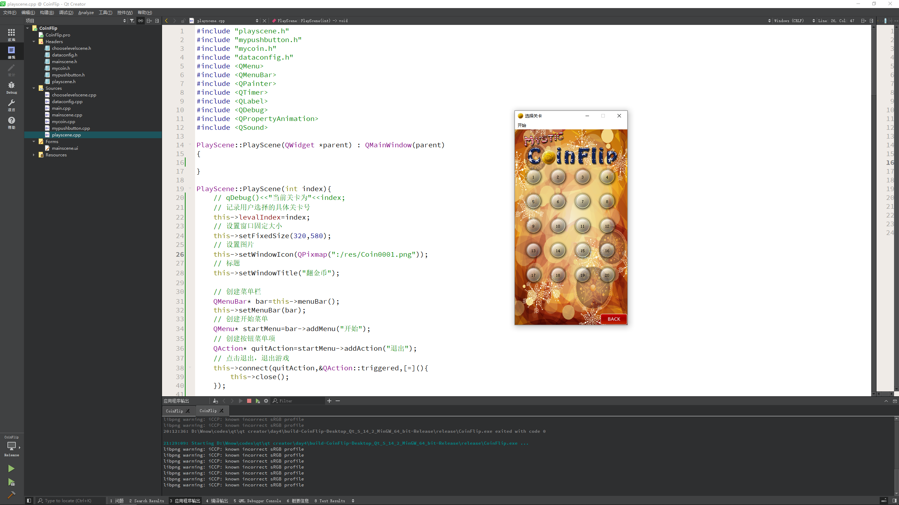
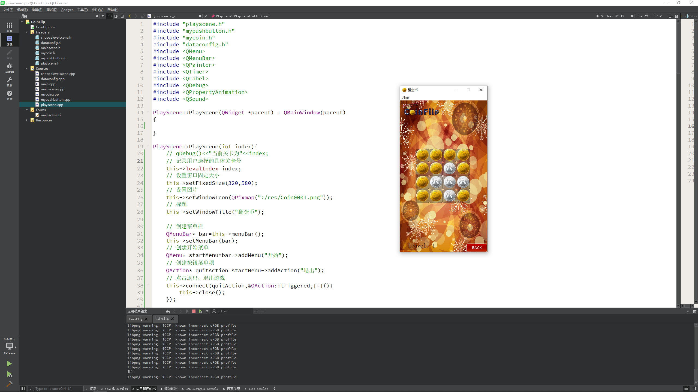
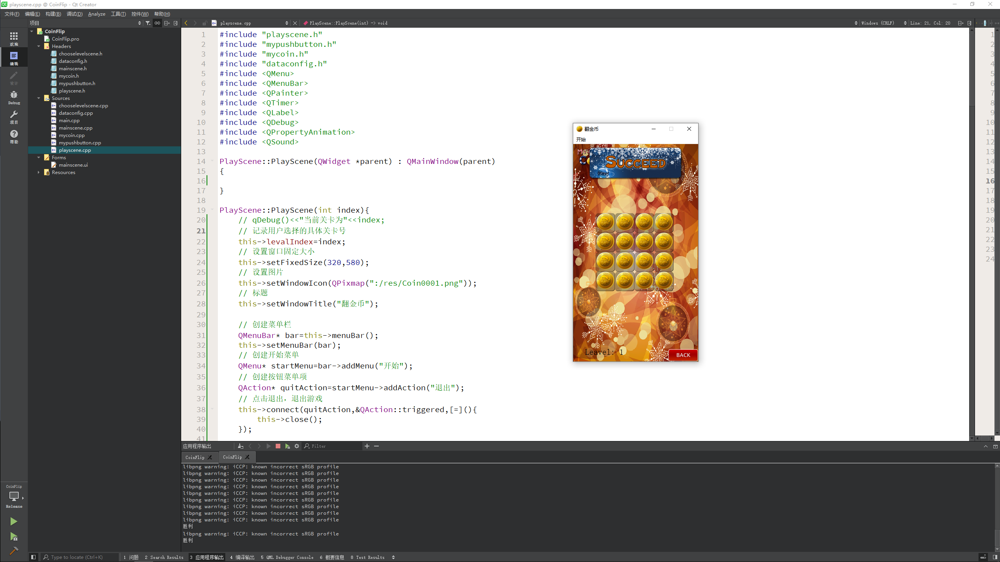

# 翻金币项目

翻金币项目是一款经典的益智类游戏，游戏设立了 20 个关卡供玩家选择，我们需要将金币都翻成同色，才视为胜利

---

## 项目基本配置

* 项目创建
    * 项目名称 `CoinFlip`
    * 创建主场景 `MainScene` 类
* 导入资源

---

## 主场景

* 窗口标题
* 窗口图标
* 窗口固定大小
* 点击开始下的退出，实现退出游戏
* 背景加载
* 背景图标加载

---

## 自定义按钮封装

* 创建 `MyPushButton` 类，继承于 `QPushButton`
* 构造函数中有两个参数(默认显示图片路径，按下后显示的图片路径 = "")
* 设置不规则图片
    * 设置图片大小 `this->setFixedSize(pix.width(),pix.height());`
    * 设置不规则图片样式 `this->setStyleSheet("QPushButton{border:0px;}");`
    * 设置图标 `this->setIcon(pix);`
    * 设置图标大小 `this->setIconSize(QSize(pix.width(),pix.height()));`
* 在主场景中测试 `start` 开始按钮

---

## 开始按钮特效封装

* 在自定义按钮 `MyPushButton` 类中添加 `zoom1` 和 `zoom2` 弹起效果函数
    * 创建动画对象 `QPropertyAnimation* animation = new QPropertyAnimation(this,"geometry");`
    * 设置动画时间间隔 `animation->setDuration(200);`
    * 设置起始位置 `animation->setStartValue(QRect(this->x(),this->y()+10,this->width(),this->height()));`
    * 设置结束位置 `animation->setEndValue(QRect(this->x(),this->y(),this->width(),this->height()));`
    * 设置弹起效果 `animation->setEasingCurve(QEasingCurve::OutBounce);`
    * 让动画执行 `animation->start(QAbstractAnimation::DeleteWhenStopped);`
* 测试，实现开始按钮弹起效果

---

## 创建选择关卡场景

* 创建选择关卡场景
* 点击开始按钮后，延时进入到选择关卡场景
    * `QTimer::singleShot(500,this,[=](){...};`
* 选择关卡场景的基本搭建

---

## 返回按钮实现

* 实现返回按钮切图功能
    * 重写鼠标按下
    * 重写鼠标释放
* 返回按钮功能实现
    * 点击之后发送自定义的信号
    * 在主场景中监听返回的信号，并且先选关场景隐藏，显示主场景

---

## 创建选择关卡的小按钮

* 利用一个 `for` 循环实现一个二维矩阵，并且创建 20 个按钮
* 点击按钮 响应用户具体选择的关卡号
* 在按钮上层创建 `QLabel` 显示具体关卡号
* `QLabel` 设置
    * 设置父窗口
    * 设置位置
    * 设置文本
    * 设置固定大小
    * 设置居中 `label->setAlignment(Qt::AlignHCenter | Qt::AlignVCenter);`
    * 设置鼠标穿透 51 号 `label->setAttribute(Qt::WA_TransparentForMouseEvents);`

---

## 创建游戏场景

* 创建 `PlayScene` 游戏核心场景
* 初始化场景中内容
* 选择关卡场景和游戏场景之间的切换
* 创建玩家具体显示的关卡号的标签
    * 设置位置和大小 `label->setGeometry(QRect(30,this->height()-50,120,50));`
    * 设置字体 `label->setFont(font);`
* 创建出显示金币的背景图案

---

## 金币类创建

* 创建 `MyCoin` 类，代表金币类
* 构造函数中传入显示的金币或者银币的图片路径
* 根据路径，显示不规则金币或者银币
* 在游戏场景中测试，创建出所有金币

---

## 配置文件导入

* 在项目中加入配置文件 `dataConfig.h` 和 `dataConfig.cpp`
* 在 `main` 函数中测试使用配置文件 
* `dataConfig config;`
* `config.mData[1][i][j];`

---

## 初始化关卡

* 利用配置文件的数据初始化每个关卡
* 在 `PlayScene` 中创建二维数组 `gameArra[4][4]` 维护当前关卡的金币或银币二维数组
* 根据当前关卡的二维数组初始化场景
* 测试

---

## 金币翻转特效实现

* 给每个硬币增加属性
    * `posX` x 坐标 
    * `posY` y 坐标
    * `flag` 正反面标志
* 增加行为
    * `changeFlag()` 改变状态
    * 在 `changeFlag` 改变状态后并且开启对应的定时器
* 监听定时器，并且执行切换动画
* 测试，可以对每个硬币进行翻转

---

## 优化游戏

* 当用户疯狂点击，动画在执行期间就会切到另一个动画中，需要解决这类问题
* 加一个标志解决，`bool isAnimation = flase;`
* 当做动画时候，将标志改为 `true`，并且屏蔽点击事件
* 做完动画，再将标志改为 `false`

---

## 翻转周围金币

* 创建金币的二维数组，方便翻转周围的金币
* `MyCoin* coinBtn[4][4];` // 金币按钮数组
* 当点击金币后，翻转周围，并且检测周围金币是否可以翻转
* 测试，延时可以翻转周围的金币

---

## 游戏胜利的检测

* 在 `PlayScene` 中加入 `isWin` 是否胜利的标志
* 翻转周围金币后，判断是否胜利
* 如果胜利，打印输出

---

## 游戏胜利后禁止点击

* 当游戏判断胜利后，禁止所有金币的点击
* 解决 bug，当手速过快可以在点击胜利后又点击其他金币的 bug

---

## 将胜利图片做动画

* 当游戏胜利后，胜利的图片做动画，向下移动

---

## 音效添加

* `QSound` 音效类
* 调用 `play` 播放音效
* 在三个场景中添加不同的音效并且播放
* 设置循环 `setLoop(x)` 如果 `x = -1` 代表无限循环

---

## 优化项目

* 将三个场景的切换在同一个位置上
* `this->setGeometry(this->playScene->geometry());`

---

## 项目扩展

* 倒计时
* 关卡增加
* 存档和读档

---

## 项目打包发布

* 切成 `release` 版本进行运行
* 将 `exe` 放入文件中
* 通过命令打包 `windeployqt.exe coinFlip.exe`
* 可以通过第三方工具再进行封装 `nis edit`

具体代码可见：

[code](../codes/CoinFlip/)

效果如下:

---
