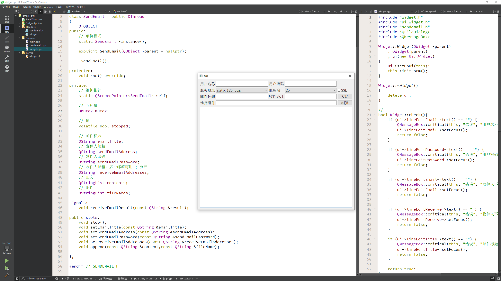
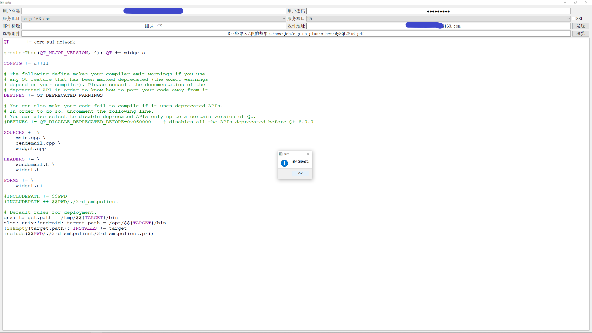
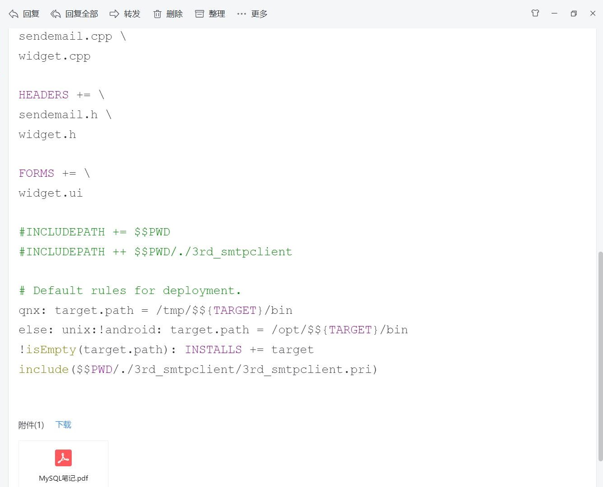
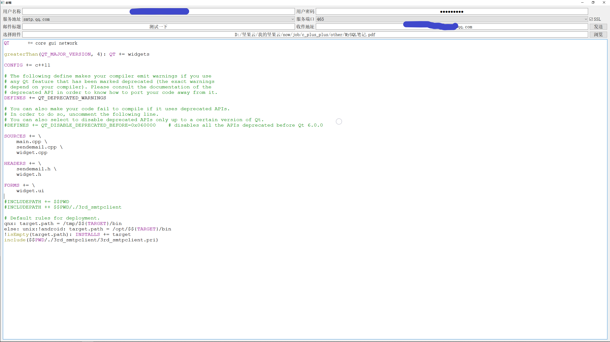
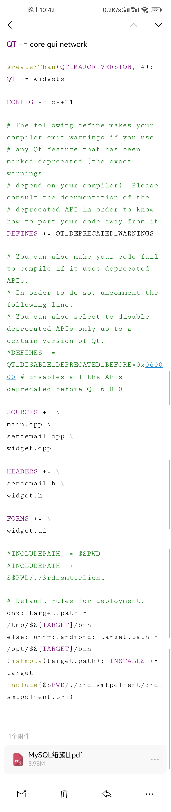

# 邮件系统

需要导入一个项目，[地址](https://gitcode.net/mirrors/feiyangqingyun/qwidgetdemo/-/tree/f027369f27edfe88f24339a8973ebc0b3a0ebb6d/3rd_smtpclient)

效果如下:

当然这个小 demo 还有不少可以优化的问题，这些问题会在 [项目](../../Project/content.md) 里面被完善，demo 模块更多的是一个个散件

---
