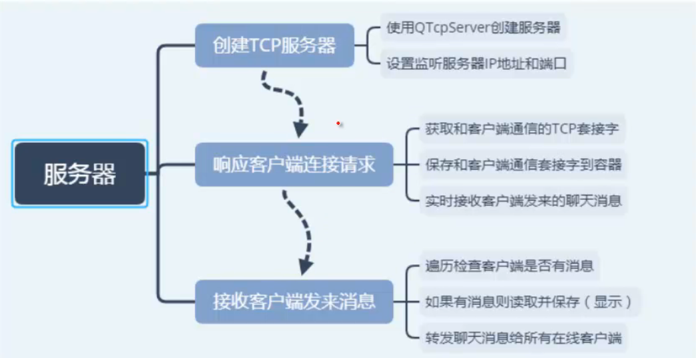
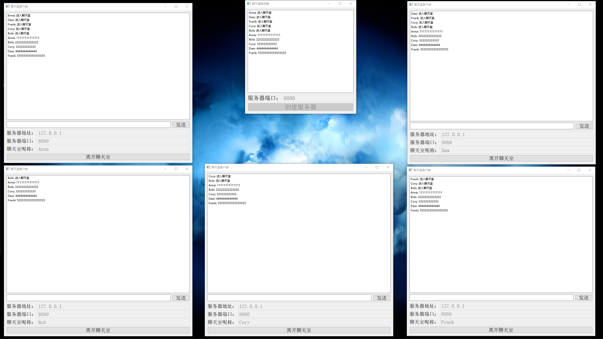
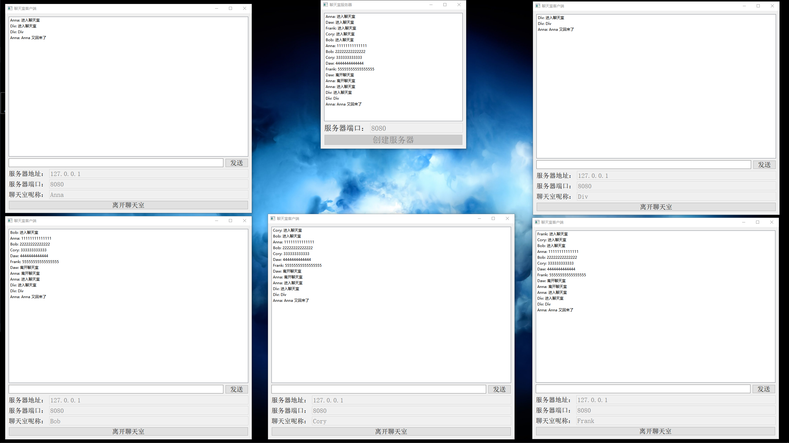

# 

---

## 需求分析

服务器：

* 基于 TCP 协议创建服务器
* 响应客户端的连接请求
* 实时接收所有客户端发来的聊天信息
* 保存，显示聊天消息，并转发给其他客户端
* 服务器要及时检查和客户端连接状态，如发现有客户端已经断开连接，需删除通信套接字

客户端：

* 创建 TCP 套接字
* 配置服务器的 IP，端口和聊天室呢称(可选)
* 向服务器发送连接请求
* 获取用户输入的聊天消息，发送到服务器
* 实时接收服务器转发的聊天信息，并显示

---

## 概要设计

服务器：

---

## 详细设计

TCP 协议

聊天服务器可以使用 `QTpServer` 类，客户端可以使用 `QTcpSocket` 类

---

## 代码编写

代码见

* [client](../codes/NetworkChat/Client/)
* [server](../codes/NetworkChat/Server/)

效果如下:

---
