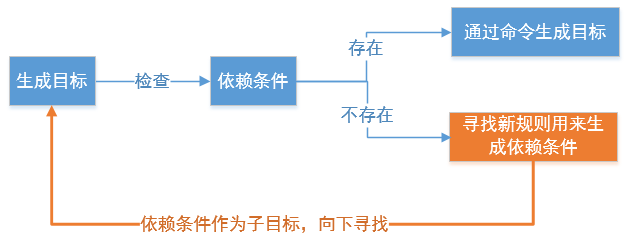
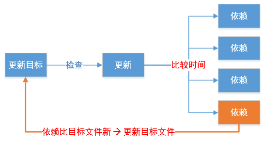
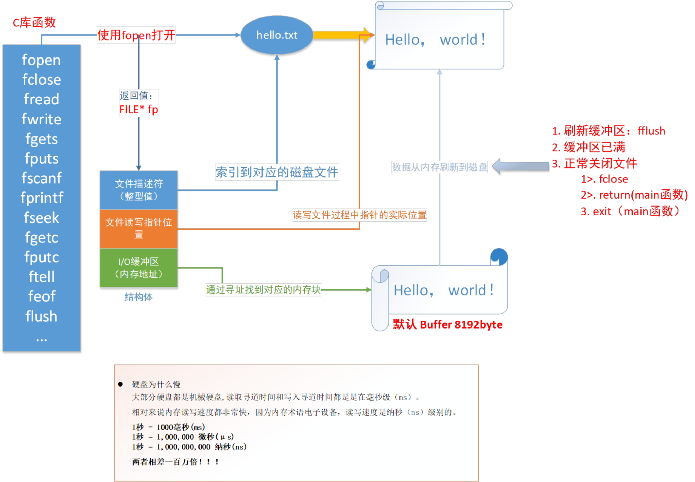
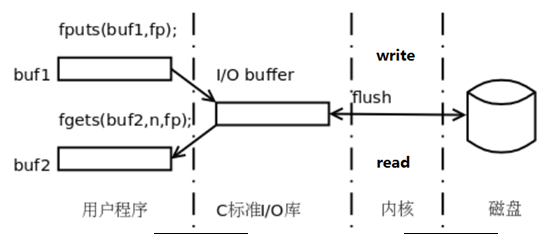
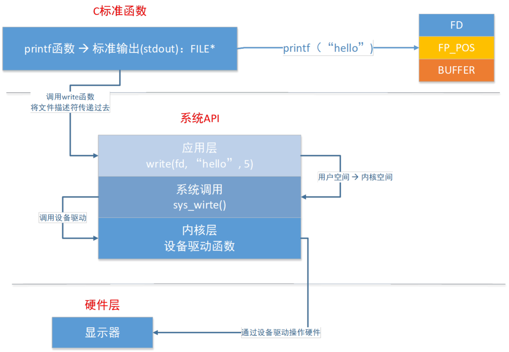
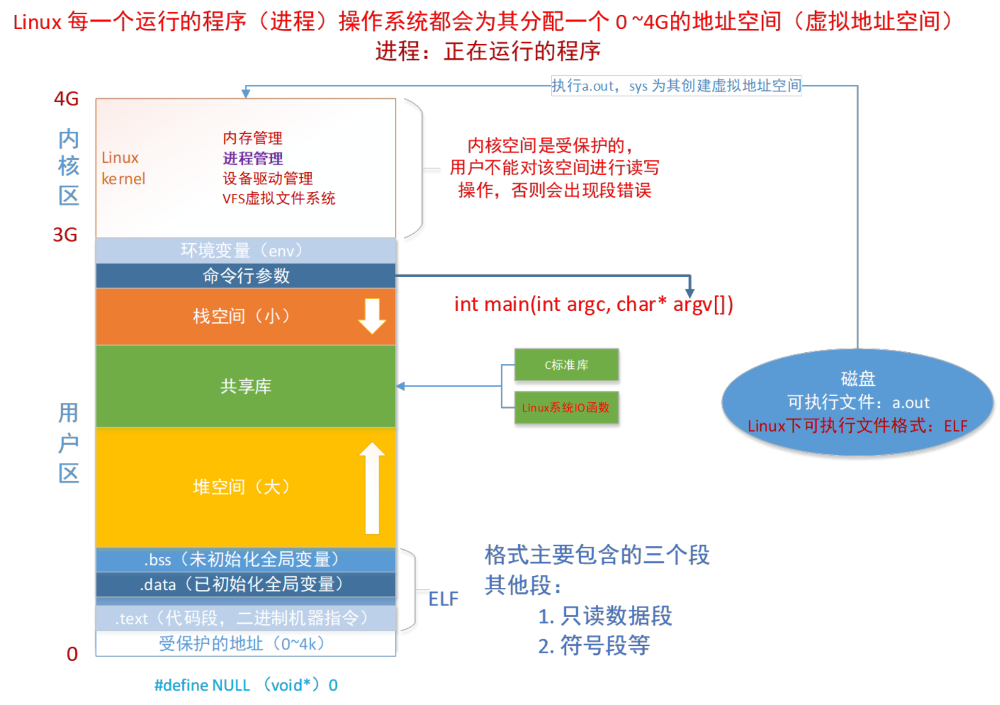
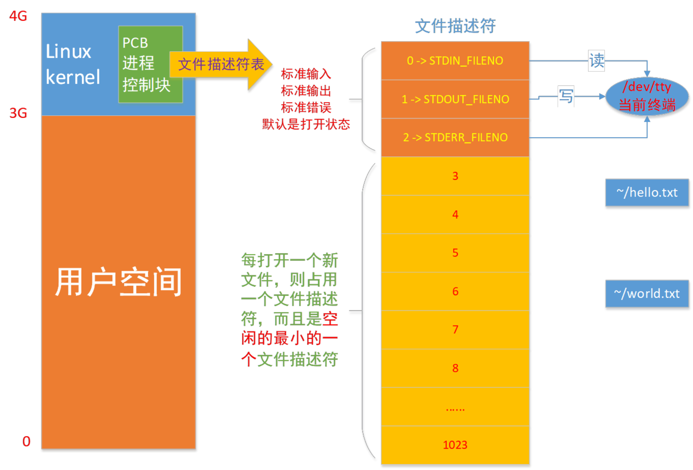

# makefile，gdb，文件 IO

**学习目标:**

* 熟练使用规则编写简单的 `makefile` 文件
* 熟练使用 `makefile` 中的变量
* 熟练使用 `makefile` 中的函数
* 熟练掌握 `gdb` 相关调试命令的使用
* 了解概念: `pcb` 和文件描述符，虚拟地址空间
* 熟练掌握 Linux 系统 IO 函数的使用

---

## makefile

`makefile` 文件中定义了一系列的规则来指定，哪些文件需要先编译，哪些文件需要后编译，哪些文件需要重新编译，甚至于进行更复杂的功能操作，因为 `makefile` 就像一个 Shell 脚本一样，其中也可以执行操作系统的命令

`makefile` 带来的好处就是——"自动化编译"，一旦写好，只需要一个 `make` 命令，整个工程完全自动编译，极大的提高了软件开发的效率

`make` 是一个命令工具，是一个解释 `makefile` 中指令的命令工具，一般来说，大多数的 IDE 都有这个命令，比如：Visual C++ 的 `nmake`，Linux 下 GNU 的 `make`

`makefile` 文件中会使用 `gcc` 编译器对源代码进行编译，最终生成可执行文件或者是库文件

`makefile` 文件的命名：`makefile` 或者 `Makefile`

### makefile 基本规则

`makefile` 由一组规则组成，规则如下:

```make
目标: 依赖
(tab)命令
```

`makefile` 基本规则三要素：

* 目标: 要生成的目标文件
* 依赖: 目标文件由哪些文件生成
* 命令: 通过执行该命令由依赖文件生成目标

下面以具体的例子来讲解：当前目录下有 `main.c`、`fun1.c`、`fun2.c`、`sum.c`、`head.h`，根据这个基本规则编写一个简单的 `makefile` 文件，生成可执行文件 `main`

```sh
# tree
.
├── fun1.c
├── fun2.c
├── head.h
├── main.c
├── makefile
└── sum.c

0 directories, 6 files
```

第一个版本的 `makefile`:

```make
main: main.c fun1.c fun2.c sum.c
	gcc -o main main.c fun1.c fun2.c sum.c -I ./
```

缺点: 效率低，修改一个文件，所有的文件会全部重新编译

### makefile 工作原理

**基本原则:**

若想生成目标，检查规则中的所有的依赖文件是否都存在:

* 如果有的依赖文件不存在，则向下搜索规则，看是否有生成该依赖文件的规则:
    * 如果有规则用来生成该依赖文件，则执行规则中的命令生成依赖文件
    * 如果则用来生成该依赖文件，则报错



* 如果所有依赖都存在，检查规则中的目标是否需要更新，必须先检查它的所有依赖，依赖中有任何一个被更新，则目标必须更新(检查的规则是哪个时间大哪个最新)
    * 若目标的时间 > 依赖的时间，不更新
    * 若目标的时间 < 依赖的时间，则更新



**总结:**

* 分析各个目标和依赖之间的关系
* 根据依赖关系自底向上执行命令
* 根据依赖文件的时间和目标文件的时间确定是否需要更新
* 如果目标不依赖任何条件，则执行对应命令，以示更新(如: 伪目标)

第二个版本:

```make
main: main.o fun1.o fun2.o sum.o
	gcc -o main main.o fun1.o fun2.o sum.o

main.o: main.c
	gcc -o main.o -c main.c -I ./

fun1.o: fun1.c
	gcc -o fun1.o -c fun1.c

fun2.o: fun2.c
	gcc -o fun2.o -c fun2.c

sum.o: sum.c
	gcc -o sum.o -c sum.c
```

缺点: 冗余，若 `.c` 文件数量很多，编写起来比较麻烦

### makefile 中的变量

在 `makefile` 中使用变量有点类似于 C 语言中的宏定义，使用该变量相当于内容替换，使用变量可以使 `makefile` 易于维护，修改起来变得简单

`makefile` 有三种类型的变量:

* 普通变量
* 自带变量
* 自动变量

### 普通变量

* 变量定义直接用 `=`
* 使用变量值用 `$(变量名)`

如: 下面是变量的定义和使用

```makefile
foo = abc			// 定义变量并赋值
bar = $(foo)		// 使用变量，$(变量名)
```

定义了两个变量: `foo`、`bar`，其中 `bar` 的值是 `foo` 变量值的引用

#### 自带变量

除了使用用户自定义变量，`makefile` 中也提供了一些变量(变量名大写)供用户直接使用，我们可以直接对其进行赋值：

```makefile
CC = gcc #arm-linux-gcc
CPPFLAGS: C 预处理的选项 -I
CFLAGS:   C 编译器的选项 -Wall -g -c
LDFLAGS:  链接器选项 -L  -l
```

#### 自动变量

* `$@`: 表示规则中的目标
* `$<`: 表示规则中的第一个条件
* `$^`: 表示规则中的所有条件，组成一个列表，以空格隔开，如果这个列表中有重复的项则消除重复项

特别注意：自动变量只能在规则的命令中使用

* 模式规则

至少在规则的目标定义中要包含 `%`，`%` 表示一个或多个，在依赖条件中同样可以使用 `%`，依赖条件中的 `%` 的取值取决于其目标:

比如: `main.o: main.c`、`fun1.o: fun1.c`、`fun2.o:fun2.c`，说的简单点就是: `xxx.o: xxx.c`

`makefile` 的第三个版本:

```makefile
target= main
object= main.o fun1.o fun2.o sum.o
CC= gcc
CPPFLAGS= -I ./

$(target): $(object)
	$(CC) -o $@ $^

%.o: %.c
	$(CC) -o $@ -c $< $(CPPFLAGS)
```

### makefile 函数

`makefile` 中的函数有很多，在这里介绍两个最常用的

* `wildcard` – 查找指定目录下的指定类型的文件
    * `src=$(wildcard *.c)` // 到当前目录下所有后缀为 `.c` 的文件，赋值给 `src`
* `patsubst` – 匹配替换
    * `obj=$(patsubst %.c, %.o, $(src))` // 把 `src` 变量里所有后缀为 `.c` 的文件替换 `.o`

在 `makefile` 中所有的函数都是有返回值的

当前目录下有 `main.c fun1.c fun2.c sum.c head.h`

* `src=$(wildcard *.c)` 等价于 `src = main.c fun1.c fun2.c sum.c`
* `obj=$(patsubst %.c, %.o, $(src))` 等价于 `obj = main.o fun1.o fun2.o sum.o`

`makefile` 的第四个版本:

```makefile
src= $(wildcard ./*.c)
object= $(patsubst %.c, %.o, $(src))
target= main
CC= gcc
CPPFLAGS= -I ./

$(target): $(object)
	$(CC) -o $@ $^

%.o: %.c
	$(CC) -o $@ -c $< $(CPPFLAGS)
```

缺点: 每次重新编译都需要手工清理中间 `.o` 文件和最终目标文件

### makefile 的清理操作

用途：清除编译生成的中间 `.o` 文件和最终目标文件

`make clean` 如果当前目录下有同名 `clean` 文件，则不执行 `clean` 对应的命令，解决方案

* 伪目标声明: `.PHONY: clean` 
    * 声明目标为伪目标之后 `makefile` 将不会检查该目标是否存在或者该目标是否需要更新
* `clean` 命令中的特殊符号：
    * `-` 此条命令出错，`make` 也会继续执行后续的命令。如: `-rm main.o"`
        * `rm -f`: 强制执行，比如若要删除的文件不存在使用 `-f` 不会报错
    * `@` 不显示命令本身，只显示结果。如: `@echo clean done`
* 其它
    * `– make` 默认执行第一个出现的目标，可通过 `make dest` 指定要执行的目标
    * `– make -f`: `-f` 执行一个 `makefile` 文件名称，使用 `make` 执行指定的 `makefile: make -f mainmak`

`makefile` 的第 5 个版本:

```makefile
target= main
src= $(wildcard ./*.c)
object= $(patsubst %.c, %.o, $(src))
CC= gcc
CPPFLAGS= -I ./

$(target): $(object)
	$(CC) -o $@ $^

%.o: %.c 
	$(CC) -o $@ -c $< $(CPPFLAGS)

.PHONY: clean
clean:
	-rm -f $(target) $(object)
```

在 `makefile` 的第 5 个版本中，综合使用了变量，函数，模式规则和清理命令，是一个比较完善的版本

```sh
# make
gcc -o fun1.o -c fun1.c -I ./
gcc -o fun2.o -c fun2.c -I ./
gcc -o sum.o -c sum.c -I ./
gcc -o main.o -c main.c -I ./
gcc -o main fun1.o fun2.o sum.o main.o
# tree
.
├── fun1.c
├── fun1.o
├── fun2.c
├── fun2.o
├── head.h
├── main
├── main.c
├── main.o
├── makefile
├── sum.c
└── sum.o

0 directories, 11 files
# ./main
this is main!
[0]: [./main]
this is fun1
this is fun2
sum(10) == [45]
# make clean
rm -f main  ./fun1.o  ./fun2.o  ./sum.o  ./main.o
# tree
.
├── fun1.c
├── fun2.c
├── head.h
├── main.c
├── makefile
└── sum.c

0 directories, 6 files
# 
```

---

## gdb 调试

### gdb 介绍

GDB(GNU Debugger)是 GCC 的调试工具，其功能强大。GDB 主要帮忙你完成下面四个方面的功能：

* 启动程序，可以按照你的自定义的要求随心所欲的运行程序
* 可让被调试的程序在你所指定的断点处停住(断点可以是条件表达式)
* 当程序被停住时，可以检查此时你的程序中所发生的事
* 动态的改变你程序的执行环境

### 生成调试信息

一般来说 GDB 主要调试的是 C/C++ 的程序。要调试 C/C++ 的程序，首先在编译时，必须要把调试信息加到可执行文件中。使用编译器 `cc/gcc/g++` 的 `-g` 参数可以做到这一点。如：

```sh
gcc -o main -g main.c
```

如果没有 `-g`，将看不见程序的函数名、变量名，所代替的全是运行时的内存地址。当用 `-g` 把调试信息加入之后，并成功编译目标代码以后，让我们来看看如何用 `gdb` 来调试

### 启动 gdb

* 启动 `gdb`：`gdb program`
    * `program` 也就是执行文件，一般在当前目录下
* 设置运行参数
    * `set args` 可指定运行时参数，如：`set args 10 20 30 40 50`
    * `show args` 命令可以查看设置好的运行参数。
* 启动程序
    * `run`：程序开始执行，如果有断点，停在第一个断点处
    * `start`：程序向下执行一行(在第一条语句处停止)

### 显示源代码

GDB 可以打印出所调试程序的源代码，当然，在程序编译时一定要加上 `-g` 参数，把源程序信息编译到执行文件中。不然就看不到源程序了。当程序停下来以后，GDB 会报告程序停在了那个文件的第几行上。可以用 `list` 命令来打印程序的源代码，默认打印 10 行，`list` 命令的用法如下所示:

* `list linenum`：打印第 `linenum` 行的上下文内容
* `list function`：显示函数名为 `function` 的函数的源程序
* `list`：显示当前行后面的源程序
* `list -`：显示当前文件开始处的源程序
* `list file: linenum`: 显示 `file` 文件下第 `n` 行
* `list file: function`: 显示 `file` 文件的函数名为 `function` 的函数的源程序

一般是打印当前行的上 5 行和下 5 行，如果显示函数是是上 2 行下 8 行，默认是 10 行，当然，也可以定制显示的范围，使用下面命令可以设置一次显示源程序的行数

* `set listsize count`：设置一次显示源代码的行数         
* `show listsize`：查看当前 `listsize` 的设置

### 设置断点

**简单断点—当前文件**

* `break` 设置断点，可以简写为 `b`
    * `b 10` 设置断点，在源程序第 10 行
    * `b func` 设置断点，在 `func` 函数入口处

**多文件设置断点---其他文件**

* 在进入指定函数时停住:
    * `b filename: linenum` -- 在源文件 `filename`的 `linenum` 行处停住
    * `b filename: function` -- 在源文件 `filename` 的 `function` 函数的入口处停住

**查询所有断点**

* `info b` == `info break` == `i break` == `i b`

**条件断点**

一般来说，为断点设置一个条件，使用 `if` 关键词，后面跟其断点条件。设置一个条件断点：

```sh
b test.c:8 if intValue == 5
```

**维护断点**

* `delete [range...]` 删除指定的断点，其简写命令为 `d`
    * 如果不指定断点号，则表示删除所有的断点。`range` 表示断点号的范围(如：3-7)
        * 删除某个断点: `delete num`
        * 删除多个断点: `delete num1 num2 ...` 
        * 删除连续的多个断点: `delete m-n`
        * 删除所有断点: `delete`
    * 比删除更好的一种方法是 `disable` 停止点，`disable` 了的停止点，GDB 不会删除，当你还需要时，`enable` 即可，就好像回收站一样
* `disable [range...]` 使指定断点无效，简写命令是 `dis`，如果什么都不指定，表示 `disable` 所有的停止点
    * 使一个断点无效/有效: `disable num`
    * 使多个断点无效有效: `disable num1 num2 ...`
    * 使多个连续的断点无效有效: `disable m-n`
    * 使所有断点无效有效: `disable`
* `enable [range...]` 使无效断点生效，简写命令是 `ena`。如果什么都不指定，表示 `enable` 所有的停止点
    * 使一个断点无效/有效: `enable num`
    * 使多个断点无效有效: `enable num1 num2 ...`
    * 使多个连续的断点无效有效: `enable m-n`
    * 使所有断点无效有效: `disable/enable`

### 调试代码

* `run` 运行程序，可简写为 `r`
* `next` 单步跟踪，函数调用当作一条简单语句执行，可简写为 `n`
* `step` 单步跟踪，函数调进入被调用函数体内，可简写为 `s`
* `finish` 退出进入的函数，如果出不去，看一下函数体中的循环中是否有断点，如果有删掉，或者设置无效
* `until` 在一个循环体内单步跟踪时，这个命令可以运行程序直到退出循环体，可简写为 `u`，如果出不去，看一下函数体中的循环中是否有断点，如果有删掉，或者设置无效
* `continue` 继续运行程序，可简写为 `c`(若有断点则跳到下一个断点处)

### 查看变量的值

查看运行时变量的值

`print` 打印变量、字符串、表达式等的值，可简写为 `p`

`p count` ----- 打印 `count` 的值

自动显示变量的值

可以设置一些自动显示的变量，当程序停住时，或是单步跟踪时，这些变量会自动显示。相关的GDB命令是 `display`

* `display 变量名`
* `info display` -- 查看 `display` 设置的自动显示的信息
* `undisplay num`(`info display` 时显示的编号)
* `delete display dnums...` -- 删除自动显示，`dnums` 意为所设置好了的自动显式的编号。如果要同时删除几个，编号可以用空格分隔，如果要删除一个范围内的编号，可以用减号表示(如：2-5)
    * 删除某个自动显示: `undisplay num` 或者 `delete display num`
    * 删除多个: `delete display num1 num2`
    * 删除一个范围: `delete display m-n`
* `disable display dnums...`
    * 使一个自动显示无效: `disable display num`
    * 使多个自动显示无效: `delete display num1 num2`
    * 使一个范围的自动显示无效: `delete display m-n`
* `enable display dnums...`
    * 使一个自动显示有效: `enable display num`
    * 使多个自动显示有效: `enable display num1 num2`
    * 使一个范围的自动显示有效: `enable display m-n`
* `disable` 和 `enalbe` 不删除自动显示的设置，而只是让其失效和恢复

查看修改变量的值

* `p type width` -- 查看变量 `width` 的类型 `type = double`
* `p width` -- 打印变量 `width` 的值 `$4 = 13`

你可以使用 `set var` 命令来告诉 GDB，`width` 不是 GDB 的参数，而是程序的变量名，如：

`set var width = 47`  // 将变量 `var` 值设置为 47

在你改变程序变量取值时，最好都使用 `set var` 格式的 GDB 命令

---

## 文件 IO

从本章开始学习各种 Linux 系统函数，这些函数的用法必须结合 Linux 内核的工作原理来理解，因为系统函数正是内核提供给应用程序的接口，而要理解内核的工作原理，必须熟练掌握 C 语言，因为内核也是用 C 语言写的，我们在描述内核工作原理时必然要用"指针"、"结构体"、"链表"这些名词来组织语言，就像只有掌握了英语才能看懂英文书一样，只有学好了 C 语言才能看懂内核工作原理

### C 库 IO 函数的工作流程





C 语言操作文件相关问题:

使用 `fopen` 函数打开一个文件，返回一个 `FILE* fp`，这个指针指向的结构体有三个重要的成员

* 文件描述符: 通过文件描述可以找到文件的 `inode`，通过 `inode` 可以找到对应的数据块
* 文件指针: 读和写共享一个文件指针，读或者写都会引起文件指针的变化
* 文件缓冲区: 读或者写会先通过文件缓冲区，主要目的是为了减少对磁盘的读写次数，提高读写磁盘的效率

备注: 

* 头文件 `stdio.h` 的第 48 行处: `typedef struct _IO_FILE FILE;`
* 头文件 `libio.h` 的第 241 行处: `struct _IO_FILE`，这个接头体定义中有一个 `_fileno` 成员，这个就是文件描述符

### C 库函数与系统函数的关系



系统调用: 由操作系统实现并提供给外部应用程序的编程接口，(Application Programming Interface，API)，是应用程序同系统之间数据交互的桥梁

### 虚拟地址空间



进程的虚拟地址空间分为用户区和内核区，其中内核区是受保护的，用户是不能够对其进行读写操作的；内核区中很重要的一个就是进程管理，进程管理中有一个区域就是 PCB(本质是一个结构体)；
PCB 中有文件描述符表，文件描述符表中存放着打开的文件描述符，涉及到文件的 IO 操作都会用到这个文件描述符

### pcb 和文件描述符表



备注: 

`pcb`：结构体: `task_stuct`，该结构体在: `/usr/src/linux-headers-5.4.0-100/include/linux/sched.h`

一个进程有一个文件描述符表：1024

* 前三个被占用，分别是 `STDIN_FILENO`，`STDOUT_FILENO`，`STDERR_FILENO`
* 文件描述符作用：通过文件描述符找到 `inode`，通过 `inode` 找到磁盘数据块

虚拟地址空间 🡪 内核区 🡪 PCB 🡪 文件描述表 🡪 文件描述符 🡪 文件 IO 操作使用文件描述符

---
