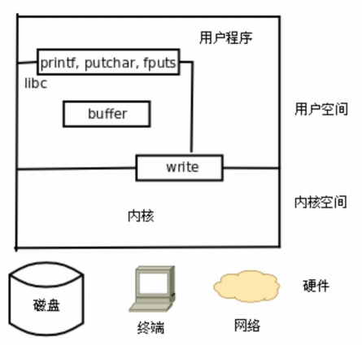
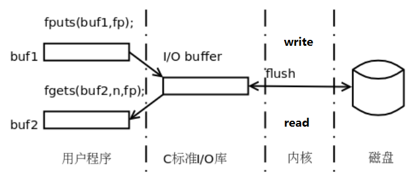
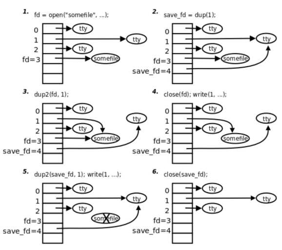

# 文件和目录操作

**学习目标**

* 掌握 `/open/read/write/lseek/close` 函数的使用
* 掌握 `stat/lstat` 函数的使用
* 掌握目录遍历相关函数的使用
* 掌握 `dup`、`dup2` 函数的使用
* 掌握 `fcntl` 函数的使用

## 文件 IO

从本章开始学习各种 Linux 系统函数，这些函数的用法必须结合 Linux 内核的工作原理来理解，因为系统函数正是内核提供给应用程序的接口，而要理解内核的工作原理，必须熟练掌握 C 语言，因为内核也是用 C 语言写的，我们在描述内核工作原理时必然要用"指针"、"结构体"、"链表"这些名词来组织语言，就像只有掌握了英语才能看懂英文书一样，只有学好了 C 语言才能看懂我描述的内核工作原理

### C 标准函数与系统函数的区别

#### 什么是系统调用

由操作系统实现并提供给外部应用程序的编程接口(Application Programming Interface，API)是应用程序同系统之间数据交互的桥梁

一个 `helloworld` 如何打印到屏幕



每一个 `FILE` 文件流(标准 C 库函数)都有一个缓冲区 `buffer`，默认大小 `8192Byte`。Linux 系统的 IO 函数默认是没有缓冲区



### open/close

#### 文件描述符

一个进程启动之后，默认打开三个文件描述符：

```c
#define STDIN_FILENO 0
#define STDOUT_FILENO 1
#define STDERR_FILENO 2
```

新打开文件返回文件描述符表中未使用的最小文件描述符，调用 `open` 函数可以打开或创建一个文件，得到一个文件描述符

#### open 函数

* 函数描述: 打开或者新建一个文件
* 函数原型:

```c
int open(const char *pathname, int flags);
int open(const char *pathname, int flags, mode_t mode);
```

* 函数参数：
    * `pathname` 参数是要打开或创建的文件名，和 `fopen` 一样，`pathname` 既可以是相对路径也可以是绝对路径
    * `flags` 参数有一系列常数值可供选择，可以同时选择多个常数用按位或运算符连接起来，所以这些常数的宏定义都以 `O_` 开头，表示 `or`
        * 必选项: 以下三个常数中必须指定一个，且仅允许指定一个
            * `O_RDONLY` 只读打开
            * `O_WRONLY` 只写打开
            * `O_RDWR` 可读可写打开
        * 以下可选项可以同时指定 0 个或多个，和必选项按位或起来作为 `flags` 参数。可选项有很多，这里只介绍几个常用选项：
            * `O_APPEND` 表示追加。如果文件已有内容，这次打开文件所写的数据附加到文件的末尾而不覆盖原来的内容
            * `O_CREAT` 若此文件不存在则创建它。使用此选项时需要提供第三个参数 `mode`，表示该文件的访问权限
            * `O_EXCL` 如果同时指定了 `O_CREAT`，并且文件已存在，则出错返回
            * `O_TRUNC` 如果文件已存在，将其长度截断为为 0 字节
            * `O_NONBLOCK` 对于设备文件，以 `O_NONBLOCK` 方式打开可以做非阻塞 I/O (`NonblockI/O`)，非阻塞 I/O
    * 文件最终权限：`mode & ~umask`
* 函数返回值:
    * 成功: 返回一个最小且未被占用的文件描述符
    * 失败: 返回 -1，并设置 `errno` 值

#### close 函数

* 函数描述: 关闭文件
* 函数原型: `int close(int fd);`
* 函数参数: `fd` 文件描述符
* 函数返回值:
    * 成功返回 0
    * 失败返回 -1，并设置 `errno` 值

需要说明的是，当一个进程终止时，内核对该进程所有尚未关闭的文件描述符调用 `close` 关闭，所以即使用户程序不调用 `close`，在终止时内核也会自动关闭它打开的所有文件。但是对于一个长年累月运行的程序(比如网络服务器)，打开的文件描述符一定要记得关闭，否则随着打开的文件越来越多，会占用大量文件描述符和系统资源

### read/write

#### read 函数

* 函数描述: 从打开的设备或文件中读取数据
* 函数原型: `ssize_t read(int fd, void *buf, size_t count);`
* 函数参数:
    * `fd`: 文件描述符
    * `buf`: 读上来的数据保存在缓冲区 `buf` 中
    * `count`: `buf` 缓冲区存放的最大字节数
* 函数返回值:
    * `>0`：读取到的字节数
    * `=0`：文件读取完毕
    * `-1`：出错，并设置 `errno`

```c
#include <stdio.h>
#include <stdlib.h>
#include <fcntl.h>
#include <unistd.h>
#include <string.h>
#include <sys/stat.h>
#include <sys/types.h>

void testRead1()
{
    // 读标准输入
    char buf[1024];
    memset(buf, 0, sizeof(buf));
    int n = read(STDIN_FILENO, buf, sizeof(buf));
    printf("First: n == %d, buf == %s", n, buf);
}

void testRead2()
{
    // 读标准输入
    char buf[64];
    memset(buf, 0, sizeof(buf));
    int n = read(STDIN_FILENO, buf, sizeof(buf));
    printf("Read: n == %d, buf == %s", n, buf);
}

void testRead3(char *argv[])
{
    // 打开文件
    int fd = open(argv[1], O_RDWR);
    if (fd < 0)
    {
        perror("open error");
        return;
    }

    // 读文件
    char buf[1024];
    memset(buf, 0, sizeof(buf));
    int n = read(fd, buf, sizeof(buf));
    printf("First: n == %d, buf == %s\n", n, buf);

    // 再次读文件，验证 read 函数是否堵塞
    memset(buf, 0, sizeof(buf));
    n = read(fd, buf, sizeof(buf));
    printf("Second: n == %d, buf == %s\n", n, buf);

    // 关闭文件
    close(fd);
}

int main(int argc, char *argv[])
{
    // testRead1();

    /*
        hello cpp!
        First: n == 11, buf == hello cpp!
    */

    // testRead2();

    /*
        hello cpp
        Read: n == 10, buf == hello cpp
    */

    testRead3(argv);

    /*
        First: n == 9, buf == hello cpp
        Second: n == 0, buf ==
    */

    return 0;
}
```

#### write 函数

* 函数描述: 向打开的设备或文件中写数据
* 函数原型: `ssize_t write(int fd, const void *buf, size_t count);`
* 函数参数： 
    * `fd`：文件描述符
    * `buf`：缓冲区，要写入文件或设备的数据
    * `count`：`buf` 中数据的长度
* 函数返回值:
    * 成功：返回写入的字节数
    * 错误：返回 -1 并设置 `errno`

```c
#include <stdio.h>
#include <stdlib.h>
#include <fcntl.h>
#include <unistd.h>
#include <string.h>
#include <sys/stat.h>
#include <sys/types.h>

int main(int argc, char *argv[])
{
    // 打开文件
    int fd = open(argv[1], O_RDWR | O_CREAT, 0777);
    if (fd < 0)
    {
        perror("open error");
        return -1;
    }

    // 写文件
    // ssize_t write(int fd, const void *buf, size_t count);
    write(fd, "hello cpp", strlen("hello cpp"));

    // 移动文件指针到文件开始处
    // off_t lseek(int fd, off_t offset, int whence);
    lseek(fd, 0, SEEK_SET);

    // 读文件
    // ssize_t read(int fd, void *buf, size_t count);
    char buf[1024];
    memset(buf, 0, sizeof(buf));
    int n = read(fd, buf, sizeof(buf));
    printf("n == [%d], buf == [%s]\n", n, buf);

    // 关闭文件
    close(fd);

    // n == [9], buf == [hello cpp]

    return 0;
}
```

### lseek

所有打开的文件都有一个当前文件偏移量(current file offset)，以下简称为 `cfo`。`cfo` 通常是一个非负整数，用于表明文件开始处到文件当前位置的字节数。读写操作通常开始于 `cfo`，并且使 `cfo` 增大，增量为读写的字节数。文件被打开时，`cfo` 会被初始化为 0，除非使用了 `O_APPEND`

使用 `lseek` 函数可以改变文件的 `cfo`

```c
#include <sys/types.h>
#include <unistd.h>
off_t lseek(int fd, off_t offset, int whence);
```

* 函数描述: 移动文件指针
* 函数原型: `off_t lseek(int fd, off_t offset, int whence);`
* 函数参数：
    * `fd`：文件描述符
    * 参数 `offset` 的含义取决于参数 `whence`：
        * 如果 `whence` 是 `SEEK_SET`，文件偏移量将设置为 `offset`
        * 如果 `whence` 是 `SEEK_CUR`，文件偏移量将被设置为 `cfo` 加上 `offset`，`offset` 可以为正也可以为负
        * 如果 `whence` 是 `SEEK_END`，文件偏移量将被设置为文件长度加上 `offset`，`offset` 可以为正也可以为负
* 函数返回值: 若 `lseek` 成功执行，则返回新的偏移量
* `lseek` 函数常用操作
    * 文件指针移动到头部 `lseek(fd, 0, SEEK_SET);`
    * 获取文件指针当前位置 `int len = lseek(fd, 0, SEEK_CUR);`
    * 获取文件长度 `int len = lseek(fd, 0, SEEK_END);`
    * `lseek` 实现文件拓展 
        * `off_t currpos;` // 从文件尾部开始向后拓展 1000 个字节
        * `currpos = lseek(fd, 1000, SEEK_END);` // 额外执行一次写操作，否则文件无法完成拓展
        * `write(fd, "a", 1);` // 数据随便写

```c
#include <stdio.h>
#include <stdlib.h>
#include <fcntl.h>
#include <unistd.h>
#include <string.h>
#include <sys/stat.h>
#include <sys/types.h>

void testLseek1(char *argv[])
{
    int fd = open(argv[1], O_RDWR);
    if (fd < 0)
    {
        perror("open error");
        return;
    }

    int len = lseek(fd, 0, SEEK_END);
    printf("file size: %d\n", len);

    close(fd);
}

void testLseek2(char *argv[])
{
    int fd = open(argv[1], O_RDWR);
    if (fd < 0)
    {
        perror("open error");
        return;
    }

    lseek(fd, 20, SEEK_SET);
    write(fd, "H", 1);

    close(fd);

    fd = open(argv[1], O_RDWR);
    if (fd < 0)
    {
        perror("open error");
        return;
    }

    char buf[1024];
    memset(buf, 0, sizeof(buf));
    int n = read(fd, buf, sizeof(buf));
    printf("First: n == %d, buf == %s\n", n, buf);

    close(fd);
}

int main(int argc, char *argv[])
{
    // testLseek1(argv);

    // file size: 9

    testLseek2(argv);

    // First: n == 21, buf == 

    return 0;
}
```

### perror 和 errno

`errno` 是一个全局变量，当系统调用后若出错会将 `errno` 进行设置，`perror` 可以将 `errno` 对应的描述信息打印出来

如: `perror("open")`; 如果报错的话打印: `open:(空格)错误信息`

```c
#include <stdio.h>
#include <stdlib.h>
#include <fcntl.h>
#include <unistd.h>
#include <string.h>
#include <sys/stat.h>
#include <sys/types.h>
#include <errno.h>

int main(int argc, char *argv[])
{
    int fd = open(argv[1], O_RDWR);
    if (fd < 0)
    {
        perror("open error");
        if (errno == ENOENT)
        {
            printf("same\n");
        }
        return -1;
    }

    int i = 0;
    for (i = 0; i < 64; i++)
    {
        errno = i;
        printf("%d: %s\n", i, strerror(errno));
    }

    /*
        0: Success
        1: Operation not permitted
        2: No such file or directory
        3: No such process
        4: Interrupted system call
        5: Input/output error
        6: No such device or address
        7: Argument list too long
        8: Exec format error
        9: Bad file descriptor
        10: No child processes
        11: Resource temporarily unavailable
        12: Cannot allocate memory
        13: Permission denied
        14: Bad address
        15: Block device required
        16: Device or resource busy
        17: File exists
        18: Invalid cross-device link
        19: No such device
        20: Not a directory
        21: Is a directory
        22: Invalid argument
        23: Too many open files in system
        24: Too many open files
        25: Inappropriate ioctl for device
        26: Text file busy
        27: File too large
        28: No space left on device
        29: Illegal seek
        30: Read-only file system
        31: Too many links
        32: Broken pipe
        33: Numerical argument out of domain
        34: Numerical result out of range
        35: Resource deadlock avoided
        36: File name too long
        37: No locks available
        38: Function not implemented
        39: Directory not empty
        40: Too many levels of symbolic links
        41: Unknown error 41
        42: No message of desired type
        43: Identifier removed
        44: Channel number out of range
        45: Level 2 not synchronized
        46: Level 3 halted
        47: Level 3 reset
        48: Link number out of range
        49: Protocol driver not attached
        50: No CSI structure available
        51: Level 2 halted
        52: Invalid exchange
        53: Invalid request descriptor
        54: Exchange full
        55: No anode
        56: Invalid request code
        57: Invalid slot
        58: Unknown error 58
        59: Bad font file format
        60: Device not a stream
        61: No data available
        62: Timer expired
        63: Out of streams resources
    */

    return 0;
}
```

### 阻塞和非阻塞:

思考: 阻塞和非阻塞是文件的属性还是 `read` 函数的属性

* 普通文件：`hello.c`
    * 默认是非阻塞的
* 终端设备：如 `/dev/tty`
    * 默认阻塞
* 管道和套接字
    * 默认阻塞

阻塞和非阻塞是文件本身的属性，不是read函数的属性.

---

## 文件和目录

### 文件操作相关函数

#### stat/lstat 函数

* 函数描述: 获取文件属性
* 函数原型: 
    * `int stat(const char *pathname, struct stat *buf);`
    * `int lstat(const char *pathname, struct stat *buf);`
* 函数返回值： 
    * 成功返回 0
    * 失败返回 -1

```c
struct stat
{
    dev_t st_dev;         // 文件的设备编号
    ino_t st_ino;         // 节点
    mode_t st_mode;       // 文件的类型和存取的权限
    nlink_t st_nlink;     // 连到该文件的硬连接数目，刚建立的文件值为1
    uid_t st_uid;         // 用户 ID
    gid_t st_gid;         // 组 ID
    dev_t st_rdev;        // (设备类型)若此文件为设备文件，则为其设备编号
    off_t st_size;        // 文件字节数(文件大小)
    blksize_t st_blksize; // 块大小(文件系统的 I/O 缓冲区大小)
    blkcnt_t st_blocks;   // 块数
    time_t st_atime;      // 最后一次访问时间
    time_t st_mtime;      // 最后一次修改时间
    time_t st_ctime;      // 最后一次改变时间(指属性)
};
```

* `st_mode` -- 16 位整数
    * `0-2 bit` -- 其他人权限
        * `S_IROTH 00004` 读权限
		* `S_IWOTH 00002` 写权限
		* `S_IXOTH 00001` 执行权限
		* `S_IRWXO 00007` 掩码，过滤 `st_mode` 中除其他人权限以外的信息
	* `3-5 bit` -- 所属组权限
		* `S_IRGRP 00040` 读权限
		* `S_IWGRP 00020` 写权限
        * `S_IXGRP 00010` 执行权限
		* `S_IRWXG 00070` 掩码，过滤 `st_mode` 中除所属组权限以外的信息
	* `6-8 bit` -- 文件所有者权限
		* `S_IRUSR 00400` 读权限
		* `S_IWUSR 00200` 写权限
		* `S_IXUSR 00100` 执行权限
		* `S_IRWXU 00700` 掩码，过滤 `st_mode` 中除文件所有者权限以外的信息
		* `if (st_mode & S_IRUSR)` ------ 为真表明可读
        * `if (st_mode & S_IWUSR)` ------ 为真表明可写
        * `ff (st_mode & S_IXUSR)` ------ 为真表明可执行
	* `12-15 bit` -- 文件类型
		* `S_IFSOCK 0140000` 套接字
        * `S_IFLNK 0120000` 符号链接(软链接)
		* `S_IFREG 0100000` 普通文件
		* `S_IFBLK 0060000` 块设备
		* `S_IFDIR 0040000` 目录
		* `S_IFCHR 0020000` 字符设备
		* `S_IFIFO 0010000` 管道
		* `S_IFMT 0170000` 掩码，过滤 `st_mode` 中除文件类型以外的信息
		* `if ((st_mode & S_IFMT) == S_IFREG)` ------ 为真普通文件
        * `if (S_ISREG(st_mode))` ------ 为真表示普通文件
        * `if (S_ISDIR(st.st_mode))` ------ 为真表示目录文件

```c
#include <stdio.h>
#include <stdlib.h>
#include <fcntl.h>
#include <unistd.h>
#include <string.h>
#include <sys/stat.h>
#include <sys/types.h>

void statTest1(char *argv[])
{
    // int stat(const char *pathname, struct stat *buf);
    struct stat st;
    stat(argv[1], &st);
    printf("size: %ld, uid: %d, gid: %d\n", st.st_size, st.st_uid, st.st_gid);
}

void statTest2(char *argv[])
{
    struct stat sb;
    stat(argv[1], &sb);

    // 获取文件类型
    if ((sb.st_mode & S_IFMT) == S_IFREG)
    {
        printf("普通文件\n");
    }
    else if ((sb.st_mode & S_IFMT) == S_IFDIR)
    {
        printf("目录文件\n");
    }
    else if ((sb.st_mode & S_IFMT) == S_IFLNK)
    {
        printf("链接文件\n");
    }
    else
    {
    }

    if (S_ISREG(sb.st_mode))
    {
        printf("普通文件\n");
    }
    else if (S_ISDIR(sb.st_mode))
    {
        printf("目录文件\n");
    }
    else if (S_ISLNK(sb.st_mode))
    {
        printf("链接文件\n");
    }
    else
    {
    }

    // 判断文件权限
    if (sb.st_mode & S_IROTH)
    {
        printf("---R---\n");
    }
    if (sb.st_mode & S_IWOTH)
    {
        printf("---R---\n");
    }
    if (sb.st_mode & S_IXOTH)
    {
        printf("---R---\n");
    }
}

int main(int argc, char *argv[])
{
    // statTest1(argv);

    // size: 21, uid: 0, gid: 0

    // statTest2(argv);

    /*
        普通文件
        普通文件
        ---R---
    */

    return 0;
}
```

```c
#include <stdio.h>
#include <stdlib.h>
#include <fcntl.h>
#include <unistd.h>
#include <string.h>
#include <sys/stat.h>
#include <sys/types.h>

void lstatTest(char *argv[])
{
    // int lstat(const char *pathname, struct stat *buf);
    struct stat st;
    lstat(argv[1], &st);
    printf("size: %ld, uid: %d, gid: %d\n", st.st_size, st.st_uid, st.st_gid);
}

int main(int argc, char *argv[])
{
    lstatTest(argv);

    // size: 21, uid: 0, gid: 0

    return 0;
}
```

`stat` 函数和 `lstat` 函数的区别

* 对于普通文件，这两个函数没有区别，是一样的
* 对于连接文件，调用 `lstat` 函数获取的是链接文件本身的属性信息
    * 而 `stat` 函数获取的是链接文件指向的文件的属性信息

### 目录操作相关函数

#### opendir 函数

* 函数描述: 打开一个目录 
* 函数原型: `DIR *opendir(const char *name);`
* 函数返回值: 指向目录的指针
* 函数参数: 要遍历的目录(相对路径或者绝对路径)

#### readdir 函数

* 函数描述: 读取目录内容 -- 目录项
* 函数原型: `struct dirent *readdir(DIR *dirp);`
* 函数返回值: 读取的目录项指针
* 函数参数: `opendir` 函数的返回值

```c
struct dirent
{
    ino_t d_ino;               // 此目录进入点的 inode
    off_t d_off;               // 目录文件开头至此目录进入点的位移
    signed short int d_reclen; // d_name 的长度，不包含 NULL 字符
    unsigned char d_type;      // d_name 所指的文件类型
    char d_name[256];          // 文件名
};
```

`d_type` 的取值:

* `DT_BLK` - 块设备
* `DT_CHR` - 字符设备
* `DT_DIR` - 目录
* `DT_LNK` - 软连接
* `DT_FIFO` - 管道
* `DT_REG` - 普通文件
* `DT_SOCK` - 套接字
* `DT_UNKNOWN` - 未知


#### closedir 函数

* 函数描述: 关闭目录
* 函数原型: `int closedir(DIR *dirp);`
* 函数返回值: 成功返回 0，失败返回 -1
* 函数参数: `opendir` 函数的返回值

#### 读取目录内容的一般步骤

```c
DIR *pDir = opendir("dir");   // 打开目录
while((p=readdir(pDir)) != NULL){}  // 循环读取文件
closedir(pDir);  // 关闭目录
```

```c
#include <stdio.h>
#include <stdlib.h>
#include <fcntl.h>
#include <unistd.h>
#include <string.h>
#include <sys/stat.h>
#include <sys/types.h>
#include <dirent.h>

int main(int argc, char *argv[])
{
    // 打开目录
    // DIR *opendir(const char *name);
    DIR *pDir = opendir(argv[1]);
    if (pDir == NULL)
    {
        perror("opendir error");
        return -1;
    }

    // 循环读取目录项
    // struct dirent *readdir(DIR *dirp);
    struct dirent *pDent = NULL;
    while ((pDent = readdir(pDir)) != NULL)
    {
        // 过滤掉 . 和 .. 文件
        if (strcmp(pDent->d_name, ".") == 0 || strcmp(pDent->d_name, "..") == 0)
        {
            continue;
        }
        printf("%s ----> ", pDent->d_name);

        // 判断文件类型
        switch (pDent->d_type)
        {
        case DT_REG:
        {
            printf("普通文件\n");
            break;
        }
        case DT_DIR:
        {
            printf("目录文件\n");
            break;
        }
        case DT_LNK:
        {
            printf("链接文件\n");
            break;
        }
        default:
        {
            printf("未知文件\n");
        }
        }
    }

    // 关闭目录
    closedir(pDir);

    /*
        makefile ----> 普通文件
        .vscode ----> 目录文件
        test ----> 目录文件
        testc ----> 目录文件
    */

    return 0;
}
```

### dup/dup2/fcntl



#### dup 函数

* 函数描述: 复制文件描述符
* 函数原型: `int dup(int oldfd);`
* 函数参数: `oldfd` - 要复制的文件描述符
* 函数返回值:
    * 成功: 返回最小且没被占用的文件描述符
    * 失败: 返回 -1，设置 `errno` 值

```c
#include <stdio.h>
#include <stdlib.h>
#include <fcntl.h>
#include <unistd.h>
#include <string.h>
#include <sys/stat.h>
#include <sys/types.h>
#include <dirent.h>

void dupTest(char *argv[])
{
    int fd = open(argv[1], O_RDWR);
    if (fd < 0)
    {
        perror("open error");
        return;
    }

    // 调用 dup 函数复制 fd
    int newfd = dup(fd);
    printf("newfd: %d, fd: %d\n", newfd, fd);

    // 使用 fd 对文件进行写操作
    write(fd, "hello cpp", strlen("hello cpp"));

    // 调用 lseek 函数移动文件指针到开始处
    lseek(fd, 0, SEEK_SET);

    // 使用 newfd 读文件
    char buf[128];
    memset(buf, 0, sizeof(buf));
    int n = read(newfd, buf, sizeof(buf));
    printf("read over: n == %d, buf == %s\n", n, buf);

    // 关闭文件
    close(fd);
    close(newfd);
}

int main(int argc, char *argv[])
{
    dupTest(argv);

    /*
        newfd: 4, fd: 3
        read over: n == 9, buf == hello cpp
    */

    return 0;
}
```

#### dup2 函数

* 函数描述: 复制文件描述符
* 函数原型: `int dup2(int oldfd, int newfd);`
* 函数参数: 
    * `oldfd` - 原来的文件描述符
    * `newfd` - 复制成的新的文件描述符
* 函数返回值:
    * 成功: 将 `oldfd` 复制给 `newfd`，两个文件描述符指向同一个文件
    * 失败: 返回 -1，设置 `errno` 值
* 假设 `newfd` 已经指向了一个文件，首先 `close` 原来打开的文件，然后 `newfd` 指向 `oldfd` 指向的文件
    * 若 `newfd` 没有被占用，`newfd` 指向 `oldfd` 指向的文件

```c
#include <stdio.h>
#include <stdlib.h>
#include <fcntl.h>
#include <unistd.h>
#include <string.h>
#include <sys/stat.h>
#include <sys/types.h>
#include <dirent.h>

void dup2Test1(char *argv[])
{
    int oldfd = open(argv[1], O_RDWR | O_CREAT, 0755);
    if (oldfd < 0)
    {
        perror("open error");
        return;
    }

    int newfd = open(argv[2], O_RDWR | O_CREAT, 0755);
    if (newfd < 0)
    {
        perror("open error");
        return;
    }

    // 调用 dup2 函数复制 fd
    dup2(oldfd, newfd);
    printf("newfd: %d, oldfd: %d\n", newfd, oldfd);

    write(newfd, "hello world", strlen("hello world"));

    lseek(newfd, 0, SEEK_SET);

    char buf[128];
    memset(buf, 0, sizeof(buf));
    int n = read(oldfd, buf, sizeof(buf));
    printf("read over: n == %d, buf == %s\n", n, buf);

    close(oldfd);
    close(newfd);
}

void dup2Test2(char *argv[])
{
    int fd = open(argv[1], O_RDWR | O_CREAT, 0777);
    if (fd < 0)
    {
        perror("open error");
        return;
    }

    // 调用 dup2 函数实现文件重定向操作
    dup2(fd, STDOUT_FILENO);

    printf("hello cpp");

    close(fd);
    close(STDOUT_FILENO);
}

int main(int argc, char *argv[])
{
    // dup2Test1(argv);

    /*
        newfd: 4, oldfd: 3
        read over: n == 11, buf == hello world
    */

    dup2Test2(argv);

    return 0;
}
```

#### fcntl 函数

* 函数描述: 改变已经打开的文件的属性
* 函数原型: `int fcntl(int fd, int cmd, ... /* arg */);`
    * 若 `cmd` 为 `F_DUPFD`，复制文件描述符，与 `dup` 相同
    * 若 `cmd` 为 `F_GETFL`，获取文件描述符的 `flag` 属性值
    * 若 `cmd` 为 `F_SETFL`，设置文件描述符的 `flag` 属性
* 函数返回值: 返回值取决于 `cmd`
    * 成功
        * 若 `cmd` 为 `F_DUPFD`，返回一个新的文件描述符
        * 若 `cmd` 为 `F_GETFL`，返回文件描述符的 `flags` 值
        * 若 `cmd` 为 `F_SETFL`，返回 0
    * 失败返回 -1，并设置 `errno` 值
* `fcntl` 函数常用的操作:
    * 复制一个新的文件描述符:
        * `int newfd = fcntl(fd, F_DUPFD, 0);`
    * 获取文件的属性标志
        * `int flag = fcntl(fd, F_GETFL, 0);`
    * 设置文件状态标志
        * `flag = flag | O_APPEND;`
        * `fcntl(fd, F_SETFL, flag);`
    * 常用的属性标志
        * `O_APPEND` ------ 设置文件打开为末尾添加
        * `O_NONBLOCK` ------ 设置打开的文件描述符为非阻塞

```c
#include <stdio.h>
#include <stdlib.h>
#include <fcntl.h>
#include <unistd.h>
#include <string.h>
#include <sys/stat.h>
#include <sys/types.h>
#include <dirent.h>

int main(int argc, char *argv[])
{
    int fd = open(argv[1], O_RDWR);
    if (fd < 0)
    {
        perror("open error");
        return -1;
    }

    // 获取和设置 fd 的 flags 属性
    int flags = fcntl(fd, F_GETFL, 0);
    flags = flags | O_APPEND;
    fcntl(fd, F_SETFL, flags);

    write(fd, "hello world", strlen("hello world"));

    close(fd);

    /*
        newfd: 4, oldfd: 3
        read over: n == 11, buf == hello world
    */

    return 0;
}
```

---
