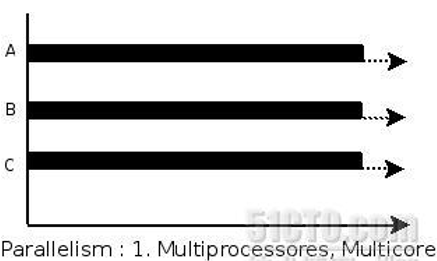

# 进程控制

学习目标

* 了解进程相关的概念
* 掌握 `fork/getpid/getppid` 函数的使用
* 熟练掌握 `ps/kill` 命令的使用
* 熟练掌握 `execl/execlp` 函数的使用
* 说出什么是孤儿进程什么是僵尸进程
* 熟练掌握 `wait` 函数的使用
* 熟练掌握 `waitpid` 函数的使用

---

## 进程相关概念

### 程序和进程

* 程序，是指编译好的二进制文件，在磁盘上，占用磁盘空间，是一个静态的概念
* 进程，一个启动的程序，进程占用的是系统资源，如：物理内存，CPU，终端等，是一个动态的概念
* 程序 -> 剧本(纸)		
* 进程 -> 戏(舞台、演员、灯光、道具、...)

同一个剧本可以在多个舞台同时上演，同样，同一个程序也可以加载为不同的进程(彼此之间互不影响)

### 并行和并发

* 并发，在一个时间段内，是在同一个 CPU 上，同时运行多个程序

如：若将 CPU 的 1s 的时间分成 1000 个时间片，每个进程执行完一个时间片必须无条件让出 CPU 的使用权，这样 1s 中就可以执行 1000 个进程


* 并行性指两个或两个以上的程序在同一时刻发生(需要有多颗)




### PCB - 进程控制块

每个进程在内核中都有一个进程控制块(PCB)来维护进程相关的信息，Linux 内核的进程控制块是 `task_struct` 结构体

`/usr/src/linux-headers-5.4.0-100/include/linux/sched.h` 文件的 624 行处可以查看 `struct task_struct` 结构体定义。其内部成员有很多，重点掌握以下部分即可：

* 进程 `id`。系统中每个进程有唯一的 `id`，在 C 语言中用 `pid_t` 类型表示，其实就是一个非负整数
* 进程的状态，有就绪、运行、挂起、停止等状态
* 进程切换时需要保存和恢复的一些 CPU 寄存器
* 描述虚拟地址空间的信息
* 描述控制终端的信息
* 当前工作目录(Current Working Directory)
    * `getcwd -- pwd`
* `umask` 掩码
* 文件描述符表，包含很多指向 `file` 结构体的指针
* 和信号相关的信息
* 用户 `id` 和组 `id`
* 会话(Session)和进程组
* 进程可以使用的资源上限(Resource Limit)
    * `ulimit -a`

### 进程状态

进程基本的状态有 5 种，分别为初始态，就绪态，运行态，挂起态与终止态。其中初始态为进程准备阶段，常与就绪态结合来看


---

## 创建进程

### fork 函数

* 函数作用：创建子进程
* 原型: `pid_t fork(void);`
    * 函数参数：无
    * 返回值：
        * 调用成功: 
            * 父进程返回子进程的 `PID`
            * 子进程返回 0
        * 调用失败: 返回 -1，设置 `errno` 值
* `fork` 函数代码片段实例


```c
#include <stdio.h>
#include <stdlib.h>
#include <string.h>
#include <sys/types.h>
#include <unistd.h>

int main()
{
    pid_t pid;
    char *mes;
    int n;
    pid = fork();

    if (pid < 0)
    {
        perror("fork failed");
        exit(1);
    }

    if (pid == 0)
    {
        mes = "This is the child\n";
        n = 6;
    }
    else
    {
        mes = "This is the parent\n";
        n = 3;
    }

    while (n--)
    {
        printf("%s", mes);
        sleep(1);
    }

    /*
        This is the parent
        This is the parent
        This is the parent
        This is the child
        This is the child
        This is the child
        This is the child
        This is the child
        This is the child
    */

    return 0;
}
```


* 调用 `fork` 函数的内核实现原理:


* `fork` 函数总结
    * `fork` 函数的返回值
        * 父进程返回子进程的 `PID`，是一个大于 0 数
        * 子进程返回 0
        * 特别需要注意的是：不是 `fork` 函数在一个进程中返回 2 个值，而是在父子进程各自返回一个值
    * 子进程创建成功后，代码的执行位置
  	    * 父进程执行到什么位置，子进程就从哪里执行
    * 如何区分父子进程
	    * 通过 `fork` 函数的返回值
    * 父子进程的执行顺序
        * 不一定，哪个进程先抢到 CPU，哪个进程就先执行


### ps 命令和 kill 命令

* `ps aux | grep "xxx"`
* `ps ajx | grep "xxx"`
    * `-a`：(all)当前系统所有用户的进程
    * `-u`：查看进程所有者及其他一些信息
    * `-x`：显示没有控制终端的进程 -- 不能与用户进行交互的进程【输入、输出】
    * `-j`: 列出与作业控制相关的信息
* `kill -l` 查看系统有哪些信号
* `kill -9 pid` 杀死某个进程


### getpid/getppid

* `getpid` - 得到当前进程的 PID
    * `pid_t getpid(void);`
* `getppid` - 得到当前进程的父进程的 PID
    * `pid_t getppid(void);`


```c
#include <stdio.h>
#include <stdlib.h>
#include <string.h>
#include <sys/types.h>
#include <unistd.h>

int g_var = 99;

void testFork1()
{
    printf("Before fork, pid: %d\n", getpid());
    // 创建子进程
    pid_t pid = fork();

    if (pid < 0)
    {
        // 创建失败
        perror("fork error");
        exit(1);
    }
    else if (pid == 0)
    {
        // 子进程
        printf("Child: %d, pid: %d, fpid: %d\n", pid, getpid(), getppid());
    }
    else
    {
        // 父进程
        printf("Parent: %d, pid: %d, fpid: %d\n", pid, getpid(), getppid());
    }
    printf("After fork, pid: %d\n", getpid());
}

void testFork2()
{
    // 创建子进程
    pid_t pid = fork();

    if (pid < 0)
    {
        // 创建失败
        perror("fork error");
        exit(1);
    }
    else if (pid == 0)
    {
        // 子进程
        sleep(1);
        printf("Child &g_var: %p\n", &g_var);
        printf("Child: %d, pid: %d, fpid: %d\n", pid, getpid(), getppid());
        printf("Child g_var: %d\n", g_var);
    }
    else
    {
        // 父进程
        printf("Parent: %d, pid: %d, fpid: %d\n", pid, getpid(), getppid());
        g_var++;
        printf("Parent &g_var: %p\n", &g_var);
    }
}

void testFork3()
{
    int i = 0;
    for (i = 0; i < 3; i++)
    {
        // 创建子进程
        pid_t pid = fork();
        if (pid < 0)
        {
            perror("fork error");
            exit(1);
        }
        else if (pid > 0)
        {
            printf("Parent: pid: %d, fpid: %d\n", getpid(), getppid());
        }
        else
        {
            printf("Child: pid: %d, fpid: %d\n", getpid(), getppid());
            break;
        }
    }

    if (i == 0)
    {
        printf("%d -- %d: child\n", i, getpid());
    }
    if (i == 1)
    {
        printf("%d -- %d: child\n", i, getpid());
    }
    if (i == 2)
    {
        printf("%d -- %d: child\n", i, getpid());
    }
    if (i == 3)
    {
        printf("%d -- %d: child\n", i, getpid());
    }
    sleep(10);
}

int main()
{
    // testFork1();

    /*
        Before fork, pid: 45099
        Parent: 45100, pid: 45099, fpid: 45093
        After fork, pid: 45099
        Before fork, pid: 45099
        Child: 0, pid: 45100, fpid: 1
        After fork, pid: 45100
    */

    // testFork2();

    /*
        Parent: 45076, pid: 45075, fpid: 45069
        Parent &g_var: 0x560850d54010
        Child &g_var: 0x560850d54010
        Child: 0, pid: 45076, fpid: 1
        Child g_var: 99
    */

    testFork3();

    /*
        Parent: pid: 45230, fpid: 45224
        Parent: pid: 45230, fpid: 45224
        Parent: pid: 45230, fpid: 45224
        3 -- 45230: child
        Parent: pid: 45230, fpid: 45224
        Parent: pid: 45230, fpid: 45224
        Child: pid: 45233, fpid: 45230
        2 -- 45233: child
        Parent: pid: 45230, fpid: 45224
        Child: pid: 45232, fpid: 45230
        1 -- 45232: child
        Child: pid: 45231, fpid: 45230
        0 -- 45231: child
    */

    return 0;
}
```

---

## exec 函数族

### 函数作用和函数介绍  	 

有的时候需要在一个进程里面执行其他的命令或者是用户自定义的应用程序，此时就用到了 `exec` 函数族当中的函数

使用方法一般都是在父进程里面调用 `fork` 创建处子进程，然后在子进程里面调用 `exec` 函数


**execl 函数**

函数原型: 

```cpp
int execl(const char *path，const char *arg，... /* (char  *) NULL */);
```

* 参数介绍：
    * `path`: 要执行的程序的绝对路径
    * 变参 `arg`: 要执行的程序的需要的参数
    * `arg`: 占位，通常写应用程序的名字
    * `arg` 后面的: 命令的参数
    * 参数写完之后: `NULL`
* 返回值：
    * 若是成功，则不返回，不会再执行 `exec` 函数后面的代码
    * 若是失败，会执行 `execl` 后面的代码，可以用 `perror` 打印错误原因

`execl` 函数一般执行自己写的程序

**execlp 函数**

函数原型: 

```cpp
int execlp(const char *file，const char *arg，.../* (char  *) NULL */);
```

* 参数介绍：
    * `file`: 执行命令的名字，根据 `PATH` 环境变量来搜索该命令
    * `arg`: 占位
    * `arg` 后面的: 命令的参数
    * 参数写完之后: `NULL`
* 返回值：
    * 若是成功，则不返回，不会再执行 `exec` 函数后面的代码
    * 若是失败，会执行 `exec` 后面的代码，可以用 `perror` 打印错误原因

`execlp` 函数一般是执行系统自带的程序或者是命令

### exec 函数族原理介绍   

`exec` 族函数的实现原理图：


如：`execlp("ls"，"ls"，"-l"，NULL);`

**总结**

`exec` 函数是用一个新程序替换了当前进程的代码段、数据段、堆和栈；原有的进程空间没有发生变化，并没有创建新的进程，进程 PID 没有发生变化

注意：当 `execl` 和 `execlp` 函数执行成功后，不返回，并且不会执行 `execl` 后面的代码逻辑，原因是调用 `execl` 函数成功以后，`exec` 函数指定的代码段已经将原有的代码段替换了

```c
#include <stdio.h>
#include <stdlib.h>
#include <string.h>
#include <sys/types.h>
#include <unistd.h>

int main()
{
    pid_t pid = fork();
    if (pid < 0)
    {
        perror("fork error");
        return -1;
    }
    else if (pid > 0)
    {
        printf("Parent: %d, pid: %d, fpid: %d\n", pid, getpid(), getppid());
    }
    else
    {
        printf("Child: pid: %d, fpid: %d\n", getpid(), getppid());
        // execl("/bin/ls","ls","-l",NULL);
        // execl("/home/root/codes/cplusplus/vscode/demo/test/m", "m", "gcc", "-o", "m", "m.c", "&&", "./m", "hello", "world", NULL);
        // execlp("ls", "ls", "-l", NULL);
        execl("./m", "hello", "world", NULL);
        perror("execl error");
    }

    /*
        Parent: 128182, pid: 128181, fpid: 115275
        Child: pid: 128182, fpid: 1
        total 48
        -rwxr-xr-x 1 root root 16464 Sep 13 19:03 m
        -rwxr-xr-x 1 root root 16920 Sep 13 19:28 main
        -rw-r--r-- 1 root root   872 Sep 13 19:28 main.c
        -rw-r--r-- 1 root root   179 Sep 13 19:08 m.c
    */

    /*
        Parent: 129066, pid: 129065, fpid: 115275
        Child: pid: 129066, fpid: 1
        [0]:[hello]
        [1]:[world]
    */

    return 0;
}
```

---

## 进程回收

### 为什么要进行进程资源的回收

当一个进程退出之后，进程能够回收自己的用户区的资源，但是不能回收内核空间的 PCB 资源，必须由它的父进程调用 `wait` 或者 `waitpid` 函数完成对子进程的回收，避免造成系统资源的浪费

### 孤儿进程

* 孤儿进程的概念：
    * 若子进程的父进程已经死掉，而子进程还存活着，这个进程就成了孤儿进程
* 为了保证每个进程都有一个父进程，孤儿进程会被 `init` 进程领养，`init` 进程成为了孤儿进程的养父进程，当孤儿进程退出之后，由 `init` 进程完成对孤儿进程的回收
* 模拟孤儿进程的案例
    * 编写模拟孤儿进程的代码讲解孤儿进程，验证孤儿进程的父进程是否由原来的父进程变成了 `init` 进程

```c
#include <stdio.h>
#include <stdlib.h>
#include <string.h>
#include <sys/types.h>
#include <unistd.h>

int main()
{
    pid_t pid = fork();

    if (pid < 0)
    {
        perror("fork error");
        return -1;
    }
    else if (pid > 0)
    {
        sleep(5);
        printf("Parent: %d, pid: %d, fpid: %d\n", pid, getpid(), getppid());
    }
    else
    {
        printf("Child: %d, pid: %d, fpid: %d\n", pid, getpid(), getppid());
        sleep(20);
        printf("Child: %d, pid: %d, fpid: %d\n", pid, getpid(), getppid());
    }

    /*
        Parent: 129363, pid: 129362, fpid: 129356
        Child: 0, pid: 129363, fpid: 129362
        Child: 0, pid: 129363, fpid: 1
     */

    return 0;
}
```

### 僵尸进程

* 僵尸进程的概念:
    * 若子进程死了，父进程还活着， 但是父进程没有调用 `wait` 或 `waitpid` 函数完成对子进程的回收，则该子进程就成了僵尸进程
* 如何解决僵尸进程
    * 由于僵尸进程是一个已经死亡的进程，所以不能使用 `kill` 命令将其杀死
    * 通过杀死其父进程的方法可以消除僵尸进程。杀死其父进程后，这个僵尸进程会被 `init` 进程领养，由 `init` 进程完成对僵尸进程的回收
* 模拟僵尸进程的案例
    * 编写模拟僵尸进程的代码讲解僵尸进程，验证若子进程先于父进程退出，而父进程没有调用 `wait` 或者 `waitpid` 函数进行回收，从而使子进程成为了僵尸进程

```c
#include <stdio.h>
#include <stdlib.h>
#include <string.h>
#include <sys/types.h>
#include <unistd.h>

int main()
{
    pid_t pid = fork();

    if (pid < 0)
    {
        perror("fork error");
        return -1;
    }
    else if (pid > 0)
    {
        sleep(20);
        printf("Parent: %d, pid: %d, fpid: %d\n", pid, getpid(), getppid());
    }
    else
    {
        printf("Child: %d, pid: %d, fpid: %d\n", pid, getpid(), getppid());
    }

    /*
        Child: 0, pid: 129894, fpid: 129893
        Parent: 129894, pid: 129893, fpid: 129376
     */

    return 0;
}
```

### 进程回收函数

* `wait` 函数
    * 函数原型：
        * `pid_t wait(int *status);`
    * 函数作用：
        * 阻塞并等待子进程退出 
        * 回收子进程残留资源 
        * 获取子进程结束状态(退出原因)
    * 返回值：
        * 成功：清理掉的子进程 ID
        * 失败：-1(没有子进程)
    * `status` 参数：子进程的退出状态 -- 传出参数
        * `WIFEXITED(status)`：为非 0 -- 进程正常结束
        * `WEXITSTATUS(status)`：获取进程退出状态 
        * `WIFSIGNALED(status)`：为非 0 -- 进程异常终止
        * `WTERMSIG(status)`：取得进程终止的信号编号
* `wait` 函数练习
    * 使用 `wait` 函数完成父进程对子进程的回收

```c
#include <stdio.h>
#include <stdlib.h>
#include <string.h>
#include <sys/types.h>
#include <unistd.h>
#include <sys/wait.h>

int main()
{
    pid_t pid = fork();

    if (pid < 0)
    {
        perror("fork error");
        return -1;
    }
    else if (pid > 0)
    {
        printf("Parent: %d, pid: %d, fpid: %d\n", pid, getpid(), getppid());
        int status;
        pid_t wpid = wait(&status);
        printf("wpid: %d\n", wpid);

        if (WIFEXITED(status))
        {
            // 正常退出
            printf("Child normal exit, status: %d\n", WEXITSTATUS(status));
        }
        else if (WIFSIGNALED(status))
        {
            // 被信号杀死
            printf("Child killed by signal, signo: %d\n", WTERMSIG(status));
        }
        else
        {
        }
    }
    else
    {
        printf("Child: %d, pid: %d, fpid: %d\n", pid, getpid(), getppid());
        sleep(20);
        return 9;
    }

    /*
        Parent: 130459, pid: 130458, fpid: 129376
        Child: 0, pid: 130459, fpid: 130458
        wpid: 130459
        Child normal exit, status: 9
     */

    return 0;
}
```

* `waitpid` 函数
    * 函数原型：
        * `pid_t waitpid(pid_t pid，int *status，in options);`
    * 函数作用
        * 同 `wait` 函数
    * 函数参数
        * `pid`：
            * `pid = -1` 等待任一子进程，与 `wait` 等效
            * `pid > 0` 等待其进程 ID 与 `pid` 相等的子进程
            * `pid = 0` 等待进程组 ID 与目前进程相同的任何子进程，也就是说任何和调用 ` waitpid()` 函数的进程在同一个进程组的进程
            * `pid < -1` 等待其组 ID 等于 `pid` 的绝对值的任一子进程(适用于子进程在其他组的情况)
        * `status`: 子进程的退出状态，用法同 `wait` 函数
        * `options`：设置为 `WNOHANG`，函数非阻塞，设置为 0，函数阻塞
    * 函数返回值
        * `> 0`：返回回收掉的子进程 ID
        * `-1`：无子进程
        * `= 0`：参3 为 `WNOHANG`，且子进程正在运行
* `waitpid` 函数练习
    * 使用 `waitpid` 函数完成对子进程的回收

```c
#include <sys/stat.h>
#include <stdlib.h>
#include <unistd.h>
#include <stdio.h>
#include <sys/wait.h>

int main()
{
    pid_t cpid, wpid;
    int status;
    int n = 5;
    int i;
    for (i = 0; i < n; i++)
    {
        cpid = fork();
        if (cpid == -1)
        {
            perror("fork");
            exit(EXIT_FAILURE);
        }
        else if (cpid == 0)
        {
            break;
        }
    }
    if (n == i)
    {
        sleep(n);
        printf("I am parent, pid is: %d\n", getpid());
        do
        {
            wpid = waitpid(-1, NULL, WNOHANG);
            if (wpid > 0)
            {
                n--;
                printf("child pid: %d called back\n", wpid);
            }
            sleep(1);
        } while (n > 0);
        printf("wait finished\n");
    }
    else
    {
        sleep(i);
        printf("I'm %dth child, pid = %d\n", i + 1, getpid());
    }

    /*
        I'm 1th child, pid = 131507
        I'm 2th child, pid = 131508
        I'm 3th child, pid = 131509
        I'm 4th child, pid = 131510
        I'm 5th child, pid = 131511
        I am parent, pid is: 131506
        child pid: 131507 called back
        child pid: 131508 called back
        child pid: 131509 called back
        child pid: 131510 called back
        child pid: 131511 called back
        wait finished
    */

    return 0;
}
```

---

## ps 命令详解 

原文地址：[http://apps.hi.baidu.com/share/detail/32573968](http://apps.hi.baidu.com/share/detail/32573968)

有时候系统管理员可能只关心现在系统中运行着哪些程序，而不想知道有哪些进程在运行。由于一个应用程序可能需要启动多个进程。所以在同等情况下，进程的数 量要比程序多的多。为此从阅读方面考虑，管理员需要知道系统中运行的具体程序。要实现这个需求的话，就需要利用命令 `ps` 来帮忙

要对进程进行监测和控制，首先必须要了解当前进程的情况，也就是需要查看当前进程，而 `ps` 命令就是最基本同时也是非常强大的进程查看命令。使用该命令可以确定有哪些进程正在运行和运行的状态、进程是否结束、进程有没有僵死、哪些进程占用了过多 的资源等等。总之大部分信息都是可以通过执行该命令得到的

**ps 命令**

* 使用权限：所有使用者
* 使用方式：`ps [options] [--help]`
* 说明：显示瞬间行程 `process` 的动态
* 参数：`ps` 的参数非常多，在此仅列出几个常用的参数并大略介绍含义
    * `-A` 列出所有的进程
    * `-w` 显示加宽可以显示较多的资讯
    * `-au` 显示较详细的资讯
    * `-aux` 显示所有包含其他使用者的行程

**常用参数**

* `-A` 显示所有进程(等价于 `-e`)(utility)
* `-a` 显示一个终端的所有进程，除了会话引线
* `-N` 忽略选择
* `-d` 显示所有进程，但省略所有的会话引线(utility)
* `-x` 显示没有控制终端的进程，同时显示各个命令的具体路径。`dx` 不可合用(utility)
* `-p pid` 进程使用 cpu 的时间
* `-u uid or username` 选择有效的用户 `id` 或者是用户名
* `-g gid or groupname` 显示组的所有进程
* `U username` 显示该用户下的所有进程，且显示各个命令的详细路径。如: `ps U zhang`(utility)
* `-f` 全部列出，通常和其他选项联用。如：`ps -fa` or `ps -fx` 等等
* `-l` 长格式(有 `F`，`chan` 等字段)
* `-j` 作业格式
* `-o` 用户自定义格式
* `v` 以虚拟存储器格式显示
* `s` 以信号格式显示
* `-m` 显示所有的线程
* `-H` 显示进程的层次(和其它的命令合用，如：`ps -Ha`)(utility)
* `e` 命令之后显示环境(如：`ps -d e`；`ps -a e`)(utility)
* `h` 不显示第一行

**ps 命令常用用法(方便查看系统进程)**

* `ps a` 显示现行终端机下的所有程序，包括其他用户的程序
* `ps -A` 显示所有进程
* `ps c` 列出程序时，显示每个程序真正的指令名称，而不包含路径，参数或常驻服务的标示
* `ps -e` 此参数的效果和指定 `A` 参数相同
* `ps e` 列出程序时，显示每个程序所使用的环境变量
* `ps f` 用 ASCII 字符显示树状结构，表达程序间的相互关系
* `ps -H` 显示树状结构，表示程序间的相互关系
* `ps -N` 显示所有的程序，除了执行 `ps` 指令终端机下的程序之外
* `ps s` 采用程序信号的格式显示程序状况
* `ps S` 列出程序时，包括已中断的子程序资料
* `ps -t<终端机编号>` 指定终端机编号，并列出属于该终端机的程序的状况
* `ps u` 以用户为主的格式来显示程序状况
* `ps x` 显示所有程序，不以终端机来区分

最常用的方法是 `ps -aux`，后再利用一个管道符号导向到 `grep` 去查找特定的进程，后再对特定的进程进行操作

运行 `ps -aux` 的到如下信息：

```sh
# ps -aux
USER         PID %CPU %MEM    VSZ   RSS TTY      STAT START   TIME COMMAND
root           1  0.0  0.4 168204  8292 ?        Ss   Mar08   2:16 /lib/systemd/systemd --system --deserialize 34
root           2  0.0  0.0      0     0 ?        S    Mar08   0:00 [kthreadd]
root           3  0.0  0.0      0     0 ?        I<   Mar08   0:00 [rcu_gp]
root           4  0.0  0.0      0     0 ?        I<   Mar08   0:00 [rcu_par_gp]
root           6  0.0  0.0      0     0 ?        I<   Mar08   0:00 [kworker/0:0H-kblockd]
root           9  0.0  0.0      0     0 ?        I<   Mar08   0:00 [mm_percpu_wq]
root          10  0.0  0.0      0     0 ?        S    Mar08   5:11 [ksoftirqd/0]
root          11  0.0  0.0      0     0 ?        I    Mar08  80:45 [rcu_sched]
root          12  0.0  0.0      0     0 ?        S    Mar08   0:37 [migration/0]
root          13  0.0  0.0      0     0 ?        S    Mar08   0:00 [idle_inject/0]
root          14  0.0  0.0      0     0 ?        S    Mar08   0:00 [cpuhp/0]
root     1096123  0.0  0.0   2488    64 ?        S    May01   0:00 bpfilter_umh
// ...
root     1258146  0.0  0.4  32216  8208 ?        Ss   May06   0:00 /usr/bin/python3 /usr/bin/networkd-dispatcher --run-startup-triggers
syslog   1258420  0.0  0.0 224492  1628 ?        Ssl  May06   0:07 /usr/sbin/rsyslogd -n -iNONE
systemd+ 1373906  0.0  0.0  26572   944 ?        Ss   May11   0:13 /lib/systemd/systemd-networkd
systemd+ 1373914  0.0  0.2  23992  5572 ?        Ss   May11   6:40 /lib/systemd/systemd-resolved
root     1373921  0.0  1.0  59544 21112 ?        S<s  May11   0:41 /lib/systemd/systemd-journald
root     1375104  0.0  0.1  20944  2976 ?        Ss   May11   0:20 /lib/systemd/systemd-udevd
root     1422591  0.0  0.0  12172  2020 ?        Ss   May13   0:04 sshd: /usr/sbin/sshd -D [listener] 0 of 10-100 startups
root     2471384  0.0  0.0 424024   648 ?        S<l  Jun28  51:22 /usr/local/aegis/AliSecGuard/AliSecGuard
mysql    3341752  0.4 18.7 1355988 381276 ?      Ssl  Jul29 281:30 /usr/sbin/mysqld
root     3891478  0.0  0.3 805684  6628 ?        Ssl  Aug27  16:28 /usr/local/share/aliyun-assist/2.2.3.326/aliyun-service
root     3891648  0.0  0.0  17796  1396 ?        Ssl  Aug27   4:40 /usr/local/share/assist-daemon/assist_daemon
root     3975481  0.0  0.1  22704  4056 ?        S<sl Sep01  12:21 /usr/local/aegis/aegis_update/AliYunDunUpdate
root     3975568  1.8  1.7 134864 34540 ?        S<sl Sep01 322:34 /usr/local/aegis/aegis_client/aegis_11_37/AliYunDun
```

**head 标头**

* `USER` 用户名
* `UID` 用户 ID(User ID)
* `PID` 进程 ID(Process ID)
* `PPID` 父进程的进程 ID(Parent Process id)
* `SID` 会话 ID(Session id)
* `%CPU` 进程的 cpu 占用率
* `%MEM` 进程的内存占用率
* `VSZ` 进程所使用的虚存的大小(Virtual Size)
* `RSS` 进程使用的驻留集大小或者是实际内存的大小，K bytes 字节
* `TTY` 与进程关联的终端(tty)
* `STAT` 进程的状态：进程状态使用字符表示的(STAT 的状态码)
* `R` 运行 Runnable(on run queue) 正在运行或在运行队列中等待
* `S` 睡眠 Sleeping 休眠中，受阻，在等待某个条件的形成或接受到信号
* `I` 空闲 Idle
* `Z` 僵死 Zombie(a defunct process) 进程已终止，但进程描述符存在，直到父进程调用 `wait4()` 系统调用后释放
* `D` 不可中断 Uninterruptible sleep(ususally IO) 收到信号不唤醒和不可运行，进程必须等待直到有中断发生
* `T` 终止 Terminate 进程收到 `SIGSTOP`，`SIGSTP`，`SIGTIN`，`SIGTOU` 信号后停止运行运行
* `P` 等待交换页
* `W` 无驻留页 has no resident pages 没有足够的记忆体分页可分配
* `X` 死掉的进程
* `<` 高优先级进程
* `N` 低优先序的进程
* `L` 内存锁页 `Lock` 有记忆体分页分配并缩在记忆体内
* `s` 进程的领导者(在它之下有子进程)
* `l` 多进程的(使用 `CLONE_THREAD`，类似 NPTL pthreads)
* `+` 位于后台的进程组 
* `START` 进程启动时间和日期
* `TIME` 进程使用的总 cpu 时间
* `COMMAND` 正在执行的命令行命令
* `NI` 优先级(Nice)
* `PRI` 进程优先级编号(Priority)
* `WCHAN` 进程正在睡眠的内核函数名称；该函数的名称是从 `/root/system.map` 文件中获得的
* `FLAGS` 与进程相关的数字标识

查看当前系统进程的 `uid`，`id`，`tat`，`ri`，以 `uid` 号排序

```sh
# ps -eo pid,stat,pri,uid --sort uid
    PID STAT PRI   UID
      1 Ss    19     0
      2 S     19     0
      3 I<    39     0
      4 I<    39     0
      6 I<    39     0
      9 I<    39     0
     10 S     19     0
     11 I     19     0
     12 S    139     0
     13 S     90     0
//..
3891478 Ssl   19     0
3891648 Ssl   19     0
3975481 S<sl  29     0
3975568 S<sl  29     0
    531 Ss    19     1
1096113 S     19    33
1373906 Ss    19   100
1373914 Ss    19   101
    448 Ss    19   103
1258420 Ssl   19   104
    461 S     19   110
    464 S     19   110
3341752 Ssl   19   111
    613 Ssl   19   112
```

查看当前系统进程的 `user`，`id`，`tat`，`ss`，`rgs`，以 `rss` 排序

```sh
# ps -eo user,pid,stat,rss,args --sort rss
USER         PID STAT   RSS COMMAND
root           2 S        0 [kthreadd]
root           3 I<       0 [rcu_gp]
root           4 I<       0 [rcu_par_gp]
root           6 I<       0 [kworker/0:0H-kblockd]
root           9 I<       0 [mm_percpu_wq]
root          10 S        0 [ksoftirqd/0]
root          11 I        0 [rcu_sched]
root          12 S        0 [migration/0]
root          13 S        0 [idle_inject/0]
//..
root       29390 Sl   17736 /root/.vscode-server/extensions/ms-vscode.cpptools-1.12.4-linux-x64/bin/cpptools-srv 28676 {E99A2977-7C9F-4364-9164-EEFB17E06B5D}
root     1373921 S<s  21384 /lib/systemd/systemd-journald
root     3975568 S<sl 34540 /usr/local/aegis/aegis_client/aegis_11_37/AliYunDun
root       28617 Sl   42440 /root/.vscode-server/bin/784b0177c56c607789f9638da7b6bf3230d47a8c/node /root/.vscode-server/bin/784b0177c56c607789f9638da7b6bf3230d47a8c/out/bootstrap-fork --type=fileWatcher
root       28735 Sl   44624 /root/.vscode-server/bin/784b0177c56c607789f9638da7b6bf3230d47a8c/node /root/.vscode-server/bin/784b0177c56c607789f9638da7b6bf3230d47a8c/extensions/json-language-features/server/dist/node/jsonServerMain --node-ipc --clie
root       28575 Sl   57832 /root/.vscode-server/bin/784b0177c56c607789f9638da7b6bf3230d47a8c/node /root/.vscode-server/bin/784b0177c56c607789f9638da7b6bf3230d47a8c/out/bootstrap-fork --type=ptyHost --logsPath /root/.vscode-server/data/logs/2022091
root       28532 Sl   85532 /root/.vscode-server/bin/784b0177c56c607789f9638da7b6bf3230d47a8c/node /root/.vscode-server/bin/784b0177c56c607789f9638da7b6bf3230d47a8c/out/server-main.js --start-server --host=127.0.0.1 --accept-server-license-terms --
root       28789 Sl   103972 /root/.vscode-server/extensions/ms-vscode.cpptools-1.12.4-linux-x64/bin/cpptools-srv 28676 {253413CB-D8B6-43AF-9753-FB20CC8FE35D}
root       28676 Sl   106164 /root/.vscode-server/extensions/ms-vscode.cpptools-1.12.4-linux-x64/bin/cpptools
root       28606 Sl   172472 /root/.vscode-server/bin/784b0177c56c607789f9638da7b6bf3230d47a8c/node /root/.vscode-server/bin/784b0177c56c607789f9638da7b6bf3230d47a8c/out/bootstrap-fork --type=extensionHost --transformURIs --useHostProxy=false
mysql    3341752 Ssl  381276 /usr/sbin/mysqld
```

`ps` 为我们提供了进程的一次性的查看，它所提供的查看结果并不动态连续的；如果想对进程时间监控，应该用 `top` 工具

### ps 的参数说明

`ps` 提供了很多的选项参数，常用的有以下几个：

* `l` 长格式输出
* `u` 按用户名和启动时间的顺序来显示进程
* `j` 用任务格式来显示进程
* `f` 用树形格式来显示进程
* `a` 显示所有用户的所有进程(包括其它用户)
* `x` 显示无控制终端的进程
* `r` 显示运行中的进程
* `ww` 避免详细参数被截断

常用的选项是组合是 `aux` 或 `lax`，还有参数 `f` 的应用

### ps aux 或 lax 输出的解释

* `USER` 进程的属主
* `PID` 进程的 ID
* `PPID` 父进程
* `%CPU` 进程占用的 CPU 百分比
* `%MEM` 占用内存的百分比
* `NI` 进程的 NICE 值，数值大，表示较少占用 CPU 时间
* `VSZ` 进程虚拟大小
* `RSS` 驻留中页的数量
* `TTY` 终端 ID
* `STAT` 进程状态(有以下几种)
* `D` 无法中断的休眠状态(通常 IO 的进程)
* `R` 正在运行可中在队列中可过行的
* `S` 处于休眠状态
* `T` 停止或被追踪
* `W` 进入内存交换(从内核 2.6 开始无效)
* `X` 死掉的进程(从来没见过)
* `Z` 僵尸进程
* `<` 优先级高的进程
* `N` 优先级较低的进程
* `L` 有些页被锁进内存
* `s` 进程的领导者(在它之下有子进程)
* `l` 多进程的(使用 `CLONE_THREAD`，类似 NPTL pthreads)
* `+` 位于后台的进程组
* `WCHAN` 正在等待的进程资源
* `START` 启动进程的时间
* `TIME` 进程消耗 CPU 的时间
* `COMMAND` 命令的名称和参数

### 应用举例

```sh
# ps -aux | more
USER         PID %CPU %MEM    VSZ   RSS TTY      STAT START   TIME COMMAND
root           1  0.0  0.4 168204  8292 ?        Ss   Mar08   2:16 /lib/systemd/systemd --system --deserialize 34
root           2  0.0  0.0      0     0 ?        S    Mar08   0:00 [kthreadd]
root           3  0.0  0.0      0     0 ?        I<   Mar08   0:00 [rcu_gp]
root           4  0.0  0.0      0     0 ?        I<   Mar08   0:00 [rcu_par_gp]
root           6  0.0  0.0      0     0 ?        I<   Mar08   0:00 [kworker/0:0H-kblockd]
root           9  0.0  0.0      0     0 ?        I<   Mar08   0:00 [mm_percpu_wq]
root          10  0.0  0.0      0     0 ?        S    Mar08   5:11 [ksoftirqd/0]
root          11  0.0  0.0      0     0 ?        I    Mar08  80:46 [rcu_sched]
root          12  0.0  0.0      0     0 ?        S    Mar08   0:37 [migration/0]
root          13  0.0  0.0      0     0 ?        S    Mar08   0:00 [idle_inject/0]
root          14  0.0  0.0      0     0 ?        S    Mar08   0:00 [cpuhp/0]
root          15  0.0  0.0      0     0 ?        S    Mar08   0:00 [kdevtmpfs]
root          16  0.0  0.0      0     0 ?        I<   Mar08   0:00 [netns]
root          17  0.0  0.0      0     0 ?        S    Mar08   0:00 [rcu_tasks_kthre]
root          18  0.0  0.0      0     0 ?        S    Mar08   0:00 [kauditd]
root          19  0.0  0.0      0     0 ?        S    Mar08   0:06 [khungtaskd]
root          20  0.0  0.0      0     0 ?        S    Mar08   0:00 [oom_reaper]
root          21  0.0  0.0      0     0 ?        I<   Mar08   0:00 [writeback]
root          22  0.0  0.0      0     0 ?        S    Mar08   0:00 [kcompactd0]
root          23  0.0  0.0      0     0 ?        SN   Mar08   0:00 [ksmd]
--More--
```

可以用 `|` 管道和 `more` 连接起来分页查看

```sh
# ps -aux >ps.txt
```

把结果输出到 `ps.txt` 文本中并保存

```sh
# more ps.txt
USER         PID %CPU %MEM    VSZ   RSS TTY      STAT START   TIME COMMAND
root           1  0.0  0.4 168204  8292 ?        Ss   Mar08   2:16 /lib/systemd/systemd --system --deserialize 34
root           2  0.0  0.0      0     0 ?        S    Mar08   0:00 [kthreadd]
root           3  0.0  0.0      0     0 ?        I<   Mar08   0:00 [rcu_gp]
root           4  0.0  0.0      0     0 ?        I<   Mar08   0:00 [rcu_par_gp]
root           6  0.0  0.0      0     0 ?        I<   Mar08   0:00 [kworker/0:0H-kblockd]
root           9  0.0  0.0      0     0 ?        I<   Mar08   0:00 [mm_percpu_wq]
root          10  0.0  0.0      0     0 ?        S    Mar08   5:11 [ksoftirqd/0]
root          11  0.0  0.0      0     0 ?        I    Mar08  80:46 [rcu_sched]
root          12  0.0  0.0      0     0 ?        S    Mar08   0:37 [migration/0]
root          13  0.0  0.0      0     0 ?        S    Mar08   0:00 [idle_inject/0]
root          14  0.0  0.0      0     0 ?        S    Mar08   0:00 [cpuhp/0]
root          15  0.0  0.0      0     0 ?        S    Mar08   0:00 [kdevtmpfs]
root          16  0.0  0.0      0     0 ?        I<   Mar08   0:00 [netns]
root          17  0.0  0.0      0     0 ?        S    Mar08   0:00 [rcu_tasks_kthre]
root          18  0.0  0.0      0     0 ?        S    Mar08   0:00 [kauditd]
root          19  0.0  0.0      0     0 ?        S    Mar08   0:06 [khungtaskd]
root          20  0.0  0.0      0     0 ?        S    Mar08   0:00 [oom_reaper]
root          21  0.0  0.0      0     0 ?        I<   Mar08   0:00 [writeback]
root          22  0.0  0.0      0     0 ?        S    Mar08   0:00 [kcompactd0]
root          23  0.0  0.0      0     0 ?        SN   Mar08   0:00 [ksmd]
--More--(15%)
```

这里是把所有进程显示出来，并输出到 `ps.txt` 文件，然后再通过 `more` 来分页查看

### kill 终止(杀死)进程

有十几种控制进程的方法，下面是一些常用的方法:

```sh
# kill -STOP [pid]
```

发送 `SIGSTOP(17, 9, 3)` 停止一个进程，而并不消灭这个进程

```sh
# kill -CONT [pid]
```

发送 `SIGCONT(19, 8, 5)` 重新开始一个停止的进程

```sh
# kill -KILL [pid]
```

发送 `SIGKILL(9)` 强迫进程立即停止，并且不实施清理操作

```sh
# kill -9 -1
```

终止你拥有的全部进程

`SIGKILL` 和 `SIGSTOP` 信号不能被捕捉、封锁或者忽略，但是，其它的信号可以。所以这是你的终极武器

### 利用 ps 命令向管理员报告执行中的程序

有时候系统管理员可能只关心现在系统中运行着哪些程序，而不想知道有哪些进程在运行。由于一个应用程序可能需要启动多个进程。所在在同等情况下，进程的数量要比程序多的多。为此从阅读方面考虑，管理员需要知道系统中运行的具体程序。要实现这个需求的话，就需要利用命令 `ps` 来帮忙

#### ps 命令显示结果的含义

当需要查看系统中执行的程序时，虽然 `ps` 命令不是唯一的命令，但绝对是使用的最频繁的命令。如下所示，就是执行 `ps` 命令后显示的结果

```sh
# ps
    PID TTY          TIME CMD
  28658 pts/3    00:00:00 bash
  39771 pts/3    00:00:00 ps
```

其显示结果主要有四部分内容。首先是 PID，这是程序的 ID 号。才作系统就是利用这个 ID 号来唯一的标识应用程序，而不是利用命令来辨认。当需要强制关闭应用程序时，就需要用到这个 PID 号码。其次是 TTY，这个字段表示用户使用的终端代码。pts 表示用户是采用远程登录的。第三个参数 TIME 表示这个程序所消耗的 CPU 时间，注意这个时间不是程序开始运行的时间。最后一个参数 CMD 就表示程序的名字

#### 让系统报告详细的信息

在使用 `ps` 命令时，如果不采用任何的可选项，则其显示的信息是非常有限的，而且往往只显示当前用户所运行的程序。当系统管理员需要知道应用程序更加详细的 运行信息时，如想要知道这个应用程序内存、CPU 的占用率情况时，那么就需要加入一些可选项。如系统管理员需要一并查看其它用户所执行的应用程序时，就需要在这个命令后面采用可选项 `-al`。如此的话，系统会列出系统中所有用户运行的所有程序。如想要知道某个程序 CPU 与内存的使用情况，而不是只简单的现实其 CPU 的使用时间，那么就需要在这个命令后面加入参数 `-l`，即使用 `ps –l` 命令可以让系统显示出应用程序的详细运行信息。关于上面各个字段所代表的含义，大家若有兴趣的话可以查看相关的帮助。一般来说，系统管理员关心的只是程序的 PID 号码、内存与 CPU 的使用率、命令的名字、用户采用的终端等等。其它的信息对于系统管理员来说价值不是很大

#### 查看后台运行的程序

默认情况下，`ps` 命令只显示前台运行的程序，而不会显示后台运行的程序。但是并非所有的程序都是在前台运行。正常情况下，隐藏在后台运行的程序数量要比前 台运行的程序多的多。如随着操作系统启动而启动的不少系统自带程序，其运行的方式都是后台运行。而且有时候，系统出现问题往往是由于后台程序所造成的。如常见的木马等程序都是在后台所运行的。为此系统管理员相对来说，更加想要知道在后台运行着哪些程序

如果要查看后台运行的程序，那就比较复杂一点。因为在不同版本的 Linux 操作系统中，要显示后台进程其所采用的可选项是不同的。如在红帽子 Linux 操作系统中，其实采用参数的形式而不是可选项。即采用 `ps aux` 命令可以显示出所有的应用程序(包括前台与后台的)。参数与可选项的差异主要在前面又没有这个 `-` 符号。如果带有这个符号的就表示这是一个可选项。而如果不带的，就表示这事一个参数。这个符号一般情况下可不能够省。在该写的地方没写，或者不需要些的地方偏偏加上了，则系统都会提示错误信息，说找不到这个命令。而在其它的 Linux 系统版本中，可能不能够识别这个 `aux` 参数。如在一些 Linux 操作系统版本中，需要采用 `-a` 可选项来完成这个任务。由于系统版本之间的差异，给系统管理员带来了不少的麻烦。不过值得庆幸的是，各个操作系统版本中都有在线的帮助。如果系统管理员在使用一个新版本的操作系统时，不知道要显示全部进程该使用哪个可选项时，可以利用 `ps --heip` 等命令来查看系统帮助

#### 对程序列表进行排序

当运行的应用程序比较多时，系统管理员需要对应用程序进行排序。`ps` 命令的排序功能是比较强的。主要是因为这个命令有一个 `--sort` 参数(注意在这个参 数前面采用的是两个小横杆符号，各位读者不要以为是笔者写错了)。在这个参数后面加上系统管理员想要的排序字段，就可以进行排序了。如这个命令 `ps –A --sort cmd`，就表示显示系统所有的应用程序，并根据程序命令来进行排序。在 Linux 操作系统参数中，还有一个比较麻烦的事情，就是参数大小写不同往往代表着不同的含义。如上面这个命令，将大写字母 `A` 换成是小写字符 `a`，则结果就完全两样了。大写字符 `A` 表示所有的应用程序，而小写字符 `a` 则表示 "all w/ tty except session leaders"。两者有本质的区别。通过这个差异可以用来过滤不同终端登陆帐户所运行的应用程序

在 `ps` 命令中，不少参数都有这种情况。运行 `ps --help` 查看这个命令的所有参数，就可以看到类似的大小写不同代表不同含义的情况还有很多。如大写字符 `O` 与小写字符 `o`、大写字符 `U` 与小写字符 `u` 等等。 这些差异无形之中增加了系统管理员维护操作系统的难度。系统管理员要掌握这么多的参数以及参数大小写之间的差异，往往是不可能的。系统管理员除了平时要多 使用使用常用的参数来增加值观的印象，这个系统命令的在线帮助确实也是少不了的。这个系统帮助可以给管理员使用系统命令提供在线的指导

#### 报告特定程序的运行情况

当系统中运行的程序比较多时，通过对程序名字排序可以帮助管理员找到自己所关心的程序。但是这仍然不是最简便的方式。如现在系统管理员在其它操作系统中发 现有一个叫做 `threadx` 的木马程序在系统后台运行。为此管理员需要在其它电脑上查看是否也有这个木马程序在运行。此时该如何处理呢

利用排序功能，对程序的名字进行排序(注意不是对程序的 PID 进行排序，因为即使程序相同，启动的时间不同或者操作系统中已经启动程序的数量不同，这个 PID 号码也就不同。也就是说这个 PID 号码是自动生成的)。这在一定程度上可以帮助管理员加快程序查找的速度。不过笔者认为，如果系统管理员能够使用管道符与 `grep` 等查询命令可能会更快的找到自己所需要的应用程序信息

如现在系统管理员若使用这个命令 `ps aux | grep threadx`，会出现什么情况呢

首先系统会列出当前系统中所有运行的应用程序(包括前台运行与后台运行的)。然后将输出的结果通过管道符号 `|` 传递给命令 `grep`。然后命令 `grep` 就会在 `ps` 命令输出的结果中查找是否有 `threadx` 这个程序运行的信息。如果有的话，则会在窗口中显示这个程序的信息，而过滤掉其它应用程序的运行信息。可见采用管道符跟其它查询命令结合，可以帮助系统管理员在最短的时间内找到自己想了解的应用程序的信息

跟一些特殊符号结合还可以实现一些更加负责的功能。如跟 `cat` 命令结合使用可以统计出符合条件的程序数量。如在命令后面加入 `>` 符号，可以将输出的结果定位到一个文件中。如跟通配符结合使用，可以查询出满足特定条件的一类程序。如还可以查询出某个程序父程序或者其子程序的运行信息等等

---
