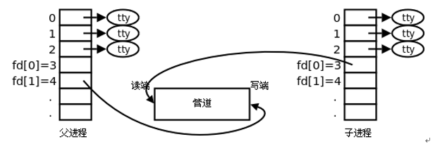

# 进程间通信

**学习目标**

* 熟练使用 `pipe` 进行父子进程间通信
* 熟练使用 `pipe` 进行兄弟进程间通信
* 熟练使用 `fifo` 进行无血缘关系的进程间通信
* 使用 `mmap` 进行有血缘关系的进程间通信
* 使用 `mmap` 进行无血缘关系的进程间通信

---

## 进程间通信相关概念

### 什么是进程间通信

Linux 环境下，进程地址空间相互独立，每个进程各自有不同的用户地址空间。任何一个进程的全局变量在另一个进程中都看不到，所以进程和进程之间不能相互访问，要交换数据必须通过内核，在内核中开辟一块缓冲区，进程1 把数据从用户空间拷到内核缓冲区，进程2 再从内核缓冲区把数据读走，内核提供的这种机制称为进程间通信(IPC，InterProcess Communication)


### 进程间通信的方式

在进程间完成数据传递需要借助操作系统提供特殊的方法，如：文件、管道、信号、共享内存、消息队列、套接字、命名管道等。随着计算机的蓬勃发展，一些方法由于自身设计缺陷被淘汰或者弃用。现今常用的进程间通信方式有：

* 管道(使用最简单)
* 信号(开销最小)
* 共享映射区(无血缘关系)
* 本地套接字(最稳定)

---

## 管道 pipe

### 管道的概念

管道是一种最基本的 IPC 机制，也称匿名管道，应用于有血缘关系的进程之间，完成数据传递。调用 `pipe` 函数即可创建一个管道


有如下特质：

* 管道的本质是一块内核缓冲区 
* 由两个文件描述符引用，一个表示读端，一个表示写端
* 规定数据从管道的写端流入管道，从读端流出
* 当两个进程都终结的时候，管道也自动消失
* 管道的读端和写端默认都是阻塞的

### 管道的原理

* 管道的实质是内核缓冲区，内部使用环形队列实现
* 默认缓冲区大小为 4K，可以使用 `ulimit -a` 命令获取大小
* 实际操作过程中缓冲区会根据数据压力做适当调整

### 管道的局限性

* 数据一旦被读走，便不在管道中存在，不可反复读取
* 数据只能在一个方向上流动，若要实现双向流动，必须使用两个管道
* 只能在有血缘关系的进程间使用管道

### 创建管道 - pipe 函数

* 函数作用:
	* 创建一个管道
* 函数原型:
	* `int pipe(int fd[2]);`
* 函数参数:
	* 若函数调用成功，`fd[0]` 存放管道的读端，`fd[1]` 存放管道的写端
* 返回值:
	* 成功返回 0
	* 失败返回 -1，并设置 `errno` 值

函数调用成功返回读端和写端的文件描述符，其中 `fd[0]` 是读端，`fd[1]` 是写端，向管道读写数据是通过使用这两个文件描述符进行的，读写管道的实质是操作内核缓冲区

管道创建成功以后，创建该管道的进程(父进程)同时掌握着管道的读端和写端。如何实现父子进程间通信呢

### 父子进程使用管道通信

一个进程在由 `pipe()` 创建管道后，一般再 `fork` 一个子进程，然后通过管道实现父子进程间的通信(因此也不难推出，只要两个进程中存在血缘关系，这里的血缘关系指的是具有共同的祖先，都可以采用管道方式来进行通信)。父子进程间具有相同的文件描述符，且指向同一个管道 `pipe`，其他没有关系的进程不能获得 `pipe()` 产生的两个文件描述符，也就不能利用同一个管道进行通信

* 第一步：父进程创建管道


* 第二步：父进程 `fork` 出子进程


* 第三步：父进程关闭 `fd[0]`，子进程关闭 `fd[1]`



**创建步骤总结：

* 父进程调用 `pipe` 函数创建管道，得到两个文件描述符 `fd[0]` 和 `fd[1]`，分别指向管道的读端和写端
* 父进程调用 `fork` 创建子进程，那么子进程也有两个文件描述符指向同一管
* 父进程关闭管道读端，子进程关闭管道写端。父进程可以向管道中写入数据，子进程将管道中的数据读出，这样就实现了父子进程间通信

```c
#include <stdlib.h>
#include <unistd.h>
#include <string.h>
#include <stdio.h>
#include <sys/wait.h>
#include <sys/stat.h>

void testPipe1()
{
    // 创建管道
    // int pipe(int pipefd[2]);
    int fd[2];
    int ret = pipe(fd);
    if (ret < 0)
    {
        perror("pipe error");
        return;
    }

    // 创建子进程
    pid_t pid = fork();
    if (pid < 0)
    {
        perror("fork error");
        return;
    }
    else if (pid > 0)
    {
        // 关闭读端
        close(fd[0]);
        sleep(5);
        write(fd[1], "hello, I am parent process", strlen("hello, I am parent process"));
    }
    else
    {
        // 关闭写端
        close(fd[1]);
        char buf[64];
        memset(buf, 0, sizeof(buf));
        int n = read(fd[0], buf, sizeof(buf));
        printf("read over, n: %d, buf: %s\n", n, buf);
    }
}

void testPipe2()
{
    // 创建管道
    // int pipe(int pipefd[2]);
    int fd[2];
    int ret = pipe(fd);
    if (ret < 0)
    {
        perror("pipe error");
        return;
    }

    // 创建子进程
    pid_t pid = fork();
    if (pid < 0)
    {
        perror("fork error");
        return;
    }
    else if (pid > 0)
    {
        // 关闭写端
        close(fd[1]);

        char buf[64];
        memset(buf, 0, sizeof(buf));
        int n = read(fd[0], buf, sizeof(buf));
        printf("read over, n: %d, buf: %s\n", n, buf);

        int status;
        int wpid = wait(&status);
        printf("wpid: %d\n", wpid);

        if (WIFEXITED(status))
        {
            // 正常退出
            printf("Child normal exit, status: %d\n", WEXITSTATUS(status));
        }
        else if (WIFSIGNALED(status))
        {
            // 被信号杀死
            printf("Child killed by signal, signo: %d\n", WTERMSIG(status));
        }
        else
        {
        }
    }
    else
    {
        // 关闭读端
        close(fd[0]);
        write(fd[1], "hello, I am child process", strlen("hello, I am child process"));
    }
}

void testPipe3()
{
    // 创建管道
    // int pipe(int pipefd[2]);
    int fd[2];

    int ret = pipe(fd);

    if (ret < 0)
    {
        perror("pipe error");
        return;
    }

    // 创建子进程
    pid_t pid = fork();
    if (pid < 0)
    {
        perror("fork error");
        return;
    }
    else if (pid > 0)
    {
        sleep(4);
        char *str = "hello, I am parent process";
        printf("parent send over, buf: %s\n", str);
        write(fd[1], str, strlen(str));

        sleep(4);

        char buf[64];
        memset(buf, 0, sizeof(buf));
        int n = read(fd[0], buf, sizeof(buf));
        printf("parent read over, n: %d, buf: %s\n", n, buf);
    }
    else
    {
        char *str = "hello, I am child process";
        char buf[64];
        memset(buf, 0, sizeof(buf));
        int n = read(fd[0], buf, sizeof(buf));
        printf("child read over, n: %d, buf: %s\n", n, buf);

        sleep(4);

        printf("child send over, buf: %s\n", str);
        write(fd[1], str, strlen(str));
    }
}

void testPipe4()
{
    // 创建管道
    // int pipe(int pipefd[2]);
    int fdP2C[2];
    int fdC2P[2];

    int retP2C = pipe(fdP2C);
    int retC2P = pipe(fdC2P);

    if (retP2C < 0 | retC2P < 0)
    {
        perror("pipe error");
        return;
    }

    // 创建子进程
    pid_t pid = fork();
    if (pid < 0)
    {
        perror("fork error");
        return;
    }
    else if (pid > 0)
    {
        char *str = "hello, I am parent process";
        // 关闭读管道，保留写
        close(fdP2C[0]);
        // 关闭写管道，保留读
        close(fdC2P[1]);

        printf("parent send over, buf: %s\n", str);
        write(fdP2C[1], str, strlen(str));

        char buf[64];
        memset(buf, 0, sizeof(buf));
        int n = read(fdC2P[0], buf, sizeof(buf));
        printf("parent read over, n: %d, buf: %s\n", n, buf);
    }
    else
    {
        char *str = "hello, I am child process";
        // 关闭写管道，保留读
        close(fdP2C[1]);
        // 关闭读管道，保留写
        close(fdC2P[0]);

        char buf[64];
        memset(buf, 0, sizeof(buf));
        int n = read(fdP2C[0], buf, sizeof(buf));
        printf("child read over, n: %d, buf: %s\n", n, buf);

        printf("child send over, buf: %s\n", str);
        write(fdC2P[1], str, strlen(str));
    }
}

int main()
{
    // testPipe1();

    /*
        read over, n: 26, buf: hello, I am parent process
    */

    // testPipe2();

    /*
        read over, n: 25, buf: hello, I am child process
        wpid: 3463
        Child normal exit, status: 0
    */

    testPipe3();

    /*
        parent send over, buf: hello, I am parent process
        child read over, n: 26, buf: hello, I am parent process
        child send over, buf: hello, I am child process
        parent read over, n: 25, buf: hello, I am child process
    */

    // testPipe4();

    /*
        parent send over, buf: hello, I am parent process
        child read over, n: 26, buf: hello, I am parent process
        child send over, buf: hello, I am child process
        parent read over, n: 25, buf: hello, I am child process
    */

    return 0;
}
```

### 管道练习

* 一个进程能否使用管道完成读写操作呢

```c
#include <stdlib.h>
#include <unistd.h>
#include <string.h>
#include <stdio.h>
#include <sys/wait.h>
#include <sys/stat.h>

int main()
{
    // 创建管道
    // int pipe(int pipefd[2]);
    int fd[2];
    int ret = pipe(fd);
    if (ret < 0)
    {
        perror("pipe error");
        return -1;
    }

    // 写端
    write(fd[1], "hello, I am parent process", strlen("hello, I am parent process"));

    sleep(5);

    // 读端
    char buf[64];
    memset(buf, 0, sizeof(buf));
    int n = read(fd[0], buf, sizeof(buf));
    printf("read over, n: %d, buf: %s\n", n, buf);

    /*
        read over, n: 26, buf: hello, I am parent process
    */

    return 0;
}
```

* 使用管道完成父子进程间通信
* 父子进程间通信，实现 `ps aux | grep bash`
	* 使用 `execlp` 函数和 `dup2` 函数
* 兄弟进程间通信，实现 `ps aux | grep bash`
	* 使用 `execlp` 函数和 `dup2` 函数
	* 父进程要调用 `waitpid` 函数完成对子进程的回收


```c
#include <stdlib.h>
#include <unistd.h>
#include <string.h>
#include <stdio.h>
#include <sys/wait.h>
#include <sys/stat.h>

int main()
{
    // 创建管道
    // int pipe(int pipefd[2]);
    int fd[2];
    int ret = pipe(fd);
    if (ret < 0)
    {
        perror("pipe error");
        return -1;
    }

    // 创建子进程
    pid_t pid = fork();
    if (pid < 0)
    {
        perror("fork error");
        return -1;
    }
    else if (pid > 0)
    {
        // 关闭读终端
        close(fd[0]);
        dup2(fd[1], STDOUT_FILENO);
        execlp("ps", "ps", "aux", NULL);
        perror("execlp error");
        int wpid = waitpid(-1, NULL, WNOHANG);
        if (wpid > 0)
        {
            printf("child pid: %d called back\n", wpid);
        }
    }
    else
    {
        // 关闭终端
        close(fd[1]);
        dup2(fd[0], STDIN_FILENO);
        execlp("grep", "grep", "--color=auto", "bash", NULL);
        perror("execlp error");
    }

    /*
        root        1219  0.0  0.1   9624  3632 ?        Ss   15:14   0:00 bash
        root        1489  0.0  0.2  10072  4324 pts/0    Ss+  15:14   0:00 /bin/bash --init-file /root/.vscode-server/bin/784b0177c56c607789f9638da7b6bf3230d47a8c/out/vs/workbench/contrib/terminal/browser/media/shellIntegration-bash.sh
        root        2679  0.0  0.0   9032   720 ?        S    15:54   0:00 grep --color=auto bash
    */

    return 0;
}
```

### 管道的读写行为

* 读操作
	* 有数据
		* `read` 正常读，返回读出的字节数
	* 无数据
		* 写端全部关闭
			* `read` 解除阻塞，返回 0，相当于读文件读到了尾部
		* 没有全部关闭
			* `read` 阻塞
* 写操作
	* 读端全部关闭
		* 管道破裂，进程终止，内核给当前进程发 `SIGPIPE` 信号
	* 读端没全部关闭
		* 缓冲区写满了
			* `write` 阻塞
		* 缓冲区没有满
			* 继续 `write`

### 如何设置管道为非阻塞

默认情况下，管道的读写两端都是阻塞的，若要设置读或者写端为非阻塞，则可参考下列三个步骤进行：

* 第 1 步：`int flags = fcntl(fd[0], F_GETFL, 0);` 
* 第 2 步：`flag |= O_NONBLOCK;`
* 第 3 步：`fcntl(fd[0], F_SETFL, flags);`

若是读端设置为非阻塞：

* 写端没有关闭，管道中没有数据可读，则 `read` 返回 -1
* 写端没有关闭，管道中有数据可读，则 `read` 返回实际读到的字节数
* 写端已经关闭，管道中有数据可读，则 `read` 返回实际读到的字节数
* 写端已经关闭，管道中没有数据可读，则 `read` 返回 0

```c
#include <stdlib.h>
#include <unistd.h>
#include <string.h>
#include <stdio.h>
#include <sys/wait.h>
#include <sys/stat.h>
#include <fcntl.h>

int main()
{
    // 创建管道
    // int pipe(int pipefd[2]);
    int fd[2];
    int ret = pipe(fd);
    if (ret < 0)
    {
        perror("pipe error");
        return -1;
    }

    printf("pipe size: %ld\n", fpathconf(fd[0], _PC_PIPE_BUF));
    printf("pipe size: %ld\n", fpathconf(fd[1], _PC_PIPE_BUF));

    // close(fd[0]);
    write(fd[1], "hello world", strlen("hello world"));

    // 关闭写端
    close(fd[1]);

    // 设置管道的读端为非阻塞
    int flag = fcntl(fd[0], F_GETFL);
    flag |= O_NONBLOCK;
    fcntl(fd[0], F_SETFL, flag);

    char buf[64];
    memset(buf, 0, sizeof(buf));
    int n = read(fd[0], buf, sizeof(buf));
    printf("read over, n: %d, buf: %s\n", n, buf);

    /*
        pipe size: 4096
        pipe size: 4096
        read over, n: 11, buf: hello world
    */

    return 0;
}
```

### 如何查看管道缓冲区大小

* 命令
	* `ulimit -a`
* 函数 
	* `long fpathconf(int fd, int name);`
	* `printf("pipe size==[%ld]\n", fpathconf(fd[0], _PC_PIPE_BUF));`
	* `printf("pipe size==[%ld]\n", fpathconf(fd[1], _PC_PIPE_BUF));`

---

## FIFO

### FIFO 介绍

FIFO 常被称为命名管道，以区分管道(pipe)。管道(pipe)只能用于"有血缘关系"的进程间通信。但通过 FIFO，不相关的进程也能交换数据

FIFO 是 Linux 基础文件类型中的一种(文件类型为 `p`，可通过 `ls -l` 查看文件类型)。但 FIFO 文件在磁盘上没有数据块，文件大小为 0，仅仅用来标识内核中一条通道。进程可以打开这个文件进行 `read/write`，实际上是在读写内核缓冲区，这样就实现了进程间通信

### 创建管道

* 方式1 - 使用命令 `mkfifo`
	* 命令格式：`mkfifo 管道名`
	* 例如：`mkfifo myfifo`
* 方式2 - 使用函数
	* `int mkfifo(const char *pathname, mode_t mode);`
	* 参数说明和返回值可以查看 `man 3 mkfifo`

当创建了一个 FIFO，就可以使用 `open` 函数打开它，常见的文件 I/O 函数都可用于 FIFO。如：`close`、`read`、`write`、`unlink` 等

FIFO 严格遵循先进先出(first in first out)，对 FIFO 的读总是从开始处返回数据，对它们的写则把数据添加到末尾。它们不支持诸如 `lseek()` 等文件定位操作

### 使用 FIFO 完成两个进程通信

使用 FIFO 完成两个进程通信的示意图


**思路**

* 进程 A：
	* 创建一个 `fifo` 文件：`myfifo`
	* 调用 `open` 函数打开 `myfifo` 文件
	* 调用 `write` 函数写入一个字符串如："hello world"(其实是将数据写入到了内核缓冲区)
	* 调用 `close` 函数关闭 `myfifo` 文件
* 进程 B：
	* 调用 `open` 函数打开 `myfifo` 文件
	* 调用 `read` 函数读取文件内容(其实就是从内核中读取数据)
	* 打印显示读取的内容
	* 调用 `close` 函数关闭 `myfifo` 文件

注意：`myfifo` 文件是在进程 A 中创建的，如果先启动进程 B 会报错。思考一下如何解决这个问题呢

```c
#include <stdlib.h>
#include <unistd.h>
#include <string.h>
#include <stdio.h>
#include <sys/wait.h>
#include <sys/stat.h>
#include <fcntl.h>

int main()
{
    // 创建 fifo 文件
    // int mkfifo(const char *pathname, mode_t mode);

    int ret = access("./myfifo", F_OK);
    if (ret != 0)
    {
        ret = mkfifo("./myfifo", 0777);
        if (ret < 0)
        {
            perror("mkfifo error");
            return -1;
        }
    }

    // 打开 fifo 文件
    int fd = open("./myfifo", O_RDWR);
    if (fd < 0)
    {
        perror("open error");
        return -1;
    }

    // 写 fifo 文件
    int i = 0;
    char buf[64];
    while (1)
    {
        memset(buf, 0, sizeof(buf));
        sprintf(buf, "%d: %s", i, "hello world");
        write(fd, buf, strlen(buf));
        sleep(1);
        i++;
    }

    // 关闭文件
    close(fd);

    return 0;
}
```

```c
#include <stdlib.h>
#include <unistd.h>
#include <string.h>
#include <stdio.h>
#include <sys/wait.h>
#include <sys/stat.h>
#include <fcntl.h>

int main()
{
    // 创建 fifo 文件
    // int mkfifo(const char *pathname, mode_t mode);

    int ret = access("./myfifo", F_OK);
    if (ret != 0)
    {
        ret = mkfifo("./myfifo", 0777);
        if (ret < 0)
        {
            perror("mkfifo error");
            return -1;
        }
    }

    // 打开 fifo 文件
    int fd = open("./myfifo", O_RDWR);
    if (fd < 0)
    {
        perror("open error");
        return -1;
    }

    // 读 fifo 文件
    int n;
    char buf[64];
    while (1)
    {
        memset(buf, 0, sizeof(buf));
        n = read(fd, buf, sizeof(buf));
        printf("n: %d, buf: %s\n", n, buf);
    }

    // 关闭文件
    close(fd);

    /*
        n: 14, buf: 0: hello world
        n: 14, buf: 1: hello world
        n: 14, buf: 2: hello world
        n: 14, buf: 3: hello world
        n: 14, buf: 4: hello world
        n: 14, buf: 5: hello world
        // ...
    */

    return 0;
}
```

---

## 内存映射区

### 存储映射区介绍

存储映射 I/O(Memory-mapped I/O)使一个磁盘文件与存储空间中的一个缓冲区相映射。从缓冲区中取数据，就相当于读文件中的相应字节；将数据写入缓冲区，则会将数据写入文件。这样，就可在不使用 `read` 和 `write` 函数的情况下，使用地址(指针)完成 I/O 操作

使用存储映射这种方法，首先应通知内核，将一个指定文件映射到存储区域中。这个映射工作可以通过 `mmap` 函数来实现


### mmap 函数

* 函数作用:
	* 建立存储映射区
* 函数原型
	* `void *mmap(void *addr, size_t length, int prot, int flags, int fd, off_t offset);`
* 函数返回值：
	* 成功：返回创建的映射区首地址
	* 失败：`MAP_FAILED` 宏
* 参数：	
	* `addr`: 指定映射的起始地址，通常设为 `NULL`，由系统指定
	* `length`：映射到内存的文件长度
	* `prot`：映射区的保护方式，最常用的:
		* 读：`PROT_READ`
		* 写：`PROT_WRITE`
		* 读写：`PROT_READ | PROT_WRITE`
	* `flags`：映射区的特性，可以是
		* `MAP_SHARED`: 写入映射区的数据会写回文件，且允许其他映射该文件的进程共享
		* `MAP_PRIVATE`: 对映射区的写入操作会产生一个映射区的复制(copy-on-write)，对此区域所做的修改不会写回原文件
	* `fd`：由 `open` 返回的文件描述符，代表要映射的文件
	* `offset`：以文件开始处的偏移量，必须是 4k 的整数倍，通常为 0，表示从文件头开始映射

### munmap 函数

* 函数作用:
	* 释放由 `mmap` 函数建立的存储映射区
* 函数原型:
	* `int munmap(void *addr, size_t length);`
* 返回值：
	* 成功：返回 0
	* 失败：返回 -1，设置 `errno` 值
* 函数参数:
	* `addr`：调用 `mmap` 函数成功返回的映射区首地址
	* `length`：映射区大小(`mmap` 函数的第二个参数)

### mmap 注意事项

* 创建映射区的过程中，隐含着一次对映射文件的读操作，将文件内容读取到映射区
* 当 `MAP_SHARED` 时，要求：`映射区的权限应 <= 文件打开的权限`(出于对映射区的保护)。而 `MAP_PRIVATE` 则无所谓，因为 `mmap` 中的权限是对内存的限制
* 映射区的释放与文件关闭无关，只要映射建立成功，文件可以立即关闭
* 特别注意，当映射文件大小为 0 时，不能创建映射区。所以，用于映射的文件必须要有实际大小；`mmap` 使用时常常会出现总线错误，通常是由于共享文件存储空间大小引起的
* `munmap` 传入的地址一定是 `mmap` 的返回地址。坚决杜绝指针 `++` 操作
* 文件偏移量必须为 0 或者 4K 的整数倍
* `mmap` 创建映射区出错概率非常高，一定要检查返回值，确保映射区建立成功再进行后续操作

### 有关 mmap 函数的使用总结

* 第一个参数写成 `NULL`
* 第二个参数要映射的文件大小 > 0
* 第三个参数：`PROT_READ`、`PROT_WRITE`
* 第四个参数：`MAP_SHARED` 或者 `MAP_PRIVATE`
* 第五个参数：打开的文件对应的文件描述符
* 第六个参数：4k 的整数倍

### mmap 函数相关思考题

* 可以 `open` 的时候 `O_CREAT` 一个新文件来创建映射区吗
* 如果 `open` 时 `O_RDONLY`，`mmap` 时 `PROT` 参数指定 `PROT_READ | PROT_WRITE` 会怎样
* `mmap` 映射完成之后，文件描述符关闭，对 `mmap` 映射有没有影响
* 如果文件偏移量为 1000 会怎样
* 对 `mem` 越界操作会怎样
* 如果 `mem++`，`munmap` 可否成功
* `mmap` 什么情况下会调用失败
* 如果不检测 `mmap` 的返回值，会怎样

### mmap 应用练习

* 练习 1：使用 `mmap` 完成对文件的读写操作
* 练习 2：使用 `mmap` 完成父子进程间通信
	* 图解说明
	* 思路
		* 调用 `mmap` 函数创建存储映射区，返回映射区首地址 `ptr`
		* 调用 `fork` 函数创建子进程，子进程也拥有了映射区首地址
		* 父子进程可以通过映射区首地址指针 `ptr` 完成通信
		* 调用 `munmap` 函数释放存储映射区


* 练习 3：使用 `mmap` 完成没有血缘关系的进程间通
	* 思路：两个进程都打开相同的文件，然后调用 `mmap` 函数建立存储映射区，这样两个进程共享同一个存储映射区

使用 `mmap` 函数建立匿名映射：

```c
mmap(NULL, 4096, PROT_READ | PROT_WRITE, MAP_SHARED | MAP_ANONYMOUS, -1, 0);
```

`mmap.c`

```c
#include <stdlib.h>
#include <unistd.h>
#include <string.h>
#include <stdio.h>
#include <sys/wait.h>
#include <sys/stat.h>
#include <fcntl.h>
#include <sys/mman.h>
#include <sys/types.h>

int main()
{
    // 使用 mmap 函数建设共享映射区
    // void *mmap(void *addr, size_t length, int prot, int flags, int fd, off_t offset);
    int fd = open("./test.log", O_RDWR);
    if (fd < 0)
    {
        perror("open error");
        return -1;
    }

    // 注意，mmap 不能去扩展一个内容为空的新文件，因为大小为 0，所有本没有与之对应的合法的物理页，不能扩展
    // 方法一
    // write(fd,"fd",strlen("fd"));
    // 方法二
    ftruncate(fd, 4096);

    int len = lseek(fd, 0, SEEK_END);

    void *addr = mmap(NULL, len, PROT_READ | PROT_WRITE, MAP_SHARED, fd, 0);
    if (addr == MAP_FAILED)
    {
        perror("mmap error");
        return -1;
    }
    close(fd);

    // 创建子进程
    pid_t pid = fork();
    if (pid < 0)
    {
        perror("fork error");
        return -1;
    }
    else if (pid > 0)
    {
        memcpy(addr, "hello world", strlen("hello world"));
        wait(NULL);
    }
    else if (pid == 0)
    {
        sleep(1);
        char *p = (char *)addr;
        printf("%s\n", p);
    }

    /*
        hello world
    */

    return 0;
}
```

`mmapAnony.c`

```c
#include <stdlib.h>
#include <unistd.h>
#include <string.h>
#include <stdio.h>
#include <sys/wait.h>
#include <sys/stat.h>
#include <fcntl.h>
#include <sys/mman.h>
#include <sys/types.h>

int main()
{
    // 使用 mmap 函数建设共享映射区
    // void *mmap(void *addr, size_t length, int prot, int flags, int fd, off_t offset);

    void *addr = mmap(NULL, 4096, PROT_READ | PROT_WRITE, MAP_SHARED | MAP_ANONYMOUS, -1, 0);
    if (addr == MAP_FAILED)
    {
        perror("mmap error");
        return -1;
    }

    // 创建子进程
    pid_t pid = fork();
    if (pid < 0)
    {
        perror("fork error");
        return -1;
    }
    else if (pid > 0)
    {
        memcpy(addr, "hello world", strlen("hello world"));
        wait(NULL);
    }
    else if (pid == 0)
    {
        sleep(1);
        char *p = (char *)addr;
        printf("%s\n", p);
    }

    /*
        hello world
    */

    return 0;
}
```

`mmapRead.c`

```c
//使用mmap函数完成父子进程间通信
#include <stdio.h>
#include <stdlib.h>
#include <string.h>
#include <sys/types.h>
#include <unistd.h>
#include <sys/wait.h>
#include <fcntl.h>
#include <sys/stat.h>
#include <sys/mman.h>

int main()
{
    // 使用 mmap 函数建立共享映射区
    // void *mmap(void *addr, size_t length, int prot, int flags, int fd, off_t offset);

    int fd = open("./test.log", O_RDWR);
    if (fd < 0)
    {
        perror("open error");
        return -1;
    }

    int len = lseek(fd, 0, SEEK_END);

    void *addr = mmap(NULL, len, PROT_READ | PROT_WRITE, MAP_SHARED, fd, 0);
    if (addr == MAP_FAILED)
    {
        perror("mmap error");
        return -1;
    }

    char buf[64];
    memset(buf, 0, sizeof(buf));
    memcpy(buf, addr, 10);
    printf("buf: %s\n", buf);

    // buf: 0123456789

    return 0;
}
```

`mmapWrite.c`

```c
//使用mmap函数完成父子进程间通信
#include <stdio.h>
#include <stdlib.h>
#include <string.h>
#include <sys/types.h>
#include <unistd.h>
#include <sys/wait.h>
#include <fcntl.h>
#include <sys/stat.h>
#include <sys/mman.h>

int main()
{
    // 使用 mmap 函数建立共享映射区
    // void *mmap(void *addr, size_t length, int prot, int flags, int fd, off_t offset);

    int fd = open("./test.log", O_RDWR);
    if (fd < 0)
    {
        perror("open error");
        return -1;
    }

    int len = lseek(fd, 0, SEEK_END);

    void *addr = mmap(NULL, len, PROT_READ | PROT_WRITE, MAP_SHARED, fd, 0);
    if (addr == MAP_FAILED)
    {
        perror("mmap error");
        return -1;
    }

    memcpy(addr, "0123456789", 10);

    return 0;
}
```

### 补充

代码位于 [code](../codes/part4/homework/)

`hello.c`

```c
#include <stdio.h>
#include <stdlib.h>
#include <string.h>
#include <sys/types.h>
#include <unistd.h>
#include <sys/wait.h>
#include <fcntl.h>
#include <sys/stat.h>
#include <errno.h>

int main(int argc, char *argv[])
{
    int i = 0;
    for (i = 0; i < argc; i++)
    {
        printf("%d: %s\n", i, argv[i]);
    }

    while (1)
    {
        printf("hello world\n");
        sleep(1);
    }

    return 0;
}
```

`test.c`

```c
#include <stdio.h>
#include <stdlib.h>
#include <string.h>
#include <sys/types.h>
#include <unistd.h>
#include <sys/wait.h>
#include <fcntl.h>
#include <sys/stat.h>
#include <errno.h>

int main(int argc, char *argv[])
{
    char *p = "hello world";
    p[0] = 'H';
    printf("%s\n", p);

    return 0;
}
```

使用 `mmap` 函数完成父子进程间通信

`forkFile.c`

```c
#include <stdio.h>
#include <stdlib.h>
#include <string.h>
#include <sys/types.h>
#include <unistd.h>
#include <sys/wait.h>
#include <fcntl.h>
#include <sys/stat.h>
#include <sys/mman.h>

int main()
{
    // 使用 mmap 函数建立共享映射区
    // void *mmap(void *addr, size_t length, int prot, int flags, int fd, off_t offset);

    int fd = open("./test.log", O_RDWR | O_CREAT, 0777);
    if (fd < 0)
    {
        perror("open error");
        return -1;
    }

    pid_t pid = fork();
    if (pid < 0)
    {
        perror("fork error");
        return -1;
    }
    else if (pid > 0)
    {
        printf("father: fpid: %d, cpid: %d\n", getpid(), pid);
        write(fd, "hello world", strlen("hello world"));
        close(fd);
    }
    else
    {
        printf("child: fpid: %d, cpid: %d\n", getppid(), getpid());
        char buf[256];
        int n;
        memset(buf, 0, sizeof(buf));
        sleep(1);
        lseek(fd, 0, SEEK_SET);
        n = read(fd, buf, sizeof(buf));
        printf("read over, n: %d, buf: %s\n", n, buf);
        close(fd);
    }

    /*
        father: fpid: 8700, cpid: 8701
        child: fpid: 1, cpid: 8701
        read over, n: 256, buf: hello world
    */

    return 0;
}
```

`forkLoop.c`

```c
#include <stdio.h>
#include <stdlib.h>
#include <string.h>
#include <sys/types.h>
#include <unistd.h>
#include <sys/wait.h>
#include <fcntl.h>
#include <sys/stat.h>
#include <errno.h>

int main()
{
    int i = 0;
    int n = 3;

    for (i = 0; i < n; i++)
    {
        pid_t pid = fork();
        if (pid < 0)
        {
            perror("fork error");
            return -1;
        }
        else if (pid > 0)
        {
            printf("father: fpid: %d, cpid: %d\n", getpid(), pid);
            sleep(1);
        }
        else
        {
            printf("child: fpid: %d, cpid: %d\n", getppid(), getpid());
            break;
        }
    }

    // 父进程
    if (i == 3)
    {
        printf("%d: father: fpid: %d\n", i, getpid());
        pid_t wpid;
        int status;

        while (1)
        {
            wpid = waitpid(-1, &status, WNOHANG);
            if (wpid == 0)
            {
                // 没有子进程退出
                continue;
            }
            else if (wpid == -1)
            {
                // 已经没有子进程
                printf("no child is living, wpid: %d\n", wpid);
                exit(0);
            }
            else if (wpid > 0)
            {
                if (WIFEXITED(status))
                {
                    printf("normal exit, status: %d\n", WEXITSTATUS(status));
                }
                else if (WIFSIGNALED(status))
                {
                    printf("killed by sign: %d\n", WTERMSIG(status));
                }
                else
                {
                }
            }
            else
            {
            }
        }
    }

    // 第一个子进程
    if (i == 0)
    {
        printf("%d: child: cpid: %d\n", i, getpid());
        execlp("ls", "ls", "-l", NULL);
        perror("execl error");
        exit(-1);
    }

    // 第二个子进程
    if (i == 1)
    {
        printf("%d: child: cpid: %d\n", i, getpid());
        execl("/home/root/codes/cplusplus/vscode/demo/test/hello", "hello", "111", "222", NULL);
        perror("execl error");
        return -1;
    }

    // 第三个子进程
    if (i == 2)
    {
        printf("%d: child: cpid: %d\n", i, getpid());
        execl("/home/root/codes/cplusplus/vscode/demo/test/test", "test", NULL);
        perror("execl error");
        return -1;
    }

    /*
        father: fpid: 8183, cpid: 8184
        child: fpid: 8183, cpid: 8184
        0: child: cpid: 8184
        total 100
        -rwxr-xr-x 1 root root 16784 Sep 14 20:58 hello
        -rw-r--r-- 1 root root   413 Sep 14 21:40 hello.c
        -rwxr-xr-x 1 root root 17136 Sep 14 21:55 m
        -rwxr-xr-x 1 root root 17224 Sep 14 21:45 main
        -rw-r--r-- 1 root root  1139 Sep 14 21:29 main.c
        -rw-r--r-- 1 root root  2374 Sep 14 21:55 m.c
        -rwxr-xr-x 1 root root 16696 Sep 14 21:03 test
        -rw-r--r-- 1 root root   305 Sep 14 21:51 test.c
        -rw-r--r-- 1 root root  4096 Sep 14 21:45 test.log
        father: fpid: 8183, cpid: 8221
        child: fpid: 8183, cpid: 8221
        1: child: cpid: 8221
        0: hello
        1: 111
        2: 222
        hello world
        father: fpid: 8183, cpid: 8228
        child: fpid: 8183, cpid: 8228
        2: child: cpid: 8228
        hello world
        3: father: fpid: 8183
        normal exit, status: 0
        killed by sign: 11
        hello world
        hello world
        hello world
        hello world
        hello world
        hello world
        ...
    */

    return 0;
}
```

---
