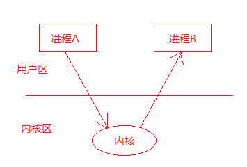
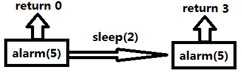
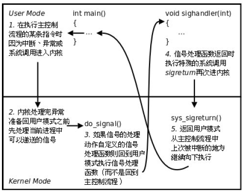

# 信号

**学习目标**

* 了解信号中的基本概念
* 熟练使用信号相关的函数
* 参考文档使用信号集操作相关函数
* 熟练使用信号捕捉函数 `signal`
* 熟练使用信号捕捉函数 `sigaction`
* 熟练掌握使用信号完成子进程的回收

---

## 信号介绍

信号是信息的载体，Linux/UNIX 环境下，古老、经典的通信方式，现下依然是主要的通信手段

信号在生活中随处可见，例如：

* 古代战争中摔杯为号
* 现代战争中的信号弹
* 体育比赛中使用的信号枪

信号的特点
    
* 简单
* 不能携带大量信息
* 满足某个特点条件才会产生

---

## 信号的机制

进程 A 给进程 B 发送信号，进程 B 收到信号之前执行自己的代码，收到信号后，不管执行到程序的什么位置，都要暂停运行，去处理信号，处理完毕后再继续执行。与硬件中断类似——异步模式。但信号是软件层面上实现的中断，早期常被称为"软中断"

每个进程收到的所有信号，都是由内核负责发送的


进程 A 给进程 B 发送信号示意图：



### 信号的状态

信号有三种状态：产生、未决和递达

* 信号的产生
    * 按键产生，如：`Ctrl + c`、`Ctrl + z`、`Ctrl + \`
    * 系统调用产生，如：`kill`、`raise`、`abort`
    * 软件条件产生，如：定时器 `alarm`
    * 硬件异常产生，如：非法访问内存(段错误)、除 0(浮点数例外)、内存对齐出错(总线错误)
    * 命令产生，如：`kill` 命令
* 未决：产生和递达之间的状态。主要由于阻塞(屏蔽)导致该状态
* 递达：递送并且到达进程

### 信号的处理方式

* 执行默认动作 
* 忽略信号(丢弃不处理)
* 捕捉信号(调用用户的自定义的处理函数)

### 信号的特质

信号的实现手段导致信号有很强的延时性，但对于用户来说，时间非常短，不易察觉

Linux 内核的进程控制块 PCB 是一个结构体，`task_struct`，除了包含进程 `id`，状态，工作目录，用户 `id`，组 `id`，文件描述符表，还包含了信号相关的信息，主要指**阻塞信号集和未决信号集**

注:表示 PCB 的 `task_struct` 结构体定义在：`/usr/src/linux-headers-5.4.0-100/include/linux/sched.h` 中

### 阻塞信号集和未决信号集

Linux 内核的进程控制块 PCB 是一个结构体，这个结构体里面包含了信号相关的信息，主要有**阻塞信号集和未决信号集**

* 阻塞信号集中保存的都是被当前进程阻塞的信号。若当前进程收到的是阻塞信号集中的某些信号，这些信号需要暂时被阻塞，不予处理
* 信号产生后由于某些原因(主要是阻塞)不能抵达，这类信号的集合称之为未决信号集。在屏蔽解除前，信号一直处于未决状态；若是信号从阻塞信号集中解除阻塞，则该信号会被处理，并从未决信号集中去除


### 信号的四要素

* 通过 `man 7 signal` 可以查看信号相关信息
	* 信号的编号
		* 使用 `kill -l` 命令可以查看当前系统有哪些信号，不存在编号为 0 的信号。其中 1-31 号信号称之为常规信号(也叫普通信号或标准信号)，34-64 称之为实时信号，驱动编程与硬件相关
	* 信号的名称
	* 产生信号的事件
  	* 信号的默认处理动作
    	* `Term`：终止进程
    	* `Ign`：忽略信号(默认即时对该种信号忽略操作)
    	* `Core`：终止进程，生成 `Core` 文件(查验死亡原因，用于 `gdb` 调试)
    	* `Stop`：停止(暂停)进程
    	* `Cont`：继续运行进程
* 特别需要注意的是：The signals SIGKILL and SIGSTOP cannot be caught, blocked, or ignored
* 几个常用到的信号
	* `SIGINT、SIGQUIT、SIGKILL、SIGSEGV、SIGUSR1、SIGUSR2、SIGPIPE、SIGALRM、SIGTERM、SIGCHLD、SIGSTOP、SIGCONT`

---

## 信号相关函数

### signal 函数

* 函数作用：注册信号捕捉函数
* 函数原型
	* `typedef void (*sighandler_t)(int);`
  	* `sighandler_t signal(int signum, sighandler_t handler);`
* 函数参数
	* `signum`：信号编号
	* `handler`：信号处理函数

```c
#include <stdio.h>
#include <stdlib.h>
#include <string.h>
#include <sys/types.h>
#include <unistd.h>
#include <sys/wait.h>
#include <fcntl.h>
#include <sys/stat.h>
#include <errno.h>

// 信号处理函数
void sighandler(int signo)
{
    printf("signo: %d\n", signo);
}

int main()
{
    // 创建管道
    int fd[2];
    int ret = pipe(fd);
    if (ret < 0)
    {
        perror("pipe error");
        return -1;
    }

    // 注册 SIGPIPE 信号处理函数
    signal(SIGPIPE, sighandler);

    // 关闭读端
    close(fd[0]);
    // 不关闭读端，没有 SIGPIPE 信号

    write(fd[1], "hello world", strlen("hello world"));

    /*
        signo: 13
    */

    return 0;
}
```

验证 `SIGCHLD` 信号是如何产生的: 子进程退出，`SIGSTOP`，`SIGCONT`

```c
#include <stdio.h>
#include <stdlib.h>
#include <string.h>
#include <sys/types.h>
#include <unistd.h>
#include <sys/wait.h>
#include <fcntl.h>
#include <sys/stat.h>
#include <errno.h>
#include <sys/time.h>

void sighandler(int signo)
{
    printf("signo: %d\n", signo);
}

int main()
{
    pid_t pid;
    int i = 0;

    signal(SIGCHLD, sighandler);

    pid = fork();

    if (pid < 0)
    {
        perror("fork error");
        return -1;
    }
    else if (pid > 0)
    {
        printf("The father process, pid: %d, child pid: %d\n", getpid(), pid);
        int status;
        while (1)
        {
            sleep(1);
            pid_t p = waitpid(-1, &status, WNOHANG);
            if (WIFEXITED(status))
            {
                // 正常退出
                printf("Child normal exit, status: %d\n", WEXITSTATUS(status));
                break;
            }
            else if (WIFSIGNALED(status))
            {
                // 被信号杀死
                printf("Child killed by signal, signo: %d\n", WTERMSIG(status));
                break;
            }
            else
            {
            }
        }
    }
    else
    {
        printf("The child process, father pid: %d, pid: %d\n", getppid(), getpid());
        exit(-1);
    }

    /*
        The father process, pid: 17726, child pid: 17727
        The child process, father pid: 17726, pid: 17727
        signo: 17
        Child normal exit, status: 255
    */

    return 0;
}
```

`forkLoop.c`

```c
#include <stdio.h>
#include <stdlib.h>
#include <string.h>
#include <sys/types.h>
#include <unistd.h>
#include <sys/wait.h>
#include <fcntl.h>
#include <sys/stat.h>
#include <errno.h>
#include <sys/time.h>

void waitchild(int signo)
{
    printf("signo: %d\n", signo);
}

int main()
{
    int i = 0;
    int n = 3;

    for (i = 0; i < n; i++)
    {
        // fork 子进程
        pid_t pid = fork();
        if (pid < 0)
        {
            perror("fork error");
            return -1;
        }
        else if (pid > 0)
        {
            printf("father: pid: %d\n", getpid());
            sleep(1);
        }
        else
        {
            printf("child: pid: %d\n", getpid());
            break;
        }
    }

    // 父进程
    if (i == 3)
    {
        printf("%d: father: pid: %d\n", i, getpid());
        signal(SIGCHLD, waitchild);

        while (1)
        {
            sleep(4);
            // 杀死一个进程组
            kill(0, SIGKILL);
        }
    }
    if (i == 0)
    {
        printf("%d: child: %d\n", i, getpid());
        sleep(10);
    }
    if (i == 1)
    {
        printf("%d: child: %d\n", i, getpid());
        sleep(10);
    }
    if (i == 2)
    {
        printf("%d: child: %d\n", i, getpid());
        sleep(10);
    }

    /*
        father: pid: 19627
        child: pid: 19628
        0: child: 19628
        father: pid: 19627
        child: pid: 19654
        1: child: 19654
        father: pid: 19627
        child: pid: 19679
        2: child: 19679
        3: father: pid: 19627
        Killed
    */

    return 0;
}
```

`fork.c`

```c
#include <stdio.h>
#include <stdlib.h>
#include <string.h>
#include <sys/types.h>
#include <unistd.h>
#include <sys/wait.h>
#include <fcntl.h>
#include <sys/stat.h>
#include <errno.h>
#include <sys/time.h>

void waitchild(int signo)
{
    printf("signo: %d\n", signo);
}

int main()
{
    int i = 0;
    int n = 3;

    for (i = 0; i < n; i++)
    {
        // fork 子进程
        pid_t pid = fork();
        if (pid < 0)
        {
            perror("fork error");
            return -1;
        }
        else if (pid > 0)
        {
            printf("father: pid: %d\n", getpid());
        }
        else
        {
            printf("child: pid: %d\n", getpid());
            break;
        }
    }

    // 父进程
    if (i == 3)
    {
        printf("the father: pid: %d\n", getpid());
    }
    if (i == 0)
    {
        printf("the first child: %d\n", getpid());
    }
    if (i == 1)
    {
        printf("the second child: %d\n", getpid());
    }
    if (i == 2)
    {
        printf("the third child: %d\n", getpid());
    }

    /*
        father: pid: 19239
        father: pid: 19239
        father: pid: 19239
        the father: pid: 19239
        child: pid: 19242
        the third child: 19242
        child: pid: 19241
        the second child: 19241
        child: pid: 19240
        the first child: 19240
     */

    return 0;
}
```

### kill 函数/命令

* 描述：给指定进程发送指定信号
* `kill` 命令：`kill -SIGKILL 进程 PID`
* `kill` 函数原型：`int kill(pid_t pid, int sig);`
* 函数返回值：
	* 成功：0
	* 失败：-1，设置 `errno`
* 函数参数：
	* `sig` 信号参数：不推荐直接使用数字，应使用宏名，因为不同操作系统信号编号可能不同，但名称一致
	* `pid` 参数：
    	* `pid > 0`: 发送信号给指定的进程
		* `pid = 0`: 发送信号给与调用 `kill` 函数进程属于同一进程组的所有进程
		* `pid < -1`: 取 `|pid|` 发给对应进程组
		* `pid = -1`: 发送给进程有权限发送的系统中所有进程

进程组：每个进程都属于一个进程组，进程组是一个或多个进程集合，他们相互关联，共同完成一个实体任务，每个进程组都有一个进程组长，默认进程组 ID 与进程组长 ID 相同

```c
#include <stdio.h>
#include <stdlib.h>
#include <string.h>
#include <sys/types.h>
#include <unistd.h>
#include <sys/wait.h>
#include <fcntl.h>
#include <sys/stat.h>
#include <errno.h>

void testKill1()
{
    kill(getpid(), SIGKILL);
    printf("hello world\n");
}

// 父进程杀死子进程或者子进程杀死父进程
void testKill2()
{
    pid_t pid;
    int i = 0;
    for (int i = 0; i < 3; i++)
    {
        pid = fork();
        if (pid < 0)
        {
            perror("fork error");
            return;
        }
        else if (pid > 0)
        {
            printf("father process, pid: %d, child pid: %d\n", getpid(), pid);
            // if (i == 0)
            // {
            //     kill(pid, SIGKILL);
            // }
        }
        else
        {
            printf("child process, father pid: %d, pid: %d\n", getppid(), getpid());
            break;
        }
    }

    if (i == 0)
    {
        printf("the first child, pid: %d\n", getpid());

        // 子进程杀死父进程
        // kill(getppid(), SIGKILL);

        sleep(1);
        // 杀死同一组内所有进程
        kill(0, SIGKILL);
    }
    if (i == 1)
    {
        printf("the second child, pid: %d\n", getpid());
        sleep(3);
    }
    if (i == 2)
    {
        printf("the third child, pid: %d\n", getpid());
        sleep(3);
    }
    if (i == 3)
    {
        printf("the father, pid: %d\n", getpid());
        sleep(3);
    }
}

int main()
{
    // testKill1();

    // Killed

    testKill2();

    /*
        father process, pid: 13747, child pid: 13748
        father process, pid: 13747, child pid: 13749
        father process, pid: 13747, child pid: 13750
        the first child, pid: 13747
        child process, father pid: 13747, pid: 13750
        the first child, pid: 13750
        child process, father pid: 13747, pid: 13749
        the first child, pid: 13749
        child process, father pid: 13747, pid: 13748
        the first child, pid: 13748
        Killed
    */

    return 0;
}
```

### abort 函数与 raise 函数

* `raise` 函数
	* 函说描述：给当前进程发送指定信号(自己给自己发)
	* 函数原型：`int raise(int sig);`
	* 函数返回值：
		* 成功：0
		* 失败：非 0 值
	* 函数拓展：`raise(signo) == kill(getpid(), signo);`

```c
#include <stdio.h>
#include <stdlib.h>
#include <string.h>
#include <sys/types.h>
#include <unistd.h>
#include <sys/wait.h>
#include <fcntl.h>
#include <sys/stat.h>
#include <errno.h>

int main()
{
    // 给当前进程发送信号
    raise(SIGKILL);

    printf("hello world\n");

    // Killed

    return 0;
}
```

* `abort` 函数
	* 函数描述：给自己发送异常终止信号 `6) SIGABRT`，并产生 `core` 文件
	* 函数原型：`void abort(void);`  
	* 函数拓展：`abort() == kill(getpid(), SIGABRT);`

```c
#include <stdio.h>
#include <stdlib.h>
#include <string.h>
#include <sys/types.h>
#include <unistd.h>
#include <sys/wait.h>
#include <fcntl.h>
#include <sys/stat.h>
#include <errno.h>

int main()
{
    // 给当前进程发送信号
    abort();

    printf("hello world\n");

    // Aborted (core dumped)

    return 0;
}
```

### alarm 函数	

* 函数原型：`unsigned int alarm(unsigned int seconds);`
* 函数描述：设置定时器(闹钟)。在指定 `seconds` 后，内核会给当前进程发送 `14) SIGALRM` 信号。进程收到该信号，默认动作终止。每个进程都有且只有唯一的一个定时器
* 函数返回值：返回 0 或剩余的秒数，无失败。例如：



* 常用操作：取消定时器 `alarm(0)`，返回旧闹钟余下秒数
	* `alarm` 使用的是自然定时法，与进程状态无关，就绪、运行、挂起(阻塞、暂停)、终止、僵尸...无论进程处于何种状态，`alarm` 都计时
	* 练习题 1：编写一个程序测试 `alarm` 函数
	* 练习题 2：编写程序，测试你的电脑 1 秒种能数多个数字
	* 使用 `time` 命令查看程序执行的时间。程序运行的瓶颈在于 IO，优化程序，首选优化 IO
	* 实际执行时间 = 系统时间 + 用户时间 + 损耗时间
		* 损耗的时间主要来来自文件 IO 操作，IO 操作会有用户区到内核区的切换，切换的次数越多越耗时

`alarm.c`

```c
#include <stdio.h>
#include <stdlib.h>
#include <string.h>
#include <sys/types.h>
#include <unistd.h>
#include <sys/wait.h>
#include <fcntl.h>
#include <sys/stat.h>
#include <errno.h>

void sighandler(int signo)
{
    printf("signo: %d\n", signo);
}

int main()
{
    signal(SIGALRM, sighandler);

    // 设置时钟
    int n = alarm(5);
    printf("n: %d\n", n);

    sleep(2);
    n = alarm(2);
    printf("n: %d\n", n);

    sleep(2);
    n = alarm(5);
    printf("n: %d\n", n);

    // 取消闹钟
    n = alarm(0);
    printf("n: %d\n", n);

    sleep(6);

    /*
        n: 0
        n: 3
        signo: 14
        n: 0
        n: 5
    */

    return 0;
}
```

`alarmCount.c`

```c
#include <stdio.h>
#include <stdlib.h>
#include <string.h>
#include <sys/types.h>
#include <unistd.h>
#include <sys/wait.h>
#include <fcntl.h>
#include <sys/stat.h>
#include <errno.h>

int main()
{
    alarm(1);
    int i = 0;
    while (1)
    {
        printf("[%d]", i++);
    }

    return 0;
}
```

`alarmUncle.c`

```c
#include <stdio.h>
#include <stdlib.h>
#include <string.h>
#include <sys/types.h>
#include <unistd.h>
#include <sys/wait.h>
#include <fcntl.h>
#include <sys/stat.h>
#include <errno.h>

int main()
{
    alarm(1);
    int i = 0;
    while (1)
    {
        printf("[%d]\n", i++);
    }

    return 0;
}
```

### setitimer 函数

* 函数原型       

```c
int setitimer(int which, const struct itimerval *new_value, struct itimerval *old_value);
```

* 函数描述
    * 设置定时器(闹钟)，可代替 `alarm` 函数，精度微秒 `us`，可以实现周期定时
* 函数返回值
	* 成功：0；
	* 失败：-1，设置 `errno` 值
* 函数参数： 
	* `which`：指定定时方式
		* 自然定时：`ITIMER_REAL -> 14) SIGALRM` 计算自然时间
		* 虚拟空间计时(用户空间)：`ITIMER_VIRTUAL -> 26) SIGVTALRM` 只计算进程占用 cpu 的时间
		* 运行时计时(用户 + 内核)：`ITIMER_PROF -> 27) SIGPROF` 计算占用 cpu 及执行系统调用的时间
	* `new_value`：`struct itimerval`，负责设定 `timeout` 时间
		* `itimerval.it_value`: 设定第一次执行 `function` 所延迟的秒数
		* `itimerval.it_interval`: 设定以后每几秒执行 `function`
    * `old_value`：存放旧的 `timeout` 值，一般指定为 `NULL`

```c
struct timeval
{
    long tv_sec;  // 秒
    long tv_usec; // 微秒
};

struct itimerval
{
    struct timeval it_interval; // 闹钟触发周期
    struct timeval it_value;    // 闹钟触发时间
};
```

练习: 使用 `setitimer` 实现每隔一秒打印一次 `hello，world`

```c
#include <stdio.h>
#include <stdlib.h>
#include <string.h>
#include <sys/types.h>
#include <unistd.h>
#include <sys/wait.h>
#include <fcntl.h>
#include <sys/stat.h>
#include <errno.h>
#include <sys/time.h>

void sighandler(int signo)
{
    // printf("signo: %d\n", signo);
    printf("hello world\n");
}

int main()
{
    // int setitimer(int which, const struct itimerval *new_value, struct itimerval *old_value);

    // 注册信号 SIGAKRN 的信号处理函数
    signal(SIGALRM, sighandler);

    struct itimerval timerval;
    // 周期行时间赋值
    timerval.it_interval.tv_sec = 1;
    timerval.it_interval.tv_usec = 0;

    // 第一次触发时间
    timerval.it_value.tv_sec = 1;
    timerval.it_value.tv_usec = 0;

    setitimer(ITIMER_REAL, &timerval, NULL);

    while (1)
    {
        sleep(1);
    }

    /*
        hello world
        hello world
        hello world
        hello world
        // ...
    */

    return 0;
}
```

`pipeBrother.c`

```c
#include <stdio.h>
#include <stdlib.h>
#include <string.h>
#include <sys/types.h>
#include <unistd.h>
#include <sys/wait.h>
#include <fcntl.h>
#include <sys/stat.h>
#include <errno.h>

int main()
{
    int fd[2];
    int ret;
    pid_t pid;

    // 创建一个管道
    ret = pipe(fd);
    if (ret < 0)
    {
        perror("pipe error");
        return -1;
    }

    int i = 0;
    int n = 2;
    for (i = 0; i < n; i++)
    {
        // 创建子进程
        pid = fork();
        if (pid < 0)
        {
            perror("fork error");
            return -1;
        }
        else if (pid == 0)
        {
            break;
        }
        else
        {
        }
    }

    if (i == n)
    {
        close(fd[0]);
        close(fd[1]);

        pid_t wpid;
        int status;

        while (1)
        {
            // 等待子进程回收
            wpid = waitpid(-1, &status, WNOHANG);
            if (wpid == 0)
            {
                sleep(1);
                continue;
            }
            else if (wpid == -1)
            {
                printf("no child is living, wpid: %d\n", wpid);
                exit(0);
            }
            else if (wpid > 0)
            {
                if (WIFEXITED(status))
                {
                    printf("child normal exited, status: %d\n", WEXITSTATUS(status));
                }
                else if (WIFSIGNALED(status))
                {
                    printf("child killed by signo: %d\n", WTERMSIG(status));
                }
                else
                {
                }
            }
            else
            {
            }
        }
    }
    if (i == 0)
    {
        close(fd[0]);

        // 将标准输出重定向到管道写端
        dup2(fd[1], STDOUT_FILENO);
        execlp("ps", "ps", "-aux", NULL);

        close(fd[1]);
    }
    if (i == 1)
    {
        close(fd[1]);
        printf("child: fpid: %d, cpid: %d\n", getppid(), getpid());

        // 将标准输入重定向到管道读端
        dup2(fd[0], STDIN_FILENO);
        execlp("grep", "grep", "--color", "bash", NULL);

        close(fd[0]);
    }

    /*
        child: fpid: 23829, cpid: 23831
        root       15536  0.0  0.1   9624  3756 ?        Ss   11:53   0:00 bash
        root       15795  0.0  0.2  10048  4368 pts/0    Ss   11:54   0:00 /usr/bin/bash --init-file /root/.vscode-server/bin/74b1f979648cc44d385a2286793c226e611f59e7/out/vs/workbench/contrib/terminal/browser/media/shellIntegration-bash.sh
        root       23831  0.0  0.0   9032   648 pts/0    S+   19:13   0:00 grep --color bash
        child normal exited, status: 0
        child normal exited, status: 0
        no child is living, wpid: -1
    */

    return 0;
}
```

---

## 信号集相关

### 未决信号集和阻塞信号集的关系

阻塞信号集是当前进程要阻塞的信号的集合，未决信号集是当前进程中还处于未决状态的信号的集合，这两个集合存储在内核的 PCB 中，信号不支持排队


下面以 `SIGINT` 为例说明信号未决信号集和阻塞信号集的关系：

* 当进程收到一个 `SIGINT` 信号(信号编号为 2)，首先这个信号会保存在未决信号集合中，此时对应的 2 号编号的这个位置上置为 1，表示处于未决状态；在这个信号需要被处理之前首先要在阻塞信号集中的编号为 2 的位置上去检查该值是否为 1：
	* 如果为 1，表示 `SIGNIT` 信号被当前进程阻塞了，这个信号暂时不被处理，所以未决信号集上该位置上的值保持为 1，表示该信号处于未决状态
	* 如果为 0，表示 `SIGINT` 信号没有被当前进程阻塞，这个信号需要被处理，内核会对 `SIGINT` 信号进行处理(执行默认动作，忽略或者执行用户自定义的信号处理函数)，并将未决信号集中编号为 2 的位置上将 1 变为 0，表示该信号已经处理了，这个时间非常短暂，用户感知不到
* 当 `SIGINT` 信号从阻塞信号集中解除阻塞之后，该信号就会被处理


### 信号集相关函数

由于信号集属于内核的一块区域，用户不能直接操作内核空间，为此，内核提供了一些信号集相关的接口函数，使用这些函数用户就可以完成对信号集的相关操作

信号集是一个能表示多个信号的数据类型，`sigset_t set`，`set` 即一个信号集。既然是一个集合，就需要对集进行添加、删除等操作

`sigset_t` 类型的定义在 `signal.h` 文件中:

```c
typedef __sigset_t sigset_t;
```

`__sigset_t` 的定义在 `sigset.h` 文件中:

```c
#define _SIGSET_NWORDS (1024 / (8 * sizeof(unsigned long int)))

typedef struct
{
    unsigned long int __val[_SIGSET_NWORDS];
} __sigset_t;
```

上述变量类型的定义的查找有个小窍门：可以执行 `gcc` 的预处理命令：`gcc -E test.c -o test.i` 这样头文件就会展开，可以直接到 `test.i` 文件中看到相关变量类型的定义

**信号集相关函数**

* `int sigemptyset(sigset_t *set);`
	* 函数说明：将某个信号集清 0
	* 函数返回值：
		* 成功：0；
		* 失败：-1，设置 `errno`
* `int sigfillset(sigset_t *set);`
	* 函数说明：将某个信号集置 1
	* 函数返回值：
		* 成功：0
		* 失败：-1，设置 `errno`
* `int sigaddset(sigset_t *set, int signum);`
	* 函数说明：将某个信号加入信号集合中
	* 函数返回值：
		* 成功：0
		* 失败：-1，设置 `errno`
* `int sigdelset(sigset_t *set, int signum);`
	* 函数说明：将某信号从信号清出信号集   	
	* 函数返回值：
		* 成功：0
		* 失败：-1，设置 `errno`
* `int sigismember(const sigset_t *set, int signum);`
	* 函数说明：判断某个信号是否在信号集中
	* 函数返回值：
		* 在：1
		* 不在：0
		* 出错：-1，设置 `errno`
* `sigprocmask` 函数
	* 函数说明：用来屏蔽信号、解除屏蔽也使用该函数。其本质，读取或修改进程控制块中的信号屏蔽字(阻塞信号集)
	* 特别注意，屏蔽信号只是将信号处理延后执行(延至解除屏蔽)；而忽略表示将信号丢弃处理
	* 函数原型：`int sigprocmask(int how, const sigset_t *set, sigset_t *oldset);`
	* 函数返回值：
		* 成功：0
		* 失败：-1，设置 `errno`
	* 函数参数：
		* `how` 参数取值：假设当前的信号屏蔽字为 `mask`
			* `SIG_BLOCK`: 当 `how` 设置为此值，`set` 表示需要屏蔽的信号。相当于 `mask = mask | set`
			* `SIG_UNBLOCK`: 当 `how` 设置为此，`set` 表示需要解除屏蔽的信号。相当于 `mask = mask & ~set`
			* `SIG_SETMASK`: 当 `how` 设置为此，`set` 表示用于替代原始屏蔽及的新屏蔽集。相当于 `mask = set`，若调用 `sigprocmask` 解除了对当前若干个信号的阻塞，则在 `sigprocmask` 返回前，至少将其中一个信号递达
		* `set`：传入参数，是一个自定义信号集合。由参数 `how` 来指示如何修改当前信号屏蔽字
		* `oldset`：传出参数，保存旧的信号屏蔽字
* `sigpending` 函数
	* 函数原型：`int sigpending(sigset_t *set);`
	* 函数说明：读取当前进程的未决信号集
	* 函数参数：`set` 传出参数
	* 函数返回值：
		* 成功：0
		* 失败：-1，设置 `errno`

练习：编写程序，设置阻塞信号集并把所有常规信号的未决状态打印至屏幕

```c
#include <stdio.h>
#include <stdlib.h>
#include <string.h>
#include <sys/types.h>
#include <unistd.h>
#include <sys/wait.h>
#include <fcntl.h>
#include <sys/stat.h>
#include <errno.h>
#include <signal.h>

// 信号处理函数
void sighandler(int signo)
{
    printf("signo: %d\n", signo);
}

int main()
{
    // 注册信号处理函数
    signal(SIGINT, sighandler);
    signal(SIGQUIT, sighandler);

    // 定义信号集变量
    sigset_t set;
    sigset_t oldset;

    // 初始化信号集
    sigemptyset(&set);
    sigemptyset(&oldset);

    // 将 SIGINT SIGQUIT 加入到 set 集合
    sigaddset(&set, SIGINT);
    sigaddset(&set, SIGQUIT);

    // 将 set 集合中的 SIGINT，SIGQUIT 信号加入到阻塞信号集中
    sigprocmask(SIG_BLOCK, &set, &oldset);

    int i = 0;
    int j = 1;
    sigset_t pend;

    while (1)
    {
        // 获取未决信号
        sigemptyset(&pend);
        sigpending(&pend);

        for (i = 1; i <= 32; i++)
        {
            if (sigismember(&pend, i) == 1)
            {
                printf("1");
            }
            else
            {
                printf("0");
            }
        }
        printf("\n");

        // 循环 10 次接触对 SIGINT，SIGQUIT 信号的阻塞
        if (j++ % 10 == 0)
        {
            sigprocmask(SIG_SETMASK, &oldset, NULL);
        }
        else
        {
            sigprocmask(SIG_BLOCK, &set, NULL);
        }

        sleep(1);
    }

    /*
        00000000000000000000000000000000
        00000000000000000000000000000000
        ^C01000000000000000000000000000000
        01000000000000000000000000000000
        01000000000000000000000000000000
        ^\01100000000000000000000000000000
        01100000000000000000000000000000
        01100000000000000000000000000000
        01100000000000000000000000000000
        01100000000000000000000000000000
        signo: 3
        signo: 2
        00000000000000000000000000000000
        00000000000000000000000000000000
        ...
    */

    return 0;
}
```

---

## 信号捕捉函数

* `signal` 函数
* `sigaction` 函数
	* 函数说明：
		* 注册一个信号处理函数
	* 函数原型：`int sigaction(int signum, const struct sigaction *act, struct sigaction *oldact);`
	* 函数参数：
		* `signum`：捕捉的信号
		* `act`：传入参数，新的处理方式
		* `oldact`：传出参数，旧的处理方式

```c
struct sigaction
{
    void (*sa_handler)(int);                        // 信号处理函数
    void (*sa_sigaction)(int，siginfo_t *，void *); // 信号处理函数
    sigset_t sa_mask;                               // 信号处理函数执行期间需要阻塞的信号
    int sa_flags;                                   // 通常为 0，表示使用默认标识
    void (*sa_restorer)(void);
};
```

**总结**	
* `sa_handler`：指定信号捕捉后的处理函数名(即注册函数)。也可赋值为 `SIG_IGN` 表忽略 或 `SIG_DFL` 表执行默认动作
* `sa_mask`: 用来指定在信号处理函数执行期间需要被屏蔽的信号，特别是当某个信号被处理时，它自身会被自动放入进程的信号掩码，因此在信号处理函数执行期间这个信号不会再度发生。注意：仅在处理函数被调用期间屏蔽生效，是临时性设置
* `sa_flags`：通常设置为 0，使用默认属性
* `sa_restorer`：已不再使用	

**练习**

编写程序，使用 `sigaction` 函数注册信号捕捉函数，并使用这个程序验证信号是否支持排队

* 知识点: 信号处理不支持排队:
	* 在 XXX 信号处理函数执行期间，XXX 信号是被阻塞的，如果该信号产生了多次，在 XXX 信号处理函数结束之后，该 XXX 信号只被处理一次
	* 在 XXX 信号处理函数执行期间，如果阻塞了 YYY 信号，若 YYY 信号产生了多次，当 XXX 信号处理函数结束后，YYY 信号只会被处理一次
* 内核实现信号捕捉的过程：如果信号的处理动作是用户自定义函数，在信号递达时就调用这个函数，这称为捕捉信号。由于信号处理函数的代码是在用户空间的，处理过程比较复杂，举例如下：
	* 用户程序注册了 `SIGQUIT` 信号的处理函数 `sighandler`
	* 当前正在执行 `main` 函数，这时发生中断或异常切换到内核态
	* 在中断处理完毕后要返回用户态的 `main` 函数之前检查到有信号 `SIGQUIT` 递达
	* 内核决定返回用户态后不是恢复 `main` 函数的上下文继续执行，而是执行 `sighandler` 函数，`sighandler` 和 `main` 函数使用不同的堆栈空间，它们之间不存在调用和被调用的关系，是两个独立的控制流程
	* `sighandler` 函数返回后自动执行特殊的系统调用 `sigreturn` 再次进入内核态
	* 如果没有新的信号要递达，这次再返回用户态就是恢复 `main` 函数的上下文继续执行了

```c
#include <stdio.h>
#include <stdlib.h>
#include <string.h>
#include <sys/types.h>
#include <unistd.h>
#include <sys/wait.h>
#include <fcntl.h>
#include <sys/stat.h>
#include <errno.h>
#include <signal.h>

// 信号处理函数
void sighandler(int signo)
{
    printf("signo: %d\n", signo);
    sleep(5);
}

int main()
{
    // 注册 SIGINT 信号处理函数
    struct sigaction act;
    // 信号处理函数
    act.sa_handler = sighandler;
    // 阻塞信号
    sigemptyset(&act.sa_mask);
    // 在信号处理函数执行期间阻塞 SIGQUIT 信号
    // sigaddset(&act.sa_mask, SIGQUIT);
    act.sa_flags = 0;
    sigaction(SIGINT, &act, NULL);

    signal(SIGQUIT, sighandler);

    while (1)
    {
        sleep(1);
    }

    /*
        ^Csigno: 2
        ^\signo: 3
        ^\^\signo: 3
        ^C^\^C^\^C^\^Csigno: 3
        ^\signo: 3
        ^Csigno: 2
    */

    return 0;
}
```



---

## SIGCHLD 信号

### 产生 SIGCHLD 信号的条件

* 子进程结束的时候
* 子进程收到 `SIGSTOP` 信号
* 当子进程停止时，收到 `SIGCONT` 信号

### SIGCHLD 信号的作用

子进程退出后，内核会给它的父进程发送 SIGCHLD 信号，父进程收到这个信号后可以对子进程进行回收

使用 SIGCHLD 信号完成对子进程的回收可以避免父进程阻塞等待而不能执行其他操作，只有当父进程收到 SIGCHLD 信号之后才去调用信号捕捉函数完成对子进程的回收，未收到 SIGCHLD 信号之前可以处理其他操作

### 使用 SIGCHLD 信号完成对子进程的回收

* 练习：父进程创建三个子进程，然后让父进程捕获 `SIGCHLD` 信号完成对子进程的回收
* 注意点：
	* 有可能还未完成信号处理函数的注册三个子进程都退出了
	* 解决办法：可以在 `fork` 之前先将 `SIGCHLD` 信号阻塞，当完成信号处理函数的注册后在解除阻塞
	* 当 `SIGCHLD` 信号函数处理期间，`SIGCHLD` 信号若再次产生是被阻塞的，而且若产生了多次，则该信号只会被处理一次，这样可能会产生僵尸进程
		* 解决办法: 可以在信号处理函数里面使用 `while(1)` 循环回收，这样就有可能出现捕获一次 `SIGCHLD` 信号但是回收了多个子进程的情况，从而可以避免产生僵尸进程

```c
#include <stdio.h>
#include <stdlib.h>
#include <string.h>
#include <sys/types.h>
#include <unistd.h>
#include <sys/wait.h>
#include <fcntl.h>
#include <sys/stat.h>
#include <errno.h>
#include <signal.h>

// SIGCHLD 信号处理函数
void waitchild(int signo)
{
    pid_t wpid;
    while (1)
    {
        wpid = waitpid(-1, NULL, WNOHANG);
        if (wpid > 0)
        {
            printf("child is quit, wpid: %d\n", wpid);
        }
        else if (wpid == 0)
        {
            printf("child is living, wpid: %d\n", wpid);
            break;
        }
        else if (wpid == -1)
        {
            printf("no child is living, wpid: %d\n", wpid);
            break;
        }
        else
        {
        }
    }
}

int main()
{
    pid_t pid;
    int i = 0;

    // 将 SIGCHLD 信号阻塞
    sigset_t mask;
    sigemptyset(&mask);
    sigaddset(&mask, SIGCHLD);
    sigprocmask(SIG_BLOCK, &mask, NULL);

    for (i = 0; i < 3; i++)
    {
        pid = fork();
        if (pid < 0)
        {
            perror("fork error");
            return -1;
        }
        else if (pid > 0)
        {
            printf("father process, pid: %d, child pid: %d\n", getpid(), pid);
        }
        else
        {
            printf("child process, father pid: %d, pid: %d\n", getppid(), getpid());
            break;
        }
    }

    if (i == 0)
    {
        printf("the first child, pid: %d\n", getpid());
    }
    if (i == 1)
    {
        printf("the second child, pid: %d\n", getpid());
    }
    if (i == 2)
    {
        printf("the third child, pid: %d\n", getpid());
    }
    if (i == 3)
    {
        printf("the father, pid: %d\n", getpid());

        // 注册 SIGCHLD 信号处理函数
        struct sigaction act;
        act.sa_handler = waitchild;
        sigemptyset(&act.sa_mask);
        act.sa_flags = 0;
        sleep(5);
        sigaction(SIGCHLD, &act, NULL);

        // 完成 SIGCHLD 信号的注册后，解除对 SIGCHLD 信号的阻塞
        sigprocmask(SIG_UNBLOCK, &mask, NULL);

        while (1)
        {
            sleep(1);
        }
    }

    /*
        father process, pid: 42357, child pid: 42358
        father process, pid: 42357, child pid: 42359
        father process, pid: 42357, child pid: 42360
        the father, pid: 42357
        child process, father pid: 42357, pid: 42360
        the third child, pid: 42360
        child process, father pid: 42357, pid: 42359
        the second child, pid: 42359
        child process, father pid: 42357, pid: 42358
        the first child, pid: 42358
        child is quit, wpid: 42358
        child is quit, wpid: 42359
        child is quit, wpid: 42360
        no child is living, wpid: -1
    */

    return 0;
}
```

练习：

```c
#include <stdio.h>
#include <stdlib.h>
#include <string.h>
#include <sys/types.h>
#include <unistd.h>
#include <sys/wait.h>
#include <fcntl.h>
#include <sys/stat.h>
#include <errno.h>
#include <signal.h>

int num = 0;
int flag;

void func1(int signo)
{
    printf("F:[%d]\n", num);
    num += 2;
    flag = 0;
    sleep(1);
}

void func2(int signo)
{
    printf("C:[%d]\n", num);
    num += 2;
    flag = 0;
    sleep(1);
}

int main()
{
    int ret;
    pid_t pid;

    pid = fork();

    if (pid < 0)
    {
        perror("fork error");
        return -1;
    }
    else if (pid > 0)
    {
        num = 0;
        flag = 1;
        signal(SIGUSR1, func1);

        while (1)
        {
            if (flag == 0)
            {
                kill(pid, SIGUSR2);
                flag = 1;
            }
        }
    }
    else
    {
        num = 1;
        flag = 0;
        signal(SIGUSR2, func2);

        while (1)
        {
            if (flag == 0)
            {
                kill(getppid(), SIGUSR1);
                flag = 1;
            }
        }
    }

    /*
        F:[0]
        C:[1]
        F:[2]
        C:[3]
        F:[4]
        C:[5]
        F:[6]
        C:[7]
        // ...
    */

    return 0;
}
```

---
