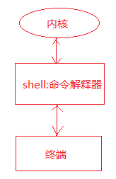
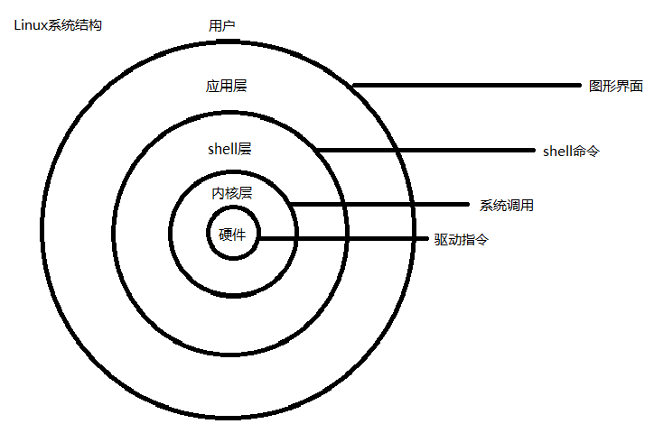
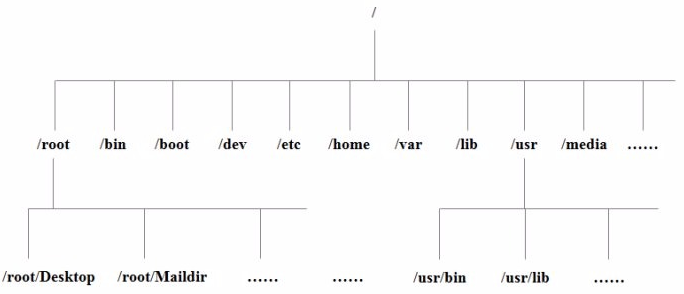
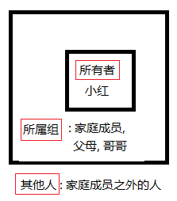
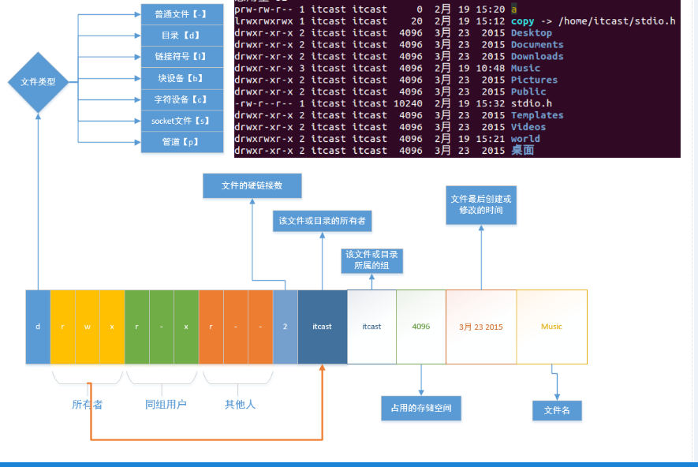
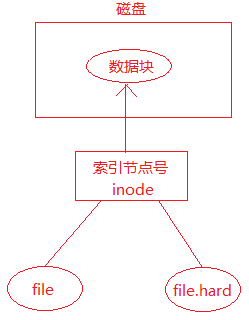
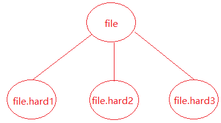

# Linux 基础命令

**学习目标**

* 说出 Linux 下的目录结构和常见目录的作用
* 熟练使用 Linux 下的相对路径和绝对路径
* 熟练使用 Linux 下常用文件和目录操作相关的命令
* 熟练使用修改用户权限、用户和用户组相关的命令
* 熟练使用文件的查找和检索相关的命令
* 熟练掌握 Ubuntu 下的软件安装和卸载
* 熟练使用压缩工具完成文件或目录的压缩解压缩

---

## 命令解析器

* shell 就是命令解释器
* 命令解析器的作用：对用户输入到终端的命令进行解析，调用对应的执行程序



用户在终端输入命令，由 shell 命令解释器对命令进行解析(按照 `$PATH` 环境变量搜索命令)，解析成内核能够识别的指令，然后由内核执行命令，最后由终端显示命令执行的结果给用户

注意：shell 在寻找命令的时候是按照 `$PATH` 环境变量去查找的，如果找到了就执行对应的命令，若找不到就报错，执行 `echo $PATH` 可以查看 `PATH` 环境变量的值

```sh
# echo $PATH
/usr/local/sbin:/usr/local/bin:/usr/sbin:/usr/bin:/sbin:/bin:/usr/games:/usr/local/games:/snap/bin:/opt/java/jdk-17/bin
r
```



* 常用的命令解析器：
    * shell -- Bourne Shell
        * `/bin/sh`
    * bash -- Bourne Again Shell
        * `/bin/bash`
* 当前系统所使用的 shell
    * `echo $SHELL`
* 当前系统下有哪些 `shell`
    * `cat /etc/shells`

---

## Linux 下常用快捷键

### tab 键的作用

* 补齐命令
    * 如: 在终端输入 `his` 然后按 tab 键，会补齐 `history` 命令
    * 如: 输入 `l` 然后按 tab 键，会显示所有以 `l` 开头的命令
* 补齐文件(包括目录和文件)
    * 例如: 如果在执行 `ls`，然后按 tab 键，会显示当前目录下所有的文件

使用 tab 键的优点: 减少用户输入，加快输入速度，减少出错的机会

### 主键盘快捷键

* 遍历输入的历史命令
    * 从当前位置向上遍历：`ctrl + p(↑)`
    * 从当前位置向下遍历：`ctrl + n(↓)`
    * 注意：使用 `history` 命令可以显示用户输入的所有命令
* 光标位置移动
    * 光标左移：`ctrl + b(←)`
    * 坐标右移：`ctrl + f(→)`
    * 移动到头部：`ctrl + a(home)`
    * 移动到尾部：`ctlr + e(end)`
* 字符删除
    * 删除光标前边的字符：`ctrl + h(Backspace)`
    * 删除光标后边的字符：`ctrl + d`
        * 光标后边的字符即光标覆盖的字符
        * 执行该命令，删除的是字符 `W`
    * 删除光标前所有内容：`ctrl + u`
    * 删除光标后所有内容：`ctrl + k`

---

## linux 下的目录结构

### linux 系统的目录结构

* Linux 系统的目录结构是一个倒立的树状结构，根目录用 `/` 表示，对比 windows 目录结构理解 linux 的目录结构



### linux 下主要目录介绍

* `/bin`: binary，二进制文件，可执行程序，shell 命令
    * 如: `ls，rm，mv，cp` 等常用命令
* `/sbin`: s 是 Super User 的意思，这里存放的是系统管理员使用的系统管理程序
    * 如 `ifconfig，halt，shutdown，reboot` 等系统命令
* `/dev`: device，在 linux 下一切皆文件
    * 硬盘，显卡，显示器
    * 字符设备文件、块设备文件
        * 如: 在 `input` 目录下执行: `sudo cat mouse0`，移动鼠标会显示有输入
* `/lib`: linux 运行的时候需要加载的一些动态库
    * 如: `libc.so、libpthread.so` 等
* `/mnt`: 手动的挂载目录，如 U 盘等
* `/media`: 外设的自动挂载目录，如光驱等
* `/root`: linux 的超级用户 root 的目录
* `/usr`: unix system resource -- 类似于 WINDOWS 的 programe files 目录
    * `include` 目录里存放头文件，如: `stdio.h、stdlib.h、string.h、pthread.h`
    * `games` 目录下的小游戏-如: `sl` 小火车游戏
* `/etc`: 存放配置文件
    * `/etc/passwd`
        * `man 5 passwd` 可以查看 `passwd` 文件的格式信息
    * `/etc/group`
        * `man 5 group` 可以查看 `group` 文件的格式信息
    * `/etc/profile`
        * 系统的配置文件，修改该文件会影响这个系统下面的所有的用户
* `/opt`: 安装第三方应用程序
    * 比如安装 oracle 数据库可以在这个目录下
* `/home`: linux 操作系统所有用户的家目录
    * 用户家目录：(宿主目录或者主目录)
        * `/home/itcast`
* `/tmp`: 存放临时文件
    * 新建在这个目录下的文件会在系统重启后自动清除

### 相对路径和绝对路径

* 绝对路径：从根目录开始表示的路径，也就是从 `/` 开始，例如：`/home/root`
* 相对路径
    * 从当前所处的目录开始表示的路径
    * `.` 表示当前目录
    * `..` 表示当前目录的上一级目录

Linux 中的命令提示符

```sh
root@master:/home/root#
```

* `root`: 当前登录的用户
* `@`：英文 at，在的意思
* `master`: 主机名
    * 主机名在 `/etc/hosts` 这个文件中
* `/home/root`：当前工作目录
    * 可通过：`echo ~` 或者 `echo $HOME` 查看当前用户的宿主目录
* `#`：表示当前用户为 root 用户；`$` 表示当前用户为普通用户

---

## 文件和目录操作相关的命令

### tree 命令

* 以树状形式查看指定目录内容，使用该命令需要安装软件 `tree`

```sh
# sudo apt-get update
# sudo apt-get install tree
```

* 命令使用方法
    * `tree` -- 树形结构显示当前目录下的文件信息
    * `tree` 目录 -- 树形结构显示指定目录下的文件信息
	
说明: 使用 `tree` 命令查看目录内容层次清晰，一目了然；`tree` 命令只能查看目录内容，不能查看普通文件内容

### ls 命令

`ls` 可以查看指定目录下的文件信息

使用方法：

* `ls` -- 显示当前目录下文件信息
* `ls` 目录或文件名 -- 显示指定目录下文件信息

相关参数

* `-a`：列出当前目录下的所有文件
    * `.` 当前目录
    * `..` 当前目录的上一级目录
    * 隐藏文件，以 `.` 开头的文件名，如 `.bashrc`
    * 普通文件
* `-R`：递归方式列出所有目录中的内容
* `-l`：列出文件的详细信息，7 部分内容。`-rw-r--r-- 1 root root 0 Jul 26  2021 p.txt`
    * 文件类型(第 1 个字符)
        * `-`：普通文件
        * `d`：目录
        * `l`：符号链接，相当于 windows 中的快捷方式
        * `s`：套接字
        * `p`：管道
        * `b`：块设备
        * `c`：字符设备
    * 用户的操作权限(2 – 10 个字符)
        * 文件所有者对文件的操作权限(2，3，4 个字符)
        * 文件所属组用户对文件的操作权限(5，6，7 个字符)
        * 其他人对文件的操作权限(8，9，10 个字符)
    * 硬链接计数:
        * 对于目录来说，链接计数等于该目录下所有的目录总数(含 `.` 和 `..`)，但是不包含该目录的子目录下的目录文件数量，执行 `ls -la` 命令可以进行查看
        * 对于文件来说，指的是该文件所有的硬链接文件数量
    * 文件所有者：root
    * 文件所属组：root
    * 文件大小：26
        * 如果是目录: 只表示目录大小，不包含目录中的内容，目录大小为 4k
        * 如果是文件：表示文件大小
    * 文件的创建日期或最后修改时间：Jul 26  2021
    * 文件名：`p.txt`
* 参数之间可以结合使用：
    * `ls -la`: 列出当前目录下所有文件的相信信息，包括隐藏文件 
    * `ls -ltr`: 列出当前目录下的文件，按照时间逆向排序
* 文件所有者，所属组，其他人的概念



* 下图是 `ls -l` 命令截图



### cd 命令

切换目录(change directory)

命令使用方式：

```sh
# cd + 路径
```

路径可以使用相对路径或者绝对路径

`cd -` 可以实现临近两个目录直接切换

### pwd 命令

查看用户当前所处的工作目录，printf working directory

### which 命令

显示命令所在的目录，如 `which ls`，`which cp`

### touch 命令

如果文件不存在，创建新文件，如果文件存在，更新文件的最后修改时间

命令使用方式：

```sh
# touch 文件名
```

### mkdir 命令

创建新目录，make directory

创建方式：

```sh
# mkdir 目录名
```

如果创建多级目录需要添加参数 `-p`

如在当前目录下创建目录: `mkdir mydir`
在宿主目录下创建多级目录: `mkdir -p ~/test/hello/world/aa`

### rmdir 命令

删除空目录，只能删除空目录

使用方式：

```sh
# rmdir 目录名
```

### rm 命令

* 删除文件：`rm 文件名`
* 删除目录：`rm -r 目录名`
* 参数：
    * `-r`：递归删除目录，删除目录必须添加此参数
    * `-i`：提示用户是否删除文件或目录
    * `-f`：强制删除
* 注意事项：
    * 使用 `rm` 命令删除的文件或目录不会放入回收站中，数据不易恢复

### cp 命令

命令使用方式：

```sh
# cp 源目录或文件 目标目录或文件
```

若有目录的拷贝需要使用 `-r` 参数

* `cp 要拷贝的文件(file1) file(不存在)`
    * 创建 `file`，将 `file1` 中的内容拷贝到 `file`
* `cp file1 file(存在)`
    * `file1` 覆盖 `file`
* `cp file dir(存在)`
    * 拷贝 `file` 到 `dir` 目录
* `cp -r dir(存在) dir1(存在)`   
    * 将 `dir` 目录拷贝到 `dir1` 目录中
    * 包括 `dir` 目录
* `cp -r dir(存在) dir1(不存在)`
    * 创建 `dir1`
    * 将 `dir` 中的内容拷贝到 `dir1` 中，不包括 `dir` 目录
* `cp` 拷贝目录也可以用 `-a` 参数，这样可以保留被拷贝的文件的一些属性信息

### mv 命令

* 改名或者移动文件 `mv file1 file2`
    * 改名
        * `mv file(存在) file1(不存在) `
        * `mv dir(存在) dir1(不存在)`
        * `mv file(存在) file2(存在)`
            * `file` 文件覆盖 `file2` 文件，`file` 改名为 `file2`
    * 移动(第二个参数一定是目录文件)
        * `mv file(文件) dir(存在目录)`
            * 将 `file` 文件移动到 `dir` 中
        * `mv dir(目录存在) dir1(目录存在)`
            * 将 `dir` 移动到 `dir1` 中，`dir` 就会作为 `dir1` 的子目录而存在

### cat 命令

* 将文件内容一次性输出到终端
* 使用方式：`cat 文件名`
* 缺点：终端显示的内容有限，如果文件太长无法全部显示
* 可用于文件重定向: `cat file1>file2`，相当于 `cp file1 file2`

### more 命令

* 文件内容分页显示到终端，但是只能一直向下浏览，不能回退
* 使用方式：`more + 文件名`
* 相关操作：
    * 显示下一行：回车
    * 显示下一页：空格
    * 退出：`q(ctrl + c)`

### less 命令

* 文件内容分页显示到终端，可以自由上下浏览
* 使用方式：`less 文件名`
* 相关操作：
    * 显示下一行：回车、`ctrl + p`、键盘向下键
    * 显示上一行：`ctrl + n`、键盘向上键
    * 显示下一页：空格、PageDown
    * 显示上一页：PageUp
    * 退出：`q`

### head 命令

* 从文件头部开始查看前 `n` 行的内容
* 使用方式：`head -n[行数] 文件名`
    * `head -20 hello.txt`
* 如果没有指定行数，默认显示前 10 行内容

### tail 命令

* 从文件尾部向上查看最后 `n` 行的内容
* 使用方式：`tail -n[行数] 文件名`
* 如果没有指定行数，默认显示最后 10 行内容
* 一个比较重要的应用：显示日志: `tail -f test.log`
    * 一个终端 `tail -f test.log`，另一个终端: `echo "hello world" >>test.log`

### 软链接

* 软连接类似于 windows 下的快捷方式
* 如何创建软连接
    * `ln -s 文件名 快捷方式的名字`
        * 例如：`ln -s aa aa.soft`
    * 目录也可以创建软连接
        * 例如：`ln -s tmp tmp.link`
* 创建软链接应注意事项
    * `ln` 创建软连接要用绝对路径，因为如果不使用绝对路径，一旦这个连接文件发生位置变动，就不能找到那个文件了
    * 软连接文件的大小是: **路径 + 文件名的总字节数**

### 硬链接

* `ln 文件名 硬链接的名字`
    * `ln test.log test.log.hard`
* 使用硬链接应注意事项
    * 硬链接不能建在目录上
    * 硬连接对绝对路径没有要求
    * 硬连接不能跨文件系统
    * 硬链接文件和源文件的 `inode` 是相同的，文件系统的 `inode` 要求唯一，跨文件系统可能会使 `inode` 不同，所以硬链接不能跨文件系统
* 硬链接的本质
    * 硬连接的本质是不同的文件名所在的 `inode` 节点是相同的，相同的 `inode` 节点指向了相同的数据块，所以它们的文件内容是一样的，文件内容会同步
        * `ls -i 文件名` ---🡪 可以查看文件的 `i` 节点
        * `stat 文件名` ---🡪 可以查看 `i` 节点信息
        * 如下图，`file.hard` 是 `file` 的硬链接，这个两个文件指向了同一个 `inode`，同一个 `inode` 指向了相同的数据块(文件内容)
            * 当新创建了一个文件，硬链接计数为 1
            * 给文件创建了一个硬链接后，硬链接计数加 1
            * 删除一个硬链接后，硬链接计数减 1
            * 如果删除硬链接后，硬链接计数为 0，则该文件会删除



* 硬链接应用场合
    * 可以起到同步文件的作用
    * 修改 `file` 的内容，会在其余三个硬链接文件上同步
    * 可以起到保护文件的作用
    * 删除文件的时候，只要硬链接计数不为 0，不会真正删除，起到保护文件的作用.



### wc 命令

显示文件行数，字节数，单词数

* `wc -l file` 显示文件的总行数
* `wc -c file` 显示文件的总字节数
* `wc -w file` 显示文件的总单词数
* `wc file` 显示文件的总行数，单词数和总字节数

### whoami

显示当前登陆的用户名

---

## 用户权限、用户、用户组

### 修改文件权限 chmod

linux 是通过权限对文件进行控制的，通过使用 `chmod` 命令可以修改文件相关的权限

**文字设定法**

* 命令：`chmod [who] [+|-|=] [mode] 文件名`
    * 操作对象【who】
        * `u` -- 用户(user) 
        * `g` -- 同组用户(group)
        * `o` -- 其他用户(other)
        * `a` -- 所用用户(all)【默认】
    * 操作符【+-=】
        * `+` -- 添加权限
        * `-` -- 取消权限
        * `=` -- 赋予给定权限并取消其他权限
    * 权限【mode】
        * `r` -- 读
        * `w` -- 写 
        * `x` -- 执行

示例：给文件 `file.txt` 的所有者和所属组添加读写权限

```sh
chmod ug+wr file.txt
```

**数字设定法**

* 命令：`chmod [+|-|=][mode] 文件名`
    * 操作符【+-=】
        * `+` -- 添加权限
        * `-` -- 取消权限
        * `=` -- 赋予给定权限并取消其他权限(默认为 `=`)
    * 数字表示的含义
        * 0 -- 没有权限(`-`)
        * 1 -- 执行权限(`x`)
        * 2 -- 写权限(`w`)
        * 4 -- 读权限(`r`)

例：给 `file.txt` 文件设置 `rw-rw-r--`

```sh
chmod 664 file.txt
```

注意点: 使用数字设定法，一定要使用 3 位的 8 进制数: 如 066

### 修改文件所有者和所属组

* 修改文件所有者 `chown`
    * 用法：`chown 文件所有者 文件名`
        * `sudo chown mytest file.txt`
* 修改文件所有者和所属组 `chown`
    * 用法：`chown 文件所有者:文件所属组 文件名`
        * `sudo chown mytest:mytest file.txt`
        * `sudo chown mytest.mytest file.txt`

注意: 普通用户需要使用管理员用户权限执行该命令
注意: 若系统没有其他用户，可以使用 `sudo adduser 用户名` 创建一个新用户

### 修改文件所属组

`chgrp` 命令

使用方法：`chgrp 用户组 文件或目录名`

示例：修改文件所属组为 `mytest`

```sh
# sudo chgrp mytest file.txt
```

普通用户需要使用管理员权限执行该命令

---

## find 命令

* 按文件名查询：使用参数 `-name`
    * 命令：`find 路径 -name 文件名`
    * 示例：`find /home -name *.c`
* 按文件类型查询：使用参数 `-type`
    * 命令：`find 路径 -type 类型`
        * 类型	
            * 普通文件类型用 `f` 表示而不是 `-`
            * `d` -> 目录
            * `l` -> 符号链接
            * `b` -> 块设备文件
            * `c` -> 字符设备文件
            * `s` -> socket 文件
            * `p` -> 管道文件
    * 查找指定目录下的普通文件：`find 路径 -type f`
* 按文件大小查询：使用参数 `-size`
    * 命令：`find 路径 -size 范围`
        * 范围
            * 大于：`+` 表示 -- `+100k`
            * 小于：`-` 表示 -- `-100k`
            * 等于: 不需要添加符号 -- `100k`
        * 大小
            * `M` 必须大写(`10M`)
            * `k` 必须小写(`20k`)
            * `c` 表示字节数
        * 例子: 查询目录为 `home` 目录
            * 等于 100k 的文件: `find ~/ -size 100k`
            * 大于 100k的文件: `find ~/ -size +100k`
            * 大于 50k，小于 100k 的文件: `find ~/ -size +50k -size -100k`
* 按文件日期
    * 创建日期：`-ctime -n/+ n`
        * `-n`: `n` 天以内
        * `+n`: `n` 天以外
    * 修改日期：`-mtime -n/+n`
    * 访问日期：`-atime -n/+n`
* 按深度
    * `-maxdepth n(层数)`
        * 搜索 `n` 层以下的目录，搜索的层数不超过 `n` 层
    * `-mindepth n(层数)`
        * 搜 `n` 层以上的目录，搜索的层数不能小于 `n` 层
* 高级查找
    * 例：查找指定目录下所有目录，并列出目录中文件详细信息
        * `find ./ -type d -exec shell命令 {} \;`
            * `find ./ -type d -exec ls -l {} \;`
        * `find ./ -type d -ok shell命令 {} \;`
            * `find ./ -type d -ok ls -l {} \;`
            * 注意: `{}` 中间不能有空格
            * `-ok` 比较安全, 特别是在执行 `rm` 删除文件的时候
        * `find ./ -type d | xargs shell命令`
            * `find ./ -type d | xargs ls -l`

---

## grep 命令

* `grep -r(有目录) 查找的内容 搜索的路径`
    * `-r` 参数，若是目录，则可以递归搜索
    * `-n` 参数可以显示该查找内容所在的行号
    * `-i` 参数可以忽略大小写进行查找
    * `-v `参数不显示含有某字符串
* 搜索当前目录下包含 `hello world` 字符串的文件
    * `grep -r -n "hello world" ./` ------ 显示行号
    * `grep -r -i -n "HELLO world" ./` ------- 忽略大小小查找

---

## find 和 grep 命令结合使用

先使用 `find` 命令查找文件，然后使用 `grep` 命令查找哪些文件包含某个字符串

```sh
find . -name "*.c" | xargs grep -n "main"
```

---

## Linux 中常用的压缩工具

* `gzip` 和 `bzip2` 能压缩目录，只能一个一个文件进行压缩，压缩之后会使原文件消失
    * `gzip *` 压缩当前目录下所有的文件，但是目录不能压缩
    * `gunzip *` 解压当前目录下所有的 `.gz` 文件
    * `bzip2 *` 压缩当前目录下所有的文件，但是目录不能压缩
    * `bunzip2 *` 解压当前目录下所有的 `.bz2` 文件
* `tar` 工具
    * 相关参数说明
        * `-z`：用 `gzip` 来压缩/解压缩文件
        * `-j`：用 `bzip2` 来压缩/解压缩文件
        * `-c`：create，创建新的压缩文件，与 `x` 互斥使用
        * `-x`：从压缩文件中释放文件，与 `c` 互斥使用
        * `-v`：详细报告 `tar` 处理的文件信息
        * `-f`：指定压缩文件的名字，放最后面
        * `-t`:  查看压缩包中有哪些文件
    * 压缩：
        * `tar -cvf 压缩包名字.tar 原材料[要打包压缩的文件或目录]`
        * `tar -zcvf 压缩包名字.tar.gz 原材料[要打包压缩的文件或目录]`
        * `tar -jcvf 压缩包名字.tar.bz2 原材料[要打包压缩的文件或目录]`
    * 解压缩：
        * `tar -xvf 已有的压缩包(test.tar.gz)`
        * `tar -zxvf 已有的压缩包(test.tar.gz)`
        * `tar -jxvf 已有的压缩包(test.tar.bz2)`
        * 解压到指定目录：`添加参数 -C(大写)`
            * `tar -zxvf test.tar.gz -C 解压目录(./mytest)`
    * 查看压缩包中有哪些文件
        * `tar -tvf test.tar`
* `rar` 工具
    * 使用前需要安装 `rar` 工具
        * `sudo apt-get install rar`
    * 压缩：
        * 命令：`rar a -r 要压缩的文件(含文件或者目录)`
        * 压缩目录需要使用参数：`-r`
            * `rar a -r my aa bb dir` ---- 将 `aa bb dir` 压缩到 `my.rar` 文件中
        * 打包的生成的新文件不需要指定后缀
    * 解压缩：
        * 命令：`rar x xxx.rar 压缩目录`
            * `rar x my.rar` ---- 将 `my.rar` 解压到当前目录
        * 解压到指定目录，直接指定解压目录即可
            * `rar x xxx.rar 目录`
            * `rar x my.rar TAR` ----- 将 `my.rar` 解压到 `TAR` 目录下
			* 注意：若解压目录不存在则会报错
* `zip` 工具
    * 压缩：`zip -r 压缩包名 要压缩的文件(含文件或目录)`
        * 压缩目录需要使用参数 `-r`
        * 使用该命令不需要指定压缩包后缀
            * `zip -r xxx file dir` --- 生成 `xxx.zip` 文件
    * 解压缩：`unzip 压缩包名`
        * 解压缩到指定目录：添加参数 `–d 解压目录`
            * `unzip xxx.zip -d /home/itcast/test/day1`
        * 注意：解压目录若不存在则会创建

---

## 软件的安装和卸载

* 在线安装
    * 软件安装：`sudo apt-get install 软件名`
    * 软件卸载：`sudo apt-get remove 软件名`
    * 更新软件列表：`sudo apt-get update`
    * 清理安装包：`sudo apt-get clean`
        * 清理的是缓存路径：`/var/cache/apt/archives`
* 软件包安装
    * 在 Ubuntu 系统下必须有 `deb` 格式的安装包
    * 软件安装
        * `sudo dpkg -i xxx.deb`
    * 软件卸载
        * `sudo dpkg -r 软件名`

---
