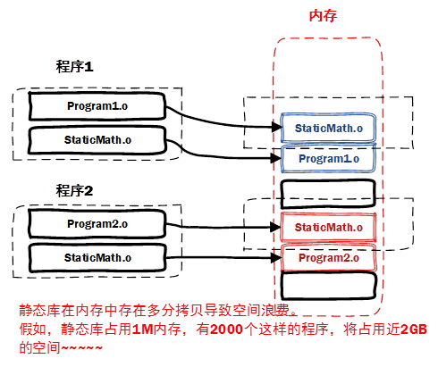

# vim，gcc 库的制作与使用

**学习目标**

* 掌握 `vim` 命令模式下相关命令的使用
* 掌握从命令模式切换到编辑模式的相关命令
* 掌握 `vim` 末行模式下相关命令的使用
* 能够说出 `gcc` 的工作流程和掌握常见参数的使用
* 熟练掌握 Linux 下的静态库的制作和使用
* 熟练掌握 Linux 下的共享库的制作和使用

---

## vim

### vim 简单介绍

`vi` 是 visual interface 的简称，它可以执行编辑、删除、查找、替换、块操作等众多文本操作，而且用户可以根据自己的需要对其进行定制。`vi` 是一个文本编辑程序，没有菜单，只有命令

`vim` 更高级一些，可以理解是 `vi` 的高级版本。`vim` 需要自行安装，在 shell 中输入 `vimtutor` 命令可以查看相关的帮助文档

### vim 三种模式

`vi` 有三种基本工作模式: 命令模式、文本输入模式、末行模式

三种工作模式的切换如图所示，从下图中可以看出编辑模式和末行模式之间不能相互切换，必须经过命令模式


### vim 基本操作

#### 命令模式下的操作

用户按下 `esc` 键，就可以使 `vi` 进入命令模式下；当使用 `vi` 打开一个新文件开始也是进入命令模式下

* 保存退出

|||
|:----:|:----:|
| 快捷键 | 操作 |
| `shitf + zz` | 保存退出 |

* 代码格式化

|||
|:----:|:----:|
| 快捷键 | 操作 |
| `gg=G` | 代码的格式化 |

* 光标移动

|||
|:----:|:----:|
| 快捷键 | 操作 |
| `h` | 光标左移 |
| `j` | 光标下移 |
| `k` | 光标上移 |
| `l` | 光标右移 |
| `w` | 移动一个单词 |
| `gg` | 光标移动到文件开头 |
| `G` | 光标移动到文件末尾 |
| `0` | 光标移到到行首 |
| `$` | 光标移到到行尾 |
| `nG` | 行跳转，例 `12G`，跳到 12 行处 |

* 删除命令

|||
|:----:|:----:|
| 快捷键 | 操作 |
| `x` | 删除光标后一个字符，相当于 `Del` |
| `X` | 删除光标前一个字符，相当于 Backspace |
| `dw` | 删除光标开始位置的字，包含光标所在字符 |
| `d0` | 删除光标前本行所有内容，不包含光标所在字符 |
| `D[d$]` | 删除光标后本行所有内容，包含光标所在字符 |
| `dd` | 删除光标所在行(本质其实是剪切) |
| `ndd` | 从光标当前行向下删除指定的行数，如 `15dd` |
| `v/ctrl+v` | 使用 `h、j、k、l` 移动选择内容，然后按 `d` 删除其中 `ctrl + v` 是列模式，`v` 为非列模式 |

* 撤销和反撤销命令

|||
|:----:|:----:|
| 快捷键 | 操作 |
| `u` | 一步一步撤销，相当于 word 文档的 `ctrl + z` |
| `ctrl + r` | 反撤销，相当于 word 文档的 `ctrl + y` |

* 复制粘贴

|||
|:----:|:----:|
| 快捷键 | 操作 |
| `yy` | 复制当前行 |
| `nyy` | 复制 `n` 行，如 `10yy` |
| `p` | 在光标所在位置向下新开辟一行，粘贴 |
| `P` | 在光标所在位置向上新开辟一行，粘贴 |
| 剪切，操作 | 按 `dd` 或者 `ndd` 删除，将删除的行保存到剪贴板中，然后按 `p/P` 就可以粘贴了 |

* 可视模式

|||
|:----:|:----:|
| 快捷键 | 操作 |
| `v/ctrl + v` | 使用 `h、j、k、l` 移动选择内容；使用 `d` 删除，使用 `y` 复制，使用 `p` 粘贴到光标的后面；使用 `P` 粘贴到光标的前面 |

* 替换操作

|||
|:----:|:----:|
| 快捷键 | 操作 |
| `r` | 替换当前字符 |
| `R` | 替换当前行光标后的字符 |

* 查找命令

|||
|:----:|:----:|
| 快捷键 | 操作 |
| `/` | `/xxxx`，从光标所在的位置开始搜索，按 `n` 向下搜索，按 `N` 向上搜索 |
| `?` | `?xxxx`，从光标所在的位置开始搜索，按 `n` 向上搜索，按 `N` 向下搜索 |
| `#` | 将光标移动到待搜索的字符串上，然后按 `n` 向上搜索，但 `N` 向下搜索 |
| `shift + k` | 在待搜索的字符串上按 `shift + k` 或者 `K`，可以查看相关的帮助文档 |

#### 切换到文本输入模式

从命令模式切换到文本输入模式只需输入如下命令:

|||
|:----:|:----:|
| 快捷键 | 操作 |
| `i` | 在光标前插入 |
| `a` | 在光标后插入 |
| `I` | 在光标所在行的行首插入 |
| `A` | 在光标所在行的行尾插入 |
| `o` | 在光标所在的行的下面新创建一行，行首插入 |
| `O` | 在光标所在的行的上面新创建一行，行首插入 |
| `s` | 删除光标后边的字符，从光标当前位置插入 |
| `S` | 删除光标所在当前行，从行首插入 |
| 按列模式插入 | 先按 `ctrl + v` 进入列模式，按 `hjkl` 移动选定某列，按 `I` 或者 `shift + i` 向前插入，然后插入字符，最后按两次 `esc` |

#### 末行模式下的操作

从命令模式切换到末行模式，输入冒号 `:`

* 保存退出

|||
|:----:|:----:|
| 快捷键 | 操作 |
| `q` | 退出 |
| `q!` | 强制退出，不保存修改内容 |
| `w` | 保存修改内容，不退出 |
| `wq` | 保存并退出 |
| `x` | 相当于 `wq` |

* 替换操作

下面表格中 `old` 表示原字符串，`new` 表示新字符串

|||
|:----:|:----:|
| 快捷键 | 操作 |
| `:s/old/new/` | 光标所在行的第一个 `old` 替换为 `new` |
| `:s/old/new/g` | 光标所在行的所有 `old` 替换为 `new` |
| `:m，ns/old/new/g` | 将第 `m` 行至第 `n` 行之间的 `old` 全部替换成 `new` |
| `:%s/old/new/g` | 当前文件的所有 `old` 替换为 `new` |
| `:1，$s/old/new/g` | 当前文件的所有 `old` 替换为 `new` |
| `:%s/old/new/gc` | 同上，但是每次替换需要用户确认 |

* 快速翻屏

|||
|:----:|:----:|
| 快捷键 | 操作 |
| `ctrl + u` | 向下翻半屏(up) -- 光标向上移动 |
| `ctrl + d` | 向上翻半屏(down) -- 光标向下移动 |
| `ctrl + f` | 向上翻一屏(front) |
| `ctrl + b` | 向后翻一屏(back) |

* 在末行模式下执行 shell 命令

!shell 命令，按下两次 `esc` 可以回到命令模式

* 分屏操作

**在打开文件之后分屏:**

|||
|:----:|:----:|
| 快捷键 | 操作 |
| `sp` | 当前文件水平分屏 |
| `vsp` | 当前文件垂直分屏 |
| `sp 文件名` | 当前文件和另一个文件水平分屏 |
| `vsp 文件名` | 当前文件和另一个文件垂直分屏 |
| `ctrl + w + w` | 在多个窗口切换光标 |
| `wall/wqall/xall/qall/qall!` | 保存/保存退出/保存退出/退出/强制退出分屏窗口 |

**在打开文件之前分屏:**

* 分屏: `vim -on file1 file2 ...`  
* 垂直分屏: `vim -On file1 file2 ...` 

注意: `n` 可以省略，有几个文件就分几屏

* 从末行模式切换回命令模式

按两次 ESC，退格(backspace)或者回车键

#### vim 的配置文件

* 用户级别配置文件

`~/.vimrc`，修改用户级别的配置文件只会影响当前用户，不会影响其他的用户

例如: 在用户的家目录下的 `.vimrc` 文件中添加

```sh
set tabstop=4  ----设置缩进 4 个空格
set nu        ---- 设置行号
set shiftwidth=4  --- 设置 gg=G 缩进 4 个空格，默认是缩进 8 个空格
```

* 系统级别配置文件

`/etc/vim/vimrc`，修改了系统级别的配置文件将影响系统下的所有用户

说明: 由于 linux 是多用户操作系统，建议只在用户级别的配置文件下进行修改，不要影响其他用户

---

## gcc 编译器

### gcc 工作流程

`gcc` 编译器将 `c` 源文件到生成一个可执行程序，中间一共经历了四个步骤：


 
四个步骤并不是 `gcc` 独立完成的，而是在内部调用了其他工具，从而完成了整个工作流程，其中编译最耗时，因为要逐行检查语法


下面以 `test.c` 为例介绍 `gcc` 的四个步骤:

* `gcc -E test.c -o test.i`
* `gcc -S test.i -o test.s`
* `gcc -c test.s -o test.o`
* `gcc test.o -o test`

一步生成最终的可执行程序: 

```sh
gcc test.c -o test
```

### gcc 常用参数

* `-v` 查看 `gcc` 版本号，`--version` 也可以
* `-E` 生成预处理文件
* `-S` 生成汇编文件
* `-c` 只编译，生成 `.o文件`，通常称为目标文件
* `-I` 指定头文件所在的路径
* `-L` 指定库文件所在的路径
* `-l` 指定库的名字
* `-o` 指定生成的目标文件的名字
* `-g` 包含调试信息，使用 `gdb` 调试需要添加 `-g` 参数
* `-On n=0∼3` 编译优化，`n` 越大优化得越多

例如:

```cpp
int a = 10;
int b = a;
int c = b;
printf("%d"，c);
```

上面的代码可能会被编译器优化成:

```cpp
int c = 10;
printf("%d"，10);
```

* `-Wall` 提示更多警告信息

```cpp
int a;
int b;
int c = 10;
printf("[%d]\n"，c);
```

编译如下: `gcc -o test -Wall test.c`

```cpp
warning: unused variable 'b' [-Wunused-variable]
warning: unused variable 'a' [-Wunused-variable]
```

* `-D` 编译时定义宏

`test.c` 文件中的代码片段:

```cpp
printf("MAX==[%d]\n"，MAX);
```

编译: 

```sh
gcc -o test test.c -D MAX=10
gcc -o test test.c -DMAX=10
```

---

## 静态库和共享(动态)库

### 库的介绍   

* 什么是库

库是二进制文件，是源代码文件的另一种表现形式，是加了密的源代码；是一些功能相近或者是相似的函数的集合体

* 使用库有什么好处
   * 提高代码的可重用性，而且还可以提高程序的健壮性
   * 可以减少开发者的代码开发量，缩短开发周期

* 库制作完成后，如何给用户使用
   * 头文件 --- 包含了库函数的声明
   * 库文件 --- 包含了库函数的代码实现

注意: 库不能单独使用，只能作为其他执行程序的一部分完成某些功能，也就是说只能被其他程序调用才能使用

库可分静态库(static library)和共享库(shared library)

### 静态库(static library)

静态库可以认为是一些目标代码的集合，是在可执行程序运行前就已经加入到执行码中，成为执行程序的一部分. 按照习惯，一般以 `.a` 做为文件后缀名

静态库的命名一般分为三个部分：
   * 前缀：`lib`
   * 库名称：自定义即可，如 `test`
   * 后缀：`.a`

所以最终的静态库的名字应该为：`libtest.a`

#### 静态库的制作

下面以 `fun1.c`，`fun2.c` 和 `head.h` 三个文件为例讲述静态库的制作和使用，其中 `head.h` 文件中有函数的声明，`fun1.c` 和 `fun2.c` 中有函数的实现

`head.h`

```h
void fun1();
void fun2();
```

`fun1.c`

```c
#include <stdio.h>

void fun1()
{
    printf("this is fun1\n");
}
```

`fun2.c`

```c
#include <stdio.h>

void fun2()
{
    printf("this is fun2\n");
}
```

`main.c`

```c
#include <stdio.h>
#include <stdlib.h>
#include "head.h"

int main(int argc, char *argv[])
{
    printf("this is main!\n");

    fun1();
    fun2();

    return 0;
}
```

* 步骤 1：将 `c` 源文件生成对应的 `.o` 文件
   * `gcc -c fun1.c fun2.c`
   * 或者分别生成 `.o` 文件
      * `gcc -c fun1.c -o fun1.o`
 		* `gcc -c fun2.c -o fun2.o`
* 步骤 2：使用打包工具 `ar` 将准备好的 `.o` 文件打包为 `.a` 文件
   * 在使用 `ar` 工具是时候需要添加参数 `rcs`
      * `r` 更新、`c` 创建、`s` 建立索引
   * 命令：`ar rcs 静态库名 .o文件`
      * `ar rcs libtest1.a fun1.o fun2.o`


#### 静态库的使用

静态库制作完成之后，需要将 `.a` 文件和头文件一定发布给用户

假设测试文件为 `main.c`，静态库文件为 `libtest1.a`，头文件为 `head.h`

用到的参数：

* `-L`：指定要连接的库的所在目录
* `-l`：指定链接时需要的静态库，去掉前缀和后缀
* `-I`: 指定 `main.c` 文件用到的头文件 `head.h` 所在的路径

```sh
gcc -o mainlib main.c -L ./ -l test1 -I ./ && ./mainlib 
```

#### 静态库的优缺点

* 优点：
   * 函数库最终被打包到应用程序中，实现是函数本地化，寻址方便、速度快(库函数调用效率==自定义函数使用效率)
   * 程序在运行时与函数库再无瓜葛，移植方便
* 缺点：
   * 消耗系统资源较大，每个进程使用静态库都要复制一份，无端浪费内存
   * 静态库会给程序的更新、部署和发布带来麻烦。如果静态库 `libxxx.a` 更新了，所有使用它的应用程序都需要重新编译、发布给用户(对于用户来说，可能是一个很小的改动，却导致整个程序重新下载)



### 共享库(shared library)/动态库

共享库在程序编译时并不会被连接到目标代码中，而是在程序运行是才被载入。不同的应用程序如果调用相同的库，那么在内存里只需要有一份该共享库的拷贝，规避了空间浪费问题。动态库在程序运行时才被载入，也解决了静态库对程序的更新、部署和发布会带来麻烦。用户只需要更新动态库即可，增量更新

为什么需要动态库，其实也是静态库的特点导致

按照习惯，一般以 `.so` 做为文件后缀名. 共享库的命名一般分为三个部分：

* 前缀：`lib`
* 库名称：自己定义即可，如 `test`
* 后缀：`.so`

所以最终的静态库的名字应该为：`libtest.so`


#### 共享库的制作

生成目标文件 `.o`，此时要加编译选项：`-fPIC(fpic)`

```sh
gcc -fpic -c fun1.c fun2.c
```

参数：`-fpic` 创建与地址无关的编译程序(pic，position independent code)，目的就是为了能够在多个应用程序间共享

生成共享库，此时要加链接器选项: `-shared`(指定生成动态链接库)

```sh
gcc -shared fun1.o fun2.o -o libtest2.so
```

#### 共享库的使用

引用动态库编译成可执行文件(跟静态库方式一样)，用到的参数：

* `-L`：指定要连接的库的所在目录
* `-l`：指定链接时需要的动态库，去掉前缀和后缀
* `-I`: 指定 `main.c` 文件用到的头文件 `head.h` 所在的路径

```sh
gcc -o mainso main.c -L ./ -l test2 -I ./
```

然后运行：`./mainso`，发现竟然报错了

分析为什么在执行的时候找不到 `libtest2.so` 库

* 当系统加载可执行代码时候，能够知道其所依赖的库的名字，但是还需要知道所依赖的库的绝对路径。此时就需要系统动态载入器(dynamic linker/loader)

`ldd` 命令可以查看可执行文件依赖的库文件，执行 `ldd mainso`，可以发现 `libtest2.so` 找不到

```sh
# ldd mainso
linux-vdso.so.1 (0x00007ffe09ba5000)
libtest2.so => not found
libc.so.6 => /lib/x86_64-linux-gnu/libc.so.6 (0x00007f7ea2747000)
/lib64/ld-linux-x86-64.so.2 (0x00007f7ea2947000)
```

* 对于 `elf` 格式的可执行程序，是由 `ld-linux.so*` 来完成的，它先后搜索 `elf` 文件的 `DT_RPATH` 段 — 环境变量 `LD_LIBRARY_PATH` — `/etc/ld.so.cache` 文件列表 — `/lib/`，`/usr/lib` 目录找到库文件后将其载入内存

使用 `file` 命令可以查看文件的类型: `file mainso`

```sh
# file mainso 
mainso: ELF 64-bit LSB shared object, x86-64, version 1 (SYSV), dynamically linked, interpreter /lib64/ld-linux-x86-64.so.2, BuildID[sha1]=17d8e97fbe37b24dc5e0f9c473077743b9948a47, for GNU/Linux 3.2.0, not stripped
```

**如何让系统找到共享库**

* 拷贝自己制作的共享库到 `/lib` 或者 `/usr/lib`
* 临时设置 `LD_LIBRARY_PATH`:
   * `export LD_LIBRARY_PATH=$LD_LIBRARY_PATH:库路径` 
* 永久设置，把 `export LD_LIBRARY_PATH=$LD_LIBRARY_PATH:库路径`，设置到 `~/.bashrc` 文件中，然后在执行下列三种办法之一:
   * 执行. `~/.bashrc` 使配置文件生效(第一个 `.` 后面有一个空格)
   * 执行 `source ~/.bashrc` 配置文件生效
   * 退出当前终端，然后再次登陆也可以使配置文件生效
* 永久设置，把 `export LD_LIBRARY_PATH=$LD_LIBRARY_PATH:库路径`，设置到 `/etc/profile` 文件中
* 将其添加到 `/etc/ld.so.cache` 文件中
   * 编辑 `/etc/ld.so.conf` 文件，加入库文件所在目录的路径
   * 运行 `sudo ldconfig -v`，该命令会重建 `/etc/ld.so.cache` 文件

解决了库的路径问题之后，再次 `ldd` 命令可以查看可执行文件依赖的库文件，`ldd main2`:

```sh
# cp libtest2.so /usr/lib
# gcc -o mainso main.c -L ./ -l test2 -I ./
# ./mainso 
this is main!
this is fun1
this is fun2
# ldd mainso 
linux-vdso.so.1 (0x00007fff2b3f9000)
libtest2.so => /lib/libtest2.so (0x00007f698bab1000)
libc.so.6 => /lib/x86_64-linux-gnu/libc.so.6 (0x00007f698b8bf000)
/lib64/ld-linux-x86-64.so.2 (0x00007f698bac4000)
```

**共享库的特点**

* 动态库把对一些库函数的链接载入推迟到程序运行的时期
* 可以实现进程之间的资源共享(因此动态库也称为共享库)
* 将一些程序升级变得简单
* 甚至可以真正做到链接载入完全由程序员在程序代码中控制(显示调用)

### 比较静态库和动态库的优缺点

静态库:

* 优点:
   * 执行速度快，是因为静态库已经编译到可执行文件内部了
   * 移植方便，不依赖域其他的库文件
* 缺点: 
   * 耗费内存，是由于每一个静态库的可执行程序都会加载一次
   * 部署更新麻烦，因为静态库修改以后所有的调用到这个静态库的可执行文件都需要重新编译
 
动态库:

* 优点:
   * 节省内存
   * 部署升级更新方便，只需替换动态库即可，然后再重启服务
* 缺点: 
   * 加载速度比静态库慢
   * 移植性差，需要把所有用到的动态库都移植

由于由静态库生成的可执行文件是把静态库加载到了其内部，所以静态库生成的可执行文件一般会比动态库大

---
