# 网络基础概念

**学习目标**

* 了解 OSI 七层、TCP/IP 四层模型结构
* 了解常见网络协议格式
* 掌握网络字节序和主机字节序之间的转换(大端法和小端法)
* 说出 TCP 服务器端通信流程
* 说出 TCP 客户端通信流程
* 独立写出 TCP 服务器端代码
* 独立写出 TCP 客户端代码

---

## 协议
	
概念: 协议事先约定好，大家共同遵守的一组规则，如交通信号灯

从应用程序的角度看，协议可理解为数据传输和数据解释的规则

可以简单的理解为各个主机之间进行通信所使用的共同语言

假设，A、B 双方欲传输文件。规定：

* 第一次: 传输文件名，接收方接收到文件名，应答 OK 给传输方
* 第二次: 发送文件的尺寸，接收方接收到该数据再次应答一个 OK
* 第三次: 传输文件内容。同样，接收方接收数据完成后应答 OK 表示文件内容接收成功

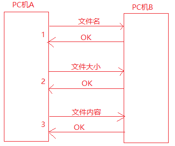

这种在 A 和 B 之间被遵守的协议称之为原始协议，后来经过不断增加完善改进，最终形成了一个稳定的完整的传输协议，被广泛应用于各种文件传输，该协议逐渐就成了一个标准协议

几种常见的协议

见讲义部分

---

## 分层模型

OSI 是 Open System Interconnection 的缩写，意为开放式系统互联. 国际标准化组织(ISO)制定了 OSI 模型，该模型定义了不同计算机互联的标准，是设计和描述计算机网络通信的基本框架

网络分层 OSI 7 层模型: 物数网传会表应 

* 物理层 --- 双绞线，光纤(传输介质)，将模拟信号转换为数字信号
* 数据链路层 --- 数据校验，定义了网络传输的基本单位 - 帧 
* 网络层 --- 定义网络，两台机器之间传输的路径选择点到点的传输
* 传输层 --- 传输数据 TCP，UDP，端到端的传输  
* 会话层 --- 通过传输层建立数据传输的通道 
* 表示层 --- 编解码，翻译工作
* 应用层 --- 为客户提供各种应用服务，email 服务，ftp 服务，ssh 服务 

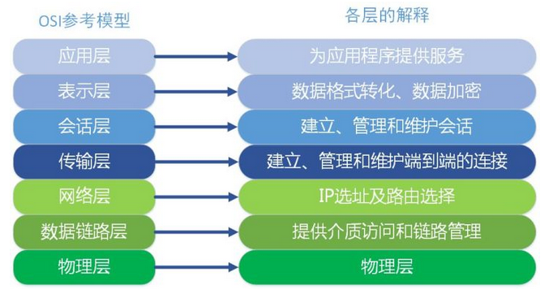

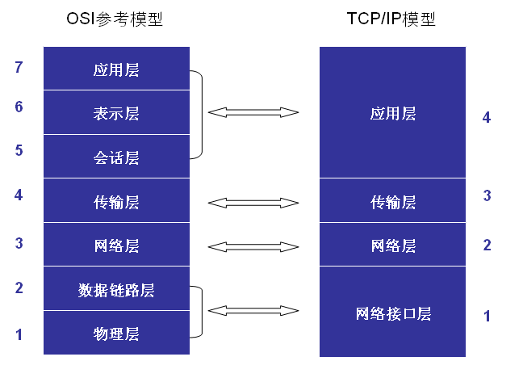

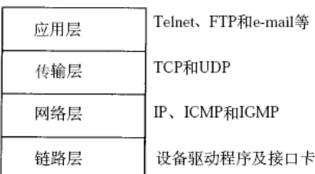

### 数据通信过程

通信过程: 其实就是发送端层层打包，接收方层层解包

注意: 这些操作不是用户自己做的，而是底层帮我们做好的

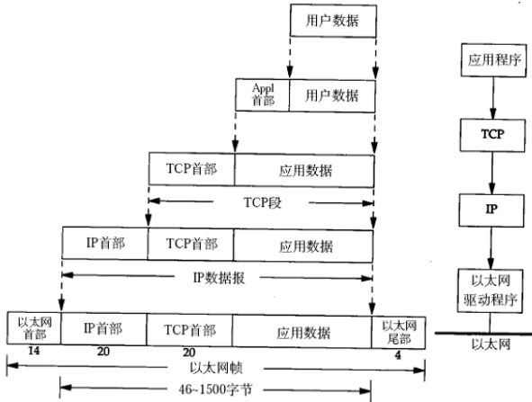

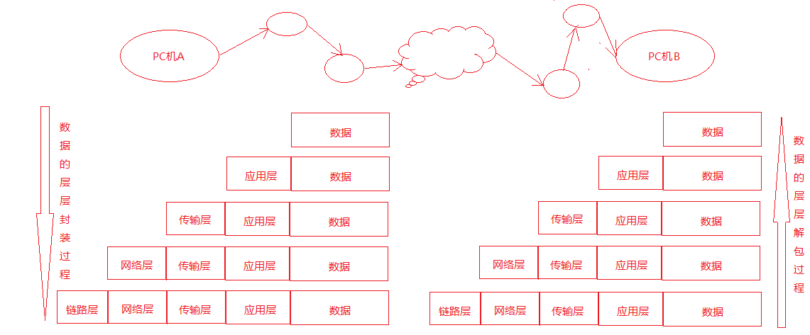

---

## 网络应用程序的设计模式

* CS 设计模式优缺点：
    * 优点:
        * 客户端在本机上可以保证性能，可以将数据缓存到本地，提高数据的传输效率，提高用户体验效果
        * 客户端和服务端程序都是由同一个开发团队开发，协议选择比较灵活
    * 缺点:
        * 服务器和客户端都需要开发，工作量相对较大，调试困难，开发周期长
        * 从用户的角度看，需要将客户端安装到用户的主机上，对用户主机的安全构成威胁
* BS 设计模式优缺点：
    * 优点:
        * 无需安装客户端，可以使用标准的浏览器作为客户端
       	* 只需要开发服务器，工作量相对较小
        * 由于采用标准的客户端，所以移植性好，不受平台限制
        * 相对安全，不用安装软件
    * 缺点:
        * 由于没有客户端，数据缓冲不尽人意，数据传输有限制，用户体验较差
        * 通信协议选择只能使用 HTTP 协议，协议选择不够灵活

---

## 以太网帧格式

以太网帧格式就是包装在网络接口层(数据链路层)的协议

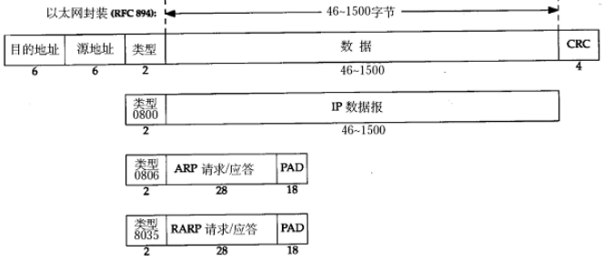

以 ARP 为例介绍以太网帧格式

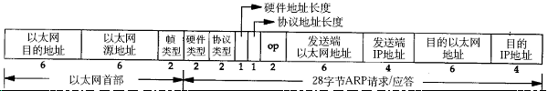

目的端 mac 地址是通过发送端发送 ARP 广播，接收到该 ARP 数据的主机先判断是否是自己的 IP，若是则应答一个 ARP 应答报文，并将 mac 地址填入应答报文中；若目的 IP 不是自己的主机 IP，则直接丢弃该 ARP 请求报文

### 详细讲解 ARP 协议

IP 段格式

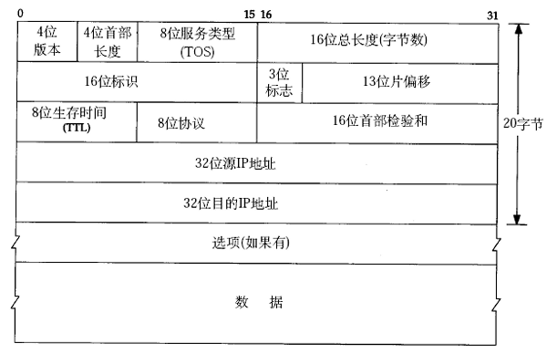

* 协议版本: ipv4，ipv6
* 16 位总长度: 最大 65536
* 8 位生存时间 `ttl`(网络连接下一跳的次数): 为了防止网络阻塞
* 32 位源 ip 地址，共个 4 字节！我们熟悉的 ip 都是点分十进制的，4 字节，每字节对应一个点分位，最大为 255，实际上就是整形数

32 位目的 ip 地址

* 8 位协议: 用来区分上层协议是 TCP，UDP，ICMP 还是 IGMP 协议
* 16 位首部校验和: 只校验 IP 首部，数据的校验由更高层协议负责

UDP 数据报格式

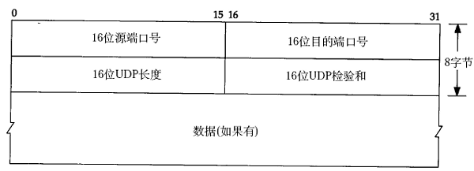

* 通过 IP 地址来确定网络环境中的唯一的一台主机
* 主机上使用端口号来区分不同的应用程序
* IP + 端口唯一确定唯一一台主机上的一个应用程序

TCP 数据流格式:

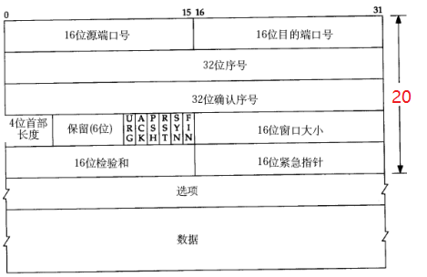

稳定的，安全的，可靠的
	
* 序号: TCP 是安全可靠的，每个数据包都带有序号，当数据包丢失的时候，需要重传，要使用序号进行重传. 控制数据有序，丢包重传
* 确认序号: 使用确认序号可以知道对方是否已经收到了，通过确认序号可以知道哪个序号的数据需要重传
* 16 位窗口大小 -- 滑动窗口(主要进行流量控制)

---

## SOCKET 编程

传统的进程间通信借助内核提供的 IPC 机制进行，但是只能限于本机通信，若要跨机通信，就必须使用网络通信(本质上借助内核 - 内核提供了 `socket` 伪文件的机制实现通信 ---- 实际上是使用文件描述符)，这就需要用到内核提供给用户的 `socket` API 函数库

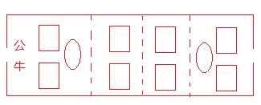

既然提到 `socket` 伪文件，所以可以使用文件描述符相关的函数 `read`，`write`
	
可以对比 `pipe` 管道讲述 `socket` 文件描述符的区别

使用 `socket` 会建立一个 `socket pair`

如下图，一个文件描述符操作两个缓冲区，这点跟管道是不同的，管道是两个文件描述符操作一个内核缓冲区

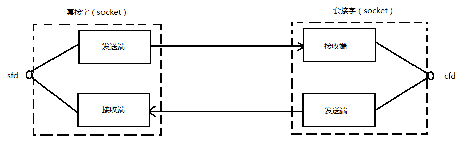

### socket 编程预备知识

网络字节序:

大端和小端的概念
		
* 大端: 低位地址存放高位数据，高位地址存放低位数据
* 小端: 低位地址存放低位数据，高位地址存放高位数据

大端和小端的使用使用场合

大端和小端只是对数据类型长度是两个及以上的，如 `int`，`short`，对于单字节没限制，在网络中经常需要考虑大端和小端的是 IP 和端口

思考题: 0x12345678 如何存放

如何验证本机上大端还是小端 ----- 使用共用体

编写代码 `endian.c` 进行测试，测试本机上是大端模式还是小端模式

网络传输用的是大端法，如果机器用的是小端法，则需要进行大小端的转换

下面 4 个函数就是进行大小端转换的函数:
	   
```c
#include <arpa/inet.h>
uint32_t htonl(uint32_t hostlong);
uint16_t htons(uint16_t hostshort);
uint32_t ntohl(uint32_t netlong);
uint16_t ntohs(uint16_t netshort);
```

函数名的 `h` 表示主机 `host`，`n` 表示网络 `network`，`s` 表示 `short`，`l`表示 `long`

上述的几个函数，如果本来不需要转换函数内部就不会做转换

IP 地址转换函数:

* `p` -> 表示点分十进制的字符串形式
* `to` -> 到
* `n` -> 表示 `network` 网络

`int inet_pton(int af, const char *src, void *dst);`

函数说明: 将字符串形式的点分十进制 IP 转换为大端模式的网络 IP(整形 4 字节数)

参数说明:

* `af`: AF_INET
* `src`: 字符串形式的点分十进制的 IP 地址
* `dst`: 存放转换后的变量的地址

例如: `inet_pton(AF_INET, "127.0.0.1", &serv.sin_addr.s_addr);`	

手工也可以计算: 如 192.168.232.145，先将 4 个正数分别转换为 16 进制数

```sh
192 ---> 0xC0  168 ---> 0xA8   232 ---> 0xE8   145 ---> 0x91
```

最后按照大端字节序存放: 0x91E8A8C0，这个就是 4 字节的整形值

```c
const char *inet_ntop(int af, const void *src, char *dst, socklen_t size);
```

函数说明: 网络 IP 转换为字符串形式的点分十进制的 IP

参数说明:

* `af`: AF_INET
* `src`: 网络的整形的 IP 地址
* `dst`: 转换后的 IP 地址，一般为字符串数组
* `size`: `dst` 的长度

返回值: 

* 成功 -- 返回指向 `dst` 的指针
* 失败 -- 返回 `NULL`，并设置 `errno`

例如: IP地址为010aa8c0，转换为点分十进制的格式:
01---->1    0a---->10   a8---->168   c0---->192
由于从网络中的IP地址是高端模式，所以转换为点分十进制后应该为: 	192.168.10.1


socket编程用到的重要的结构体:struct sockaddr

```c
struct sockaddr结构说明:
   struct sockaddr {
        sa_family_t sa_family;
        char     sa_data[14];
   }
struct sockaddr_in结构:
struct sockaddr_in {
         sa_family_t    sin_family; /* address family: AF_INET */
         in_port_t      sin_port;   /* port in network byte order */
         struct in_addr sin_addr;   /* internet address */
   };

   /* Internet address. */
   struct in_addr {
         uint32_t  s_addr;     /* address in network byte order */
   };	 //网络字节序IP--大端模式
```

通过man 7 ip可以查看相关说明

2.2 socket编程主要的API函数介绍

int socket(int domain，int type，int protocol);

函数描述: 创建socket
参数说明:
domain: 协议版本
AF_INET IPV4
AF_INET6 IPV6
AF_UNIX AF_LOCAL本地套接字使用
type:协议类型
SOCK_STREAM 流式，默认使用的协议是TCP协议
SOCK_DGRAM  报式，默认使用的是UDP协议
protocal: 
一般填0，表示使用对应类型的默认协议.
返回值: 
成功: 返回一个大于0的文件描述符
失败: 返回-1，并设置errno

当调用socket函数以后，返回一个文件描述符，内核会提供与该文件描述符相对应的读和写缓冲区，同时还有两个队列，分别是请求连接队列和已连接队列.


int bind(int sockfd，const struct sockaddr *addr，socklen_t addrlen);
函数描述: 将socket文件描述符和IP,PORT绑定
参数说明:
socket: 调用socket函数返回的文件描述符
addr: 本地服务器的IP地址和PORT，

```c
struct sockaddr_in serv;
serv.sin_family = AF_INET;
serv.sin_port = htons(8888);
//serv.sin_addr.s_addr = htonl(INADDR_ANY);
//INADDR_ANY: 表示使用本机任意有效的可用IP
```

inet_pton(AF_INET，"127.0.0.1"，&serv.sin_addr.s_addr);

addrlen: addr变量的占用的内存大小 
返回值: 
成功: 返回0
失败: 返回-1，并设置errno


int listen(int sockfd，int backlog);

函数描述: 将套接字由主动态变为被动态
参数说明:
sockfd: 调用socket函数返回的文件描述符
backlog: 同时请求连接的最大个数(还未建立连接) 
返回值:
成功: 返回0
失败: 返回-1，并设置errno

				
int accept(int sockfd，struct sockaddr *addr，socklen_t *addrlen);	

函数说明:获得一个连接，若当前没有连接则会阻塞等待.
函数参数:
sockfd: 调用socket函数返回的文件描述符
addr: 传出参数，保存客户端的地址信息
addrlen: 传入传出参数， addr变量所占内存空间大小
返回值:
成功: 返回一个新的文件描述符,用于和客户端通信
失败: 返回-1，并设置errno值.

accept函数是一个阻塞函数，若没有新的连接请求，则一直阻塞.
	从已连接队列中获取一个新的连接，并获得一个新的文件描述符，该文件描述符用于和客户端通信.  (内核会负责将请求队列中的连接拿到已连接队列中)


int connect(int sockfd，const struct sockaddr *addr，socklen_t addrlen);
函数说明: 连接服务器
函数参数:
sockfd: 调用socket函数返回的文件描述符
addr: 服务端的地址信息
addrlen: addr变量的内存大小
返回值:
成功: 返回0
失败: 返回-1，并设置errno值


接下来就可以使用write和read函数进行读写操作了.
除了使用read/write函数以外，还可以使用recv和send函数

读取数据和发送数据:

```c
ssize_t read(int fd，void *buf，size_t count);
ssize_t write(int fd，const void *buf，size_t count);
ssize_t recv(int sockfd，void *buf，size_t len，int flags);
ssize_t send(int sockfd，const void *buf，size_t len，int flags);	
```

对应recv和send这两个函数flags直接填0就可以了.

	注意: 如果写缓冲区已满，write也会阻塞，read读操作的时候，若读缓冲区没有数据会引起阻塞.


使用socket的API函数编写服务端和客户端程序的步骤图示: 


根据服务端和客户端编写代码的流程，编写代码并进行测试.

测试过程中可以使用netstat命令查看监听状态和连接状态
netstat命令: 
a表示显示所有,
n表示显示的时候以数字的方式来显示
p表示显示进程信息(进程名和进程PID)


作业: 
	自己编写代码熟悉一下服务端和客户端的代码开发流程;
	设计服务端和客户端通信协议(属于业务层的协议)
	如发送结构体

```c
typedef struct teacher_{
    int tid;
    char name[30];
    int age;
    char sex[30];
    int sal;
} teacher;

typedef struct student_{
    int sid;
    char name[30];
    int age;
    char sex[30];
}student;


typedef struct SendMsg_{
    int type;//1 - teacher;2 - student
    int len;//
    char buf[0];//变长发送数据
}SendMsg;
```

---

